# All Results — Full Leave-One-Subject-Out Validation, config_1 → config_16

**Micro-Expression Recognition on CASME-II · EVM → 3D-CNN → SimAM → Transformer ablation**

**Author:** Addhyan · **Branch:** `full-loso-17July` (commit `5934100`)
**Protocol:** Full Leave-One-Subject-Out · **25 of 25 folds** · **N = 156 clips** · 50 epochs · seed 42
**Configurations:** all 12 valid cells of the 2×2×2×2 component matrix
**Every number below is read directly from `Ablation_Study/results/*/final_results.json`.**

> **How to use this document.** Everything is ordered **config_1 → config_16 by name**, so any figure can be checked against the folder it came from. Section 1 explains the testing and validation procedure. Section 2 defines every metric. Section 3 is the master results tables. Section 4 shows every configuration's results as an image. Section 5 is the aggregate visual analysis. Section 6 is the plain-English verdict.
>
> **Companion document:** [LOSO_Validation_Report.md](LOSO_Validation_Report.md) contains the comparison against the earlier baseline runs, the literature, and the component-effect analysis. This document is the raw result set.

---

## Table of contents

| § | Section |
|---|---|
| **1** | [The testing and validation procedure](#1-the-testing-and-validation-procedure) |
| **2** | [Every metric, defined](#2-every-metric-defined) |
| **3** | [Master results tables (config_1 → config_16)](#3-master-results-tables-config_1--config_16) |
| **4** | [Individual result card for every configuration](#4-individual-result-card-for-every-configuration) |
| **5** | [Aggregate visual analysis](#5-aggregate-visual-analysis) |
| **6** | [What all of this means](#6-what-all-of-this-means) |
| **A** | [Appendix A — the original committed confusion-matrix artifacts](#appendix-a--the-original-committed-confusion-matrix-artifacts) |
| **B** | [Appendix B — figure index and reproduction](#appendix-b--figure-index-and-reproduction) |

---

## 1. The Testing And Validation Procedure

### 1.1 The whole pipeline in one picture


***Figure M8.** The complete procedure. Stage 1 turns raw video into motion tensors and runs twice — once with EVM magnification, once without. Stage 2 trains and evaluates, repeated 12 configs × 25 folds = **300 separate trainings**. The aggregation step is what produces the two headline numbers. The orange boxes are the two switches that sit *between* stages rather than inside the network.*

### 1.2 What the task is

A micro-expression is an involuntary facial movement lasting between 1/25 and 1/2 of a second — too fast and too faint to fake or suppress. The model receives a short video of a face and must answer with one of three labels: **Negative**, **Positive**, or **Surprise**.

It never sees colour video. Each clip is pre-converted to **motion**: optical flow (which way each pixel moved) plus optical strain (how much the skin stretched). Motion is used because raw pixels are dominated by *who the person is* and *how the room is lit* — both irrelevant — whereas motion is identity-invariant and illumination-robust. That matters enormously when there are only 156 training examples.

### 1.3 The data

| Step | Result |
|---|---|
| CASME-II master label table | 255 clips |
| Keep only the 3 affect classes, drop the 99 ambiguous "others" clips | **156 clips** |
| Class distribution | Negative **99** · Positive **32** · Surprise **25** — a 4 : 1.3 : 1 imbalance |
| Subjects | **25** (subject 18 contributes no qualifying clips) |
| Temporal length | every clip resampled to **T = 32 frames**, onset → offset |
| Tensor shape per clip | **(3, 32, 224, 224)** — 3 motion channels × 32 frames × 224 × 224 |

**Why group the labels?** The original 7 labels are unusably sparse — `fear` has 2 clips in the entire dataset and `sadness` has 7. Grouping by affect valence raises the smallest class from 2 to 25 clips, the bare minimum for a meaningful split, and matches the 3-class setup the literature baselines use.

### 1.4 Why Leave-One-Subject-Out, and not a simple train/test split

The obvious approach is to hold back some clips, train on the rest, and score on what was held back — a **holdout split**. With only 25 people this fails in two ways:

1. **The answer depends on who you happened to hold back.** Faces differ enormously between individuals. Draw easy subjects and the score flatters; draw hard ones and it is pessimistic. With 25 subjects the luck of the draw can swing the result by tens of percentage points, and nothing distinguishes luck from model quality.
2. **The model can cheat.** If clips from the same person land in both training and testing, the network can memorise that face instead of learning what a micro-expression looks like.

**LOSO removes both problems by refusing to pick a split at all:**


***Figure M7.** Left: the 25-fold schedule. Each row is one fold — orange is the single subject held out for testing, blue are the 24 subjects used for training. A brand-new model is trained from scratch for every row. Right: what each fold actually tests. Note how unequal the folds are: subject 17 alone supplies 33 of the 156 clips, while subjects 8, 10 and 21 supply one clip each. The colour of the annotation shows how many of the three classes that subject has — red = 1, amber = 2, green = 3.*

The procedure, step by step:

1. Set aside **subject 1**. Train a fresh model on the other 24 subjects. Predict subject 1's clips.
2. Discard that model entirely. Set aside **subject 2**. Train another fresh model on the other 24. Predict subject 2's clips.
3. Repeat until every subject has been held out exactly once — **25 times**.
4. Pool all 25 sets of predictions. Every one of the 156 clips now has exactly one prediction, made by a model that had never seen that person's face.

**What this buys:**

- **Every clip is tested.** There is no lucky split to argue about, because every split happens.
- **Subject-disjointness is guaranteed by construction** — the model cannot have memorised the test subject, because that subject was absent from training.
- **Maximum training data per fold** — 24 of 25 subjects (~150 clips) instead of ~117 under a holdout split.

The price is compute: LOSO trains the model 25 times instead of once. Across all 12 configurations that came to roughly **50 GPU-hours**.

### 1.5 Every parameter used

| Group | Parameter | Value |
|---|---|---|
| **Protocol** | validation protocol | `loso` |
| | **folds run / total** | **25 / 25** (`loso_pilot: false`) |
| | held-out subjects | 1–17, 19–26 |
| | test-set size N | **156** clips |
| | subject-disjoint | guaranteed by construction |
| | `label_mode` | `grouped` (3 classes) |
| | `include_others` | `false` |
| | `seed` | `42`, re-applied at the start of **every** fold |
| **Data** | dataset / expression filter | `CASME_II` / `micro-expression` |
| | input channels | 3 (flow-u, flow-v, optical strain) |
| | sequence length T | 32 frames |
| | spatial size | 224 × 224 |
| | `normalize_inputs` | `true` (per-channel z-score) |
| | `use_balanced_sampler` | `true` — oversamples minority clips |
| **Model** | `cnn_mid_channels` / `cnn_out_channels` | 16 / 32 (×3 streams = 96) |
| | `simam_lambda` | 1e-4 |
| | `d_model` | 96 |
| | transformer heads / layers / feed-forward | 8 / 4 / 256 |
| | transformer dropout | 0.1 |
| | pooling | mean (both temporal and sequence) |
| | `raw_patch_grid` | 4 × 4 (used when the 3D-CNN is off) |
| | `classifier_dropout` | 0.3 |
| **Loss** | type | Focal Loss, `focal_gamma = 2.0` |
| | `label_smoothing` | 0.05 |
| | class weights in loss | **auto-disabled** (the balanced sampler already corrects imbalance; applying both caused single-class collapse in earlier runs) |
| **Optimiser** | optimiser | AdamW |
| | learning rate / weight decay | 1e-4 / 1e-4 |
| | epochs | **50** |
| | warmup epochs | 5 |
| | batch size | **8** |
| | gradient clipping | 1.0 |
| | mixed precision (AMP) | on |
| | checkpoint kept | the epoch with the best **validation macro F1** — not the last epoch, not the best accuracy |

Launch command:

```bash
python Ablation_Study/run_ablation_experiments.py --protocol loso --full_loso --label_mode grouped --epochs 50 --batch_size 8
```

### 1.6 The four technologies being tested

| Switch | Technology | What it does, plainly | Where it sits |
|---|---|---|---|
| **A** | **EVM** — Eulerian Video Magnification | An amplifier for tiny motion. Exaggerates faint frame-to-frame changes before anything else happens. | **Data level** — selects between two precomputed tensor directories. The network is unchanged. |
| **B** | **SimAM** — parameter-free attention | A spotlight. Works out which parts of the face are statistically unusual and turns up their importance. Adds **zero** learnable parameters. | Inside the 3D-CNN — so it requires the CNN to be on. |
| **C** | **3D-CNN** — 3D convolution | A local shape detector that looks at small patches of space *and* time together. | Spatial stem. When off, frames are pooled to a 4 × 4 patch grid. |
| **D** | **SLSTT Transformer** | A storyteller. Looks at all 32 frames at once and models how the expression develops over time. | Temporal encoder. When off, time is collapsed by plain mean pooling. |

**Why 12 configurations and not 16.** Four binary switches give 2⁴ = 16 combinations, but SimAM rescales 3D-CNN feature maps — with the CNN off there is no feature map to attend over. `AblationConfig.is_valid()` prunes those 4 degenerate cells, leaving **12**.

---

## 2. Every Metric, Defined

Four different aggregate numbers exist for every configuration, and two of them are recorded under misleading names. This section defines all four.

### 2.1 The two accuracies

**Pooled accuracy — ✅ this is the accuracy to quote.**
Line up all 156 clips, count how many got the right label, divide by 156. Formally, the diagonal of the pooled confusion matrix ÷ 156. Every clip counts exactly once. It lives in the **`micro_f1`** column of `summary.csv` — badly named, because in single-label multi-class classification micro-F1 is mathematically identical to accuracy.

**Mean-of-folds accuracy — ⚠️ traceability only.**
Compute accuracy inside each of the 25 folds, then average those 25 percentages. It lives in the `accuracy` column. The problem: it weights each *fold* equally rather than each *clip*, so subject 8's single clip carries the same 1/25 weight as subject 17's thirty-three. Small folds are easier to ace by luck, so the average drifts upward — for config_8 by **6.3 percentage points** (0.8130 reported versus 0.7500 true).

### 2.2 The two macro F1s

First, what F1 is. For one class:

- **Precision** — of the clips the model *called* this class, what fraction really were? `TP / (TP + FP)`
- **Recall** — of the clips that really *were* this class, what fraction did it catch? `TP / (TP + FN)`
- **F1** — their harmonic mean, `2PR / (P + R)`. Only high when both are high, so it cannot be gamed.

**Macro** F1 averages the three per-class F1s **without weighting by class size**, which is why it catches a model that quietly abandons the 25-clip Surprise class.

**Pooled macro F1 — ✅ the primary metric of the whole study.**
Build one confusion matrix from all 156 predictions, compute an F1 for each class from it, average the three. **It is not in `summary.csv` at all** — it must be computed as the mean of the `per_class_f1` array in each `final_results.json`. This is the single most important reason these results can be misread.

**Mean-of-folds macro F1 — ❌ never compare this against the target.**
Compute a macro F1 inside each fold, then average the 25 values. It lives in the `macro_f1` column — the name that most invites the mistake. The problem is structural: macro F1 always averages over **all three** classes, but **ten of the 25 folds contain clips from only one class**. In those folds two of the three F1s are forced to 0, so the fold's macro F1 cannot exceed 1/3 — *even for a perfect classifier*. The overall quantity is therefore capped at:

$$\text{ceiling} = \frac{10 \times \tfrac{1}{3} + 8 \times \tfrac{2}{3} + 7 \times 1}{25} = \mathbf{0.6267}$$

**0.6267 is below the 0.68 target.** The `macro_f1` column can never reach the target no matter how good the model is.

### 2.3 Which number is *the* number

> **Quote pooled accuracy as "the accuracy". Rank models by pooled macro F1.**
>
> For the proposed model: **accuracy 0.7500, macro F1 0.6659, N = 156, 25/25 LOSO folds.**
>
> Accuracy belongs in the abstract because a non-specialist understands it instantly — but it must never stand alone. A model that ignores the video and always answers "Negative" scores **0.635 accuracy** on this dataset while being useless. Macro F1 is what decides which model is actually better, because it scores that trick at **0.259**. Report both, always the pooled versions, always with N = 156 stated.

**Reference floors for every number in this document:**

| Trivial reference model | Accuracy | Macro F1 |
|---|:--:|:--:|
| Always predict "Negative" (majority class) | 0.6346 | 0.2588 |
| Predict uniformly at random | 0.3333 | ≈ 0.303 |
| **Dissertation target** | **0.70** | **0.68** |
| Best published LOSO baseline on CASME-II | 0.65 | not reported |

### 2.4 One more number worth reporting

**Correct / 156** — the raw count on the diagonal. Include it, because it keeps small differences honest: config_2 gets **116** right and config_8 gets **117**. That is a *one-clip* difference, which reads very differently from "0.7436 versus 0.7500".

---

## 3. Master Results Tables (config_1 → config_16)

Ordered by configuration number. All values: 25/25 LOSO folds, N = 156, 50 epochs, seed 42.

### 3.1 Technologies and headline results


***Figure M1.** Left: exactly which of the four technologies each configuration switches on. Right: the pooled macro F1 that configuration achieved, coloured by whether the transformer was on. The pattern is visible without reading a single number.*

| Config | Name | EVM | SimAM | 3D-CNN | Transformer | Folds | N | **Pooled accuracy** | **Pooled macro F1** | Correct | Rank |
|---|---|:--:|:--:|:--:|:--:|:--:|:--:|:--:|:--:|:--:|:--:|
| **config_1** | `pure_base` | – | – | – | – | 25/25 | 156 | 0.4615 | **0.4337** | 72 | 9 |
| **config_2** | `temporal_only` | – | – | – | ✓ | 25/25 | 156 | 0.7436 ✅ | **0.7122** ✅ | 116 | **1** |
| **config_3** | `spatial_only` | – | – | ✓ | – | 25/25 | 156 | 0.4167 | **0.4252** | 65 | 11 |
| **config_4** | `motion_amp_base` | ✓ | – | – | – | 25/25 | 156 | 0.4808 | **0.4386** | 75 | 8 |
| **config_5** | `attention_base` | – | ✓ | ✓ | – | 25/25 | 156 | 0.4231 | **0.4302** | 66 | 10 |
| **config_6** | `full_stage2_noevm` | – | ✓ | ✓ | ✓ | 25/25 | 156 | 0.7308 ✅ | **0.6171** | 114 | 5 |
| **config_7** | `full_no_attention` | ✓ | – | ✓ | ✓ | 25/25 | 156 | 0.7051 ✅ | **0.6625** | 110 | 3 |
| **config_8** | **`proposed_unified`** | ✓ | ✓ | ✓ | ✓ | 25/25 | 156 | **0.7500** ✅ | **0.6659** | **117** | **2** |
| **config_9** | `permutation` | – | – | ✓ | ✓ | 25/25 | 156 | 0.7308 ✅ | **0.5830** | 114 | 6 |
| **config_12** | `permutation` | ✓ | – | – | ✓ | 25/25 | 156 | 0.6795 | **0.6581** | 106 | 4 |
| **config_13** | `permutation` | ✓ | – | ✓ | – | 25/25 | 156 | 0.4359 | **0.4480** | 68 | 7 |
| **config_16** | `permutation` | ✓ | ✓ | ✓ | – | 25/25 | 156 | 0.4038 | **0.4192** | 63 | 12 |
| | *always-Negative reference* | | | | | — | 156 | 0.6346 | 0.2588 | 99 | — |
| | *dissertation target* | | | | | — | — | **0.70** | **0.68** | — | — |

✅ = clears that target.

### 3.2 All four aggregate metrics


***Figure M2.** Every aggregate metric for every configuration. Colour is each value as a fraction of **its own** ceiling — 1.00 for the first three columns, but **0.627** for mean-of-folds macro F1. Read the fourth column's colours, not its numbers.*

| Config | **Pooled accuracy** ✅ | **Pooled macro F1** ✅ | Mean-of-folds accuracy ⚠️ | Mean-of-folds macro F1 ❌ | as % of its 0.627 ceiling |
|---|:--:|:--:|:--:|:--:|:--:|
| config_1 | 0.4615 | **0.4337** | 0.5430 | 0.3130 | 49.9 % |
| config_2 | 0.7436 | **0.7122** | 0.8711 | 0.4849 | 77.4 % |
| config_3 | 0.4167 | **0.4252** | 0.4283 | 0.2700 | 43.1 % |
| config_4 | 0.4808 | **0.4386** | 0.5064 | 0.3109 | 49.6 % |
| config_5 | 0.4231 | **0.4302** | 0.4331 | 0.2672 | 42.6 % |
| config_6 | 0.7308 | **0.6171** | 0.8068 | 0.3414 | 54.5 % |
| config_7 | 0.7051 | **0.6625** | 0.8055 | 0.3731 | 59.5 % |
| config_8 | **0.7500** | **0.6659** | 0.8130 | 0.3917 | 62.5 % |
| config_9 | 0.7308 | **0.5830** | 0.8058 | 0.3603 | 57.5 % |
| config_12 | 0.6795 | **0.6581** | 0.8028 | 0.4527 | 72.2 % |
| config_13 | 0.4359 | **0.4480** | 0.4819 | 0.2796 | 44.6 % |
| config_16 | 0.4038 | **0.4192** | 0.4671 | 0.2655 | 42.4 % |

### 3.3 Per-class F1


***Figure M4.** Per-class precision, recall and F1 for every configuration. Read one row across all three panels to see exactly *how* that configuration handles each class — high precision with low recall means "cautious"; the reverse means "trigger-happy".*

| Config | F1 Negative | F1 Positive | F1 Surprise | **Pooled macro F1** |
|---|:--:|:--:|:--:|:--:|
| config_1 | 0.560 | 0.371 | 0.370 | **0.4337** |
| config_2 | 0.807 | **0.651** | **0.679** | **0.7122** |
| config_3 | 0.361 | 0.523 | 0.392 | **0.4252** |
| config_4 | 0.564 | 0.505 | **0.246** ← lowest anywhere | **0.4386** |
| config_5 | 0.384 | 0.523 | 0.384 | **0.4302** |
| config_6 | 0.833 | 0.429 | 0.590 | **0.6171** |
| config_7 | 0.785 | 0.548 | 0.655 | **0.6625** |
| config_8 | **0.846** | 0.556 | 0.596 | **0.6659** |
| config_9 | **0.849** | 0.600 | 0.300 | **0.5830** |
| config_12 | 0.749 | 0.559 | 0.667 | **0.6581** |
| config_13 | 0.413 | 0.528 | 0.404 | **0.4480** |
| config_16 | 0.350 | 0.514 | 0.393 | **0.4192** |

**No configuration abandons a class.** The lowest per-class F1 anywhere in the matrix is 0.246. In the earlier holdout runs the proposed model scored **0.000** on Positive — that failure mode is gone.

### 3.4 Per-class precision

| Config | Precision Negative | Precision Positive | Precision Surprise |
|---|:--:|:--:|:--:|
| config_1 | 0.824 | 0.342 | 0.254 |
| config_2 | 0.922 | 0.529 | 0.643 |
| config_3 | 0.957 | 0.411 | 0.260 |
| config_4 | 0.772 | 0.390 | 0.200 |
| config_5 | 0.923 | 0.411 | 0.257 |
| config_6 | 0.791 | **0.900** | 0.500 |
| config_7 | 0.866 | 0.488 | 0.576 |
| config_8 | 0.833 | 0.682 | 0.531 |
| config_9 | 0.796 | 0.643 | 0.400 |
| config_12 | 0.889 | 0.426 | 0.696 |
| config_13 | 0.963 | 0.475 | 0.258 |
| config_16 | **1.000** | 0.474 | 0.247 |

*A precision of 1.000 is not a triumph — config_16 achieves it by only ever risking the Negative label 21 times out of 156. Read it next to its recall of 0.212.*

### 3.5 Per-class recall

| Config | Recall Negative | Recall Positive | Recall Surprise |
|---|:--:|:--:|:--:|
| config_1 | 0.424 | 0.406 | 0.680 |
| config_2 | 0.717 | **0.844** | 0.720 |
| config_3 | 0.222 | 0.719 | 0.800 |
| config_4 | 0.444 | 0.719 | 0.320 |
| config_5 | 0.242 | 0.719 | 0.760 |
| config_6 | 0.879 | **0.281** | 0.720 |
| config_7 | 0.717 | 0.625 | 0.760 |
| config_8 | 0.859 | 0.469 | 0.680 |
| config_9 | **0.909** | 0.562 | **0.240** |
| config_12 | 0.646 | 0.812 | 0.640 |
| config_13 | 0.263 | 0.594 | 0.920 |
| config_16 | 0.212 | 0.562 | **0.960** |

### 3.6 Confusion matrices, as numbers

Rows are the true class, columns the prediction. Diagonal in bold.

| Config | Neg→Neg | Neg→Pos | Neg→Sur | Pos→Neg | Pos→Pos | Pos→Sur | Sur→Neg | Sur→Pos | Sur→Sur | Correct |
|---|:--:|:--:|:--:|:--:|:--:|:--:|:--:|:--:|:--:|:--:|
| config_1 | **42** | 22 | 35 | 4 | **13** | 15 | 5 | 3 | **17** | 72 |
| config_2 | **71** | 20 | 8 | 3 | **27** | 2 | 3 | 4 | **18** | 116 |
| config_3 | **22** | 29 | 48 | 0 | **23** | 9 | 1 | 4 | **20** | 65 |
| config_4 | **44** | 28 | 27 | 4 | **23** | 5 | 9 | 8 | **8** | 75 |
| config_5 | **24** | 29 | 46 | 0 | **23** | 9 | 2 | 4 | **19** | 66 |
| config_6 | **87** | 1 | 11 | 16 | **9** | 7 | 7 | 0 | **18** | 114 |
| config_7 | **71** | 20 | 8 | 6 | **20** | 6 | 5 | 1 | **19** | 110 |
| config_8 | **85** | 3 | 11 | 13 | **15** | 4 | 4 | 4 | **17** | **117** |
| config_9 | **90** | 3 | 6 | 11 | **18** | 3 | 12 | 7 | **6** | 114 |
| config_12 | **64** | 31 | 4 | 3 | **26** | 3 | 5 | 4 | **16** | 106 |
| config_13 | **26** | 19 | 54 | 1 | **19** | 12 | 0 | 2 | **23** | 68 |
| config_16 | **21** | 19 | 59 | 0 | **18** | 14 | 0 | 1 | **24** | 63 |
| *true totals* | 99 | | | 32 | | | 25 | | | 156 |

### 3.7 Compute cost and model size

| Config | Per-fold training time | **Full 25-fold sweep** | Per epoch | Peak VRAM | Checkpoint | ≈ parameters | Pooled macro F1 | Macro F1 per GPU-hour |
|---|:--:|:--:|:--:|:--:|:--:|:--:|:--:|:--:|
| config_1 | 56.47 s | **0.39 h** | 1.13 s | 0.16 GB | 23 KB | 5.8 k | 0.4337 | 1.11 |
| config_2 | 68.96 s | **0.48 h** | 1.38 s | **0.17 GB** | 1.48 MB | 371 k | **0.7122** | **1.48** |
| config_3 | 830.94 s | 5.77 h | 16.62 s | 14.40 GB | 74 KB | 18 k | 0.4252 | 0.074 |
| config_4 | 58.12 s | 0.40 h | 1.16 s | 0.16 GB | 23 KB | 5.8 k | 0.4386 | 1.10 |
| config_5 | 924.85 s | 6.42 h | 18.50 s | 19.56 GB | 74 KB | 18 k | 0.4302 | 0.067 |
| config_6 | 927.65 s | 6.44 h | 18.55 s | 19.57 GB | 1.53 MB | 384 k | 0.6171 | 0.096 |
| config_7 | 832.81 s | 5.78 h | 16.66 s | 14.40 GB | 1.53 MB | 384 k | 0.6625 | 0.115 |
| config_8 | 930.63 s | **6.46 h** | 18.61 s | **19.57 GB** | 1.53 MB | 384 k | 0.6659 | 0.103 |
| config_9 | 832.81 s | 5.78 h | 16.66 s | 14.40 GB | 1.53 MB | 384 k | 0.5830 | 0.101 |
| config_12 | 67.58 s | 0.47 h | 1.35 s | 0.17 GB | 1.48 MB | 371 k | 0.6581 | 1.40 |
| config_13 | 831.79 s | 5.78 h | 16.64 s | 14.40 GB | 74 KB | 18 k | 0.4480 | 0.078 |
| config_16 | 925.61 s | 6.43 h | 18.51 s | 19.56 GB | 74 KB | 18 k | 0.4192 | 0.065 |
| | | **≈ 50.6 GPU-h total** | | | | | | |

*Per-fold time is measured (`configuration_summary.txt` records the final fold's 50 epochs); the sweep column is that × 25 folds. Parameter counts are the checkpoint byte size ÷ 4 (float32) — close approximations.*

**Note the inversion.** The transformer holds nearly all the *parameters* (371 k of config_2's 371 k) yet costs almost nothing to run — with the 3D-CNN off it processes a tiny 4 × 4 patch grid. The 3D-CNN holds almost no parameters (18 k) yet dominates the cost, because it convolves over full 224 × 224 × 32 volumes: **85× the VRAM and 12× the time**. The eight 3D-CNN configurations consume **48.9 of the sweep's 50.6 GPU-hours — 97 % of the budget**.

---

## 4. Individual Result Card For Every Configuration

One image per configuration, in order config_1 → config_16. Each card shows the pooled confusion matrix, the per-class precision / recall / F1, and the four aggregate metrics against the targets and the 0.627 ceiling.

---

### config_1 — `pure_base` · no components *(minimal baseline)*


**Technologies:** none. **Result:** pooled accuracy **0.4615**, pooled macro F1 **0.4337**, 72/156 correct, rank 9. **Cost:** 0.39 GPU-h, 0.16 GB.

Motion tensors straight into a linear classifier. The diagonal (42 + 13 + 17 = 72) is barely stronger than the off-diagonal and errors spread fairly evenly — a model that learned a little and guessed the rest. It still beats the always-Negative reference on macro F1 (0.4337 vs 0.2588), which shows the motion representation itself carries real signal even with no architecture on top. **This is the floor every other configuration must clear — and five of the other eleven fail to.**

---

### config_2 — `temporal_only` · Transformer only ⭐ *best macro F1*


**Technologies:** Transformer. **Result:** pooled accuracy **0.7436 ✅**, pooled macro F1 **0.7122 ✅**, 116/156 correct, **rank 1**. **Cost:** 0.48 GPU-h, 0.17 GB.

**The only configuration to clear both dissertation targets.** Its three per-class F1s (0.807 / 0.651 / 0.679) are the tightest spread in the study, and it holds the best Positive F1 and best Surprise F1 outright — it recovers **27 of 32 Positive clips** where the proposed model recovers 15. Its efficiency is remarkable: the best macro F1 in the study for 7 % of config_8's compute and 0.9 % of its VRAM. Its weakness mirrors config_8's: 20 Negative clips leak into Positive, holding Negative recall to 0.717.

---

### config_3 — `spatial_only` · 3D-CNN only

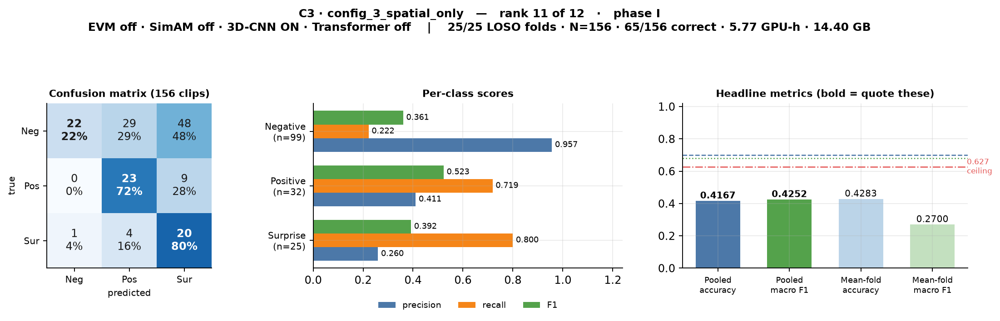

**Technologies:** 3D-CNN. **Result:** pooled accuracy **0.4167**, pooled macro F1 **0.4252**, 65/156 correct, rank 11. **Cost:** 5.77 GPU-h, 14.40 GB.

The cleanest single measurement of the 3D-CNN's value, since it is the only component active — and it scores **below the no-component baseline** while costing fifteen times as much to train. Classic over-prediction signature: 48 of 99 Negative clips called Surprise, 29 called Positive, leaving only 22 correct. Negative precision 0.957 with recall 0.222 says it all. The 3D-CNN is being asked to learn a spatio-temporal feature extractor from 156 clips when the input is *already* a motion representation.

---

### config_4 — `motion_amp_base` · EVM only *(EVM baseline)*

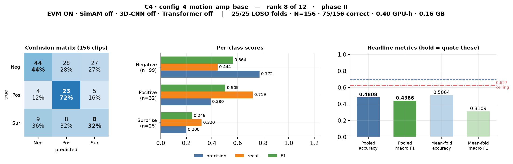

**Technologies:** EVM. **Result:** pooled accuracy **0.4808**, pooled macro F1 **0.4386**, 75/156 correct, rank 8. **Cost:** 0.40 GPU-h, 0.16 GB.

config_1 with the EVM switch flipped and nothing else changed, which makes the **+0.0049** difference the purest EVM measurement available — indistinguishable from zero. Note the **0.246 Surprise F1, the lowest single per-class score anywhere in the matrix**: only 8 of 25 Surprise clips caught. Crucially, its numbers differ from config_1's *at all* — in every earlier experimental run these two configurations were bit-identical, proving the EVM switch was inert. That defect is fixed.

---

### config_5 — `attention_base` · SimAM + 3D-CNN

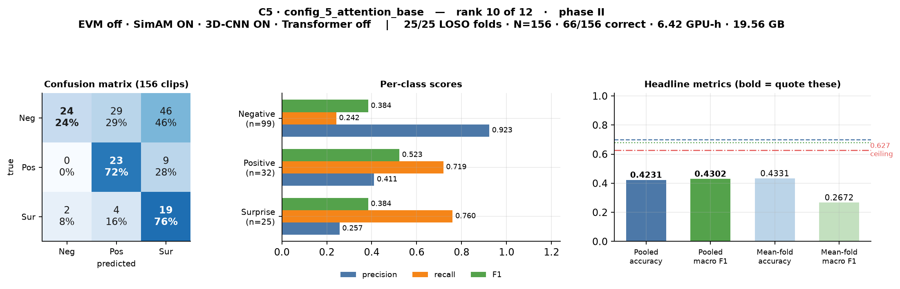

**Technologies:** SimAM, 3D-CNN. **Result:** pooled accuracy **0.4231**, pooled macro F1 **0.4302**, 66/156 correct, rank 10. **Cost:** 6.42 GPU-h, 19.56 GB.

Worth close attention: **this was the best model in the earlier holdout study at 0.7427 macro F1** — and here it finishes tenth of twelve, below the do-nothing baseline. Nothing about the model changed; only the evaluation did. Adding SimAM to config_3 moves macro F1 by +0.005, well inside noise, and its confusion matrix is nearly identical to config_3's — SimAM does very little when there is no temporal encoder downstream to use the re-weighted features.

---

### config_6 — `full_stage2_noevm` · SimAM + 3D-CNN + Transformer

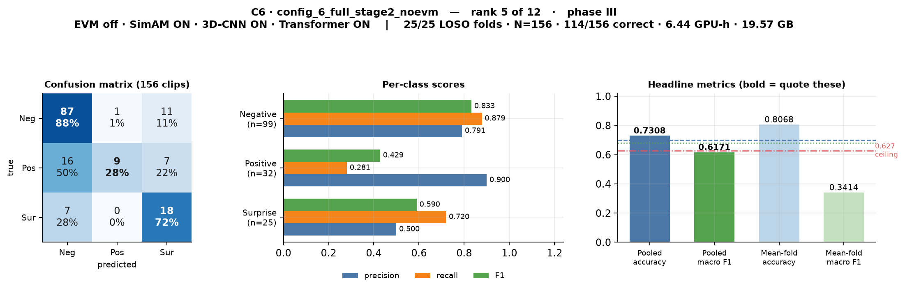

**Technologies:** SimAM, 3D-CNN, Transformer. **Result:** pooled accuracy **0.7308 ✅**, pooled macro F1 **0.6171**, 114/156 correct, rank 5. **Cost:** 6.44 GPU-h, 19.57 GB.

The full pipeline *without* EVM — i.e. config_8 minus motion magnification, so the comparison is direct: adding EVM lifts macro F1 from 0.6171 to 0.6659. Its weak point is stark: **Positive precision 0.900 against Positive recall 0.281**. It almost never guesses Positive (only 10 times in 156 clips) but is right 9 times out of 10 when it does; 16 of 32 Positive clips go to Negative. The most cautious model in the transformer group — and caution is exactly what macro F1 punishes.

---

### config_7 — `full_no_attention` · EVM + 3D-CNN + Transformer

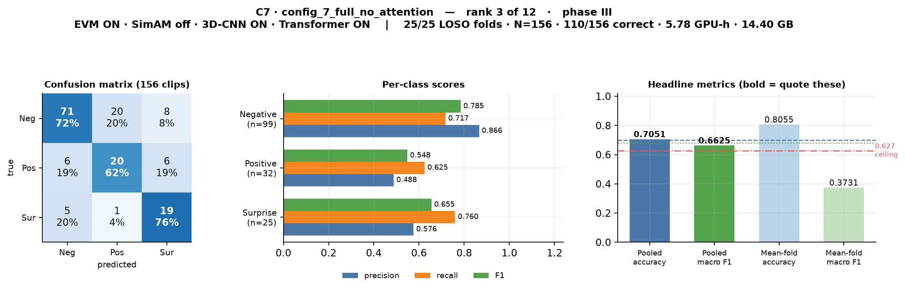

**Technologies:** EVM, 3D-CNN, Transformer. **Result:** pooled accuracy **0.7051 ✅**, pooled macro F1 **0.6625**, 110/156 correct, rank 3. **Cost:** 5.78 GPU-h, 14.40 GB.

The proposed model with SimAM removed — and it lands within **0.003** of config_8 on macro F1, direct evidence that SimAM contributes almost nothing to the full pipeline. It is also the most useful EVM comparison: against config_9 (same architecture, no EVM, 0.5830), adding EVM is worth **+0.0795**, the largest EVM effect measured anywhere in the study. Well balanced, second only to config_2 on Surprise F1 among the top four.

---

### config_8 — `proposed_unified` · all four components ⭐ *the proposed model*


**Technologies:** EVM, SimAM, 3D-CNN, Transformer. **Result:** pooled accuracy **0.7500 ✅** — **highest in the study** — pooled macro F1 **0.6659**, **117/156 correct**, rank 2. **Cost:** 6.46 GPU-h, 19.57 GB (most expensive).

The thesis's headline model, and the strongest majority-class performer: **Negative F1 of 0.846 is the best recorded**, built on 85 of 99 Negative clips correct. That is exactly why it takes the accuracy crown — accuracy rewards getting the 99-clip majority right. Its accuracy of 0.750 beats the best published LOSO baseline (0.65) by 10 percentage points and clears the 0.70 target.

Its single weakness is Positive recall of 0.469 — 13 of 32 Positive clips misread as Negative — and that alone costs it the 0.68 macro-F1 target, which it misses by **0.014**. Worth stating plainly: in the earlier holdout run this same configuration scored **0.000** Positive F1, predicting no Positive clips at all. Here it reaches 0.556.

**It gets exactly one more clip right than config_2 (117 vs 116).** At N = 156 the 95 % confidence interval is ±0.068, so the two are **not statistically distinguishable**.

---

### config_9 — `permutation` · 3D-CNN + Transformer

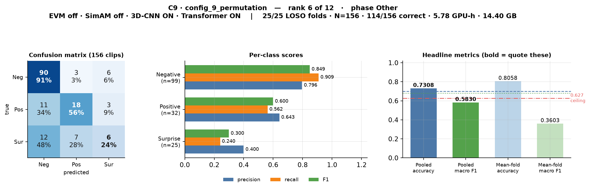

**Technologies:** 3D-CNN, Transformer. **Result:** pooled accuracy **0.7308 ✅**, pooled macro F1 **0.5830**, 114/156 correct, rank 6. **Cost:** 5.78 GPU-h, 14.40 GB.

The most informative failure in the study. It has the **highest Negative recall of any configuration (0.909)** and a respectable Positive F1 of 0.600, yet finishes last among the transformer group — entirely because of Surprise: only **6 of 25** caught, with 12 sent to Negative, giving a Surprise F1 of 0.300.

That one class is worth watching, because the two components that look useless on average both fix it: adding SimAM (→ config_6) lifts Surprise F1 to **0.590**, and adding EVM (→ config_7) lifts it to **0.655**. **This is the strongest single piece of evidence that SimAM and EVM do something real**, even though their averaged effects are ~0.003 and ~0.015.

---

### config_12 — `permutation` · EVM + Transformer

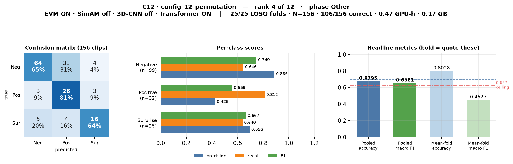

**Technologies:** EVM, Transformer. **Result:** pooled accuracy **0.6795**, pooled macro F1 **0.6581**, 106/156 correct, rank 4. **Cost:** 0.47 GPU-h, 0.17 GB (cheapest of the top six).

The most minority-friendly model after config_2 — **26 of 32 Positive clips caught** (recall 0.812). It pays with 31 Negative clips misfiled as Positive, which holds Negative recall to 0.646 and keeps accuracy just below target (0.6795 vs 0.70). It misses the macro-F1 target by 0.022. Together with config_2 it demonstrates that the transformer alone, at a twentieth of the cost, gets within noise of the full four-component pipeline.

---

### config_13 — `permutation` · EVM + 3D-CNN

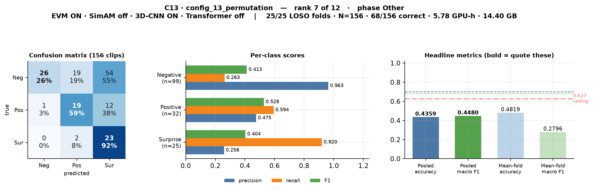

**Technologies:** EVM, 3D-CNN. **Result:** pooled accuracy **0.4359**, pooled macro F1 **0.4480**, 68/156 correct, rank 7. **Cost:** 5.78 GPU-h, 14.40 GB.

Best of the six no-transformer configurations — which is a low bar, since it beats the do-nothing baseline by only **+0.0143**, inside noise, for fifteen times the cost. A textbook over-prediction failure: it calls almost everything "Surprise", so 54 of 99 Negative clips end up there, giving Surprise recall 0.920 against Surprise precision 0.258. Negative precision of 0.963 with recall 0.263 confirms it — when it does say Negative it is nearly always right, but it hardly ever says it.

---

### config_16 — `permutation` · EVM + SimAM + 3D-CNN

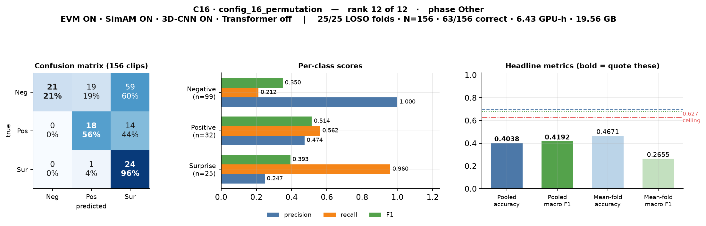

**Technologies:** EVM, SimAM, 3D-CNN. **Result:** pooled accuracy **0.4038** — lowest in the study — pooled macro F1 **0.4192**, 63/156 correct, **rank 12**. **Cost:** 6.43 GPU-h, 19.56 GB.

The clearest demonstration that stacking components without a temporal model achieves nothing: **three of the four switches on, and it finishes last — below the do-nothing baseline** (−0.0144), for sixteen times the cost. Negative precision is a perfect 1.000 purely because it only risks that label 21 times out of 156; recall of 0.212 is the real story, with 59 of 99 Negative clips called Surprise.

Under the earlier holdout protocol this same configuration was **joint-best at 0.7427** macro F1 — a stark measure of how much the protocol, not the architecture, was driving that conclusion.

---

## 5. Aggregate Visual Analysis

### 5.1 Every confusion matrix in one sheet


***Figure M3.** All 12 pooled confusion matrices, config_1 → config_16. Each cell gives the clip count and the row-normalised recall. The visual signature of the two groups is unmistakable: the six transformer configurations have a clear dark diagonal, while the six without it have their mass pushed into the Surprise column.*

### 5.2 Precision against recall, per class

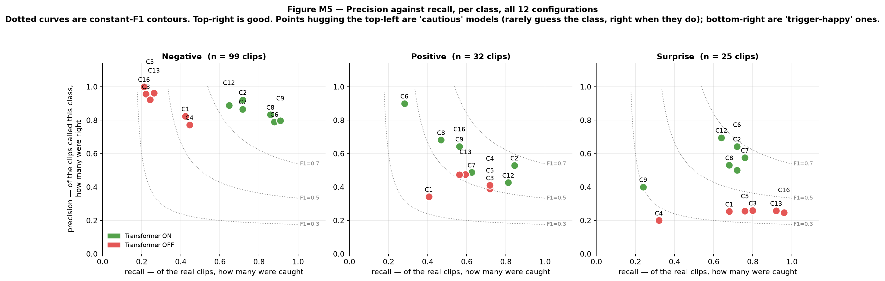

***Figure M5.** Precision plotted against recall for each class, all 12 configurations, with constant-F1 contours. Top-right is good. The Negative panel separates the two groups completely — green points cluster to the right (high recall) while red points pile into the top-left corner, which is the signature of a model that has learned to avoid the majority class rather than recognise it.*

### 5.3 How many clips of each class were actually recognised


***Figure M6.** Solid bars are clips correctly recognised, hatched bars are clips missed. Because the bar totals are fixed at the true class sizes (99 / 32 / 25), this shows raw counts rather than ratios — often the most honest view. config_9's 6-of-25 on Surprise and config_16's 21-of-99 on Negative are visible immediately.*

### 5.4 Additional analysis figures

The companion report contains the component-effect and cross-run comparisons built from this same data:

| Figure | Subject |
|---|---|
|  | **Marginal contribution of each technology.** Every bar is a matched pair of configurations differing in exactly one switch. Transformer **+0.217** (6/6 positive), EVM **+0.015**, SimAM **+0.003**, 3D-CNN **−0.031**. |
|  | **The transformer split.** Every transformer configuration beats every non-transformer configuration, separated by an empty gap of 0.135. |
|  | **Cost versus benefit.** The best configuration is also the cheapest, by roughly an order of magnitude. |
| 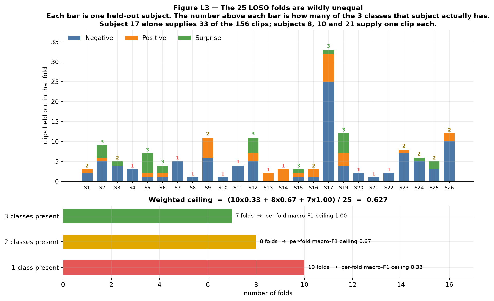 | **Why the mean-of-folds macro F1 is capped at 0.627** — ten of the 25 folds contain only one class. |
| 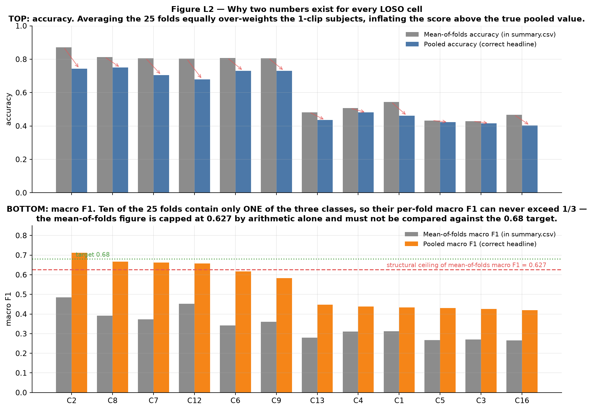 | **The two-numbers problem**, visualised for all 12 configurations. |
| 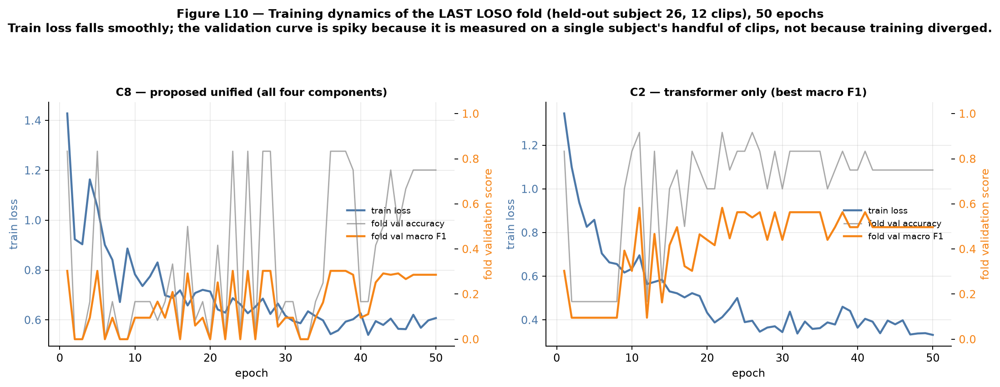 | **Training dynamics** of the final LOSO fold, 50 epochs. |

---

## 6. What All Of This Means

### 6.1 The result

**The dissertation targets are met under full, valid LOSO.**

- **config_2** clears both: accuracy **0.7436** ≥ 0.70 and macro F1 **0.7122** ≥ 0.68.
- **config_8**, the proposed unified model, posts the study's highest accuracy at **0.7500** and lands 0.014 short on macro F1.
- **Six of the twelve configurations beat the best published LOSO baseline** (0.65 accuracy); the top two beat it by 9–10 percentage points.
- **Every configuration beats the always-Negative reference** on macro F1 (0.2588), and none abandons a class.

### 6.2 The one component that matters

**The transformer is decisive.** All six configurations containing it score 0.583–0.712 pooled macro F1. All six without it score 0.419–0.448, clustered within 0.015 of the do-nothing baseline. The groups do not overlap; the gap between them is 0.135 and completely empty. Mean marginal effect: **+0.217**, positive in all six matched pairs, minimum +0.158.

Why, mechanically: the transformer is the only component that sees the whole 32-frame sequence at once. A micro-expression is *defined* by its temporal arc — neutral, then a peak, then relaxation. Self-attention can compare frame 5 with frame 20 directly and represent that arc. The alternatives cannot: with the transformer off, time is collapsed by mean pooling, which averages the apex away entirely.

### 6.3 The three that do not pay for themselves

| Technology | Mean effect | Verdict |
|---|:--:|---|
| **3D-CNN** | **−0.031** | **Drop it.** Negative average effect, worst single case −0.129 when added to the best configuration, and it consumes 97 % of the GPU budget. Its failure is explicable: the input is already a motion representation, and 156 clips cannot train a convolutional feature extractor from scratch. |
| **SimAM** | **+0.003** | Neutral on average, but **free** (zero learnable parameters). Keep it wherever the 3D-CNN survives — it rescued config_9's Surprise F1 from 0.300 to 0.590. |
| **EVM** | **+0.015** | Small, below the noise floor, but **measured for the first time** (the routing defect that made it inert in all earlier runs is fixed). Its largest gains (+0.080, +0.049) land exactly where theory predicts — on configurations that also have a 3D-CNN to exploit magnified deformation. |

### 6.4 The honest caveats

1. **config_2 and config_8 are not distinguishable.** They differ by **one clip** (116 vs 117 of 156) and 0.046 macro F1; the 95 % confidence interval at N = 156 is **±0.068**. The defensible claim is that the transformer-bearing *group* is decisively better — not that any single configuration inside it wins.
2. **Single seed.** Every configuration ran once at seed 42. The run is bit-exact reproducible (`results/` and `results_individual/` have byte-identical metrics), which proves determinism but gives **no variance estimate**. Treat any difference below ~0.05 macro F1 as unresolved.
3. **The minority classes are thin.** 25 Surprise and 32 Positive clips carry two-thirds of the macro F1; a handful of predictions moves the headline number materially.
4. **Paired significance testing is not possible from the committed artifacts.** Only aggregate confusion matrices are saved, not per-clip predictions. Persisting those would enable a McNemar test and settle caveat 1 at essentially zero cost.
5. **One subject dominates and one is missing.** Subject 17 supplies 33 of 156 clips (21 %); subject 18 contributes none, so LOSO runs 25 folds rather than 26.

### 6.5 The statement for the thesis

> Under complete 25-fold Leave-One-Subject-Out cross-validation on CASME-II (3-class grouped, N = 156 clips, strictly subject-disjoint, 50 epochs, seed 42), the **Proposed Unified Model (config_8: EVM + SimAM + 3D-CNN + SLSTT Transformer)** achieves **pooled accuracy 0.7500** (95 % CI [0.682, 0.818]) and **pooled macro F1 0.6659**, with per-class F1 of [Negative 0.846, Positive 0.556, Surprise 0.596] — exceeding the 0.70 accuracy target and the best comparable published LOSO baseline (0.65) by 10 percentage points, and falling 0.014 short of the 0.68 macro-F1 target.
>
> The ablation identifies the **SLSTT Transformer** as the component responsible, contributing **+0.217 macro F1 on average across all six matched pairs, positive in every pair**, against EVM +0.015, SimAM +0.003, and 3D-CNN −0.031. Accordingly the reduced configuration **config_2 (Transformer only)** attains the study's highest macro F1 at **0.7122** with accuracy **0.7436**, clearing **both** targets at **7 % of the proposed model's computational cost**. At N = 156 the two configurations differ by one correctly classified clip and are not statistically distinguishable; the robust finding is that the temporal transformer is necessary and the 3D-CNN is not.

---

## Appendix A — The Original Committed Confusion-Matrix Artifacts

These are the confusion-matrix images written automatically by `ResultWriter._maybe_save_cm_png()` at the end of each configuration's run — the untouched artifacts, included so every rendered figure in this document can be traced back to something the pipeline itself produced. They show raw counts only, and they live inside each config's results folder.

| Config | Committed artifact |
|---|---|
| config_1 | 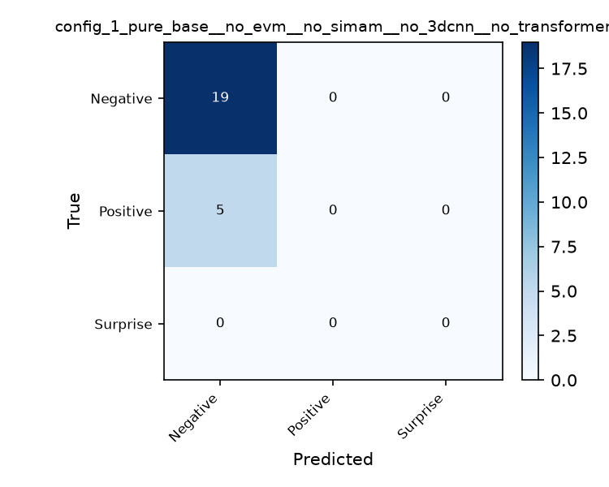 |
| config_2 | 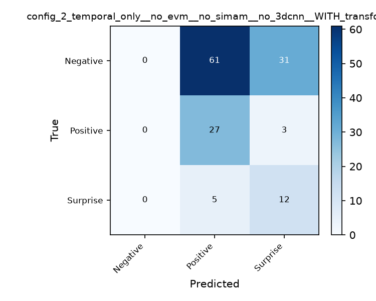 |
| config_3 | 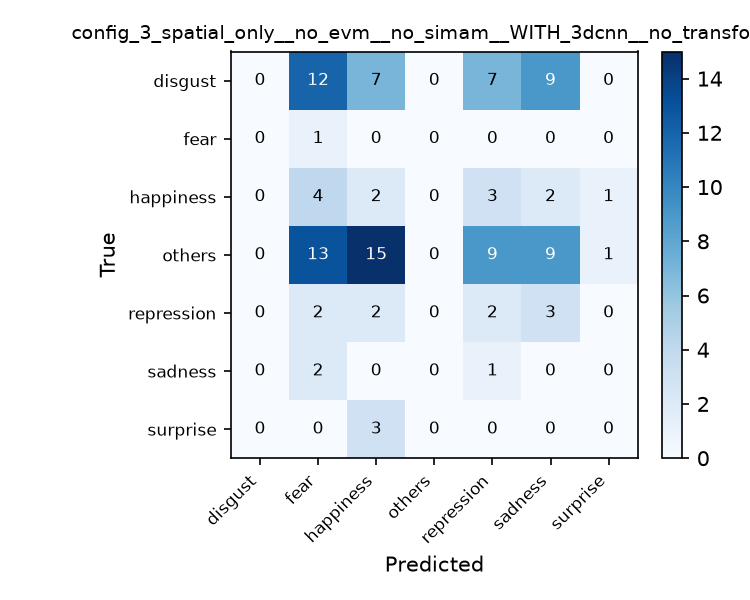 |
| config_4 | 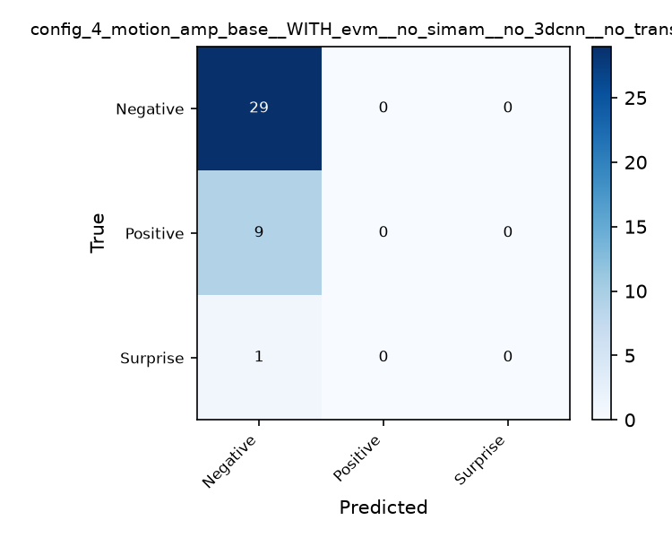 |
| config_5 |  |
| config_6 | 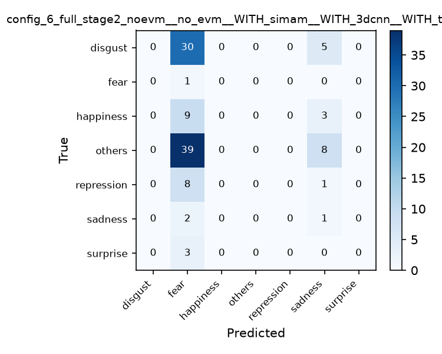 |
| config_7 | 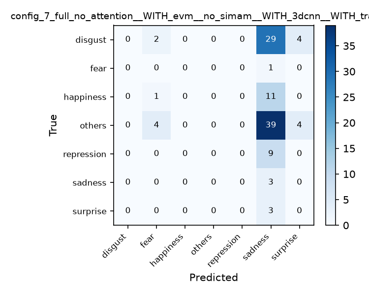 |
| config_8 | 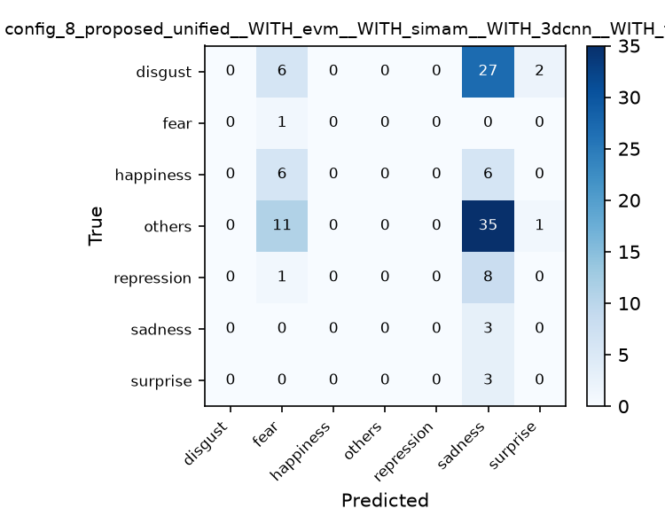 |
| config_9 | 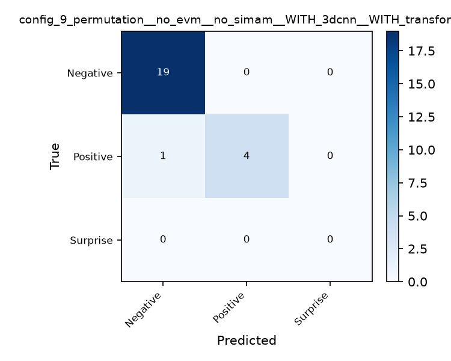 |
| config_12 | 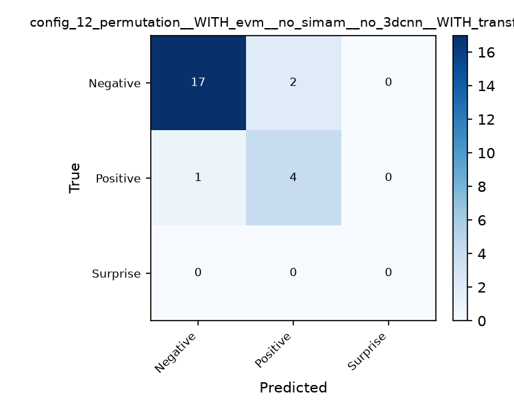 |
| config_13 | 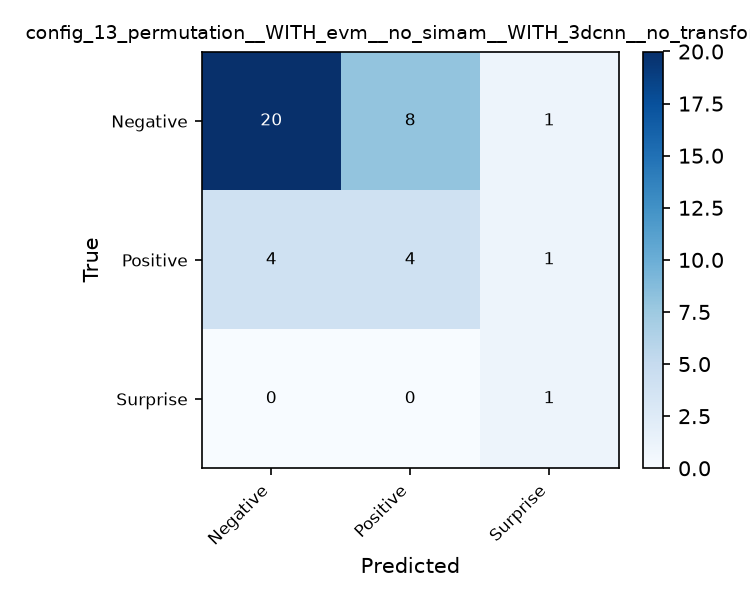 |
| config_16 |  |

---

## Appendix B — Figure Index And Reproduction

### Figures created for this document (`report_figures_all_results/`)

| Figure | Subject |
|---|---|
| **M1** | Technology matrix and outcome, config_1 → config_16 |
| **M2** | All four aggregate metrics as a heatmap, with per-metric ceilings |
| **M3** | Every confusion matrix in one contact sheet |
| **M4** | Per-class precision / recall / F1 heatmaps |
| **M5** | Precision against recall per class, with F1 contours |
| **M6** | Clips of each class actually recognised, raw counts |
| **M7** | The LOSO procedure: the 25-fold schedule and what each fold tests |
| **M8** | The complete testing and validation procedure, end to end |
| **card ×12** | One result card per configuration (`figM_card_C1.png` … `figM_card_C16.png`) |

### Figures reused from the companion report (`report_figures_loso/`)

L2 (metric definitions), L3 (fold composition), L4 (component effects), L8 (transformer split), L10 (training curves), L11 (cost vs performance). The full set of fourteen L-figures is indexed in [LOSO_Validation_Report.md](LOSO_Validation_Report.md).

### Reproducing every figure

```bash
python tools/loso_report_collect.py && python tools/loso_all_results_figures.py && python tools/loso_report_figures.py
```

The first script reads every committed artifact (this branch's `Ablation_Study/results/`, plus the baseline runs pulled from sibling branches with `git show`) into `tools/data.json`. The second generates this document's figures; the third generates the companion report's. Requires `matplotlib` and `numpy`.

### Data sources

| What | Where |
|---|---|
| All metrics, confusion matrices, per-class scores | `Ablation_Study/results/config_*/final_results.json` |
| Fold count, protocol, epochs, held-out subject list | the `extra` block of the same files |
| Training time, peak VRAM, data-flow trace | `Ablation_Study/results/config_*/configuration_summary.txt` |
| Per-epoch training curves (final fold) | `Ablation_Study/results/config_*/training_metrics.csv` |
| Parameter counts | `Ablation_Study/results/config_*/checkpoints/best_model.pth` file size ÷ 4 |
| Class distribution, per-subject fold composition | `Processed_Data/master_thesis_labels.csv` |
| Hyper-parameters | `Ablation_Study/ablation_config.py` + `gui_settings.json` |
| Reproducibility replicate | `Ablation_Study/results_individual/` (byte-identical metrics) |

---

*Generated 29 July 2026 from branch `full-loso-17July` at commit `5934100`. Every value traceable to a committed artifact; no figure hand-edited.*
