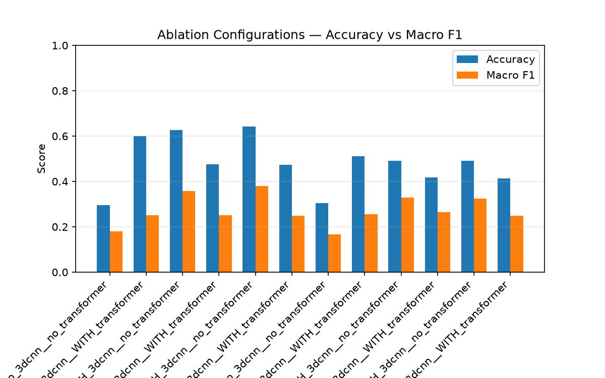
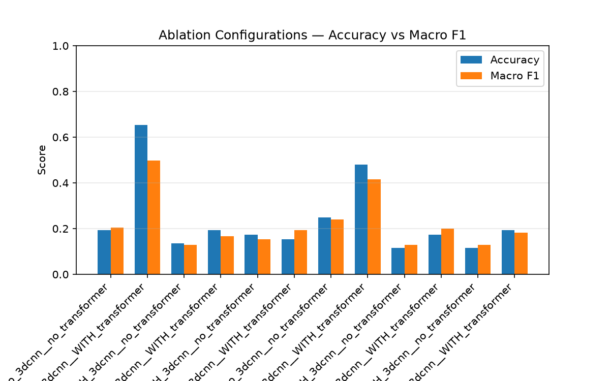
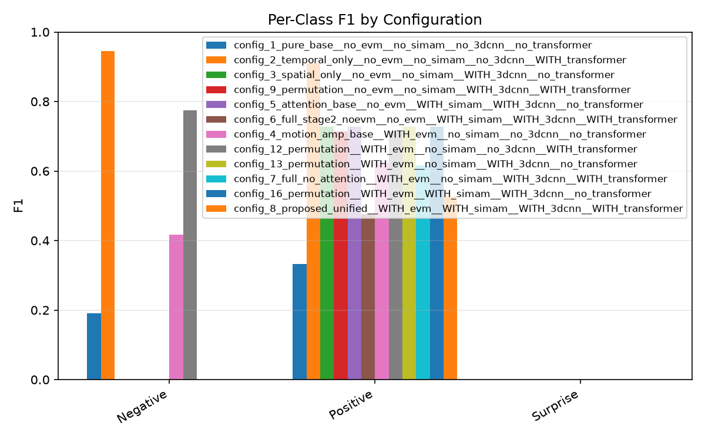
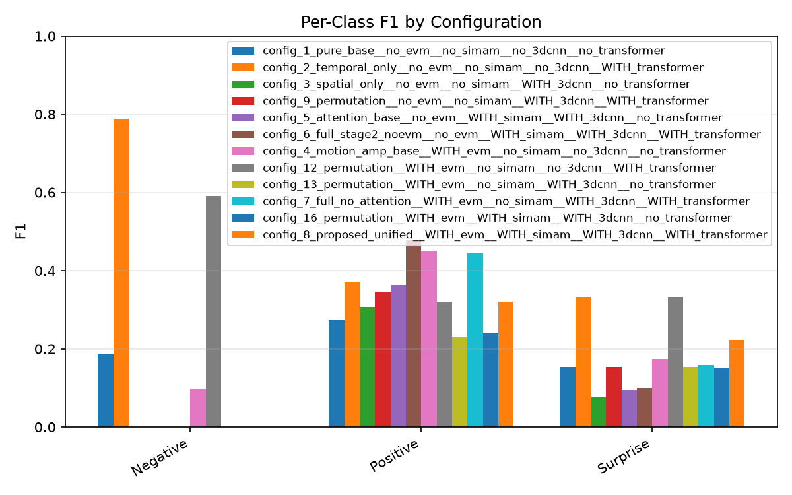
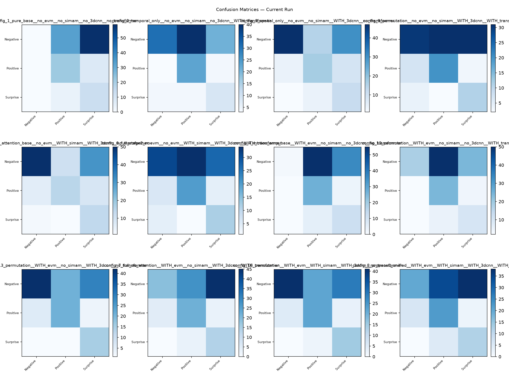
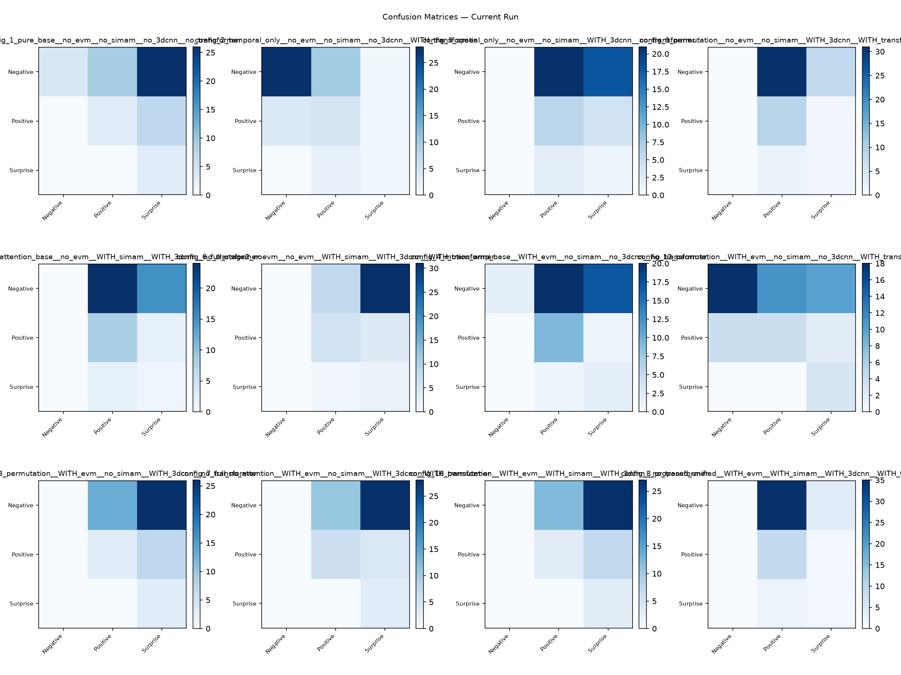

# Micro-Expression Recognition on CASME II
## Complete Results, Figures & Confusion-Matrix Walkthrough

*A self-contained results document for discussion with my supervisor — every metric, every figure, and every confusion matrix explained.*

---

## Summary of the process & technologies (in brief)

> We recognise **micro-expressions** (involuntary facial movements < 1/5 s) on the **CASME II** dataset. Each clip is converted into a 3-channel **motion tensor** (horizontal + vertical **optical flow** and **optical strain**), resampled to 32 frames at 224×224. A hybrid **PyTorch** network processes it: an optional **EVM** motion-magnification pre-step, a **three-stream 3-D CNN** spatial backbone, optional **SimAM** parameter-free attention, and an optional **SLSTT Transformer** temporal encoder, ending in a linear classifier. We run an **ablation study** — every on/off combination of these four components (12 valid configurations) — trained with **Focal loss** + class-balancing, and evaluated under two subject-disjoint protocols: **Leave-One-Subject-Out (LOSO)** and a **30 % hold-out**. The headline metric is **macro-F1**, because the 3 emotion classes (Negative / Positive / Surprise) are heavily imbalanced.

---

## 1. What the experiment is

Micro-expressions are brief, involuntary facial movements that leak concealed emotion. They are faint, fast, and rare, which makes recognition hard. Instead of proposing a single model, we run an **ablation study**: four components, each switched on or off, so we can measure *which parts actually help*.

| Toggle | Component | What it does |
|--------|-----------|--------------|
| **EVM** | Eulerian Video Magnification | amplifies tiny, near-invisible motion before feature extraction (a data pre-step) |
| **SimAM** | parameter-free spatial attention | re-weights the important regions of the CNN feature maps (adds **0** parameters) |
| **CNN** | three-stream 3-D CNN | extracts spatial + short-range motion features — the backbone |
| **Transformer** | SLSTT temporal encoder | models long-range relationships across the 32 frames |

Four on/off switches → 2⁴ = 16 combinations; 4 are invalid (SimAM needs a CNN to attend to), leaving **12 configurations** we train and test.

**Input = motion, not pixels.** Each clip becomes a `[3, 32, 224, 224]` tensor of optical flow (u, v) + optical strain. Feeding motion — not RGB — isolates *how the skin deforms* (what a micro-expression actually is) and stops the model from recognising the person's face.

**The data.** CASME II has 255 micro-expression clips. After grouping to 3 classes and dropping the incoherent "Others" bucket, we use **156 clips from 25 subjects**:

| Class | Clips | Built from raw emotions |
|-------|:-----:|-------------------------|
| Negative | 99 | disgust (63) + repression (27) + sadness (7) + fear (2) |
| Positive | 32 | happiness |
| Surprise | 25 | surprise |

> **Why group 7 emotions into 3?** Some raw classes are unusable alone — **fear has only 2 clips, sadness only 7** — you cannot train or fairly test a 2-clip class. Negative emotions (disgust/fear/sadness/repression) also share overlapping facial signatures that even human coders confuse. Grouping by valence (Negative / Positive / Surprise) is the standard MEGC challenge protocol and keeps our numbers comparable to published work.

---

## 2. Why we report Macro-F1, not accuracy

The classes are very imbalanced (≈ 63 % Negative, 20 % Positive, 16 % Surprise). A lazy model that **always predicts "Negative"** and learns nothing scores:

| "Always predict Negative" | Accuracy | Macro-F1 |
|---------------------------|:--------:|:--------:|
| LOSO | **0.662** | 0.266 |
| Hold-out | **0.750** | 0.286 |

So a useless model already gets **66–75 % accuracy**. Optimising for accuracy would *reward* ignoring the rare classes. **Macro-F1** averages each class's F1 equally, so neglecting Positive/Surprise is punished — it is the honest metric here. We therefore lead with macro-F1, keep accuracy only as a reference, and report per-class precision/recall/F1 and the full confusion matrices to show *where* errors occur.

---

## 3. The two validation methods (brief)

Both are **subject-disjoint** — the same person is *never* in both training and testing. This prevents **identity leakage** (a model recognising the *face* instead of the *expression*, which fakes the score).

- **Hold-out (fast):** split subjects **once** — ~70 % train, **30 % held out for testing** (52 test clips). One run per config; used to iterate. Downside: depends on the luck of one split (higher variance).
- **LOSO — Leave-One-Subject-Out (rigorous):** hold out **one subject**, train on the rest, test on that subject, repeat, pool predictions. It measures performance on a **completely new person** — the number that matters for real use. Downside: one full run per subject → very slow, so we ran a **pilot of 20 of the 25 subjects** (139 pooled test clips).

**Why 30 % held out (and not more)?** With only ~140 clips, a 10 % test set (~15 clips) is too small to measure a 3-class score and might contain zero Surprise clips. 30 % (~52 clips) is the smallest test set that keeps all three classes present and measurable. Testing on 100 % is impossible — nothing would be left to train on.

---

## 4. Results tables

### 4.1 LOSO (pilot, 20/25 subjects, 139 test clips) — ranked by Macro-F1

| Rank | Configuration | EVM | SimAM | CNN | Transf. | Accuracy | Macro-F1 |
|:----:|---------------|:---:|:-----:|:---:|:-------:|:--------:|:--------:|
| 1 | attention_base | – | ✓ | ✓ | – | 0.643 | **0.379** |
| 2 | spatial_only | – | – | ✓ | – | 0.627 | 0.358 |
| 3 | EVM + CNN | ✓ | – | ✓ | – | 0.491 | 0.329 |
| 4 | EVM + SimAM + CNN | ✓ | ✓ | ✓ | – | 0.491 | 0.324 |
| 5 | full_no_attention | ✓ | – | ✓ | ✓ | 0.419 | 0.264 |
| 6 | EVM + Transformer | ✓ | – | – | ✓ | 0.511 | 0.256 |
| 7 | CNN + Transformer | – | – | ✓ | ✓ | 0.476 | 0.252 |
| 8 | temporal_only | – | – | – | ✓ | 0.600 | 0.251 |
| 9 | full (no EVM) | – | ✓ | ✓ | ✓ | 0.474 | 0.250 |
| 10 | **proposed (all 4 on)** | ✓ | ✓ | ✓ | ✓ | 0.413 | 0.249 |
| 11 | pure_base | – | – | – | – | 0.295 | 0.179 |
| 12 | motion_amp_base | ✓ | – | – | – | 0.305 | 0.166 |
| — | *do-nothing baseline* | | | | | *0.662* | *0.266* |

### 4.2 Hold-out (30 % subjects, 52 test clips) — ranked by Macro-F1

| Rank | Configuration | EVM | SimAM | CNN | Transf. | Accuracy | Macro-F1 |
|:----:|---------------|:---:|:-----:|:---:|:-------:|:--------:|:--------:|
| 1 | EVM + CNN | ✓ | – | ✓ | – | 0.577 | **0.458** |
| 2 | EVM + SimAM + CNN | ✓ | ✓ | ✓ | – | 0.558 | 0.448 |
| 3 | attention_base | – | ✓ | ✓ | – | 0.481 | 0.402 |
| 4 | spatial_only | – | – | ✓ | – | 0.462 | 0.388 |
| 5 | CNN + Transformer | – | – | ✓ | ✓ | 0.442 | 0.274 |
| 6 | temporal_only | – | – | – | ✓ | 0.231 | 0.247 |
| 7 | full (no EVM) | – | ✓ | ✓ | ✓ | 0.308 | 0.218 |
| 8 | EVM + Transformer | ✓ | – | – | ✓ | 0.212 | 0.210 |
| 9 | **proposed (all 4 on)** | ✓ | ✓ | ✓ | ✓ | 0.173 | 0.183 |
| 10 | full_no_attention | ✓ | – | ✓ | ✓ | 0.192 | 0.176 |
| 11 | pure_base | – | – | – | – | 0.192 | 0.111 |
| 12 | motion_amp_base | ✓ | – | – | – | 0.096 | 0.129 |
| — | *do-nothing baseline* | | | | | *0.750* | *0.286* |

### 4.3 Four takeaways

1. **The 3-D CNN is essential.** Top-4 configs (both protocols) all have CNN✓ and Transformer✗. Every CNN-less config sinks to the bottom (EVM-only bottoms at 0.096 hold-out accuracy).
2. **The Transformer hurts.** In every matched pair, turning it on *lowers* macro-F1 (LOSO config_5→6: −0.13; hold-out config_13→7: −0.28). Cause: a 4-layer/8-head encoder (~10⁵ parameters) overfits on ~140 clips.
3. **More ≠ better.** The fully-loaded proposed model (all 4 on) ranks 10/12 (LOSO) and 9/12 (hold-out) — an honest negative result.
4. **EVM is protocol-dependent.** It helps hold-out (top-2 use it) but the best LOSO model omits it — magnification amplifies motion *and* noise, and the noise does not transfer to unseen subjects.

---

## 5. The summary figures explained

Each figure exists for both protocols (`loso/plots/` and `holdout/plots/`).

### 5.1 Accuracy vs Macro-F1 (bar chart)

**Axes:** x = the 12 configurations; y = score 0–1. Blue = accuracy, orange = macro-F1.
**What to see:** the blue (accuracy) bar is **always taller** than the orange (macro-F1) bar. That persistent gap is the fingerprint of majority-class bias — models get many Negative clips right (high accuracy) but do poorly on the rare classes (low macro-F1). This chart is the single clearest justification for leading with macro-F1.

**LOSO:**

**Hold-out:**

### 5.2 Per-class F1 (grouped by class)

**Axes:** x = the three classes (Negative / Positive / Surprise); y = F1 0–1; one coloured bar per configuration.
**What to see:** Negative F1 is high and uniform (every model finds the majority class). Positive is middling and is where good configs separate. Surprise is the lowest and most scattered — the hardest, rarest class. The ranking is decided almost entirely on Positive and Surprise, and the fact that minority bars are not flat-zero proves the imbalance defences are working. In LOSO, note config_4's near-zero Negative bar — EVM-only, CNN-less features fail even on the easy class.

**LOSO:**

**Hold-out:**

### 5.3 All confusion matrices (3×4 grid)

**Axes (each small matrix):** rows = true class, columns = predicted class (N / P / S); darker = more clips.
**What to see:** a bright **diagonal** = good; a bright **vertical stripe** = the model collapsed onto one predicted class. Good configs (3, 5, 13, 16) show a diagonal (strong top-left Negative cell). Degenerate / Transformer-heavy configs (1, 8, 4, 2) show vertical banding — e.g. config_1 predicts *no* clip as Negative (empty first column). This is the mechanism behind the F1 numbers: failures are systematic column-collapse, not random error.

**LOSO:**

**Hold-out:**

### 5.4 Key configurations side-by-side

**What to see:** the headline configs placed adjacently. The proposed all-in model's **smeared** matrix sits next to the **clean diagonal** of the lean CNN configs — making the negative result (adding EVM + Transformer degrades a working CNN model) visually undeniable.

**LOSO:**

**Hold-out:**

---

## 6. Every confusion matrix, read one by one

Below, each configuration's confusion matrix is given as three rows — the **true** class — with the three numbers being predictions for **N, P, S**. "Reading" explains the failure/success mode. (A perfect model would have all mass on the diagonal: N→N, P→P, S→S.)

### 6.1 LOSO — numeric confusion matrices (139 clips)

| Config (E/S/C/T) | Acc | F1 | True N →(N,P,S) | True P →(N,P,S) | True S →(N,P,S) | Reading |
|------------------|:---:|:--:|:---------------:|:---------------:|:---------------:|---------|
| 1 pure_base (....) | 0.295 | 0.179 | 0,33,59 | 0,22,8 | 0,4,13 | **Total majority collapse** — predicts *nothing* as Negative (empty N column). Floor baseline. |
| 2 temporal_only (...T) | 0.600 | 0.251 | 31,40,21 | 3,23,4 | 4,4,9 | Over-predicts Positive; high accuracy but Negative recall only 0.34 — accuracy inflated by majority guessing. |
| 3 spatial_only (..C.) | 0.627 | 0.358 | 47,15,30 | 4,17,9 | 1,4,12 | **Clear diagonal.** Strong Negative (47), leaks 30 to Surprise. Best simple CNN. |
| 4 motion_amp (E...) | 0.305 | 0.166 | 1,55,36 | 0,27,3 | 0,5,12 | **Worst.** EVM without a CNN predicts almost everything Positive/Surprise; Negative recall 0.01. |
| 5 attention_base (.SC.) | 0.643 | 0.379 | 50,11,31 | 6,15,9 | 2,1,14 | **Best LOSO.** Strongest Negative diagonal (50), Surprise recall 0.82. Cleanest matrix. |
| 6 full noEVM (.SCT) | 0.474 | 0.250 | 31,34,27 | 6,20,4 | 4,1,12 | Adding the Transformer to config_5 **smears** the Negative row (recall 0.54→0.34). |
| 7 full_no_attn (E.CT) | 0.419 | 0.264 | 19,28,45 | 5,22,3 | 0,3,14 | Negative badly leaked to Surprise (45); recall 0.21. EVM+Transformer hurts. |
| 8 **proposed** (ESCT) | 0.413 | 0.249 | 20,34,38 | 6,22,2 | 0,5,12 | The full model **smears Negative** across Positive(34)/Surprise(38); recall 0.22. |
| 9 CNN+Transf (..CT) | 0.476 | 0.252 | 30,31,31 | 7,20,3 | 4,2,11 | Negative split almost evenly across all three — classic Transformer smear. |
| 12 EVM+Transf (E..T) | 0.511 | 0.256 | 18,50,24 | 2,24,4 | 2,5,10 | Over-predicts Positive (50); Negative recall 0.20. No CNN → weak. |
| 13 EVM+CNN (E.C.) | 0.491 | 0.329 | 42,21,29 | 6,21,3 | 1,1,15 | Good diagonal; **best minority F1 of the EVM configs**; Surprise recall 0.88. |
| 16 EVM+SimAM+CNN (ESC.) | 0.490 | 0.324 | 41,22,29 | 5,22,3 | 0,2,15 | Nearly identical to config_13 — SimAM adds little on top of EVM+CNN here. |

### 6.2 Hold-out — numeric confusion matrices (52 clips)

| Config (E/S/C/T) | Acc | F1 | True N →(N,P,S) | True P →(N,P,S) | True S →(N,P,S) | Reading |
|------------------|:---:|:--:|:---------------:|:---------------:|:---------------:|---------|
| 1 pure_base (....) | 0.192 | 0.111 | 0,37,2 | 0,10,0 | 0,3,0 | Predicts almost everything Positive; Negative & Surprise recall 0. Degenerate. |
| 2 temporal_only (...T) | 0.231 | 0.247 | 0,30,9 | 0,9,1 | 0,0,3 | No Negative predicted (empty N column) — collapse. |
| 3 spatial_only (..C.) | 0.462 | 0.388 | 18,5,16 | 4,3,3 | 0,0,3 | Diagonal present; Surprise recall 1.0 but precision 0.14 (over-predicts S). |
| 4 motion_amp (E...) | 0.096 | 0.129 | 0,3,36 | 0,2,8 | 0,0,3 | **Worst (acc 0.096).** Predicts nearly everything Surprise. |
| 5 attention_base (.SC.) | 0.481 | 0.402 | 19,4,16 | 4,3,3 | 0,0,3 | Like config_3, slightly stronger Negative. Solid diagonal. |
| 6 full noEVM (.SCT) | 0.308 | 0.218 | 11,24,4 | 3,5,2 | 0,3,0 | Transformer smears Negative into Positive(24); **Surprise F1 = 0**. |
| 7 full_no_attn (E.CT) | 0.192 | 0.176 | 0,34,5 | 0,9,1 | 0,2,1 | Negative collapse (recall 0); predicts Positive. |
| 8 **proposed** (ESCT) | 0.173 | 0.183 | 0,15,24 | 0,7,3 | 0,1,2 | **The full model predicts NO Negative at all** (recall 0) — worst-case majority collapse on hold-out. |
| 9 CNN+Transf (..CT) | 0.442 | 0.274 | 20,0,19 | 6,0,4 | 0,0,3 | Predicts **no Positive** (empty P column); over-predicts Surprise. |
| 12 EVM+Transf (E..T) | 0.212 | 0.210 | 0,36,3 | 0,10,0 | 0,2,1 | Negative collapse; predicts Positive. |
| 13 EVM+CNN (E.C.) | 0.577 | 0.458 | 24,13,2 | 5,5,0 | 0,2,1 | **Best hold-out.** Strong Negative diagonal (24), balanced across classes. |
| 16 EVM+SimAM+CNN (ESC.) | 0.558 | 0.447 | 23,14,2 | 5,5,0 | 0,2,1 | Near-identical to config_13 — again SimAM ≈ neutral on top of EVM+CNN. |

**Cross-cutting pattern:** every matrix with an **empty column** is a collapsed model (it never predicts that class), and these are exactly the CNN-less or Transformer-heavy configs. Every matrix with a **populated diagonal** has the CNN on and the Transformer off. This is the same story as the ranking tables, now visible at the level of individual predictions.

---

## 7. Appendix — individual per-config confusion matrices

Full-resolution confusion matrix for each configuration (also stored at `{loso,holdout}/config_*/confusion_matrix.png`).

### 7.1 LOSO

:::grid 3
../loso/config_1_pure_base__no_evm__no_simam__no_3dcnn__no_transformer/confusion_matrix.png | config_1 pure_base — 0.295 / 0.179
../loso/config_2_temporal_only__no_evm__no_simam__no_3dcnn__WITH_transformer/confusion_matrix.png | config_2 temporal_only — 0.600 / 0.251
../loso/config_3_spatial_only__no_evm__no_simam__WITH_3dcnn__no_transformer/confusion_matrix.png | config_3 spatial_only — 0.627 / 0.358
../loso/config_4_motion_amp_base__WITH_evm__no_simam__no_3dcnn__no_transformer/confusion_matrix.png | config_4 motion_amp — 0.305 / 0.166
../loso/config_5_attention_base__no_evm__WITH_simam__WITH_3dcnn__no_transformer/confusion_matrix.png | config_5 attention_base (BEST) — 0.643 / 0.379
../loso/config_6_full_stage2_noevm__no_evm__WITH_simam__WITH_3dcnn__WITH_transformer/confusion_matrix.png | config_6 full noEVM — 0.474 / 0.250
../loso/config_7_full_no_attention__WITH_evm__no_simam__WITH_3dcnn__WITH_transformer/confusion_matrix.png | config_7 full_no_attn — 0.419 / 0.264
../loso/config_8_proposed_unified__WITH_evm__WITH_simam__WITH_3dcnn__WITH_transformer/confusion_matrix.png | config_8 proposed (all 4) — 0.413 / 0.249
../loso/config_9_permutation__no_evm__no_simam__WITH_3dcnn__WITH_transformer/confusion_matrix.png | config_9 CNN+Transf — 0.476 / 0.252
../loso/config_12_permutation__WITH_evm__no_simam__no_3dcnn__WITH_transformer/confusion_matrix.png | config_12 EVM+Transf — 0.511 / 0.256
../loso/config_13_permutation__WITH_evm__no_simam__WITH_3dcnn__no_transformer/confusion_matrix.png | config_13 EVM+CNN — 0.491 / 0.329
../loso/config_16_permutation__WITH_evm__WITH_simam__WITH_3dcnn__no_transformer/confusion_matrix.png | config_16 EVM+SimAM+CNN — 0.490 / 0.324
:::

### 7.2 Hold-out

:::grid 3
../holdout/config_1_pure_base__no_evm__no_simam__no_3dcnn__no_transformer/confusion_matrix.png | config_1 pure_base — 0.192 / 0.111
../holdout/config_2_temporal_only__no_evm__no_simam__no_3dcnn__WITH_transformer/confusion_matrix.png | config_2 temporal_only — 0.231 / 0.247
../holdout/config_3_spatial_only__no_evm__no_simam__WITH_3dcnn__no_transformer/confusion_matrix.png | config_3 spatial_only — 0.462 / 0.388
../holdout/config_4_motion_amp_base__WITH_evm__no_simam__no_3dcnn__no_transformer/confusion_matrix.png | config_4 motion_amp — 0.096 / 0.129
../holdout/config_5_attention_base__no_evm__WITH_simam__WITH_3dcnn__no_transformer/confusion_matrix.png | config_5 attention_base — 0.481 / 0.402
../holdout/config_6_full_stage2_noevm__no_evm__WITH_simam__WITH_3dcnn__WITH_transformer/confusion_matrix.png | config_6 full noEVM — 0.308 / 0.218
../holdout/config_7_full_no_attention__WITH_evm__no_simam__WITH_3dcnn__WITH_transformer/confusion_matrix.png | config_7 full_no_attn — 0.192 / 0.176
../holdout/config_8_proposed_unified__WITH_evm__WITH_simam__WITH_3dcnn__WITH_transformer/confusion_matrix.png | config_8 proposed (all 4) — 0.173 / 0.183
../holdout/config_9_permutation__no_evm__no_simam__WITH_3dcnn__WITH_transformer/confusion_matrix.png | config_9 CNN+Transf — 0.442 / 0.274
../holdout/config_12_permutation__WITH_evm__no_simam__no_3dcnn__WITH_transformer/confusion_matrix.png | config_12 EVM+Transf — 0.212 / 0.210
../holdout/config_13_permutation__WITH_evm__no_simam__WITH_3dcnn__no_transformer/confusion_matrix.png | config_13 EVM+CNN (BEST) — 0.577 / 0.458
../holdout/config_16_permutation__WITH_evm__WITH_simam__WITH_3dcnn__no_transformer/confusion_matrix.png | config_16 EVM+SimAM+CNN — 0.558 / 0.447
:::

---

## 8. Key settings (reference)

- **Loss:** Focal loss (γ = 2) + label smoothing 0.05 + inverse-frequency class weights + balanced oversampling (three stacked defences against the 63/20/16 imbalance).
- **Optimiser:** AdamW, lr 1e-4, weight decay 1e-4, gradient clipping 1.0, mixed precision, CosineAnnealing schedule.
- **Batch size 2** — a hardware limit (a `[3,32,224,224]` clip needs ~5 GB VRAM for Transformer configs).
- **Best checkpoint selected by macro-F1** (not accuracy); seed 42 for reproducibility.

*All numbers from `results_weekend/{loso,holdout}/summary.csv` and each config's `final_results.json`; class counts from `master_thesis_labels.csv`; 30 % hold-out from `gui_settings.json`.*
