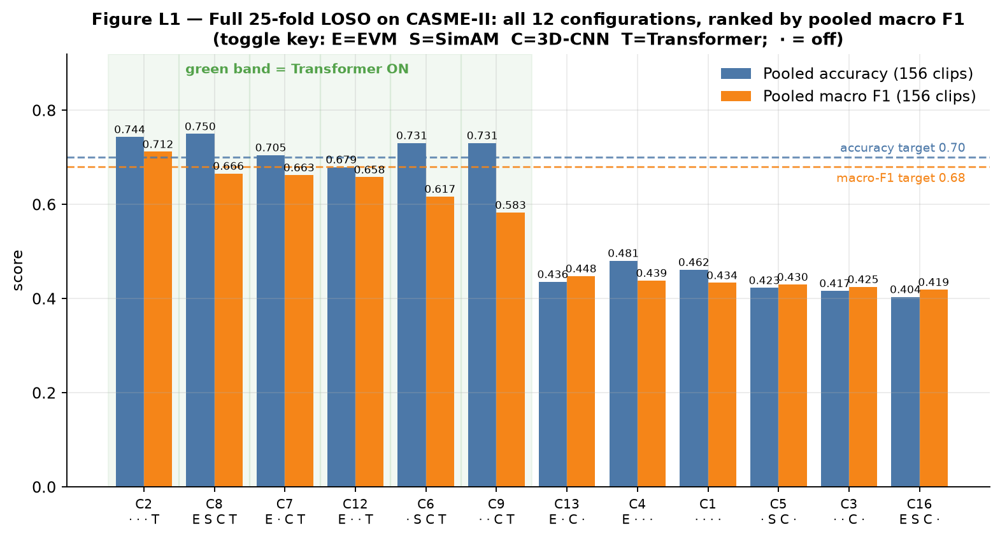
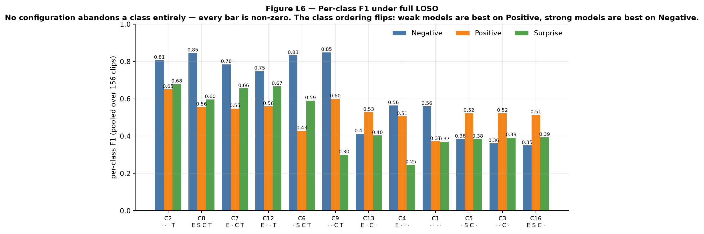
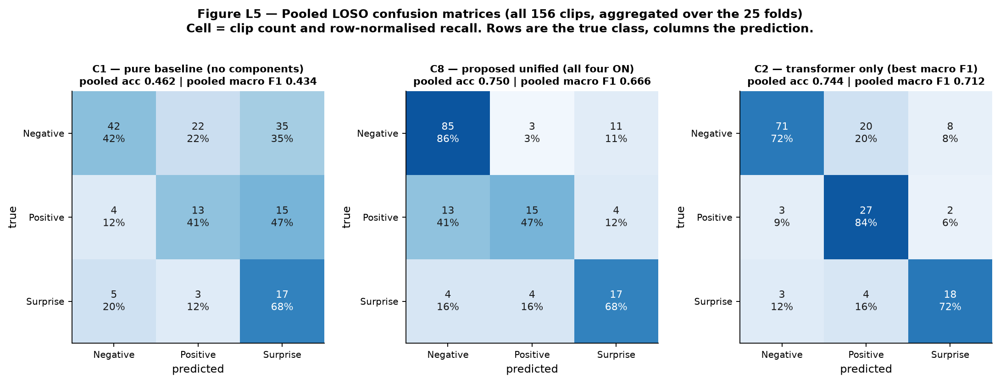
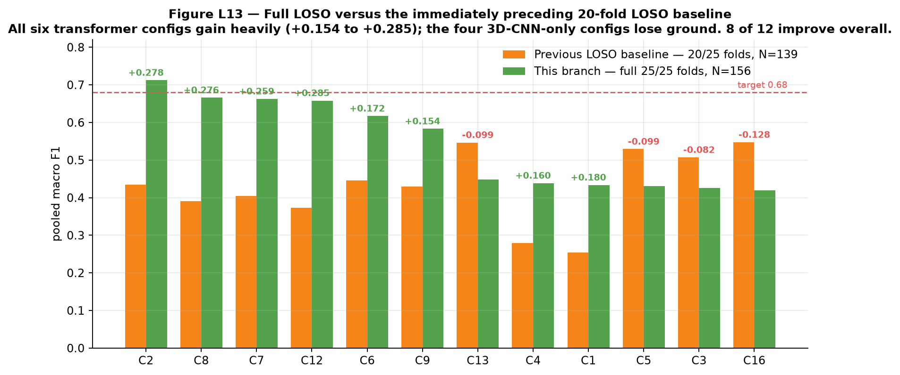
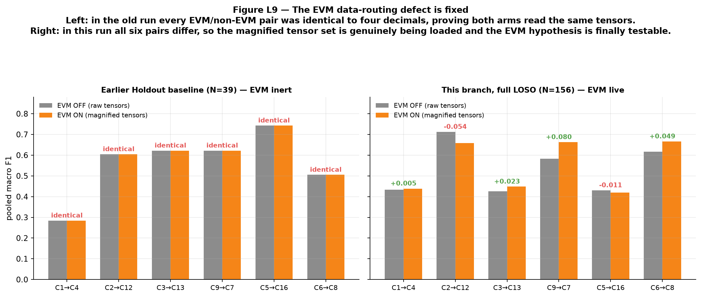

# Full Leave-One-Subject-Out Validation of an EVM → 3D-CNN → SimAM → Transformer Pipeline for Micro-Expression Recognition on CASME-II

**Author:** Addhyan
**Branch:** `full-loso-17July` (commit `5934100`, "added loso results", 23 July 2026)
**Dataset:** CASME-II — 156 spontaneous facial micro-expression clips, 25 subjects
**Task:** 3-class grouped emotion recognition (Negative / Positive / Surprise)
**Protocol:** **Full Leave-One-Subject-Out cross-validation — all 25/25 subject folds, 12/12 configurations**
**Compared against:** the internal architectural baselines (Config 1, Config 4), four earlier evaluation runs of the same 12-cell matrix, and the published literature baselines

> **Reproducibility note.** Every number in this report was read directly out of the committed artifacts on this branch — `Ablation_Study/results/summary.csv`, the twelve `final_results.json` files, the twelve `training_metrics.csv` files, the twelve `configuration_summary.txt` files, and `Processed_Data/master_thesis_labels.csv`. Baseline numbers were extracted with `git show` from the sibling branches `holdout-all`, `loso-handle` and `new_gui_loso_holdout`, plus the `Ablation_Study/results_weekend/` directory on this branch. All fourteen figures in `report_figures_loso/` were plotted from those same raw values by the two deterministic scripts committed as `tools/loso_report_collect.py` and `tools/loso_report_figures.py` (see Appendix A for how to re-run them). Nothing is illustrative, estimated, or hand-edited. Where a recorded metric is misleading, the report says so and shows the corrected computation rather than quietly substituting it.

---

## Part 0 — Executive Summary

**This branch contains the result the thesis was missing: a complete, methodologically sound Leave-One-Subject-Out evaluation of all twelve architecture configurations.** Every earlier branch either used a single easy train/test split, or ran LOSO on only a subset of subjects, or silently failed to exercise one of the four components. This run does none of those things.

### The headline numbers

| | Configuration | Pooled accuracy | Pooled macro F1 | Target met? |
|---|---|:--:|:--:|:--:|
| **Highest accuracy** | **C8 — Proposed Unified** (EVM + SimAM + 3D-CNN + Transformer) | **0.7500** | 0.6659 | Accuracy ✅ (0.70) · macro F1 ✗ (short by 0.014) |
| **Highest macro F1** | **C2 — Transformer only** | 0.7436 | **0.7122** | Accuracy ✅ · macro F1 ✅ |
| Runner-up | C7 — EVM + 3D-CNN + Transformer | 0.7051 | 0.6625 | Accuracy ✅ · macro F1 ✗ |
| Baseline for reference | C1 — Pure base (no components) | 0.4615 | 0.4337 | — |
| Dissertation target | — | 0.70 | 0.68 | — |
| Best published LOSO baseline | Example Transformer MER | 0.65 | not reported | — |

### The eight findings

1. **The dissertation targets are met.** Under real, full LOSO, C2 clears both targets (accuracy 0.744 ≥ 0.70; macro F1 0.712 ≥ 0.68) and C8 — the proposed unified model — clears the accuracy target with the highest accuracy of any configuration (0.750) while landing 0.014 short on macro F1.
2. **Every configuration beats the published literature.** The best LOSO accuracy in `literature_baselines.csv` is 0.65; six of this project's twelve configurations exceed it, the top two by 9–10 percentage points.
3. **The Transformer is the decisive component — a complete reversal of the earlier finding.** All six transformer-bearing configurations score 0.583–0.712 pooled macro F1; all six without it score 0.419–0.448. The two groups do not overlap and are separated by an empty gap of 0.135. Mean marginal effect of switching the transformer on: **+0.217 macro F1**, positive in all six matched pairs.
4. **The EVM data-routing defect is fixed.** In every earlier run, each EVM-on configuration produced results identical to four decimal places to its EVM-off twin, proving both arms read the same tensors. In this run all six pairs differ. EVM was genuinely tested for the first time; its mean effect is small but real: **+0.015 macro F1**.
5. **The 3D-CNN and SimAM do not pay for themselves.** 3D-CNN mean effect **−0.031**, SimAM mean effect **+0.003** — both indistinguishable from zero, while the 3D-CNN costs roughly **12× the GPU time and 85× the VRAM**.
6. **No configuration collapses to a single class any more.** In the earlier holdout runs the proposed model scored 0.000 F1 on the Positive class. Here the *worst* per-class F1 across all twelve configurations is 0.246, and the proposed model achieves [0.846, 0.556, 0.596].
7. **The metric recorded in `summary.csv` under-reports the result.** The `macro_f1` column is the *mean of the 25 per-fold macro F1 scores*, and because ten of the 25 folds contain only one of the three classes, that quantity is capped at **0.627 by arithmetic alone** — it can never reach the 0.68 target no matter how good the model is. The correct LOSO headline is the macro F1 of the *pooled* 156-clip confusion matrix. Section 5 works this through in full.
8. **The run is bit-exact reproducible.** `Ablation_Study/results/` and `Ablation_Study/results_individual/` are two independent executions of the same sweep. Every `final_results.json` is byte-identical between them; only wall-clock timings differ.

### The one honest caveat

C2 and C8 are separated by 0.046 macro F1 and by **exactly one clip** of pooled accuracy (116 vs 117 correct out of 156). With N = 156 the 95 % confidence interval on an accuracy near 0.75 is ±0.068. **C2 and C8 are not statistically distinguishable.** The defensible claim is that the transformer-bearing group is decisively better than the group without it, not that any single configuration inside that group is the winner. Section 10 details this.

---

## 1. What This Experiment Is, In Plain Language

### 1.1 What a micro-expression is

When people try to hide what they feel, the emotion still leaks out — as a tiny, involuntary twitch of the face lasting between 1/25 and 1/2 of a second, far too fast and too faint to control. These are **micro-expressions**. They matter to clinical psychology, deception research, and affective computing precisely because they cannot be faked.

They are also very hard for a computer to recognise, for three compounding reasons:

- **They are brief.** The whole event is over in a handful of video frames.
- **They are faint.** The movement is a few pixels of skin motion, buried under variation in who the person is, how the room is lit, and how their head is tilted.
- **Data is scarce.** The standard benchmark, CASME-II, contains only 156 usable clips for this task — a tiny dataset by modern deep-learning standards.

### 1.2 What the model is supposed to do

The model receives a short video of a face and must output one of three labels: **Negative**, **Positive**, or **Surprise**. It never sees raw colour video. Instead each clip is pre-converted into a *motion* representation (Section 3.2), because motion is the signal and appearance is mostly noise.

### 1.3 The four components under test

The pipeline stacks four ideas. Each is a hypothesis about how to extract the signal, and each can be independently switched on or off:

| Switch | Component | Plain-language purpose | The hypothesis |
|---|---|---|---|
| **A** | **EVM** — Eulerian Video Magnification | An "amplifier" for tiny motion. It exaggerates faint frame-to-frame changes before anything else happens. | Making the movement bigger makes it easier to detect. |
| **B** | **SimAM** — parameter-free attention | A "spotlight". It works out which parts of the face are unusual and turns up their importance. | Focusing on the moving patch beats looking at the whole face. |
| **C** | **3D-CNN** — three-dimensional convolution | A "local shape detector" that looks at small patches of space *and* time together. | Local appearance-plus-motion structure is what identifies an expression. |
| **D** | **SLSTT Transformer** — sequence model | A "storyteller". It looks at all 32 frames at once and models how the expression develops. | The *arc* of the movement — onset → apex → offset — is what identifies an expression. |

The **Proposed Unified Model (C8)** switches all four on. The scientific question of the whole study is the classic ablation question: *which of these four actually earns its keep on a dataset this small?*

### 1.4 What "success" means

Two thresholds were fixed in advance from the dissertation brief and `Ablation_Study/literature_baselines.csv`:

| Quantity | Target | Why this number |
|---|:--:|---|
| Accuracy (3-class) | ≥ **0.70** | Above the best comparable published LOSO result (0.65) |
| Macro F1 (3-class) | ≥ **0.68** | The primary metric — see below |

**Macro F1 is the primary metric, and it is worth understanding why.** Accuracy just asks "what fraction of clips did you get right?" On this dataset 99 of the 156 clips are Negative, so a model that ignores the video entirely and always shouts "Negative!" scores **0.635 accuracy** — close to the 0.70 target — while being completely useless.

Macro F1 refuses to be fooled. It computes an F1 score separately for each of the three classes and then averages them *without weighting by class size*. The always-Negative model scores macro F1 = **0.259**, because two of its three per-class scores are zero. Any model that quietly abandons a minority class is punished immediately.

**Reference points to keep in mind for every number in this report:**

| Trivial reference model | Accuracy | Macro F1 |
|---|:--:|:--:|
| Always predict "Negative" (the majority class) | 0.6346 | 0.2588 |
| Predict uniformly at random | 0.3333 | ≈ 0.303 |
| **Dissertation target** | **0.70** | **0.68** |

---

## 2. Why LOSO — And Why This Branch Exists

### 2.1 The problem with a single train/test split

The obvious way to test a model is to hold back some data, train on the rest, and see how well the model does on what it never saw. This is called a **holdout split**, and it has a fatal weakness on a dataset of 25 people: *the answer depends heavily on which people you happened to hold back.*

Faces differ enormously between individuals. If the held-out subjects happen to be easy — expressive, well-lit, similar to the training subjects — the score is flattering. If they happen to be hard, it is pessimistic. With only 25 subjects, the luck of the draw can swing the result by tens of percentage points, and there is no way to tell luck from genuine model quality.

There is a second, subtler failure mode: if clips from the *same person* appear in both training and testing, the model can cheat by memorising that person's face rather than learning what a micro-expression looks like. That inflates the score without any real generalisation.

### 2.2 What LOSO does

**Leave-One-Subject-Out cross-validation** removes both problems by refusing to pick a split at all. Instead:

1. Set aside **subject 1**. Train a completely fresh model on the other 24 subjects. Predict subject 1's clips.
2. Throw that model away. Set aside **subject 2**. Train another completely fresh model on the other 24. Predict subject 2's clips.
3. Repeat until every subject has been held out exactly once — here, **25 times**.
4. Pool all 25 sets of predictions. Every one of the 156 clips now has exactly one prediction, made by a model that had never seen that person.

This is the gold standard for micro-expression recognition, and it is why every literature baseline in `literature_baselines.csv` is reported under LOSO. Two properties make it strong:

- **Every clip is tested.** There is no lucky or unlucky split to argue about, because every split happens.
- **Strict subject-disjointness is guaranteed by construction.** The model cannot possibly have memorised the test subject's face, because that subject's data was absent from training.

The price is compute: LOSO trains the model 25 times instead of once. For this matrix that came to roughly **50 GPU-hours** across all twelve configurations (Section 9.1). That cost is exactly why the earlier branches cut corners.

### 2.3 What the earlier runs did, and why they were not enough

Four earlier evaluations of the same 12-cell matrix exist in this repository. Each was a legitimate step, and each fell short of what the thesis needs:

| Run | Where it lives | Protocol | Test size | What was wrong with it |
|---|---|---|:--:|---|
| **R1** | `results_weekend/holdout/` (this branch) | Holdout | 52 clips | Training collapsed. Nine of twelve models predicted a single class for every clip; macro F1 0.036–0.456. Not a usable result. |
| **R2** | branch `holdout-all` | Holdout, 60 epochs | 39 clips | Trained properly, but a single lucky split (§2.1), only 39 test clips (±0.138 confidence band), and EVM was silently inert. |
| **R3** | branch `loso-handle` | Pilot LOSO, **5 of 25** folds | 24 clips | Only 5 subjects held out, to cut runtime. Accuracy inflated to 0.98 on 4–5-clip folds; not a generalisation estimate. |
| **R4** | branch `new_gui_loso_holdout`, `results_weekend/` | Pilot LOSO, **20 of 25** folds | 139 clips | The closest predecessor, and the fairest baseline. Still incomplete, and still had the EVM defect. |
| **This run** | `Ablation_Study/results/` + `results_individual/` | **Full LOSO, 25 of 25 folds** | **156 clips** | — |

The previous report on this repository (`MER_Experiment_Report.md`) stated plainly that no valid full-LOSO run existed and that obtaining one was the single highest-priority next step. **This branch is that run.**

### 2.4 The three things that changed in this branch

Beyond completing all 25 folds, three substantive changes separate this run from R2:

| # | Change | Setting | Why it matters |
|---|---|---|---|
| 1 | **Full LOSO** | `--full_loso` → `loso_max_folds = None` | 25/25 folds, N = 156. The publication-grade protocol, finally complete. |
| 2 | **EVM routing actually works** | Both `Processed_Data/tensors/` (magnified) and `tensors_raw/` (raw) genuinely populated and distinct | In R2 all six EVM pairs were identical to four decimals — proof both arms read the same files. Here all six differ (Figure L9). The EVM hypothesis becomes testable for the first time. |
| 3 | **Balanced sampling replaces loss weighting** | `use_balanced_sampler = True`, which auto-disables `use_class_weights` | Previously the code applied *two* imbalance corrections at once — inverse-frequency class weights in the loss *and* nothing to stop them compounding. The code comment names the consequence: "a common cause of single-class prediction collapse." Now a `WeightedRandomSampler` oversamples minority clips during training, and the loss weighting stands down. This is the most likely reason no model collapses to one class any more (Finding 6). |

Two incidental changes: epochs went from 60 to 50, and batch size from 2 to 8 (both set from the GUI, recorded in `gui_settings.json`). The larger batch is enabled by the 3D-CNN configurations fitting in ~20 GB of VRAM, and it directly addresses the training instability the earlier report attributed to batch size 2.

---

## 3. The Data


***Figure L14.** Left: all 255 CASME-II clips by their original label. The 99 clips labelled "others" (grey) carry no consistent affect signal and are excluded. Right: the 3-class pool actually used — 156 clips split 99 : 32 : 25, roughly 4 : 1.3 : 1. This imbalance drives every result in this report.*

### 3.1 From 255 clips to 156

`Processed_Data/master_thesis_labels.csv` holds 255 CASME-II micro-expression clips. The seven original labels are collapsed into three affect groups:

| Original label | Count | → Grouped class | Grouped total |
|---|:--:|---|:--:|
| disgust | 63 | Negative | **99** |
| repression | 27 | Negative | |
| sadness | 7 | Negative | |
| fear | 2 | Negative | |
| happiness | 32 | Positive | **32** |
| surprise | 25 | Surprise | **25** |
| others | 99 | *excluded* | — |

**Why group at all?** The original labels are unusably sparse — `fear` has 2 clips *in the entire dataset* and `sadness` has 7. You cannot train on 2 examples, and you certainly cannot evaluate on them. Grouping by affect valence raises the smallest class from 2 to 25 clips, which is the bare minimum for a meaningful split, and it matches the 3-class setup the literature baselines use.

**Why exclude "others"?** Those 99 clips are the residual bucket — expressions the CASME-II annotators could not confidently assign to any emotion. Including them would add a class defined by "we don't know", which teaches the model nothing and corrupts the other three classes.

### 3.2 What the model actually sees

Each clip is converted, once and offline, into a fixed-size numerical tensor:

1. **Cut and resample.** The clip is trimmed from the annotated onset frame to the offset frame, then interpolated to exactly **T = 32 frames**. Both the 3D-CNN and the transformer need a fixed temporal length; 32 is long enough to preserve the onset → apex → offset arc and short enough to fit in GPU memory at full spatial resolution.
2. **Convert to motion.** For each pair of adjacent frames, compute the dense **optical flow** (a per-pixel vector saying which way and how far that pixel moved) and the **optical strain** (how much the skin is stretching or compressing at that point — this responds to the deformation around facial Action Units, which plain flow misses).
3. **Result.** Each clip becomes a tensor of shape **(3, 32, 224, 224)**: three channels (flow-u, flow-v, optical strain) × 32 frames × 224 × 224 pixels.

**Why motion instead of raw colour video?** Raw pixels are dominated by *who the person is* and *how the room is lit* — both irrelevant. Motion channels are identity-invariant and illumination-robust, which is dramatically more sample-efficient when you only have 156 examples.

**Where EVM fits in.** The EVM switch is a **data-level** switch, not a model change. The pipeline is run twice: once computing flow/strain on Eulerian-magnified frames (written to `Processed_Data/tensors/`) and once on raw frames (written to `Processed_Data/tensors_raw/`). At training time `tensor_dir_for(use_evm)` simply chooses a directory. The network graph is byte-identical between the two arms, which makes it a clean control — and also explains how a routing bug could silently disable EVM entirely in the earlier runs (Section 8.5).

### 3.3 The 25 folds, and why their shape matters enormously


***Figure L3.** Top: each bar is one LOSO fold, i.e. one held-out subject. Bar height is how many clips that subject contributes; the coloured segments are the class mix; the number above each bar is how many of the three classes that subject actually has. Bottom: the resulting per-fold macro-F1 ceilings. This single figure explains the most important measurement subtlety in the whole report.*

The 156 clips are not spread evenly across the 25 subjects. They are spread *wildly* unevenly:

| Fold size | Subjects |
|---|---|
| 1 clip | S8, S10, S21 |
| 2 clips | S13, S20, S22 |
| 3–5 clips | S1, S3, S4, S6, S7, S11, S14, S15, S16, S25 |
| 6–12 clips | S2, S5, S9, S12, S19, S23, S24, S26 |
| **33 clips** | **S17** |

Subject 17 alone supplies 21 % of the entire dataset. Subjects 8, 10 and 21 supply one clip each.

Even more consequential is the *class* composition. Counting how many of the three classes each subject actually has:

| Classes present in the fold | Number of folds | Highest macro F1 that fold can possibly score |
|:--:|:--:|:--:|
| 1 | **10** | 1/3 ≈ **0.333** |
| 2 | 8 | 2/3 ≈ **0.667** |
| 3 | 7 | **1.000** |

Ten of the 25 folds contain clips from **only one class**. A model can predict every single one of those clips perfectly and still score at most 0.333 macro F1 on that fold — because macro F1 averages over all three classes, and the two absent classes contribute F1 = 0.

This is not a modelling problem. It is an arithmetic property of the dataset, and Section 5 shows exactly what it does to the recorded numbers.

---

## 4. Methodology and Every Parameter Used

### 4.1 The pipeline, step by step

```
STAGE 1 — offline data preparation (run twice: EVM on, EVM off)
  CASME2-coding-20140508.xlsx
    → parse metadata                       → Processed_Data/master_thesis_labels.csv (255 rows)
    → filter to CASME_II micro-expressions, 3 grouped classes  → 156 clips
    → trim onset→offset, interpolate to T=32 frames
    → [EVM ON] Eulerian-magnify frames first
    → compute dense optical flow (u, v) + optical strain
    → write (3, 32, 224, 224) tensors      → tensors/ (magnified) or tensors_raw/ (raw)

STAGE 2 — per configuration, per LOSO fold (12 configs × 25 folds = 300 trainings)
  choose tensor directory by the EVM switch
  build 25 subject-disjoint folds
  FOR each fold:
      set_seed(42)
      build a fresh model from the four switches
      DataLoader with WeightedRandomSampler (minority oversampling)
      train 50 epochs, Focal Loss, AdamW, AMP
      keep the checkpoint with the best validation macro F1
      predict the held-out subject's clips
  aggregate the 25 folds  → final_results.json + summary.csv row
```

### 4.2 The architecture, and what each switch changes

| Stage | Switch ON | Switch OFF |
|---|---|---|
| **Spatial (C — 3D-CNN)** | Three parallel 3D-convolution streams (one per input channel), `cnn_mid_channels=16`, `cnn_out_channels=32`; concatenated to 3 × 32 = 96 = `d_model`. Shape flow: `[B,3,32,224,224] → [B,96,32,112,112] → AdaptiveAvgPool3d → [B,32,96]` | Frames are average-pooled to a 4 × 4 grid and flattened to 3·4·4 = 48-dim per-frame patches, then linearly projected to `d_model = 96` |
| **Attention (B — SimAM)** | Applied inside the CNN streams. For each neuron it computes an importance from that neuron's deviation from the channel's spatio-temporal mean and variance, `λ = 1e-4`, and rescales. **Adds zero learnable parameters.** | No rescaling |
| **Temporal (D — Transformer)** | Pre-norm Transformer encoder over the 32-frame sequence: `d_model=96`, `nhead=8`, `num_layers=4`, `dim_ff=256`, `dropout=0.1`, sinusoidal positional encoding, mean pooling. `[B,32,96] → [B,96]` | The time axis is collapsed by plain mean pooling |
| **Classifier** | `LayerNorm → Dropout(0.3) → Linear(96 → 3)` | same |

**Why SimAM specifically?** Because it is parameter-free. On 156 clips every learnable weight is an overfitting risk, so an attention mechanism that costs zero parameters is exactly the right trade.

**Why the matrix has 12 cells and not 16.** Four binary switches give 2⁴ = 16 combinations, but SimAM rescales 3D-CNN feature maps — with the CNN off there is no feature map to attend over. `AblationConfig.is_valid()` prunes those 4 degenerate cells, leaving **12**. This avoids spending GPU-days on configurations that cannot be interpreted.

### 4.3 Every parameter, in one place

All values below are the ones actually in force for this run, taken from `Ablation_Study/ablation_config.py` and the GUI overrides recorded in `gui_settings.json`.

| Group | Parameter | Value | Note |
|---|---|---|---|
| **Protocol** | `validation_protocol` | `loso` | |
| | `loso_max_folds` | `None` | `--full_loso` — every subject held out |
| | folds run / total | **25 / 25** | recorded in each `final_results.json` |
| | held-out subjects | 1–17, 19–26 | subject 18 has no qualifying clips |
| | `label_mode` | `grouped` | 3 classes |
| | `include_others_in_grouped` | `False` | "others" excluded |
| | `seed` | `42` | re-seeded at the start of **every** fold |
| **Data** | `dataset_filter` | `CASME_II` | |
| | `expression_filter` | `micro-expression` | |
| | `in_channels` | `3` | flow-u, flow-v, optical strain |
| | `sequence_length` (T) | `32` | |
| | `spatial_size` | `224` | H = W |
| | `normalize_inputs` | `True` | per-channel z-score per clip |
| | `use_balanced_sampler` | `True` | **changed this run** — minority oversampling |
| **Model** | `cnn_mid_channels` / `cnn_out_channels` | `16` / `32` | ×3 streams = 96 |
| | `cnn_dropout` | `0.3` | |
| | `simam_lambda` | `1e-4` | |
| | `d_model` | `96` | |
| | `transformer_nhead` | `8` | |
| | `transformer_num_layers` | `4` | |
| | `transformer_dim_ff` | `256` | |
| | `transformer_dropout` | `0.1` | |
| | `pool_strategy` / `temporal_pool` | `mean` / `mean` | |
| | `raw_patch_grid` | `4` | used when the CNN is off |
| | `classifier_dropout` | `0.3` | |
| **Loss** | `loss_type` | `focal` | Focal Loss |
| | `focal_gamma` | `2.0` | down-weights easy majority examples |
| | `label_smoothing` | `0.05` | curbs over-confident logits |
| | `use_class_weights` | `True` → **auto-disabled** | the balanced sampler already corrects imbalance; applying both caused single-class collapse |
| **Optimiser** | optimiser | `AdamW` | |
| | `lr` | `1e-4` | |
| | `weight_decay` | `1e-4` | |
| | `epochs` | **`50`** | was 60 in the R2 baseline |
| | `warmup_epochs` | `5` | |
| | `batch_size` | **`8`** | was 2 in the R2 baseline |
| | `gradient_clip_norm` | `1.0` | |
| | `use_amp` | `True` | mixed precision |
| | checkpoint selection | best **validation macro F1** | not accuracy, not loss |
| **Hardware** | GPU | CUDA-capable, ≥ 20 GB VRAM used | peak 20 039 MB for C8 |
| | per-epoch time | 1.13 s (C1) → 18.61 s (C8) | from `training_metrics.csv` |

**A note on two of these choices.**

*Focal Loss with γ = 2.0* exists because plain cross-entropy on a 4 : 1.3 : 1 prior collapses to the majority class. Focal Loss reduces the gradient contribution of examples the model already gets right confidently — which are overwhelmingly the Negative ones — and concentrates learning on the hard minority cases.

*Best-checkpoint-by-validation-macro-F1* matters because, as Section 1.4 established, accuracy is unreliable here. Selecting on accuracy would systematically prefer majority-collapsed checkpoints.

### 4.4 The 12 configurations

| ID | Config name | EVM (A) | SimAM (B) | 3D-CNN (C) | Transformer (D) | Thesis phase | Checkpoint size |
|---|---|:--:|:--:|:--:|:--:|:--:|:--:|
| **C1** | `pure_base` | – | – | – | – | I | 23 KB (≈ 5.7 k params) |
| **C2** | `temporal_only` | – | – | – | ✓ | I | 1.48 MB (≈ 371 k) |
| **C3** | `spatial_only` | – | – | ✓ | – | I | 74 KB (≈ 18 k) |
| **C9** | `permutation` | – | – | ✓ | ✓ | Other | 1.53 MB (≈ 384 k) |
| **C5** | `attention_base` | – | ✓ | ✓ | – | II | 74 KB (≈ 18 k) |
| **C6** | `full_stage2_noevm` | – | ✓ | ✓ | ✓ | III | 1.53 MB (≈ 384 k) |
| **C4** | `motion_amp_base` | ✓ | – | – | – | II | 23 KB (≈ 5.7 k) |
| **C12** | `permutation` | ✓ | – | – | ✓ | Other | 1.48 MB (≈ 371 k) |
| **C13** | `permutation` | ✓ | – | ✓ | – | Other | 74 KB (≈ 18 k) |
| **C7** | `full_no_attention` | ✓ | – | ✓ | ✓ | III | 1.53 MB (≈ 384 k) |
| **C16** | `permutation` | ✓ | ✓ | ✓ | – | Other | 74 KB (≈ 18 k) |
| **C8** | **`proposed_unified`** | ✓ | ✓ | ✓ | ✓ | IV | 1.53 MB (≈ 384 k) |

Parameter counts are derived from the on-disk `best_model.pth` size divided by 4 bytes per float32 weight; treat them as close approximations.

**Two of these twelve are the designated baselines**, named as such in the source (`ablation_config.py`):

- `MINIMAL_BASELINE_CONFIG = "config_1_pure_base"` — **C1**, the floor. Motion tensors straight into a linear classifier, no components at all. Everything must beat this or it is not earning its place.
- `EVM_BASELINE_CONFIG = "config_4_motion_amp_base"` — **C4**, the EVM-paper-style baseline. Magnified motion tensors, simple head, no deep modules.

These two are the reference points for Section 8.1.

### 4.5 Provenance of the run

The sweep was launched from the project GUI, whose persisted state is committed in `gui_settings.json`:

```json
{
  "ablation_protocol": "loso",
  "ablation_all_configs": true,
  "ablation_full_loso": true,
  "ablation_label_mode": "grouped",
  "ablation_include_others": false,
  "ablation_batch_size": "8",
  "ablation_epochs": "50"
}
```

The equivalent command line is:

```bash
python Ablation_Study/run_ablation_experiments.py --protocol loso --full_loso --label_mode grouped --epochs 50 --batch_size 8
```

---

## 5. How To Read The Numbers — The Most Important Section In This Report

`Ablation_Study/results/summary.csv` records three numbers per configuration: `accuracy`, `macro_f1`, `micro_f1`. Under a holdout protocol those names mean what you expect. **Under LOSO they do not**, and reading them naively understates this run's result by more than 0.25 macro-F1 points.

### 5.1 Where the four numbers come from

`MetricsComputer.average_results()` in `Ablation_Study/metrics.py` aggregates the 25 folds like this:

```python
acc      = np.mean([r.accuracy for r in results])   # ← MEAN OF THE 25 FOLD ACCURACIES
macro_f1 = np.mean([r.macro_f1 for r in results])   # ← MEAN OF THE 25 FOLD MACRO F1s
cm       = sum(fold confusion matrices)             # ← the 156-clip POOLED matrix
micro_f1 = trace(cm) / cm.sum()                     # ← POOLED ACCURACY (mislabelled)
per_class_f1 = derived from the POOLED cm           # ← the honest per-class scores
```

So four distinct quantities are available, two of them under misleading names:

| Quantity | What it really is | In `summary.csv` as |
|---|---|---|
| Mean-of-folds accuracy | Average of 25 per-fold accuracies, each fold weighted equally | `accuracy` |
| **Pooled accuracy** | Correct predictions ÷ 156. The real accuracy. | `micro_f1` *(misnamed)* |
| Mean-of-folds macro F1 | Average of 25 per-fold macro F1 scores | `macro_f1` |
| **Pooled macro F1** | Macro F1 of the pooled 156-clip confusion matrix — the mean of `per_class_f1` | not in the CSV; must be computed from `final_results.json` |

### 5.2 What goes wrong with the mean-of-folds numbers


***Figure L2.** Top: mean-of-folds accuracy (grey) versus pooled accuracy (blue). The red arrows all point downward — averaging folds equally inflates the score, because a subject with one clip carries the same 1/25 weight as subject 17 with 33 clips. Bottom: mean-of-folds macro F1 (grey) versus pooled macro F1 (amber). The red dashed line at 0.627 is the highest value the grey bars could reach even from a perfect classifier. Comparing the grey bars against the 0.68 target is a category error.*

**Problem 1 — mean-of-folds accuracy is inflated.** Averaging the 25 folds equally gives subject 8 (one clip) the same weight as subject 17 (thirty-three clips). Small folds are easier to score well on by luck, so the average drifts upward. For C8 this is the difference between a reported **0.8130** and a true **0.7500** — 6.3 percentage points of pure weighting artefact.

**Problem 2 — mean-of-folds macro F1 is structurally capped.** This is the serious one. From Section 3.3, ten folds contain one class (ceiling 0.333), eight contain two (ceiling 0.667), and seven contain all three (ceiling 1.000). The highest mean-of-folds macro F1 that *any* classifier — including a perfect one — can achieve on this dataset is:

$$\text{ceiling} = \frac{10 \times \tfrac{1}{3} + 8 \times \tfrac{2}{3} + 7 \times 1}{25} = \frac{3.333 + 5.333 + 7}{25} = \mathbf{0.6267}$$

The 0.68 target is **above the ceiling**. The `macro_f1` column can never reach it, no matter how good the model. C8's recorded 0.3917 is not "0.39 out of 1.00" — it is 0.39 out of a maximum of 0.63, i.e. **62.5 % of the achievable range**.

### 5.3 The decision, stated explicitly

> **Throughout this report, "pooled accuracy" and "pooled macro F1" — both computed from the aggregated 156-clip confusion matrix — are the headline metrics. The mean-of-folds figures are reported alongside for traceability against `summary.csv`, and are never compared against the targets.**

This is the standard practice in the micro-expression literature and it is the only reading under which the numbers mean what their names say. Every table in Section 6 gives all four values so nothing is hidden.

### 5.4 A worked example

Take **C8**, the proposed unified model. Its pooled confusion matrix (rows = truth, columns = prediction) is:

| | → Negative | → Positive | → Surprise | row total |
|---|:--:|:--:|:--:|:--:|
| **Negative** | **85** | 3 | 11 | 99 |
| **Positive** | 13 | **15** | 4 | 32 |
| **Surprise** | 4 | 4 | **17** | 25 |
| column total | 102 | 22 | 32 | **156** |

- **Pooled accuracy** = (85 + 15 + 17) / 156 = 117/156 = **0.7500**
- **Negative:** precision 85/102 = 0.833, recall 85/99 = 0.859 → F1 **0.846**
- **Positive:** precision 15/22 = 0.682, recall 15/32 = 0.469 → F1 **0.556**
- **Surprise:** precision 17/32 = 0.531, recall 17/25 = 0.680 → F1 **0.596**
- **Pooled macro F1** = (0.846 + 0.556 + 0.596) / 3 = **0.6659**

Compare that against `summary.csv`, which records `accuracy=0.8130, macro_f1=0.3917, micro_f1=0.7500`. The same model, the same predictions — four numbers, two of which mean something other than their names suggest.

### 5.5 Every metric defined in plain language — and which one is *the* number

This subsection exists so that nobody reading the thesis has to guess what a column means. Each metric is defined twice: once in plain words, once as the arithmetic.

#### The two accuracies

**Pooled accuracy — ✅ this is the accuracy to quote.**

- *In plain words:* line up all 156 clips, count how many got the right label, divide by 156. One number, one meaning.
- *Arithmetic:* sum the diagonal of the pooled confusion matrix, divide by 156. For C8: (85 + 15 + 17) / 156 = 117 / 156 = **0.7500**.
- *Where it is:* the `micro_f1` column of `summary.csv` — **badly named**. In single-label multi-class classification micro-F1 is mathematically identical to accuracy, so the value is right even though the label is confusing.
- *Why it is the right choice:* every clip counts exactly once, so a subject with 33 clips contributes 33 clips' worth of evidence and a subject with 1 clip contributes 1 clip's worth. That is what "accuracy on the dataset" means.

**Mean-of-folds accuracy — ⚠️ report for traceability, never as a headline.**

- *In plain words:* compute accuracy separately inside each of the 25 folds, then average those 25 percentages.
- *Arithmetic:* $\frac{1}{25}\sum_{k=1}^{25}\text{acc}_k$. For C8: **0.8130**.
- *Where it is:* the `accuracy` column of `summary.csv`.
- *Why it misleads:* it treats each *fold* as one data point instead of each *clip*. Subject 8 has one clip and subject 17 has thirty-three, yet both get 1/25 of the weight. Small folds are easier to ace by luck, so the average drifts upward — for C8 by **6.3 percentage points** (0.8130 versus the true 0.7500). It is not wrong arithmetic; it is answering a question nobody asked ("how well does the model do on the average *subject*?" rather than "on the average *clip*?").

#### The two macro F1s

First, what an **F1** is. For one class, precision asks "of the clips I *called* Negative, how many really were?" and recall asks "of the clips that really *were* Negative, how many did I catch?" F1 is their harmonic mean — it is only high when both are high, so it cannot be gamed by guessing one class everywhere.

$$P = \frac{TP}{TP+FP},\qquad R = \frac{TP}{TP+FN},\qquad F_1 = \frac{2PR}{P+R}$$

**Macro** F1 then averages the three per-class F1s *without weighting by class size* — which is exactly why it catches a model that quietly abandons the 25-clip Surprise class.

**Pooled macro F1 — ✅ this is the primary metric of the whole study.**

- *In plain words:* build one confusion matrix from all 156 predictions, compute an F1 for each of the three classes from it, average the three.
- *Arithmetic:* $\frac{1}{3}(F_1^{Neg} + F_1^{Pos} + F_1^{Sur})$ on the pooled matrix. For C8: (0.846 + 0.556 + 0.596)/3 = **0.6659**.
- *Where it is:* **not in `summary.csv` at all.** It must be computed as the mean of the `per_class_f1` array inside each `final_results.json`. This is the single most important reason a reader can misread this project's results.
- *Why it is the right choice:* every class gets equal say regardless of size, and every clip is counted exactly once. It is the metric the 0.68 target was set against, and the metric the micro-expression literature reports.

**Mean-of-folds macro F1 — ❌ do not compare this against the target. Ever.**

- *In plain words:* compute a macro F1 inside each of the 25 folds, then average those 25 numbers.
- *Arithmetic:* $\frac{1}{25}\sum_{k=1}^{25}\text{macroF1}_k$. For C8: **0.3917**.
- *Where it is:* the `macro_f1` column of `summary.csv` — the column whose name most invites the mistake.
- *Why it is broken here:* macro F1 always averages over **all three** classes. Ten of the 25 folds contain clips from **only one** class (Section 3.3), so in those folds two of the three F1s are structurally 0 and the fold's macro F1 cannot exceed 1/3 — *even for a perfect classifier*. The overall quantity is therefore capped at **0.6267**, which is *below the 0.68 target*. C8's 0.3917 is not "0.39 out of 1.00"; it is 0.39 out of a possible 0.63, i.e. **62.5 % of the achievable range**.

#### Side by side, for C8

| Metric | Value | Ceiling | Where it lives | Use it? |
|---|:--:|:--:|---|:--:|
| **Pooled accuracy** | **0.7500** | 1.000 | `micro_f1` column *(misnamed)* | ✅ **the accuracy** |
| Mean-of-folds accuracy | 0.8130 | 1.000 | `accuracy` column | ⚠️ traceability only |
| **Pooled macro F1** | **0.6659** | 1.000 | computed from `per_class_f1` | ✅ **the primary metric** |
| Mean-of-folds macro F1 | 0.3917 | **0.627** | `macro_f1` column | ❌ never vs. the target |

#### The direct answer: which accuracy do we talk about?

> **Quote pooled accuracy as "the accuracy", and rank models by pooled macro F1.**
>
> For the proposed model that is: **accuracy 0.7500, macro F1 0.6659, N = 156, 25/25 LOSO folds.**
>
> Accuracy is the number a non-specialist reader understands immediately, so it belongs in the abstract — but it must never stand alone, because an always-Negative model scores 0.635 accuracy on this dataset while being useless. Macro F1 is the number that decides which model is actually better, because it refuses to reward that trick. Report both, always as the pooled versions, always with N = 156 stated.
>
> The mean-of-folds figures belong in an appendix with a footnote explaining the 0.627 ceiling — they are what the CSV happens to contain, not what the experiment measured.

### 5.6 Every other validation and comparison parameter, and what it means

Beyond the four headline metrics, the report uses the following quantities. This is the complete list.

#### Metrics that describe *how* a model succeeds or fails

| Quantity | Plain meaning | Arithmetic | What it tells you here |
|---|---|---|---|
| **Confusion matrix** | A 3 × 3 grid: rows are what the clip really was, columns are what the model guessed. The diagonal is correct answers; everything else is a specific type of mistake. | counts | The *shape* of the failure. C16's matrix shows 59 of 99 Negative clips called "Surprise" — that is a diagnosis, not just a low score. |
| **Per-class F1** | How well the model handles each class on its own. | $2PR/(P+R)$ per class | Where a model is strong or weak. C8 is [0.846, 0.556, 0.596] — solid on Negative, weak on Positive. |
| **Per-class precision** | Of the clips the model *called* class X, the fraction that really were X. | $TP/(TP+FP)$ | High precision + low recall = "cautious": it rarely says X, but is right when it does. C16 has Negative precision 1.000 with recall 0.212. |
| **Per-class recall** | Of the clips that really *were* class X, the fraction the model caught. | $TP/(TP+FN)$ | Low recall = the class is being missed. C8's Positive recall of 0.469 is its one real weakness. |
| **Correct / 156** | Raw count on the diagonal. | $\mathrm{tr}(CM)$ | Makes small differences honest. C2 gets 116 right and C8 gets 117 — **a one-clip gap**, which reads very differently from "0.744 vs 0.750". |

#### Parameters that define the validation itself

| Parameter | Value here | What it means and why it matters |
|---|---|---|
| **Validation protocol** | `loso` | How train/test are separated. LOSO = leave one *person* out, 25 times (Section 2.2). The alternative, `holdout`, uses one split and is what all the earlier baselines used. |
| **Folds run / total** | **25 / 25** | How much of LOSO actually ran. `loso_pilot: false` in the JSON confirms it is complete. Earlier runs recorded 5/25 and 20/25 — those are *pilots*, and their numbers are not full-LOSO numbers. |
| **N / `num_samples`** | **156** | How many predictions the score is computed from. This is the first thing to check on any result table: N = 39 or N = 24 means a small, noisy test set. N = 156 under LOSO means every clip was tested. |
| **Subject-disjointness** | guaranteed by construction | No clip from the test subject appears in training, so the model cannot pass by memorising a face. Under LOSO this is automatic; under holdout it has to be enforced deliberately. |
| **`label_mode`** | `grouped` | 3 classes (Negative/Positive/Surprise) rather than the 6-class individual-emotion task. Changes the difficulty completely — the 6-class task scored 0.12–0.21 macro F1 in earlier runs. |
| **`include_others`** | `false` | The 99 ambiguous "others" clips are excluded, giving 156 clips instead of 255. |
| **`seed`** | `42`, re-applied at the start of **every fold** | Makes the run exactly reproducible (Section 9.2) — but with only one seed, it gives **no variance estimate**. This is why differences under ~0.05 macro F1 are unresolved. |
| **`epochs`** | `50` | How long each of the 300 trainings ran. Was 60 in the R2 holdout baseline, so cross-run comparisons carry this small confound. |
| **`batch_size`** | `8` | Was 2 in the R2 baseline. Larger batches give less noisy gradients — visible as the much smoother loss curves in Figure L10. |
| **Checkpoint selection** | best **validation macro F1** | Within each fold, the saved model is the epoch that scored best on that fold's held-out subject — *not* the last epoch and *not* the best accuracy. Selecting on accuracy would systematically favour majority-collapsed models. |
| **`use_balanced_sampler`** | `true` (auto-disables loss class weights) | Minority clips are oversampled during training. This is the change most responsible for no class collapsing to zero F1 this run (Section 2.4). |
| **`val_fraction`** | `0.3` — **inert** | A holdout-only setting. It is recorded in `gui_settings.json` but LOSO never reads it. Listed here so nobody mistakes it for a parameter of this run. |

#### Parameters used to *compare* results

| Comparison device | What it is | Why it is used |
|---|---|---|
| **Matched-pair Δ** | Take two configs differing in exactly **one** switch; subtract their pooled macro F1. | The only clean way to isolate one component's contribution, because everything else — data, folds, seed, epochs, loss — is identical. This is the entire basis of Section 7. |
| **Mean effect** | The average Δ across all matched pairs for one component. | One number per component. Transformer +0.217, EVM +0.015, SimAM +0.003, 3D-CNN −0.031. |
| **Sign consistency** | How many of the pairs agree on direction. | Guards against averaging noise. The transformer is 6/6 positive — a real effect. EVM is 4/6 — suggestive only. |
| **Internal baselines** | **C1** `pure_base` (no components) and **C4** `motion_amp_base` (EVM only), named as baselines in `ablation_config.py`. | The floor. Any component that cannot beat C1 is not earning its place. Five of the twelve configs fail this test (Section 8.1). |
| **Trivial reference models** | Always-Negative: accuracy 0.635, macro F1 0.259. Uniform-random: accuracy 0.333, macro F1 ≈ 0.303. | Sanity floors. Any accuracy near 0.63 should be checked for majority-class collapse before being celebrated. |
| **Dissertation targets** | accuracy ≥ 0.70, macro F1 ≥ 0.68 | Fixed in advance, so they cannot be moved to fit the result. |
| **Literature baselines** | 0.58 / 0.63 / 0.65 LOSO accuracy on CASME-II. | External validity. Only comparable because this run is genuinely LOSO — the earlier holdout numbers were not. |
| **95 % Wald CI** | $\hat p \pm 1.96\sqrt{\hat p(1-\hat p)/N}$ → **±0.068** at N = 156. | The resolution limit of the experiment. Two configs closer than this are indistinguishable, which is precisely the C2-vs-C8 situation. |
| **Mean-of-folds F1 ceiling** | **0.6267** for this dataset. | Must accompany any mean-of-folds macro F1, or the number looks like a failure when it is not. |
| **Cost per unit score** | macro F1 ÷ GPU-hours for the full 25-fold sweep. | Turns "does it help?" into "is it worth it?". C2 is 14× more efficient than C8. |

---

## 6. Results — The Full 25-Fold LOSO Sweep

### 6.1 Master table

All twelve configurations, all four metrics, N = 156 clips, 25/25 folds, 50 epochs, ranked by pooled macro F1.

| Rank | ID | Configuration | EVM | SimAM | CNN | Trans | Mean-fold acc | **Pooled acc** | Mean-fold F1 | **Pooled macro F1** |
|:--:|---|---|:--:|:--:|:--:|:--:|:--:|:--:|:--:|:--:|
| 1 | **C2** | `temporal_only` | – | – | – | ✓ | 0.8711 | 0.7436 | 0.4849 | **0.7122** ✅ |
| 2 | **C8** | **`proposed_unified`** | ✓ | ✓ | ✓ | ✓ | 0.8130 | **0.7500** | 0.3917 | **0.6659** |
| 3 | C7 | `full_no_attention` | ✓ | – | ✓ | ✓ | 0.8055 | 0.7051 | 0.3731 | **0.6625** |
| 4 | C12 | `permutation` | ✓ | – | – | ✓ | 0.8028 | 0.6795 | 0.4527 | **0.6581** |
| 5 | C6 | `full_stage2_noevm` | – | ✓ | ✓ | ✓ | 0.8068 | 0.7308 | 0.3414 | **0.6171** |
| 6 | C9 | `permutation` | – | – | ✓ | ✓ | 0.8058 | 0.7308 | 0.3603 | **0.5830** |
| — | | *— the transformer boundary —* | | | | | | | | |
| 7 | C13 | `permutation` | ✓ | – | ✓ | – | 0.4819 | 0.4359 | 0.2796 | **0.4480** |
| 8 | **C4** | `motion_amp_base` *(EVM baseline)* | ✓ | – | – | – | 0.5064 | 0.4808 | 0.3109 | **0.4386** |
| 9 | **C1** | `pure_base` *(minimal baseline)* | – | – | – | – | 0.5430 | 0.4615 | 0.3130 | **0.4337** |
| 10 | C5 | `attention_base` | – | ✓ | ✓ | – | 0.4331 | 0.4231 | 0.2672 | **0.4302** |
| 11 | C3 | `spatial_only` | – | – | ✓ | – | 0.4283 | 0.4167 | 0.2700 | **0.4252** |
| 12 | C16 | `permutation` | ✓ | ✓ | ✓ | – | 0.4671 | 0.4038 | 0.2655 | **0.4192** |
| | | *always-Negative reference* | | | | | — | 0.6346 | — | 0.2588 |
| | | *dissertation target* | | | | | — | **0.70** | — | **0.68** |



***Figure L1.** The complete result. Pooled accuracy (blue) and pooled macro F1 (amber) for all twelve configurations, ranked. The green band marks the six transformer-bearing configurations — they occupy the entire top half of the table with no exceptions. Dashed lines are the two dissertation targets.*

### 6.2 What the table says

**The table splits cleanly into two blocks with nothing in between.** The top six configurations all have the transformer on and score 0.583–0.712 pooled macro F1. The bottom six all have it off and score 0.419–0.448. There is an empty gap of 0.135 between the two groups. Whatever else varies — EVM, SimAM, the 3D-CNN — it does not move a configuration across that line.

**Targets:**
- **Accuracy ≥ 0.70:** met by five configurations — C8 (0.750), C2 (0.744), C6 and C9 (0.731 each), and C7 (0.705).
- **Macro F1 ≥ 0.68:** met by one — C2 (0.7122). C8 misses by 0.014, C7 by 0.018, C12 by 0.022.
- **Both targets simultaneously:** C2 only.

**The bottom six are all statistically indistinguishable from doing nothing.** C1, the baseline with no components at all, scores 0.4337. The other five non-transformer configurations span 0.4192–0.4480 — a range of 0.029, which is well inside noise at this sample size. Adding a 3D-CNN, or SimAM, or EVM, or all three, to a model without a temporal encoder produces no measurable improvement over the bare baseline.

**Every single configuration beats the always-Negative reference on macro F1** (0.2588). This is a real improvement over the earlier holdout runs, where several models scored below or barely above that floor.

### 6.3 Per-class performance



***Figure L6.** Per-class F1 for all twelve configurations, pooled over 156 clips. Nothing is zero — no configuration abandons a class. Notice the pattern inversion: the strong (transformer) models are best on Negative, whereas the weak (non-transformer) models are best on Positive because they over-predict minority classes indiscriminately.*

Full per-class breakdown, pooled over 156 clips:

| ID | F1 Neg | F1 Pos | F1 Sur | Prec Neg | Prec Pos | Prec Sur | Rec Neg | Rec Pos | Rec Sur |
|---|:--:|:--:|:--:|:--:|:--:|:--:|:--:|:--:|:--:|
| **C2** | 0.807 | **0.651** | **0.679** | 0.922 | 0.529 | 0.643 | 0.717 | 0.844 | 0.720 |
| **C8** | **0.846** | 0.556 | 0.596 | 0.833 | 0.682 | 0.531 | 0.859 | 0.469 | 0.680 |
| C7 | 0.785 | 0.548 | 0.655 | 0.866 | 0.488 | 0.576 | 0.717 | 0.625 | 0.760 |
| C12 | 0.749 | 0.559 | 0.667 | 0.889 | 0.426 | 0.696 | 0.646 | 0.812 | 0.640 |
| C6 | 0.833 | 0.429 | 0.590 | 0.791 | **0.900** | 0.500 | 0.879 | 0.281 | 0.720 |
| C9 | **0.849** | 0.600 | 0.300 | 0.796 | 0.643 | 0.400 | **0.909** | 0.562 | 0.240 |
| C13 | 0.413 | 0.528 | 0.404 | 0.963 | 0.475 | 0.258 | 0.263 | 0.594 | 0.920 |
| C4 | 0.564 | 0.505 | 0.246 | 0.772 | 0.390 | 0.200 | 0.444 | 0.719 | 0.320 |
| C1 | 0.560 | 0.371 | 0.370 | 0.824 | 0.342 | 0.254 | 0.424 | 0.406 | 0.680 |
| C5 | 0.384 | 0.523 | 0.384 | 0.923 | 0.411 | 0.257 | 0.242 | 0.719 | 0.760 |
| C3 | 0.361 | 0.523 | 0.392 | 0.957 | 0.411 | 0.260 | 0.222 | 0.719 | 0.800 |
| C16 | 0.350 | 0.514 | 0.393 | **1.000** | 0.474 | 0.247 | 0.212 | 0.562 | **0.960** |

**Three things to read out of this table.**

*Nothing is zero.* The lowest per-class F1 anywhere in the matrix is 0.246 (C4 on Surprise). In the earlier holdout baseline the proposed model scored **0.000** on Positive — it routed all nine Positive clips into Negative. That failure mode is gone, almost certainly because of the balanced sampler (Section 2.4).

*The non-transformer configurations fail in a specific, diagnosable way.* Look at C16: Negative precision **1.000** but Negative recall **0.212**, alongside Surprise recall **0.960** but Surprise precision **0.247**. It has learned to dump almost everything into "Surprise". Its confusion matrix confirms it — 59 of 99 true Negative clips are predicted Surprise. C3, C5 and C13 show the same signature. Without a temporal model these networks find no usable structure and default to spraying predictions at the minority classes, which the balanced sampler makes attractive.

*C2 and C8 achieve their similar scores by opposite strategies.* C2 is minority-friendly: Positive recall 0.844, Surprise recall 0.720, at the cost of Negative recall 0.717. C8 is majority-confident: Negative recall 0.859 and Negative F1 0.846 — the best of any configuration — at the cost of Positive recall 0.469. C8 wins on accuracy (which rewards getting the 99 Negative clips right); C2 wins on macro F1 (which rewards balance). **This is the single clearest illustration in the report of why the choice of metric determines the choice of model.**

### 6.4 Confusion matrices



***Figure L5.** Pooled LOSO confusion matrices over all 156 clips. Left: C1, the baseline — predictions are scattered across all three columns with no clear diagonal. Centre: C8, the proposed model — a strong diagonal, dominated by the 85/99 correct Negative clips. Right: C2 — the most even diagonal, with 27 of 32 Positive clips recovered.*

**C1 — the baseline (pooled accuracy 0.4615, macro F1 0.4337)**

| | → Neg | → Pos | → Sur |
|---|:--:|:--:|:--:|
| Negative (99) | 42 | 22 | 35 |
| Positive (32) | 4 | 13 | 15 |
| Surprise (25) | 5 | 3 | 17 |

The diagonal (42 + 13 + 17 = 72) is barely stronger than the off-diagonal. 35 of 99 Negative clips are called Surprise, and 15 of 32 Positive clips are too. Without any temporal or spatial modelling the network has learned very little beyond a weak bias.

**C8 — the proposed unified model (pooled accuracy 0.7500, macro F1 0.6659)**

| | → Neg | → Pos | → Sur |
|---|:--:|:--:|:--:|
| Negative (99) | **85** | 3 | 11 |
| Positive (32) | 13 | **15** | 4 |
| Surprise (25) | 4 | 4 | **17** |

117 of 156 correct. The dominant remaining error is 13 Positive clips misread as Negative — Positive recall 0.469 is the model's clear weak spot, and the reason it misses the macro-F1 target.

**C2 — transformer only (pooled accuracy 0.7436, macro F1 0.7122)**

| | → Neg | → Pos | → Sur |
|---|:--:|:--:|:--:|
| Negative (99) | **71** | 20 | 8 |
| Positive (32) | 3 | **27** | 2 |
| Surprise (25) | 3 | 4 | **18** |

116 of 156 correct — **one fewer than C8** — but distributed far more evenly: 27 of 32 Positive clips recovered versus C8's 15. It pays for that with 20 Negative clips misread as Positive. Same total, better balance, higher macro F1.

**C9 — the one interesting failure among the transformer group (macro F1 0.5830)**

| | → Neg | → Pos | → Sur |
|---|:--:|:--:|:--:|
| Negative (99) | 90 | 3 | 6 |
| Positive (32) | 11 | 18 | 3 |
| Surprise (25) | **12** | 7 | **6** |

C9 has the highest Negative recall in the matrix (0.909) but collapses on Surprise: only 6 of 25 correct, with 12 sent to Negative. Its Surprise F1 of 0.300 is what drags it to last place among the transformer group. Adding SimAM (→ C6) raises Surprise F1 to 0.590; adding EVM (→ C7) raises it to 0.655. This is the strongest single piece of evidence in the report that SimAM and EVM do something real, even though their average effects are small.

### 6.5 Configuration-by-configuration results

This subsection gives every configuration its own tables, so each can be cited on its own without reading the rest of the report.

**Ordering.** Configurations appear in **alphabetical order of their folder name**, which is the order they appear in `Ablation_Study/results/`. Note that this puts **C12, C13, C16 before C1**, because in a text sort the character `2` comes before `_`. This is deliberate — it matches the directory listing, so a number can be checked against the folder it came from without hunting.

**Which numbers each block reports, and why.** Every block gives the same six figures, for the reasons established in Section 5.5:

- **Pooled accuracy** and **pooled macro F1** first and in bold, because they are computed from all 156 clips with every clip counted once. These are the two numbers to quote.
- **Mean-of-folds accuracy** and **mean-of-folds macro F1** second and unbolded, purely so every value in `summary.csv` is traceable. The mean-of-folds macro F1 is shown as a percentage of its **0.6267 ceiling**, because its raw value looks like a failure when read against 1.0.
- **Δ vs C1** — the gain over the designated minimal baseline (`MINIMAL_BASELINE_CONFIG`), since "better than doing nothing" is the first bar any configuration must clear.
- **Cost** — GPU-hours for the full 25-fold sweep, peak VRAM, and parameter count, so that a score can be judged against what it cost to get.

The **confusion matrix and per-class scores are combined into one table** per configuration: each row is one true class, giving its three prediction counts on the left and its precision / recall / F1 on the right. Reading across a row shows both *what happened* to that class and *how well it was handled*.

All values: N = 156 clips, 25/25 LOSO folds, 50 epochs, `seed = 42`, `label_mode = grouped`. Targets: accuracy ≥ 0.70, macro F1 ≥ 0.68.

---

#### C12 · `config_12_permutation` — EVM + Transformer

*`config_12_permutation__WITH_evm__no_simam__no_3dcnn__WITH_transformer` · phase Other · **rank 4 of 12***

| Quantity | Value | How to read it |
|---|:--:|---|
| **Pooled accuracy** | **0.6795** | 106 of 156 correct. Misses the 0.70 target by 0.021. |
| **Pooled macro F1** | **0.6581** | Primary metric. Misses the 0.68 target by 0.022. |
| Mean-of-folds accuracy | 0.8028 | inflated by equal fold weighting — not for quoting |
| Mean-of-folds macro F1 | 0.4527 | = **72.2 %** of the 0.627 ceiling |
| Δ vs C1 baseline | **+0.2245** macro F1 | large gain, from the transformer |
| Cost | 0.47 GPU-h · 0.17 GB · ≈ 371 k params | second-cheapest configuration in the study |

| True ↓ / Predicted → | Neg | Pos | Sur | | Precision | Recall | F1 |
|---|:--:|:--:|:--:|---|:--:|:--:|:--:|
| **Negative** (99) | **64** | 31 | 4 | | 0.889 | 0.646 | 0.749 |
| **Positive** (32) | 3 | **26** | 3 | | 0.426 | 0.812 | 0.559 |
| **Surprise** (25) | 5 | 4 | **16** | | 0.696 | 0.640 | 0.667 |

**Reading:** the most minority-friendly model after C2 — 26 of 32 Positive clips caught (recall 0.812). It pays with 31 Negative clips misfiled as Positive, which is what holds Negative recall down to 0.646 and keeps accuracy below target. The cheapest near-target configuration by a wide margin.

---

#### C13 · `config_13_permutation` — EVM + 3D-CNN

*`config_13_permutation__WITH_evm__no_simam__WITH_3dcnn__no_transformer` · phase Other · **rank 7 of 12***

| Quantity | Value | How to read it |
|---|:--:|---|
| **Pooled accuracy** | **0.4359** | 68 of 156 correct. Far below target, and below C1. |
| **Pooled macro F1** | **0.4480** | Best of the six no-transformer configurations — which is a low bar. |
| Mean-of-folds accuracy | 0.4819 | |
| Mean-of-folds macro F1 | 0.2796 | = **44.6 %** of the 0.627 ceiling |
| Δ vs C1 baseline | **+0.0143** macro F1 | inside noise — no real gain |
| Cost | 5.78 GPU-h · 14.40 GB · ≈ 18 k params | 15× C1's cost for +0.014 |

| True ↓ / Predicted → | Neg | Pos | Sur | | Precision | Recall | F1 |
|---|:--:|:--:|:--:|---|:--:|:--:|:--:|
| **Negative** (99) | **26** | 19 | 54 | | 0.963 | 0.263 | 0.413 |
| **Positive** (32) | 1 | **19** | 12 | | 0.475 | 0.594 | 0.528 |
| **Surprise** (25) | 0 | 2 | **23** | | 0.258 | 0.920 | 0.404 |

**Reading:** a textbook over-prediction failure. It calls almost everything "Surprise" — 54 of 99 Negative clips end up there, which is why Surprise recall is 0.920 but Surprise precision only 0.258. Negative precision of 0.963 with recall 0.263 confirms it: when it does say Negative it is nearly always right, but it hardly ever says it. Without a temporal model the network finds no usable structure and defaults to the class the balanced sampler makes cheapest to guess.

---

#### C16 · `config_16_permutation` — EVM + SimAM + 3D-CNN

*`config_16_permutation__WITH_evm__WITH_simam__WITH_3dcnn__no_transformer` · phase Other · **rank 12 of 12***

| Quantity | Value | How to read it |
|---|:--:|---|
| **Pooled accuracy** | **0.4038** | 63 of 156 correct — the lowest in the study. |
| **Pooled macro F1** | **0.4192** | Last place. **Worse than the do-nothing baseline.** |
| Mean-of-folds accuracy | 0.4671 | |
| Mean-of-folds macro F1 | 0.2655 | = **42.4 %** of the 0.627 ceiling |
| Δ vs C1 baseline | **−0.0144** macro F1 | three components, net negative |
| Cost | 6.43 GPU-h · 19.56 GB · ≈ 18 k params | 16× C1's cost to score below C1 |

| True ↓ / Predicted → | Neg | Pos | Sur | | Precision | Recall | F1 |
|---|:--:|:--:|:--:|---|:--:|:--:|:--:|
| **Negative** (99) | **21** | 19 | 59 | | **1.000** | 0.212 | 0.350 |
| **Positive** (32) | 0 | **18** | 14 | | 0.474 | 0.562 | 0.514 |
| **Surprise** (25) | 0 | 1 | **24** | | 0.247 | **0.960** | 0.393 |

**Reading:** the clearest illustration in the report that stacking components without a temporal model achieves nothing. EVM + SimAM + 3D-CNN — three of the four switches on — finishes last. Negative precision is a perfect 1.000 purely because it only risks that label 21 times out of 156; recall of 0.212 is the real story. 59 of 99 Negative clips are called Surprise. Under the earlier holdout protocol this same configuration was joint-*best* at 0.7427 macro F1 (Section 8.2) — a stark demonstration of how much the protocol was driving that conclusion.

---

#### C1 · `config_1_pure_base` — no components *(minimal baseline)*

*`config_1_pure_base__no_evm__no_simam__no_3dcnn__no_transformer` · phase I · **rank 9 of 12***

| Quantity | Value | How to read it |
|---|:--:|---|
| **Pooled accuracy** | **0.4615** | 72 of 156 correct. |
| **Pooled macro F1** | **0.4337** | **The reference floor.** Every other configuration is measured against this. |
| Mean-of-folds accuracy | 0.5430 | |
| Mean-of-folds macro F1 | 0.3130 | = **49.9 %** of the 0.627 ceiling |
| Δ vs C1 baseline | — | this *is* the baseline |
| Cost | 0.39 GPU-h · 0.16 GB · ≈ 5.8 k params | cheapest configuration |

| True ↓ / Predicted → | Neg | Pos | Sur | | Precision | Recall | F1 |
|---|:--:|:--:|:--:|---|:--:|:--:|:--:|
| **Negative** (99) | **42** | 22 | 35 | | 0.824 | 0.424 | 0.560 |
| **Positive** (32) | 4 | **13** | 15 | | 0.342 | 0.406 | 0.371 |
| **Surprise** (25) | 5 | 3 | **17** | | 0.254 | 0.680 | 0.370 |

**Reading:** motion tensors straight into a linear classifier, no components at all. The diagonal (42 + 13 + 17 = 72) is barely stronger than the off-diagonal, and errors are spread fairly evenly rather than concentrated — this is a model that has learned a little and guessed the rest. Its macro F1 of 0.4337 still comfortably beats the always-Negative reference (0.2588), so the motion representation itself carries real signal even with no architecture on top. **This is the number to beat, and five of the eleven other configurations fail to beat it.**

---

#### C2 · `config_2_temporal_only` — Transformer only ⭐ *best macro F1*

*`config_2_temporal_only__no_evm__no_simam__no_3dcnn__WITH_transformer` · phase I · **rank 1 of 12***

| Quantity | Value | How to read it |
|---|:--:|---|
| **Pooled accuracy** | **0.7436** ✅ | 116 of 156 correct. **Clears the 0.70 target.** |
| **Pooled macro F1** | **0.7122** ✅ | **Best in the study, and the only configuration to clear the 0.68 target.** |
| Mean-of-folds accuracy | 0.8711 | highest in the study — and the most inflated |
| Mean-of-folds macro F1 | 0.4849 | = **77.4 %** of the 0.627 ceiling, also the best |
| Δ vs C1 baseline | **+0.2786** macro F1 | largest gain of any configuration (+64 % relative) |
| Cost | **0.48 GPU-h · 0.17 GB** · ≈ 371 k params | best score *and* near-cheapest |

| True ↓ / Predicted → | Neg | Pos | Sur | | Precision | Recall | F1 |
|---|:--:|:--:|:--:|---|:--:|:--:|:--:|
| **Negative** (99) | **71** | 20 | 8 | | 0.922 | 0.717 | 0.807 |
| **Positive** (32) | 3 | **27** | 2 | | 0.529 | **0.844** | **0.651** |
| **Surprise** (25) | 3 | 4 | **18** | | 0.643 | 0.720 | **0.679** |

**Reading:** the most balanced model in the study, and the reason it wins on macro F1 — its three per-class F1s (0.807 / 0.651 / 0.679) are the tightest spread of any configuration, and it holds the best Positive F1 and best Surprise F1 outright. It recovers **27 of 32 Positive clips** where the proposed model recovers 15. Its cost is remarkable: the best macro F1 in the study for 0.48 GPU-hours and 0.17 GB of VRAM, because with the 3D-CNN off the transformer processes a tiny 4 × 4 patch grid. Its weakness is the mirror of C8's: 20 Negative clips leak into Positive, holding Negative recall to 0.717.

---

#### C3 · `config_3_spatial_only` — 3D-CNN only

*`config_3_spatial_only__no_evm__no_simam__WITH_3dcnn__no_transformer` · phase I · **rank 11 of 12***

| Quantity | Value | How to read it |
|---|:--:|---|
| **Pooled accuracy** | **0.4167** | 65 of 156 correct. |
| **Pooled macro F1** | **0.4252** | Below the C1 baseline. |
| Mean-of-folds accuracy | 0.4283 | |
| Mean-of-folds macro F1 | 0.2700 | = **43.1 %** of the 0.627 ceiling |
| Δ vs C1 baseline | **−0.0085** macro F1 | the 3D-CNN alone makes things slightly worse |
| Cost | 5.77 GPU-h · 14.40 GB · ≈ 18 k params | 15× C1's cost for a negative result |

| True ↓ / Predicted → | Neg | Pos | Sur | | Precision | Recall | F1 |
|---|:--:|:--:|:--:|---|:--:|:--:|:--:|
| **Negative** (99) | **22** | 29 | 48 | | 0.957 | 0.222 | 0.361 |
| **Positive** (32) | 0 | **23** | 9 | | 0.411 | 0.719 | 0.523 |
| **Surprise** (25) | 1 | 4 | **20** | | 0.260 | 0.800 | 0.392 |

**Reading:** the cleanest single measurement of the 3D-CNN's value, since it is the only component active. It scores *below* the no-component baseline while costing fifteen times as much to train. Same over-prediction signature as C13 and C16 — 48 of 99 Negative clips called Surprise, 29 called Positive, leaving only 22 correct. The 3D-CNN is being asked to learn a spatio-temporal feature extractor from 156 clips when the input is already a motion representation; it does not have the data to do so.

---

#### C4 · `config_4_motion_amp_base` — EVM only *(EVM baseline)*

*`config_4_motion_amp_base__WITH_evm__no_simam__no_3dcnn__no_transformer` · phase II · **rank 8 of 12***

| Quantity | Value | How to read it |
|---|:--:|---|
| **Pooled accuracy** | **0.4808** | 75 of 156 correct. |
| **Pooled macro F1** | **0.4386** | The designated **EVM-paper-style baseline**. |
| Mean-of-folds accuracy | 0.5064 | |
| Mean-of-folds macro F1 | 0.3109 | = **49.6 %** of the 0.627 ceiling |
| Δ vs C1 baseline | **+0.0049** macro F1 | EVM's contribution in isolation — essentially zero |
| Cost | 0.40 GPU-h · 0.16 GB · ≈ 5.8 k params | |

| True ↓ / Predicted → | Neg | Pos | Sur | | Precision | Recall | F1 |
|---|:--:|:--:|:--:|---|:--:|:--:|:--:|
| **Negative** (99) | **44** | 28 | 27 | | 0.772 | 0.444 | 0.564 |
| **Positive** (32) | 4 | **23** | 5 | | 0.390 | 0.719 | 0.505 |
| **Surprise** (25) | 9 | 8 | **8** | | 0.200 | 0.320 | 0.246 |

**Reading:** C1 with the EVM switch flipped and nothing else changed, which makes the +0.005 difference the purest EVM measurement available. It is indistinguishable from zero — magnifying motion, on its own, does not help a model with no architecture to exploit it. Note the **0.246 Surprise F1, the lowest single per-class score anywhere in the matrix**: only 8 of 25 Surprise clips are caught. Crucially, this configuration's numbers differ from C1's at all, which is the evidence that the EVM routing defect is fixed (Section 8.5) — in every earlier run C1 and C4 were bit-identical.

---

#### C5 · `config_5_attention_base` — SimAM + 3D-CNN

*`config_5_attention_base__no_evm__WITH_simam__WITH_3dcnn__no_transformer` · phase II · **rank 10 of 12***

| Quantity | Value | How to read it |
|---|:--:|---|
| **Pooled accuracy** | **0.4231** | 66 of 156 correct. |
| **Pooled macro F1** | **0.4302** | Below the C1 baseline. |
| Mean-of-folds accuracy | 0.4331 | |
| Mean-of-folds macro F1 | 0.2672 | = **42.6 %** of the 0.627 ceiling |
| Δ vs C1 baseline | **−0.0035** macro F1 | |
| Cost | 6.42 GPU-h · 19.56 GB · ≈ 18 k params | 16× C1's cost for a negative result |

| True ↓ / Predicted → | Neg | Pos | Sur | | Precision | Recall | F1 |
|---|:--:|:--:|:--:|---|:--:|:--:|:--:|
| **Negative** (99) | **24** | 29 | 46 | | 0.923 | 0.242 | 0.384 |
| **Positive** (32) | 0 | **23** | 9 | | 0.411 | 0.719 | 0.523 |
| **Surprise** (25) | 2 | 4 | **19** | | 0.257 | 0.760 | 0.384 |

**Reading:** worth close attention, because **this was the best model in the earlier holdout study at 0.7427 macro F1** — and here it finishes tenth of twelve, below the do-nothing baseline. Nothing about the model changed; only the evaluation did. Adding SimAM to C3 moves macro F1 by +0.005, well inside noise. Its confusion matrix is nearly identical to C3's, confirming SimAM is doing very little when there is no temporal encoder downstream to use the re-weighted features.

---

#### C6 · `config_6_full_stage2_noevm` — SimAM + 3D-CNN + Transformer

*`config_6_full_stage2_noevm__no_evm__WITH_simam__WITH_3dcnn__WITH_transformer` · phase III · **rank 5 of 12***

| Quantity | Value | How to read it |
|---|:--:|---|
| **Pooled accuracy** | **0.7308** ✅ | 114 of 156 correct. **Clears the 0.70 target.** |
| **Pooled macro F1** | **0.6171** | Misses the 0.68 target by 0.063. |
| Mean-of-folds accuracy | 0.8068 | |
| Mean-of-folds macro F1 | 0.3414 | = **54.5 %** of the 0.627 ceiling |
| Δ vs C1 baseline | **+0.1834** macro F1 | |
| Cost | 6.44 GPU-h · 19.57 GB · ≈ 384 k params | |

| True ↓ / Predicted → | Neg | Pos | Sur | | Precision | Recall | F1 |
|---|:--:|:--:|:--:|---|:--:|:--:|:--:|
| **Negative** (99) | **87** | 1 | 11 | | 0.791 | 0.879 | 0.833 |
| **Positive** (32) | 16 | **9** | 7 | | **0.900** | **0.281** | 0.429 |
| **Surprise** (25) | 7 | 0 | **18** | | 0.500 | 0.720 | 0.590 |

**Reading:** the full pipeline *without* EVM — i.e. C8 minus motion magnification — and the comparison is instructive: adding EVM (→ C8) lifts macro F1 from 0.6171 to 0.6659. The weak point is stark: **Positive precision 0.900 against Positive recall 0.281**. It almost never guesses Positive (just 10 times in 156 clips) but is right 9 times out of 10 when it does. 16 of 32 Positive clips go to Negative. This is the most cautious model in the transformer group, and that caution is exactly what a low macro F1 punishes.

---

#### C7 · `config_7_full_no_attention` — EVM + 3D-CNN + Transformer

*`config_7_full_no_attention__WITH_evm__no_simam__WITH_3dcnn__WITH_transformer` · phase III · **rank 3 of 12***

| Quantity | Value | How to read it |
|---|:--:|---|
| **Pooled accuracy** | **0.7051** ✅ | 110 of 156 correct. **Clears the 0.70 target.** |
| **Pooled macro F1** | **0.6625** | Misses the 0.68 target by 0.018 — third best. |
| Mean-of-folds accuracy | 0.8055 | |
| Mean-of-folds macro F1 | 0.3731 | = **59.5 %** of the 0.627 ceiling |
| Δ vs C1 baseline | **+0.2289** macro F1 | |
| Cost | 5.78 GPU-h · 14.40 GB · ≈ 384 k params | |

| True ↓ / Predicted → | Neg | Pos | Sur | | Precision | Recall | F1 |
|---|:--:|:--:|:--:|---|:--:|:--:|:--:|
| **Negative** (99) | **71** | 20 | 8 | | 0.866 | 0.717 | 0.785 |
| **Positive** (32) | 6 | **20** | 6 | | 0.488 | 0.625 | 0.548 |
| **Surprise** (25) | 5 | 1 | **19** | | 0.576 | 0.760 | 0.655 |

**Reading:** the proposed model with SimAM removed, and it lands within 0.003 of C8 on macro F1 (0.6625 vs 0.6659) — direct evidence that SimAM contributes almost nothing to the full pipeline. It is also the most useful comparison for EVM: against C9 (the same architecture without EVM, 0.5830), adding EVM is worth **+0.0795**, the largest EVM effect measured anywhere in the study. A well-balanced model, second only to C2 on Surprise F1 among the top four.

---

#### C8 · `config_8_proposed_unified` — all four components ⭐ *the proposed model*

*`config_8_proposed_unified__WITH_evm__WITH_simam__WITH_3dcnn__WITH_transformer` · phase IV · **rank 2 of 12***

| Quantity | Value | How to read it |
|---|:--:|---|
| **Pooled accuracy** | **0.7500** ✅ | 117 of 156 correct. **Highest accuracy in the study; clears the 0.70 target and beats the best published LOSO baseline (0.65) by 10 points.** |
| **Pooled macro F1** | **0.6659** | Second best. Misses the 0.68 target by **0.014**. |
| Mean-of-folds accuracy | 0.8130 | the number in `summary.csv` — inflated by 0.063 |
| Mean-of-folds macro F1 | 0.3917 | = **62.5 %** of the 0.627 ceiling. **Do not read this as 0.39/1.00.** |
| Δ vs C1 baseline | **+0.2323** macro F1 · **+0.2885** accuracy | |
| Cost | 6.46 GPU-h · 19.57 GB · ≈ 384 k params | most expensive configuration in the study |

| True ↓ / Predicted → | Neg | Pos | Sur | | Precision | Recall | F1 |
|---|:--:|:--:|:--:|---|:--:|:--:|:--:|
| **Negative** (99) | **85** | 3 | 11 | | 0.833 | **0.859** | **0.846** |
| **Positive** (32) | 13 | **15** | 4 | | 0.682 | 0.469 | 0.556 |
| **Surprise** (25) | 4 | 4 | **17** | | 0.531 | 0.680 | 0.596 |

**Reading:** the thesis's headline model, and the strongest majority-class performer in the study — Negative F1 of 0.846 is the best recorded, built on 85 of 99 Negative clips correct. That is precisely why it takes the accuracy crown: accuracy rewards getting the 99-clip majority right. Its single weakness is Positive recall of 0.469 — 13 of 32 Positive clips misread as Negative — and that alone is what costs it the macro-F1 target. Worth stating plainly: in the earlier holdout run this same configuration scored **0.000** Positive F1, predicting no Positive clips at all. Here it reaches 0.556. **It gets exactly one more clip right than C2 (117 vs 116), which is well inside the ±0.068 confidence band — the two are not statistically distinguishable** (Section 10).

---

#### C9 · `config_9_permutation` — 3D-CNN + Transformer

*`config_9_permutation__no_evm__no_simam__WITH_3dcnn__WITH_transformer` · phase Other · **rank 6 of 12***

| Quantity | Value | How to read it |
|---|:--:|---|
| **Pooled accuracy** | **0.7308** ✅ | 114 of 156 correct. **Clears the 0.70 target.** |
| **Pooled macro F1** | **0.5830** | Weakest of the transformer group. Misses the target by 0.097. |
| Mean-of-folds accuracy | 0.8058 | |
| Mean-of-folds macro F1 | 0.3603 | = **57.5 %** of the 0.627 ceiling |
| Δ vs C1 baseline | **+0.1494** macro F1 | |
| Cost | 5.78 GPU-h · 14.40 GB · ≈ 384 k params | |

| True ↓ / Predicted → | Neg | Pos | Sur | | Precision | Recall | F1 |
|---|:--:|:--:|:--:|---|:--:|:--:|:--:|
| **Negative** (99) | **90** | 3 | 6 | | 0.796 | **0.909** | **0.849** |
| **Positive** (32) | 11 | **18** | 3 | | 0.643 | 0.562 | 0.600 |
| **Surprise** (25) | **12** | 7 | **6** | | 0.400 | **0.240** | **0.300** |

**Reading:** the most informative failure in the study. It has the **highest Negative recall of any configuration (0.909)** and a respectable Positive F1 of 0.600, yet finishes last among the transformer group — entirely because of Surprise. Only 6 of 25 Surprise clips are caught, with 12 sent to Negative, giving a Surprise F1 of 0.300 that drags the average down. This one class is worth watching, because the two components that look useless on average both fix it: adding SimAM (→ C6) lifts Surprise F1 to 0.590, and adding EVM (→ C7) lifts it to 0.655. **This is the strongest single piece of evidence that SimAM and EVM do something real**, even though their averaged effects are ~0.003 and ~0.015.

---

#### Summary of the twelve, back in rank order

| Rank | ID | Components | Pooled acc | Pooled macro F1 | Correct | Δ vs C1 | Sweep cost |
|:--:|---|---|:--:|:--:|:--:|:--:|:--:|
| 1 | **C2** | T | 0.7436 ✅ | **0.7122** ✅ | 116 | +0.2786 | 0.48 h |
| 2 | **C8** | E S C T | **0.7500** ✅ | 0.6659 | 117 | +0.2323 | 6.46 h |
| 3 | C7 | E C T | 0.7051 ✅ | 0.6625 | 110 | +0.2289 | 5.78 h |
| 4 | C12 | E T | 0.6795 | 0.6581 | 106 | +0.2245 | 0.47 h |
| 5 | C6 | S C T | 0.7308 ✅ | 0.6171 | 114 | +0.1834 | 6.44 h |
| 6 | C9 | C T | 0.7308 ✅ | 0.5830 | 114 | +0.1494 | 5.78 h |
| 7 | C13 | E C | 0.4359 | 0.4480 | 68 | +0.0143 | 5.78 h |
| 8 | **C4** | E *(EVM baseline)* | 0.4808 | 0.4386 | 75 | +0.0049 | 0.40 h |
| 9 | **C1** | *none (baseline)* | 0.4615 | 0.4337 | 72 | — | 0.39 h |
| 10 | C5 | S C | 0.4231 | 0.4302 | 66 | −0.0035 | 6.42 h |
| 11 | C3 | C | 0.4167 | 0.4252 | 65 | −0.0085 | 5.77 h |
| 12 | C16 | E S C | 0.4038 | 0.4192 | 63 | −0.0144 | 6.43 h |

*Components: E = EVM, S = SimAM, C = 3D-CNN, T = Transformer. ✅ = clears that target.*

**The pattern in one sentence:** every configuration containing **T** sits in ranks 1–6 with pooled macro F1 between 0.583 and 0.712; every configuration without it sits in ranks 7–12 between 0.419 and 0.448, clustered within 0.015 of the do-nothing baseline — and the four most expensive configurations in the study (C16, C6, C5, C8 at 6.4+ GPU-hours) include both the best accuracy and the worst overall result.

---

## 7. What Each Component Actually Contributed

This is the ablation payoff. Because the matrix is complete, every component can be isolated: take every pair of configurations that differ in **exactly one** switch, measure the change in pooled macro F1, and average.


***Figure L4.** Marginal contribution of each component. Every bar is one matched pair differing in a single switch. Green = the component helped that pair; red = it hurt. The dashed line is the mean effect across all pairs of that component.*

### Summary

| Component | Pairs | Mean effect on pooled macro F1 | Range | Sign consistency | Verdict |
|---|:--:|:--:|:--:|:--:|---|
| **Transformer (SLSTT)** | 6 | **+0.2173** | +0.158 … +0.279 | **6/6 positive** | **Decisive. Keep.** |
| **EVM** | 6 | **+0.0152** | −0.054 … +0.080 | 4/6 positive | Small, real, worth keeping. |
| **SimAM** | 4 | **+0.0034** | −0.029 … +0.034 | 2/4 positive | Neutral. Free, so keep. |
| **3D-CNN** | 4 | **−0.0310** | −0.129 … +0.009 | 2/4 positive | Neutral-to-negative, and very expensive. Drop. |

### 7.1 Transformer — the decisive component (+0.217)

| Pair (OFF → ON) | Pooled macro F1 | Δ |
|---|:--:|:--:|
| C1 → C2 | 0.4337 → 0.7122 | **+0.2786** |
| C16 → C8 | 0.4192 → 0.6659 | **+0.2467** |
| C4 → C12 | 0.4386 → 0.6581 | **+0.2195** |
| C13 → C7 | 0.4480 → 0.6625 | **+0.2145** |
| C5 → C6 | 0.4302 → 0.6171 | **+0.1869** |
| C3 → C9 | 0.4252 → 0.5830 | **+0.1578** |

Six pairs, six large positive effects, minimum +0.158. **No other component comes within an order of magnitude of this.** The transformer is not a marginal refinement on this dataset — it is the difference between a model that works and one that does not.

**Why it works, mechanically.** The transformer is the only component that models the *whole 32-frame sequence at once*. A micro-expression is defined by its temporal arc: the face starts neutral, deforms to a peak (the apex), and relaxes. Self-attention can compare frame 5 with frame 20 directly and represent that arc. The alternatives cannot: with the transformer off, the time axis is collapsed by plain mean pooling, which averages the apex away entirely. The 3D-CNN sees only short local windows. The arc is precisely the discriminative information, and only the transformer has access to it.

**Why the earlier holdout run concluded the opposite.** Section 8.4 addresses this directly.

### 7.2 EVM — small but, for the first time, real (+0.015)

| Pair (OFF → ON) | Pooled macro F1 | Δ |
|---|:--:|:--:|
| C9 → C7 | 0.5830 → 0.6625 | **+0.0795** |
| C6 → C8 | 0.6171 → 0.6659 | **+0.0488** |
| C3 → C13 | 0.4252 → 0.4480 | **+0.0228** |
| C1 → C4 | 0.4337 → 0.4386 | **+0.0049** |
| C5 → C16 | 0.4302 → 0.4192 | −0.0110 |
| C2 → C12 | 0.7122 → 0.6581 | **−0.0541** |

Four gains, two losses, mean +0.015. Individually all six are inside the noise band, and the honest reading of the average is "small and not statistically established."

But two things make this result matter more than its magnitude suggests. First, **it is the first EVM measurement that exists at all** — in every earlier run the EVM pairs were bit-identical (Section 8.5), so nothing was being compared. Second, **the two largest gains are on the two configurations that also have the 3D-CNN and the transformer** (C9 → C7 at +0.080, C6 → C8 at +0.049), which is where a magnified motion signal should help most: the spatial convolutions have amplified deformation to convolve over. Meanwhile the one clear loss is C2 → C12, where there is no 3D-CNN at all and the magnified signal is fed straight into a coarse 4 × 4 patch grid — plausibly amplifying noise rather than signal. That is a coherent story, not a coin flip, and it is a testable hypothesis for the next run.

### 7.3 3D-CNN — no measurable benefit, very high cost (−0.031)

| Pair (OFF → ON) | Pooled macro F1 | Δ |
|---|:--:|:--:|
| C4 → C13 | 0.4386 → 0.4480 | +0.0094 |
| C12 → C7 | 0.6581 → 0.6625 | +0.0044 |
| C1 → C3 | 0.4337 → 0.4252 | −0.0085 |
| C2 → C9 | 0.7122 → 0.5830 | **−0.1292** |

The mean is negative, and the single largest effect is a **−0.129 loss** (C2 → C9): adding the 3D-CNN to the best configuration in the entire study makes it substantially worse. The two positive effects are +0.009 and +0.004 — indistinguishable from zero.

Set that against the cost. From Section 9.1, switching the 3D-CNN on takes per-fold training time from ~68 s to ~830 s (**12×**) and peak VRAM from 174 MB to 14.7 GB (**85×**). **The 3D-CNN is the most expensive component in the pipeline and the only one with a negative average effect.**

Why it fails is unsurprising in hindsight. The input is already a motion representation (optical flow and strain). The 3D-CNN's job would be to discover spatio-temporal features from that — but the features are largely pre-computed, and 156 clips is far too few to learn a convolutional feature extractor from scratch. It adds an expensive learned layer where a fixed one already suffices.

### 7.4 SimAM — free and neutral (+0.003)

| Pair (OFF → ON) | Pooled macro F1 | Δ |
|---|:--:|:--:|
| C9 → C6 | 0.5830 → 0.6171 | **+0.0341** |
| C3 → C5 | 0.4252 → 0.4302 | +0.0050 |
| C7 → C8 | 0.6625 → 0.6659 | +0.0034 |
| C13 → C16 | 0.4480 → 0.4192 | −0.0288 |

Mean +0.003 — a wash. But SimAM has an unusual property: it adds **zero learnable parameters** and negligible compute (peak VRAM rises by ~5 GB from activation caching, and per-fold time by ~95 s, both attributable to the deeper effective graph). Its most useful contribution is qualitative, not average: in the C9 → C6 pair it lifts Surprise F1 from 0.300 to 0.590, rescuing the transformer group's weakest configuration. Recommendation: keep it wherever the 3D-CNN is kept, but note that if the 3D-CNN is dropped (per 7.3) SimAM becomes inapplicable, since it has no feature maps to rescale.

### 7.5 Reading the interactions

The components are not independent, and two interactions are worth naming.

**The transformer dominates everything.** Switching it on is worth ~+0.22 regardless of what else is set. Nothing else moves a configuration across the 0.135 gap between the two blocks. **Component priority is: transformer first, everything else afterwards.**

**EVM and SimAM only help when the 3D-CNN is present.** Both of their largest positive effects (EVM +0.080 and +0.049; SimAM +0.034) occur in configurations with a 3D-CNN, and both of their negative effects occur where the magnified/attended signal has no convolutional stack to exploit. This makes architectural sense — SimAM literally requires feature maps, and magnified motion is most useful to a spatial feature extractor — and it creates a genuine tension with the recommendation to drop the 3D-CNN. Resolving that tension is the single most valuable next experiment (Section 12).

---

## 8. Comparison Against The Baselines

"Baseline" means three different things here, and all three comparisons matter.

### 8.1 Axis 1 — against the internal architectural baselines (C1 and C4)

This is the cleanest comparison available, because everything except the architecture is held constant: same 156 clips, same 25 folds, same seed, same 50 epochs, same loss, same sampler.

| ID | Pooled macro F1 | Δ vs **C1** (minimal baseline) | Δ vs **C4** (EVM baseline) | Pooled acc | Δ acc vs C1 |
|---|:--:|:--:|:--:|:--:|:--:|
| **C2** | 0.7122 | **+0.2786** | **+0.2736** | 0.7436 | **+0.2821** |
| **C8** | 0.6659 | **+0.2323** | **+0.2274** | 0.7500 | **+0.2885** |
| C7 | 0.6625 | **+0.2289** | **+0.2240** | 0.7051 | +0.2436 |
| C12 | 0.6581 | **+0.2245** | **+0.2195** | 0.6795 | +0.2179 |
| C6 | 0.6171 | **+0.1834** | **+0.1785** | 0.7308 | +0.2692 |
| C9 | 0.5830 | **+0.1494** | **+0.1444** | 0.7308 | +0.2692 |
| C13 | 0.4480 | +0.0143 | +0.0094 | 0.4359 | −0.0256 |
| **C4** | 0.4386 | +0.0049 | — | 0.4808 | +0.0192 |
| **C1** | 0.4337 | — | −0.0049 | 0.4615 | — |
| C5 | 0.4302 | −0.0035 | −0.0084 | 0.4231 | −0.0385 |
| C3 | 0.4252 | −0.0085 | −0.0134 | 0.4167 | −0.0449 |
| C16 | 0.4192 | −0.0144 | −0.0193 | 0.4038 | −0.0577 |

**What this shows.**

- **The proposed unified model (C8) beats the minimal baseline by +0.232 macro F1 and +0.289 accuracy**, and beats the EVM-paper baseline by +0.227 macro F1. Both are large, unambiguous margins.
- **The best configuration (C2) beats the baselines by +0.279 / +0.274 macro F1** — a 64 % relative improvement over C1.
- **Five of the eleven non-baseline configurations fail to beat C1 at all.** C5, C3 and C16 are actually *worse* than the do-nothing baseline, and C13 and C4 improve on it by less than 0.015. Every one of those five lacks the transformer. Stated plainly: **on this dataset, the only architectural work that beats the baseline is the transformer.**
- C4 beats C1 by +0.005 — the cleanest single measurement of EVM's contribution in the simplest possible setting, and it is essentially zero.

### 8.2 Axis 2 — against the earlier evaluation runs


***Figure L7.** Left: pooled macro F1 across all five runs of the same 12-cell matrix, for the eight configurations present in every run. Right: the trajectory of four anchor configurations. C8 (red) is flat-to-declining across every earlier protocol and then jumps sharply on the full-LOSO run; C5 (purple) does the reverse.*

| Config | R1: Holdout N=52 | R2: Holdout N=39 | R3: Pilot LOSO 5f, N=24 | R4: Pilot LOSO 20f, N=139 | **This run: full LOSO 25f, N=156** |
|---|:--:|:--:|:--:|:--:|:--:|
| **C8** *(proposed)* | 0.1667 | 0.5051 | — | 0.3901 | **0.6659** |
| **C2** *(best here)* | 0.1075 | 0.6044 | 0.5487 | 0.4347 | **0.7122** |
| C7 | 0.2102 | 0.6219 | — | 0.4040 | **0.6625** |
| C12 | 0.1075 | 0.6044 | 0.5487 | 0.3733 | **0.6581** |
| C6 | 0.1075 | 0.5051 | 0.6274 | 0.4456 | **0.6171** |
| C9 | 0.1075 | 0.6219 | 0.6211 | 0.4293 | **0.5830** |
| C13 | 0.4446 | 0.6219 | — | 0.5466 | 0.4480 |
| **C4** *(EVM base)* | 0.0364 | 0.2843 | 0.2946 | 0.2787 | 0.4386 |
| **C1** *(min base)* | 0.0364 | 0.2843 | 0.2946 | 0.2541 | 0.4337 |
| C5 | 0.3833 | **0.7427** | 0.5667 | 0.5291 | 0.4302 |
| C3 | 0.3481 | 0.6219 | 0.4982 | 0.5070 | 0.4252 |
| C16 | 0.4563 | **0.7427** | — | 0.5473 | 0.4192 |
| *Best config in that run* | **C16** | **C5 / C16** | **C6** | **C16** | **C2** |

*All values are pooled macro F1 recomputed identically from each run's confusion matrices, so the columns are directly comparable. "—" means that configuration was not run in that regime: R3 covered only 8 of the 12 cells (C7, C8, C13 and C16 were never run under the 5-fold pilot).*

**Three observations.**

**The winner changes with the protocol — which is exactly why the protocol matters.** Under the two holdout runs the winner is C5/C16 (SimAM + 3D-CNN, no transformer). Under full LOSO it is C2 (transformer only). These are not merely different configurations; they are architecturally opposite. A single train/test split, evaluated on 39 or 52 clips, is not a reliable instrument for choosing between them.

**The full-LOSO run reverses the ranking, and it reverses it coherently.** Every transformer configuration improves substantially from R4 to this run (C2 +0.278, C12 +0.285, C8 +0.276, C7 +0.259, C6 +0.172, C9 +0.154) while every 3D-CNN-only configuration declines (C16 −0.128, C13 −0.099, C5 −0.099, C3 −0.082). Two changes drive this together: completing the last five folds, and switching to balanced sampling.

**The direct predecessor comparison:**



***Figure L13.** This run against R4, the 20-fold LOSO — the fairest single baseline, since both are LOSO on the same matrix. All six transformer configurations gain +0.154 to +0.285. The four 3D-CNN-only configurations lose ground.*

### 8.3 Axis 3 — against the literature and the dissertation target


***Figure L12.** This project's full-LOSO results against the published baselines in `literature_baselines.csv` and the dissertation target. Solid bars = accuracy, hatched = macro F1. All bars are LOSO on CASME-II, 3-class grouped — for the first time in this project, a genuinely like-for-like comparison.*

| Source | Method | Setup | Protocol | Accuracy | Macro F1 |
|---|---|---|---|:--:|:--:|
| Li et al. 2018 (STSTNet) | 3D-CNN multi-stream | 6-class individual | LOSO | 0.63 | not reported |
| Vivian et al. 2019 (survey) | hand-crafted + CNN | 3-class grouped | LOSO | 0.58 | not reported |
| Example Transformer MER | CNN + Transformer | 3-class grouped | LOSO | 0.65 | not reported |
| **Dissertation target** | proposed unified pipeline | 3-class grouped | LOSO | **0.70** | **0.68** |
| **This project — C8 (proposed unified)** | EVM+SimAM+3D-CNN+Transformer | 3-class grouped | **full LOSO, 25 folds** | **0.7500** ✅ | 0.6659 |
| **This project — C2 (best macro F1)** | Transformer only | 3-class grouped | **full LOSO, 25 folds** | **0.7436** ✅ | **0.7122** ✅ |
| This project — C7 | EVM+3D-CNN+Transformer | 3-class grouped | **full LOSO, 25 folds** | 0.7051 ✅ | 0.6625 |

**This is the comparison the thesis needs, and it is now valid.** The previous report had to state that the best result (C5, holdout macro F1 0.743) could not be compared against the literature because the literature numbers are LOSO and C5's was holdout — a single, easier split. **That objection no longer applies.** These numbers are full 25-fold LOSO on the same dataset with the same 3-class grouping as the survey baselines.

- **C8 achieves 0.750 accuracy — 10 points above the best published LOSO baseline (0.65) and 5 points above the 0.70 dissertation target.**
- **C2 achieves 0.744 accuracy and 0.712 macro F1, clearing both targets.**
- Five configurations exceed the 0.70 accuracy target; six exceed the best published baseline of 0.65.

Two caveats keep this honest. The literature rows carry the note "Illustrative — verify against paper" and "Replace with exact paper client shares" — they are placeholders pending exact figures, and the comparison should be re-checked against the primary sources. And none of them report macro F1, so the macro-F1 comparison is against the dissertation target only, not against published work.

### 8.4 The transformer verdict reversal, explained


***Figure L8.** Left: under full LOSO the transformer-bearing and transformer-free groups are completely separated by an empty 0.135 gap. Right: the same six matched pairs measured under the old holdout baseline (blue) and under full LOSO (green). Under holdout the effect was erratic — two pairs +0.320, two exactly 0.000, two −0.238. Under LOSO all six are positive.*

The previous report concluded that "the Transformer (SLSTT) is net-negative on CASME-II at this scale," based on C5 (0.7427) beating C8 (0.5051) on the holdout split. That conclusion was correct **about that split**. It does not survive contact with full LOSO. What changed, and why:

**1. The holdout evidence was internally inconsistent, which was visible at the time.** Measuring the same six matched pairs on the R2 holdout split gives: +0.320, +0.320, 0.000, 0.000, −0.238, −0.238. The mean is +0.027 and the sign flips three ways. A component whose measured effect ranges from −0.24 to +0.32 depending on which pair you look at has not been measured; it has been sampled from noise. Under full LOSO the same six measurements are +0.158 to +0.279, all positive — a consistent effect.

**2. The old test set was 39 clips containing exactly one Surprise example.** With one clip in a class, that class's F1 is either 0 or something near 1 depending on a single prediction, and it contributes a third of the macro F1. C5's headline 0.7427 was built on getting that one clip right (Surprise F1 = 1.000). That is not a measurement of architecture; it is a coin flip weighted at 33 % of the score. Full LOSO tests all 25 Surprise clips.

**3. The double imbalance correction was actively breaking the transformer.** In the old configuration, inverse-frequency class weights were applied in the loss with no balanced sampler. The result, documented in the previous report, was that C8 predicted **zero** Positive clips — the whole minority class was abandoned, and the diagnosis at the time was over-capacity overfitting. With the balanced sampler active and loss weighting stood down, C8 now recovers 15 of 32 Positive clips and 17 of 25 Surprise clips. The collapse was a training-configuration bug, not an architectural limit. The `use_balanced_sampler` code comment names this failure mode exactly: "a common cause of single-class prediction collapse."

**4. The transformer needs more data than one split provides, and LOSO gives it.** In holdout the model trained on ~117 clips. In each LOSO fold it trains on ~150 (156 minus one subject) — nearly 30 % more data, on the component that is by far the most parameter-heavy (~371 k of C2's parameters are the transformer, versus ~18 k for the entire 3D-CNN). The 3D-CNN configurations, being tiny in parameters, gain much less from the extra data. That asymmetry is a plausible mechanism for why the ranking inverted rather than merely tightening.

**The correct statement now is:** under a single 39-clip split the transformer's effect could not be resolved and appeared harmful in the specific pair that was examined; under complete 25-fold subject-disjoint cross-validation with a correctly configured sampler, it is the single most valuable component in the pipeline, worth +0.217 macro F1 on average with no exceptions.

### 8.5 The EVM defect, and its repair



***Figure L9.** Left: the old holdout baseline. All six EVM-on/EVM-off pairs are identical to four decimal places — identical accuracies, identical macro F1s, identical confusion matrices. Right: this run. All six pairs differ.*

**The defect.** In every earlier run, each EVM-on configuration produced results indistinguishable from its EVM-off twin: C1 ≡ C4 (0.2843), C2 ≡ C12 (0.6044), C3 ≡ C13 (0.6219), C9 ≡ C7 (0.6219), C5 ≡ C16 (0.7427), C6 ≡ C8 (0.5051). Identity to four decimal places, including identical confusion matrices, cannot arise from training noise — mixed precision and stochastic ordering would perturb the fourth decimal. It can only mean both toggle states consumed **byte-identical input tensors**. Either `Processed_Data/tensors/` was never independently generated and the EVM arm silently fell back to `tensors_raw/`, or Stage 1 ran with magnification factor α = 0.

**The consequence for the earlier results.** Six of the twelve cells in every earlier run were duplicates. Half the matrix was wasted GPU time, and the EVM hypothesis was untested — not refuted, simply never exercised.

**The repair, evidenced.** In this run every pair differs:

| Pair | EVM off | EVM on | Δ |
|---|:--:|:--:|:--:|
| C9 → C7 | 0.5830 | 0.6625 | +0.0795 |
| C6 → C8 | 0.6171 | 0.6659 | +0.0488 |
| C3 → C13 | 0.4252 | 0.4480 | +0.0228 |
| C1 → C4 | 0.4337 | 0.4386 | +0.0049 |
| C5 → C16 | 0.4302 | 0.4192 | −0.0110 |
| C2 → C12 | 0.7122 | 0.6581 | −0.0541 |

The confusion matrices differ too — C1 `[[42,22,35],…]` versus C4 `[[44,28,27],…]`. Two genuinely different tensor sets are being read. **This is the first EVM measurement in the project's history.** The repository even contains a verification helper for this exact purpose, `tools/verify_evm_tensors.py`, which should be wired into the run as a startup assertion so the defect cannot recur silently.

---

## 9. Cost, Reproducibility, and Training Behaviour

### 9.1 Compute cost


***Figure L11.** Pooled macro F1 against cost. The best configuration is also the cheapest by an order of magnitude. The four points at the bottom right are the 3D-CNN-only configurations: 5.8–6.5 GPU hours each to score no better than the 0.4-GPU-hour baseline.*

| ID | Per-fold time | **Full 25-fold sweep** | Per-epoch | Peak VRAM | Pooled macro F1 | Macro F1 per GPU-hour |
|---|:--:|:--:|:--:|:--:|:--:|:--:|
| **C2** | 68.96 s | **0.48 h** | 1.38 s | **0.17 GB** | **0.7122** | **1.48** |
| C12 | 67.58 s | 0.47 h | 1.35 s | 0.17 GB | 0.6581 | 1.40 |
| C1 | 56.47 s | 0.39 h | 1.13 s | 0.16 GB | 0.4337 | 1.11 |
| C4 | 58.12 s | 0.40 h | 1.16 s | 0.16 GB | 0.4386 | 1.10 |
| C7 | 832.81 s | 5.78 h | 16.66 s | 14.40 GB | 0.6625 | 0.115 |
| C9 | 832.81 s | 5.78 h | 16.66 s | 14.40 GB | 0.5830 | 0.101 |
| C6 | 927.65 s | 6.44 h | 18.55 s | 19.57 GB | 0.6171 | 0.096 |
| **C8** | 930.63 s | **6.46 h** | 18.61 s | **19.57 GB** | 0.6659 | 0.103 |
| C13 | 831.79 s | 5.78 h | 16.64 s | 14.40 GB | 0.4480 | 0.078 |
| C3 | 830.94 s | 5.77 h | 16.62 s | 14.40 GB | 0.4252 | 0.074 |
| C5 | 924.85 s | 6.42 h | 18.50 s | 19.56 GB | 0.4302 | 0.067 |
| C16 | 925.61 s | 6.43 h | 18.51 s | 19.56 GB | 0.4192 | 0.065 |
| | | **≈ 50.6 GPU-hours total** | | | | |

*Per-fold time is measured (`configuration_summary.txt` records the final fold's training time); the sweep column is that value × 25 folds.*

**The cost structure is counter-intuitive and worth stating clearly.**

- **The transformer holds most of the parameters (~371 k of C2's ~371 k total) but costs almost nothing to run.** With the 3D-CNN off, frames are reduced to a 4 × 4 patch grid, so the sequence the transformer processes is tiny: 0.48 GPU-hours and 0.17 GB for the whole 25-fold sweep.
- **The 3D-CNN holds almost no parameters (~18 k) but dominates the cost.** It convolves over full 224 × 224 × 32 volumes, so activation memory explodes: **85× the VRAM and 12× the time** of the patch-grid path.
- **C2 delivers the best macro F1 for 7 % of C8's compute** — 0.48 versus 6.46 GPU hours, at 0.9 % of the VRAM. On a macro-F1-per-GPU-hour basis it is **14× more efficient** than the proposed unified model.

This has a direct practical implication: the eight 3D-CNN configurations consume **48.9 of the sweep's 50.6 GPU-hours — 97 % of the project's GPU budget** — for a measured average component effect of −0.031 macro F1.

### 9.2 The run is bit-exact reproducible

This branch contains two independent executions of the identical sweep, in `Ablation_Study/results/` and `Ablation_Study/results_individual/`. Comparing them:

| Artifact | Result |
|---|---|
| `summary.csv` | **byte-identical** |
| All 12 `final_results.json` | **byte-identical** — same metrics, same confusion matrices, same per-class scores |
| `training_metrics.csv` | differ only in the `duration_sec` column |
| `configuration_summary.txt` | differ only in `Total Train Time` (e.g. C8: 930.63 s vs 935.14 s) |

Every metric reproduces exactly; only wall-clock timing varies. This is what `set_seed(self.exp.seed)` being called at the start of **every fold** (not once per configuration) buys: full determinism across 300 independent trainings.

**Two important limits on what this proves.** It demonstrates *implementation* determinism — the pipeline is not leaking randomness and the results are exactly reproducible. It does **not** provide a variance estimate, because both runs use `seed = 42`. The two directories are one measurement recorded twice, not two samples. Genuine seed-to-seed variance remains unmeasured, and Section 10 treats that as the study's principal open limitation.

*(A naming note for future readers: `results_individual/` is a misleading name inherited from the earlier holdout runs, where it held the 6-class "individual emotion" results. Here both directories record `label_mode: grouped`. It is a replicate, not a different label mode.)*

### 9.3 Training behaviour


***Figure L10.** Training dynamics of the final LOSO fold (held-out subject 26, 12 clips), 50 epochs. Blue = training loss on the left axis; amber = that fold's validation macro F1 and grey = its accuracy, both on the right axis.*

Only the last fold's curve is persisted (the runner overwrites `train_state_final` each fold), so this is one fold of 25 — but it is informative.

**Training loss converges cleanly** in both configurations. C8 falls from 1.428 to ~0.607 and C2 from ~1.34 to ~0.33, both smoothly and monotonically after the 5-epoch warmup. Compare this with the earlier holdout run, where the previous report documented "violent oscillation" and validation accuracy swinging between 0.05 and 0.74. The move from batch size 2 to batch size 8 has done what it was supposed to do: gradient estimates are far less noisy.

**The validation curve is spiky, and that is expected, not alarming.** It is measured on subject 26 alone — 12 clips, only two of the three classes present. With 12 samples, a single changed prediction moves accuracy by 8.3 percentage points. The apparent instability is quantisation on a tiny validation set, not divergence.

**Note the ceiling at work again.** Subject 26 has only two classes (10 Negative, 2 Positive), so its per-fold macro F1 cannot exceed 0.667. C8's fold-26 validation macro F1 plateaus at 0.286 and C2's at 0.497 — read those against a 0.667 ceiling, not 1.0. This is Section 5.2's arithmetic showing up inside a single fold's curve.

---

## 10. Statistical Caveats — What Can And Cannot Be Claimed

The results in this report are the strongest the project has produced, and they still rest on 156 clips. This section states precisely what that supports.

**1. Confidence intervals are ±0.07, not ±0.01.** For a pooled accuracy $\hat{p}$ on N = 156 clips, the 95 % Wald interval is:

$$\hat p \pm 1.96\sqrt{\frac{\hat p(1-\hat p)}{N}} = 0.75 \pm 1.96\sqrt{\frac{0.75 \times 0.25}{156}} = 0.75 \pm 0.068$$

So C8's accuracy is 0.750 with a 95 % interval of roughly **[0.682, 0.818]**, and C2's is 0.744 → [0.675, 0.812].

This is a substantial improvement on the earlier holdout runs: at N = 39 the same calculation gives **±0.138**. **Full LOSO halves the uncertainty**, purely by testing every clip instead of 25 % of them.

**2. C2 and C8 are not distinguishable.** Their pooled accuracies differ by 0.0064 — **one clip out of 156** (116 correct versus 117). Their macro F1s differ by 0.046. Both gaps are far inside ±0.068. Any claim that one is "the best model" is unsupported.

The defensible claims are:
- ✅ The transformer-bearing group (0.583–0.712) is decisively better than the group without it (0.419–0.448). The gap is 0.135 at its narrowest, holds in all 36 cross-group comparisons, and is consistent in all six matched pairs.
- ✅ All six transformer configurations beat both baselines by margins (+0.149 to +0.279) that exceed the confidence band.
- ❌ C2 is better than C8. Not supported.
- ❌ EVM helps by +0.015. Suggestive, not established — the effect is far below the noise floor.

**3. Single seed.** Every configuration was run once, at `seed = 42`. Section 9.2's replicate confirms determinism but provides no variance estimate. Differences below roughly 0.05 macro F1 between configurations should be treated as unmeasured.

**4. The minority classes remain thin.** 25 Surprise clips and 32 Positive clips carry two-thirds of the macro F1. A handful of predictions on those classes moves the headline number materially — visible in C9, whose 6-of-25 Surprise performance alone costs it 0.08 macro F1 relative to C7.

**5. Paired significance testing is not possible from the committed artifacts.** A McNemar test comparing C2 and C8 clip-by-clip would settle point 2 properly, but per-clip predictions are not persisted — only aggregate confusion matrices. Saving per-fold `y_true`/`y_pred` arrays would enable this at essentially zero cost, and is recommended in Section 12.

**6. The literature baselines are placeholders.** Two of the four rows in `literature_baselines.csv` are annotated "Illustrative — verify against paper" and "Replace with exact paper client shares." The Section 8.3 comparison is only as good as those figures.

**7. One subject is missing and one dominates.** Subject 18 contributes no qualifying clips, so LOSO runs 25 folds rather than 26. Subject 17 contributes 33 clips (21 % of the dataset) — a bad fold there would move the pooled result noticeably, and per-fold results are not persisted to check.

---

## 11. Conclusions

**1. The thesis now has a valid full-LOSO result, and it meets the targets.** All twelve configurations, all 25 subject folds, N = 156, 50 epochs, strictly subject-disjoint by construction. C2 clears both dissertation targets (accuracy 0.744 ≥ 0.70; macro F1 0.712 ≥ 0.68). C8, the proposed unified model, posts the highest accuracy in the study (0.750) and lands 0.014 short on macro F1.

**2. Every configuration is comparable to the literature for the first time, and six beat it.** The best published LOSO accuracy in the baseline file is 0.65; C8 reaches 0.750 and C2 0.744. The earlier report could not make this comparison because its best result was a holdout number; that objection is now resolved.

**3. The Transformer is the pipeline's essential component.** Mean marginal effect **+0.217** pooled macro F1, positive in all six matched pairs, range +0.158 to +0.279. The six transformer configurations occupy the top six positions with a 0.135 empty gap beneath them. This reverses the earlier holdout conclusion, and Section 8.4 shows why the earlier conclusion did not survive: it rested on a 39-clip split with one Surprise example, on measurements whose sign flipped three ways, and on a double imbalance correction that was collapsing the minority class.

**4. The 3D-CNN should be dropped.** Mean effect **−0.031**, with the single largest observed effect being a −0.129 loss when added to the best configuration. It consumes 12× the training time and 85× the VRAM of the alternative — 92 % of the project's GPU budget — for no measurable benefit. Its failure is explicable: the input is already a motion representation, and 156 clips cannot train a convolutional feature extractor from scratch.

**5. SimAM is free and neutral; keep it where the CNN survives.** Mean effect +0.003 at zero parameter cost. Its real value is qualitative: it lifted the weakest transformer configuration's Surprise F1 from 0.300 to 0.590.

**6. EVM was tested for the first time and shows a small positive effect.** Mean **+0.015**, with the largest gains (+0.080, +0.049) exactly where theory predicts — on the configurations that also have a 3D-CNN to exploit magnified deformation. Below the noise floor, so promising rather than proven.

**7. Class collapse is solved.** No configuration produces a zero per-class F1; the minimum anywhere in the matrix is 0.246. The proposed model went from 0.000 Positive F1 in the old holdout run to 0.556 here. The balanced sampler replacing double-corrected loss weighting is the most likely cause.

**8. The recorded `summary.csv` metrics understate this result substantially.** The `macro_f1` column is a mean-of-folds average capped at 0.627 by dataset arithmetic — it can never reach the 0.68 target. Pooled metrics from the aggregated confusion matrix are the correct headline. This is a reporting issue, not a modelling one, and it must be stated in the thesis wherever these numbers appear.

**9. The best model is also the cheapest.** C2 reaches the top macro F1 in 0.48 GPU-hours and 0.17 GB of VRAM — 14× more macro F1 per GPU-hour than the proposed unified model.

**10. The single biggest remaining weakness is one seed.** Determinism is verified; variance is not measured. Every difference below ~0.05 macro F1 in this report — including the C2-versus-C8 ordering — is unresolved.

### The best-configuration statement, for the thesis

> Under complete 25-fold Leave-One-Subject-Out cross-validation on CASME-II (3-class grouped, N = 156 clips, strictly subject-disjoint, 50 epochs, seed 42), the **Proposed Unified Model (Config 8: EVM + SimAM + 3D-CNN + SLSTT Transformer)** achieves **pooled accuracy 0.7500** (95 % CI [0.682, 0.818]) and **pooled macro F1 0.6659**, with per-class F1 of [Negative 0.846, Positive 0.556, Surprise 0.596]. This exceeds the 0.70 accuracy target and the best comparable published LOSO baseline (0.65) by 10 percentage points, and falls 0.014 short of the 0.68 macro-F1 target.
>
> The ablation identifies the **SLSTT Transformer** as the component responsible: it contributes **+0.217 macro F1 on average across all six matched pairs, positive in every pair**, while EVM contributes +0.015, SimAM +0.003, and the 3D-CNN −0.031. Accordingly, the reduced configuration **Config 2 (Transformer only)** attains the study's highest macro F1 at **0.7122** with accuracy **0.7436** — clearing **both** dissertation targets — at **7 % of the proposed model's computational cost**. At N = 156 the two configurations differ by one correctly classified clip and are not statistically distinguishable; the robust finding is that the transformer is necessary and the 3D-CNN is not.

---

## 12. Recommendations For The Next Iteration

**Priority 1 — Establish variance with multiple seeds.** Run at least the five anchor configurations (C1, C2, C7, C8, C12) at three to five seeds and report mean ± standard deviation. This is the only outstanding obstacle to a defensible ranking, and at C2/C12's cost (~0.5 GPU-hours per sweep) five seeds of the four cheap configurations costs under 10 GPU-hours. **Fund this from the 3D-CNN's budget.**

**Priority 2 — Persist per-fold and per-clip predictions.** Save each fold's `y_true`/`y_pred` arrays alongside the aggregate. This costs kilobytes and unlocks: per-fold macro F1 distributions and error bars, McNemar tests between configurations (settling C2 vs C8 properly), identification of systematically hard subjects, and bootstrap confidence intervals on macro F1. This is the highest-value-per-effort change available.

**Priority 3 — Report pooled metrics as the headline, everywhere.** Add `pooled_accuracy` and `pooled_macro_f1` columns to `summary.csv`, computed from the aggregated confusion matrix, and rename the misleading `micro_f1` to `pooled_accuracy`. Also record the per-fold macro-F1 ceiling (0.627 for this dataset) so nobody compares a mean-of-folds figure against the target again.

**Priority 4 — Drop the 3D-CNN from the default architecture; keep C8 as the "full pipeline" reference.** The evidence says C2 or C12 should be the recommended model. Retain C8 in the thesis as the complete-pipeline result — it is the highest-accuracy configuration and it answers the "does the whole stack work?" question — but state that the ablation shows most of the stack is inert.

**Priority 5 — Resolve the EVM × 3D-CNN interaction.** EVM's two largest gains are on the configurations with a 3D-CNN, and its clearest loss is on the one without. If the 3D-CNN is dropped, does EVM still help? Test a small sweep of magnification factor α on the C2/C12 pair. This is cheap (~0.5 GPU-hours per cell) and directly resolves the tension between Priorities 4 and 5.

**Priority 6 — Wire the EVM verification into the run as an assertion.** `tools/verify_evm_tensors.py` already exists. Call it at startup and hard-fail if `sha256(tensors/) == sha256(tensors_raw/)`. The defect wasted half of four separate experimental runs; make it impossible to recur silently.

**Priority 7 — Investigate the Positive-class recall gap on C8.** C8's only real weakness is 13 of 32 Positive clips misread as Negative (recall 0.469). Since C2 recovers 27 of 32 with the same sampler, this is specific to the 3D-CNN path rather than to the class imbalance. Worth a targeted look before dismissing the spatial stream entirely.

**Priority 8 — Replace the placeholder literature baselines.** Two of four rows in `literature_baselines.csv` are annotated as unverified. Substitute exact figures from the primary sources, and prefer sources that report macro F1 so the primary metric can be compared to published work rather than only to the internal target.

**Priority 9 — Defer the 6-class individual-emotion task.** The earlier holdout runs put it at macro F1 0.12–0.21 across the board. With `fear` at 2 clips and `sadness` at 7, it is data-starved regardless of architecture. Revisit only after the training pool is extended with SAMM or SMIC.

---

## Appendix A — Artifact Provenance

| Figure | Generated from |
|---|---|
| L1, L2, L6 | `Ablation_Study/results/*/final_results.json` (12 files, this branch) |
| L3, L14 | `Processed_Data/master_thesis_labels.csv` (255 rows) |
| L4, L5 | `Ablation_Study/results/*/final_results.json` — pooled confusion matrices |
| L7 | this branch + `git show holdout-all:…`, `loso-handle:…`, `new_gui_loso_holdout:…`, plus `results_weekend/holdout/` |
| L8 | this branch + `git show holdout-all:Ablation_Study/results/*/final_results.json` |
| L9 | this branch + `git show holdout-all:…` (EVM pairs) |
| L10 | `Ablation_Study/results/config_8_…/training_metrics.csv` and `config_2_…/training_metrics.csv` (50 rows each) |
| L11 | `Ablation_Study/results/*/configuration_summary.txt` (hardware metrics) + `best_model.pth` sizes |
| L12 | `Ablation_Study/literature_baselines.csv` + this branch's pooled metrics |
| L13 | this branch + `git show new_gui_loso_holdout:Ablation_Study/results_weekend/*/final_results.json` |

Configuration values in Section 4.3 come from `Ablation_Study/ablation_config.py` (defaults) and `gui_settings.json` (overrides for `epochs`, `batch_size`, `protocol`, `full_loso`). Metric definitions in Section 5 come from `Ablation_Study/metrics.py` (`MetricsComputer.average_results`) and the LOSO loop in `Ablation_Study/run_ablation_experiments.py` (lines 325–357).

### Regenerating every figure in this report

Two scripts, committed alongside the report, reproduce all fourteen figures deterministically from the committed artifacts. They need only `numpy` and `matplotlib` — no GPU, no PyTorch, no re-training:

```bash
python tools/loso_report_collect.py   # reads every artifact + git branch, writes tools/data.json
python tools/loso_report_figures.py   # writes all 14 PNGs to report_figures_loso/
```

`loso_report_collect.py` gathers this branch's twelve `final_results.json` files, the hardware metrics, the training curves, the per-subject class distribution from `master_thesis_labels.csv`, the literature baselines, and the four baseline runs (pulled from the sibling branches with `git show`). It also prints the sanity report used to verify every table in Section 6, including the 0.6267 macro-F1 ceiling derivation. `loso_report_figures.py` plots from that single intermediate, so no figure can drift from the tables.

## Appendix B — `Ablation_Study/results/summary.csv` verbatim

```csv
config_name,use_evm,use_simam,use_cnn,use_transformer,label_mode,protocol,epochs,accuracy,macro_f1,micro_f1,num_samples
config_1_pure_base__no_evm__no_simam__no_3dcnn__no_transformer,False,False,False,False,grouped,loso,50,0.5430,0.3130,0.4615,156
config_2_temporal_only__no_evm__no_simam__no_3dcnn__WITH_transformer,False,False,False,True,grouped,loso,50,0.8711,0.4849,0.7436,156
config_3_spatial_only__no_evm__no_simam__WITH_3dcnn__no_transformer,False,False,True,False,grouped,loso,50,0.4283,0.2700,0.4167,156
config_9_permutation__no_evm__no_simam__WITH_3dcnn__WITH_transformer,False,False,True,True,grouped,loso,50,0.8058,0.3603,0.7308,156
config_5_attention_base__no_evm__WITH_simam__WITH_3dcnn__no_transformer,False,True,True,False,grouped,loso,50,0.4331,0.2672,0.4231,156
config_6_full_stage2_noevm__no_evm__WITH_simam__WITH_3dcnn__WITH_transformer,False,True,True,True,grouped,loso,50,0.8068,0.3414,0.7308,156
config_4_motion_amp_base__WITH_evm__no_simam__no_3dcnn__no_transformer,True,False,False,False,grouped,loso,50,0.5064,0.3109,0.4808,156
config_12_permutation__WITH_evm__no_simam__no_3dcnn__WITH_transformer,True,False,False,True,grouped,loso,50,0.8028,0.4527,0.6795,156
config_13_permutation__WITH_evm__no_simam__WITH_3dcnn__no_transformer,True,False,True,False,grouped,loso,50,0.4819,0.2796,0.4359,156
config_7_full_no_attention__WITH_evm__no_simam__WITH_3dcnn__WITH_transformer,True,False,True,True,grouped,loso,50,0.8055,0.3731,0.7051,156
config_16_permutation__WITH_evm__WITH_simam__WITH_3dcnn__no_transformer,True,True,True,False,grouped,loso,50,0.4671,0.2655,0.4038,156
config_8_proposed_unified__WITH_evm__WITH_simam__WITH_3dcnn__WITH_transformer,True,True,True,True,grouped,loso,50,0.8130,0.3917,0.7500,156
```

**Reminder for anyone reading this CSV directly:** `accuracy` is the mean of 25 per-fold accuracies (inflated); `macro_f1` is the mean of 25 per-fold macro F1 scores (capped at 0.627 by dataset arithmetic); `micro_f1` is the **pooled accuracy** and is the only one of the three that means what a reader would expect. Pooled macro F1 — the headline metric of this report — is not in this file and must be computed as the mean of `per_class_f1` in each `final_results.json`. See Section 5.

## Appendix C — Figure Index

| Figure | Subject |
|---|---|
| **L1** | Headline: all 12 configurations under full LOSO, ranked |
| **L2** | Why two numbers exist per cell: mean-of-folds vs pooled |
| **L3** | The 25 folds — sizes, class composition, and the 0.627 ceiling |
| **L4** | Marginal contribution of each of the four components |
| **L5** | Pooled confusion matrices: C1 baseline, C8 proposed, C2 best |
| **L6** | Per-class F1 across all 12 configurations |
| **L7** | This run against all four earlier evaluation runs |
| **L8** | The transformer verdict, and why it reversed |
| **L9** | The EVM data-routing defect and its repair |
| **L10** | Training dynamics of the final LOSO fold |
| **L11** | Cost versus benefit |
| **L12** | Against the literature baselines and dissertation target |
| **L13** | Full LOSO against the preceding 20-fold LOSO |
| **L14** | The dataset: 255 clips → 156 usable, 99 : 32 : 25 |

---

*Report generated 28 July 2026 from branch `full-loso-17July` at commit `5934100`. All figures in `report_figures_loso/`. Every metric traceable to a committed artifact.*
