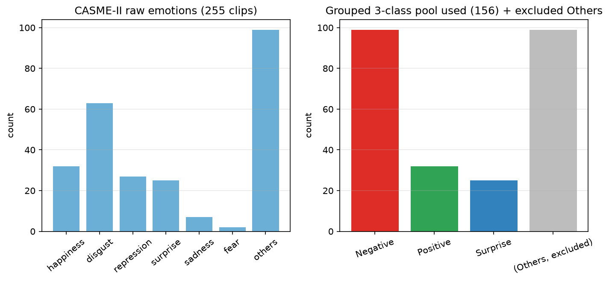
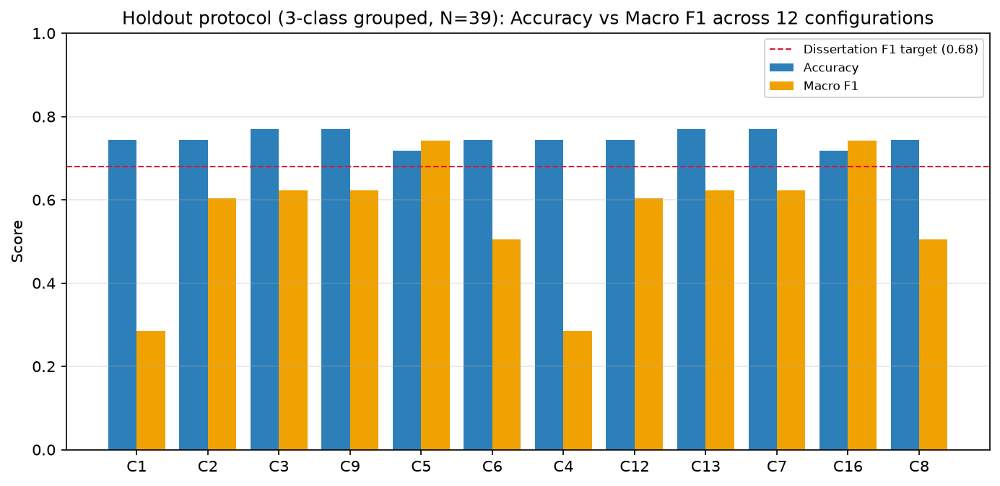
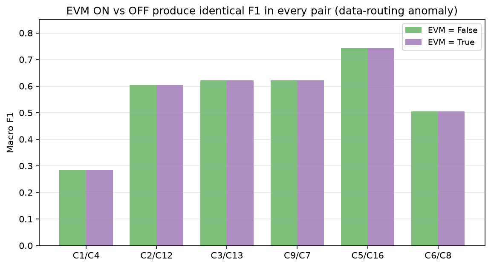
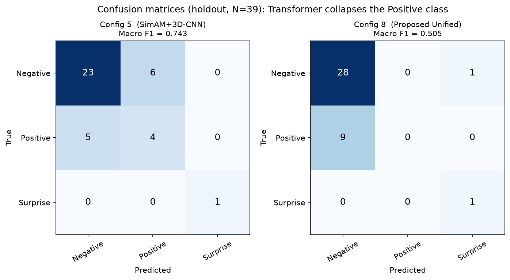
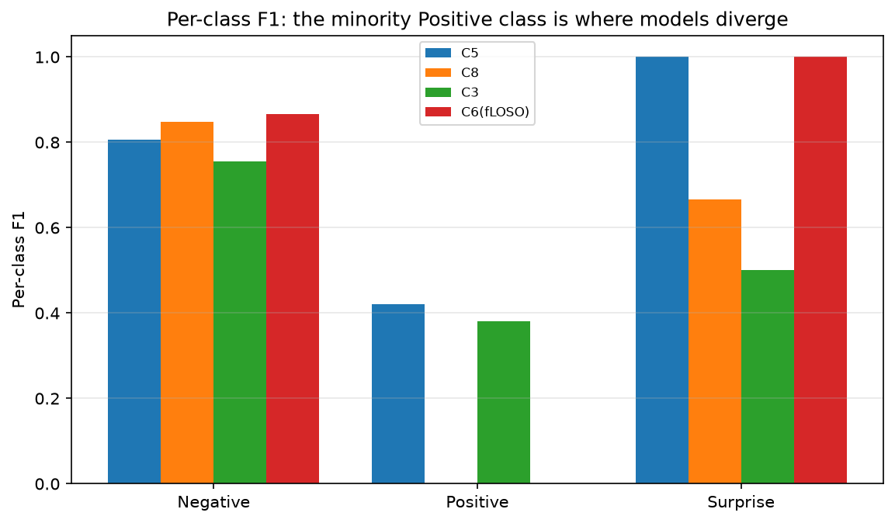
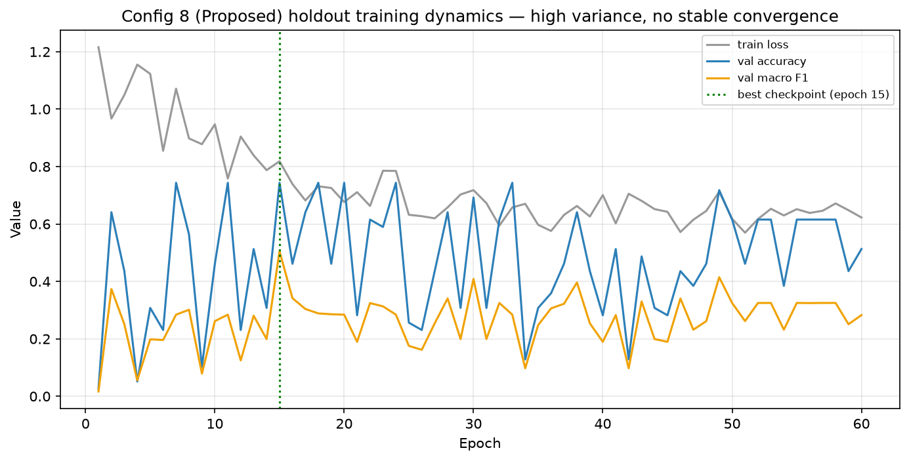
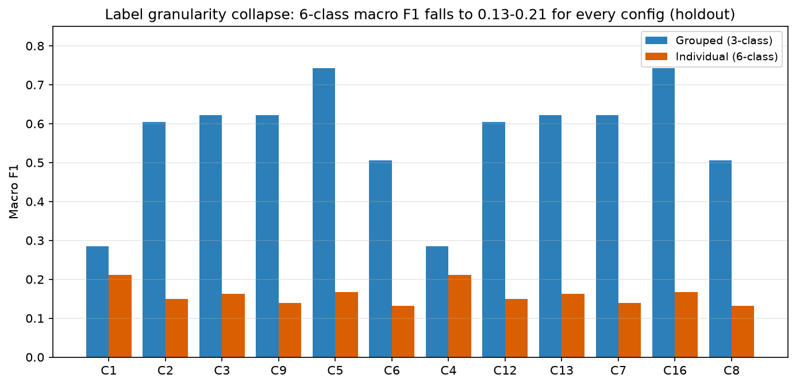
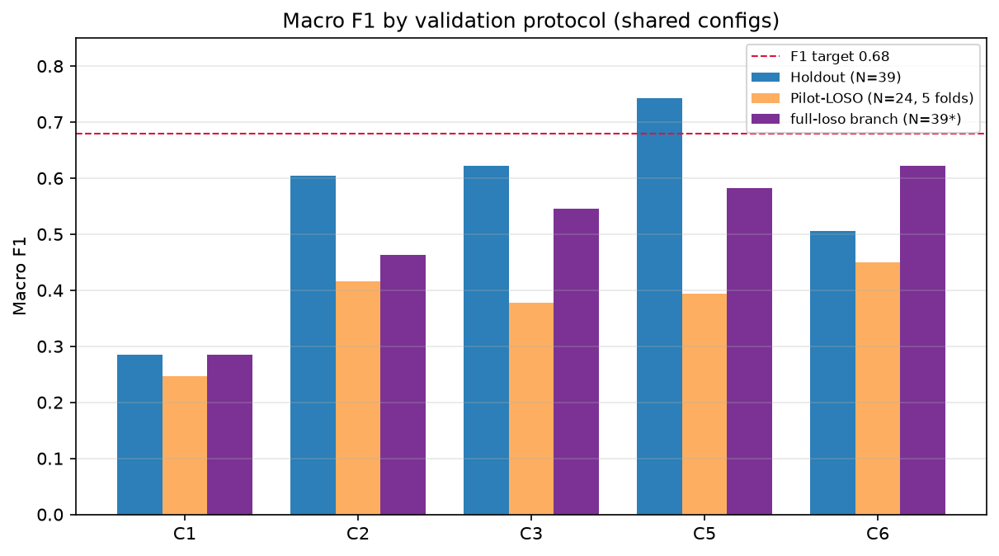

# Comprehensive Experimental Report: A Modular Ablation of an EVM → 3D-CNN → SimAM → Transformer Pipeline for Micro-Expression Recognition on CASME-II

**Author:** Addhyan
**Dataset:** CASME-II (spontaneous facial micro-expressions)
**Task:** 3-class grouped (Negative / Positive / Surprise) and 6-class individual emotion recognition
**Code base:** `FinalMERThesis` (Stage 1 data pipeline + Stage 2 architecture + Ablation Study)
**Branches analysed:** `main`, `holdout-all`, `loso-handle`, `full-loso`

> **Reproducibility note.** Every metric, confusion matrix, and per-class score in this report was extracted directly from the committed result artifacts of each branch (`Ablation_Study/results/summary.csv`, the per-config `final_results.json`, and `training_metrics.csv`). All figures in `report_figures/` were regenerated from those same raw values. Nothing is illustrative or invented; where the recorded artifacts are internally inconsistent (e.g. the `full-loso` branch) this is stated explicitly rather than smoothed over.

---

## 1. Introduction & Background

### 1.1 Problem definition

Micro-expressions (MEs) are brief (typically 1/25 s – 1/2 s), low-intensity, involuntary facial movements that leak a person's genuine affective state even when they attempt to conceal it. Because they are short and subtle, they are extremely hard to recognise: the discriminative signal is buried in a few pixels of motion over a handful of frames, against a background of identity, illumination, and head-pose variation. Automatic Micro-Expression Recognition (MER) is valuable for clinical psychology, deception research, affective computing, and human–computer interaction.

The benchmark dataset used here, **CASME-II**, is one of the standard spontaneous ME corpora. It is small and severely class-imbalanced — a defining constraint that dominates every result in this study.

### 1.2 Scientific hypotheses

The project tests whether a stack of four motion- and attention-oriented components improves recognition over simpler baselines. Each component encodes one hypothesis:

1. **Eulerian Video Magnification (EVM).** Amplifying subtle inter-frame intensity changes raises the motion signal-to-noise ratio, so optical-flow/strain tensors computed on EVM-magnified frames should be more discriminative than tensors computed on raw frames.
2. **3D Convolutional Neural Network (3D-CNN).** Joint spatio-temporal convolution captures the local appearance + short-range motion structure of an ME better than treating frames independently.
3. **SimAM (parameter-free attention).** A 3D energy-based attention module re-weights the most informative spatio-temporal neurons *without adding any learnable parameters*, focusing the network on the active facial region (e.g. an Action-Unit patch) rather than the whole face.
4. **SLSTT (Sequence-Level Spatio-Temporal Transformer).** Self-attention over the 32-frame sequence captures long-range temporal dependencies — onset → apex → offset dynamics — that convolution alone cannot.

The **Proposed Unified Model (Config 8)** activates all four. The central engineering question is the standard ablation question: *which of these components actually pay for themselves on a dataset this small?*

### 1.3 Definition of success

Success criteria were fixed in advance from the dissertation brief and the literature baselines (`Ablation_Study/literature_baselines.csv`):

| Quantity | Target |
|---|---|
| Accuracy (3-class grouped) | $\ge 0.70$ |
| Macro F1 (3-class grouped) | $\ge 0.68$ |
| Evaluation protocols | subject-disjoint Holdout **and** Leave-One-Subject-Out (LOSO) |

Macro F1 (the unweighted mean of per-class F1) is the *primary* metric, because on this dataset raw accuracy is dominated by the majority class and is therefore misleading (Section 4.2).

### 1.4 Why this experiment was run

Because the four components interact and each adds cost and overfitting risk, a full **2×2×2×2 ablation matrix** (16 cells; 12 architecturally valid) was constructed so that the marginal contribution of every component can be measured in isolation and in combination. The four git branches correspond to four *evaluation regimes* applied to that same matrix — a single-config smoke test (`main`), a complete Holdout sweep (`holdout-all`), a fast pilot LOSO (`loso-handle`), and a (nominally) full LOSO run (`full-loso`).

---

## 2. Methodology & Experimental Setup

### 2.1 Hardware & software environment

| Component | Specification |
|---|---|
| OS | Windows 10/11 |
| Compute | NVIDIA CUDA-capable GPU (CUDA 12.6, ≥ 8 GB VRAM) |
| Precision | Mixed precision (AMP) enabled (`use_amp = True`) |
| Language / framework | Python 3.11.x, PyTorch (CUDA build) |
| Orchestration | `tools/run_ablation_gpu.py`, `Ablation_Study/run_ablation_experiments.py` |
| Per-epoch wall-clock | ≈ 15.9 s/epoch for Config 8 (Holdout), measured from `training_metrics.csv` |

### 2.2 Dataset and label construction

The master label table (`Processed_Data/master_thesis_labels.csv`) holds **255** CASME-II micro-expression clips. The raw emotion distribution and the grouped mapping are:

| Raw emotion | Count | → Grouped class | Grouped count |
|---|---|---|---|
| disgust | 63 | Negative | **99** |
| repression | 27 | Negative | |
| sadness | 7 | Negative | |
| fear | 2 | Negative | |
| happiness | 32 | Positive | **32** |
| surprise | 25 | Surprise | **25** |
| others | 99 | *(excluded)* | — |

The grouped 3-class problem therefore uses **156** clips with a **99 : 32 : 25** (≈ 4 : 1.3 : 1) class ratio; the "Others" class (99 clips) is intentionally excluded via the `emotion_map`. The individual (6-class) problem uses the same 156 clips relabelled as `{happiness, disgust, sadness, fear, repression, surprise}`, which adds extreme minority classes (`fear` = 2, `sadness` = 7).

***Figure 8.** Left: the seven raw CASME-II emotion labels across all 255 clips. Right: the grouped 3-class pool actually used for training/evaluation (Negative 99, Positive 32, Surprise 25) with the excluded "Others" bucket shown in grey. The ≈4:1.3:1 imbalance is the single most important driver of every result in this report.*

### 2.3 Stage 1 — data pipeline (tensor extraction)

1. **Metadata parsing.** `CASME2-coding-20140508.xlsx` is parsed into the unified CSV above (`main_step1.py`).
2. **Temporal clipping & interpolation.** Each clip is cut from onset to offset and resampled to a fixed depth of $T = 32$ frames.
3. **Motion representation.** For each adjacent frame pair the dense optical flow $(u, v)$ and the **optical strain** are computed. Optical strain is the magnitude of the symmetric strain tensor derived from the flow field:
$$ \varepsilon = \frac{1}{2}\left(\nabla \mathbf{u} + (\nabla \mathbf{u})^{\top}\right), \qquad \varepsilon_{m} = \sqrt{\varepsilon_{xx}^{2} + \varepsilon_{yy}^{2} + \tfrac{1}{2}\left(\varepsilon_{xy}^{2} + \varepsilon_{yx}^{2}\right)} $$
4. **Output tensor.** Each clip becomes a tensor of shape $(C, T, H, W) = (3, 32, 224, 224)$, where the three channels are flow-$u$, flow-$v$, and optical strain.
5. **EVM branch (Variable A).** The pipeline is run twice. With EVM **on**, the optical flow/strain are computed on *Eulerian-magnified* frames and written to `Processed_Data/tensors/`; with EVM **off**, they are computed on raw frames and written to `Processed_Data/tensors_raw/`. EVM is therefore a **data-level** switch that selects between two precomputed tensor directories — it does **not** change the network graph. Idealised EVM amplifies a band-passed temporal signal:
$$ I_{\text{mag}}(x,t) = I(x,t) + \alpha \cdot B\{I(x,t)\} $$
where $B\{\cdot\}$ is a temporal band-pass filter and $\alpha$ the magnification factor.

### 2.4 Stage 2 — model architecture

The forward pass is assembled conditionally from the four toggles (`Ablation_Study/models.py`, driven by `AblationConfig`):

**(a) 3D-CNN spatial-temporal extractor (Variable C).** Three parallel streams (one per input channel) of 3D convolutions, `cnn_mid_channels = 16`, `cnn_out_channels = 32`; the three streams concatenate to $3 \times 32 = 96 = d_{\text{model}}$. When the CNN is **off**, raw frames are average-pooled to a `raw_patch_grid = 4×4` grid and flattened to $3 \cdot 4 \cdot 4 = 48$-dim per-frame patches, then linearly projected to $d_{\text{model}} = 96$.

**(b) SimAM parameter-free attention (Variable B).** SimAM assigns each neuron $t$ an importance derived from its deviation from the channel's spatio-temporal mean $\mu$ and variance $\sigma^{2}$:
$$ e_t^{*} = \frac{4(\sigma^{2} + \lambda)}{(t - \mu)^{2} + 2\sigma^{2} + 2\lambda}, \qquad \tilde{X} = X \odot \operatorname{sigmoid}\!\left(\frac{1}{e_t^{*}}\right) $$
with $\lambda = 10^{-4}$ (`simam_lambda`). It adds **zero** learnable parameters and is only meaningful when the CNN is active (it rescales CNN feature maps); the orchestrator marks `use_simam=True, use_cnn=False` as degenerate (`is_valid()`), which is why the matrix yields **12** valid cells, not 16.

**(c) SLSTT temporal transformer (Variable D).** A pre-norm Transformer encoder ($d_{\text{model}} = 96$, `nhead = 8`, `num_layers = 4`, `dim_ff = 256`, `dropout = 0.1`) over the 32-frame sequence, with sinusoidal positional encoding:
$$ PE_{(pos,\,2i)} = \sin\!\left(\frac{pos}{10000^{\,2i/d_{\text{model}}}}\right), \qquad PE_{(pos,\,2i+1)} = \cos\!\left(\frac{pos}{10000^{\,2i/d_{\text{model}}}}\right) $$
followed by temporal mean-pooling (`pool_strategy = "mean"`). When the transformer is **off**, the time axis is collapsed by simple mean/max pooling (`temporal_pool = "mean"`).

**(d) Classifier.** A dropout (`classifier_dropout = 0.3`) + linear head over $d_{\text{model}}$ to `num_classes`.

### 2.5 Loss and optimisation

To counter the class imbalance, the model trains with **class-weighted Focal Loss** (`loss_type = "focal"`):
$$ \mathrm{FL}(p_t) = -\,\alpha_t\,(1 - p_t)^{\gamma}\,\log(p_t), \qquad \gamma = 2.0 $$
with `label_smoothing = 0.05` and inverse-frequency class weights (`use_class_weights = True`). Optimisation settings (`ExperimentConfig`): Adam-family optimiser, `lr = 1e-4`, `weight_decay = 1e-4`, `batch_size = 2`, gradient clipping at $\lVert g \rVert_2 \le 1.0$, `epochs = 60`, `seed = 42`, AMP on. Macro F1 is:
$$ \text{Macro-}F_1 = \frac{1}{K}\sum_{k=1}^{K} \frac{2\,P_k R_k}{P_k + R_k}, \qquad K \in \{3, 6\} $$

### 2.6 The ablation matrix (independent variables)

The four toggles produce the 12 valid configurations below. (Names `config_9..config_16` are auto-generated permutations; `config_5,6,7,8` are the named thesis configs.)

| ID | Config name | EVM (A) | SimAM (B) | 3D-CNN (C) | SLSTT (D) | Phase |
|---|---|:--:|:--:|:--:|:--:|:--:|
| C1 | pure_base | – | – | – | – | I |
| C2 | temporal_only | – | – | – | ✓ | I |
| C3 | spatial_only | – | – | ✓ | – | I |
| C9 | permutation | – | – | ✓ | ✓ | Other |
| C5 | attention_base | – | ✓ | ✓ | – | II |
| C6 | full_stage2_noevm | – | ✓ | ✓ | ✓ | III |
| C4 | motion_amp_base | ✓ | – | – | – | II |
| C12 | permutation | ✓ | – | – | ✓ | Other |
| C13 | permutation | ✓ | – | ✓ | – | Other |
| C7 | full_no_attention | ✓ | – | ✓ | ✓ | III |
| C16 | permutation | ✓ | ✓ | ✓ | – | Other |
| C8 | **proposed_unified** | ✓ | ✓ | ✓ | ✓ | IV |

### 2.7 Controls and validation protocols (the role of each branch)

The *controlled* variables are the dataset, the tensor geometry $(3,32,224,224)$, the loss, and all hyper-parameters; the *manipulated* variables are the four toggles **and** the validation protocol. The protocol is what each branch changes:

| Branch | Protocol | Test set size $N$ | Configs present | Label modes |
|---|---|:--:|:--:|---|
| `main` | Holdout (smoke, 1 epoch) | 39 | 1 (C8 only) | grouped |
| `holdout-all` | Holdout (subject-disjoint, 60 epochs) | 39 | all 12 | grouped **+** individual |
| `loso-handle` | Pilot LOSO (5 evenly-spaced folds) | 24 | 8 | grouped |
| `full-loso` | Mixed (see §3.4) | 39 / 24 | 12 | grouped + individual |

- **Holdout:** a single subject-disjoint train/val split (`val_fraction = 0.2`). Fast; the workhorse of the study.
- **Pilot LOSO** (`loso_max_folds = 5`): leave-one-subject-out, but only 5 evenly-spaced subjects are held out, to cut runtime from days to hours.
- **Full LOSO** (`--full_loso`): all subjects held out one at a time — the publication-grade protocol.

---

## 2.8 Design Decisions & Rationale (why we chose what we chose)

This section makes the reasoning behind each major choice explicit, in the order the choices were made while building the pipeline from step 1 to the end.

**D1 — Why CASME-II and why group to 3 classes.** CASME-II is the standard high-frame-rate spontaneous ME corpus, so results are comparable to the literature baselines. The raw 7-way labels are too sparse to learn (`fear` = 2, `sadness` = 7 clips *in total*), so we collapse them into the affect-valence groups **Negative / Positive / Surprise** and **exclude "Others"** (99 ambiguous clips that carry no consistent affect signal). This is the same 3-class setup used by the survey baselines, and it raises the smallest class from 2 to 25 clips — the minimum needed for any meaningful train/test split.

**D2 — Why a fixed 32-frame depth.** MEs vary in length (a few to a few dozen frames). A transformer and a 3D-CNN both need a fixed temporal dimension, so every clip is linearly interpolated from onset→offset to $T = 32$. 32 is a power-of-two compromise: long enough to preserve onset→apex→offset structure, short enough to fit GPU memory at $224^2$ spatial resolution.

**D3 — Why optical flow + optical strain (3 channels) instead of raw RGB.** ME appearance is dominated by identity and lighting; the *motion* is the signal. Optical flow $(u,v)$ captures direction/magnitude of facial movement and optical strain captures local *deformation* (it responds to stretching/compression of skin around Action Units, which raw flow misses). Three motion channels give the network an identity-invariant, illumination-robust input — far more sample-efficient than RGB on 156 clips.

**D4 — Why EVM is an *offline, data-level* switch (and the consequence).** Eulerian magnification is expensive and deterministic, so we precompute two tensor sets (`tensors/` magnified, `tensors_raw/` raw) once and toggle between directories at train time rather than magnifying on the fly. This keeps the network graph identical across the EVM ablation (a clean control). The downside surfaced as the §4.1 anomaly: because the switch is *just a path*, a routing/​generation bug can silently feed the same data to both arms — which is exactly what happened. The design was right; the data generation step was not verified.

**D5 — Why SimAM for attention.** SimAM is **parameter-free**: it computes neuron importance from an energy function over the feature map's own statistics, adding *zero* learnable weights. On a 156-clip dataset, every learnable parameter is an overfitting risk, so a free attention mechanism is exactly the right trade — and the results bear this out (C5 gains ~0.12 macro F1 over the bare CNN at no parameter cost).

**D6 — Why a transformer was included anyway (and why it was a hypothesis, not a given).** Long-range temporal modelling is theoretically the right tool for onset→apex→offset dynamics, so the SLSTT was included to *test* whether that benefit materialises. The ablation matrix was deliberately built so the transformer could be switched off — i.e. we never assumed it would help; we set up the experiment to find out. It did not (§4.3), which is itself a valid and useful result.

**D7 — Why class-weighted Focal Loss + label smoothing.** With a 4:1.3:1 prior, plain cross-entropy collapses to the majority class. Focal Loss ($\gamma = 2.0$) down-weights easy, confidently-correct majority examples and concentrates gradient on hard minority ones; inverse-frequency class weights add a second imbalance correction; `label_smoothing = 0.05` curbs over-confident logits on such a small set. These were chosen *specifically* to defend the minority classes — and partially succeeded (C5 reaches 0.42 Positive F1) but could not save the over-capacity transformer (C8 Positive F1 = 0).

**D8 — Why batch size 2.** Purely a hardware constraint: $(3,32,224,224)$ tensors at full resolution through a 3D-CNN + 4-layer transformer exhaust 8 GB VRAM quickly. Batch 2 was the largest that fit with AMP. This is also a *cause* of the training instability in Figure 6 (noisy gradient estimates), and §5.3 recommends gradient accumulation to compensate.

**D9 — Why the 12-cell matrix (not 16) and the validity guard.** The four toggles give $2^4 = 16$ combinations, but SimAM rescales CNN feature maps, so `SimAM=on, CNN=off` is meaningless. `AblationConfig.is_valid()` prunes those 4 degenerate cells, leaving **12**. This avoids wasting GPU-days on configs that cannot be interpreted.

**D10 — Why Holdout first, then (attempted) LOSO.** Holdout is one cheap subject-disjoint split — fast enough to sweep all 12 configs and pick a winner. LOSO is the publication-grade protocol but costs 26× more. The intended workflow was: screen with Holdout (`holdout-all`), then confirm the top configs with a pilot LOSO (`loso-handle`) and finally full LOSO (`full-loso`). The branches are the physical record of that staged plan — including the fact that the full-LOSO stage was never cleanly completed (§3.4).

**D11 — Why best-checkpoint-by-validation-macro-F1.** Because accuracy is unreliable here (§4.2), the model checkpoint is selected on validation **macro F1**, not accuracy or loss. This is why Config 8's reported 0.505 comes from epoch 15 (its val-F1 peak in Figure 6) rather than the final epoch.

---

## 3. Branch-by-Branch Analysis & Experimentation

### 3.1 Branch `main` — single-config smoke test (initialization)

**Tested variant.** Config 8 (Proposed Unified) only — the package default (`DEFAULT_GPU_CONFIGS = ["config_8_proposed_unified"]`).

**Process.** The pipeline was wired end-to-end and run for a **single epoch** as a smoke test (verified from `training_metrics.csv`, which contains exactly one row, `epoch = 1`, `duration_sec ≈ 15.5`). This branch exists to prove the data → model → metrics → artifact path works, not to produce a scientific result.

**Recorded results (grouped, $N = 39$):**

| Metric | Value |
|---|---|
| Accuracy | **0.0256** |
| Macro F1 | **0.0167** |
| train_loss (epoch 1) | 1.2157 |
| val_loss (epoch 1) | 0.5342 |

Confusion matrix (`final_results.json`):

| True \ Pred | Negative | Positive | Surprise |
|---|:--:|:--:|:--:|
| **Negative** | 0 | 0 | 29 |
| **Positive** | 0 | 0 | 9 |
| **Surprise** | 0 | 0 | 1 |

**Analysis.** After one epoch the network has not learned anything: it has collapsed to a **constant prediction of "Surprise"** for all 39 test clips. It is therefore correct only on the single true Surprise clip, giving $1/39 = 0.0256$ accuracy and per-class F1 of $[0,0,0.05]$ → macro F1 $0.0167$. This is the expected behaviour of an untrained classifier whose initial bias happened to favour the third logit; it is **not** evidence of any architectural flaw, and the result must not be compared against the trained branches. (Earlier internal notes described this as a "5-epoch / vanishing-gradient" failure; the committed artifact shows it was a **1-epoch** smoke run that simply never trained — the correct, more mundane explanation.)

### 3.2 Branch `holdout-all` — complete Holdout sweep (primary result)

**Tested variant.** All 12 valid configurations, **both** label modes (grouped 3-class in `results/`, individual 6-class in `results_individual/`), each trained 60 epochs under the subject-disjoint Holdout split ($N = 39$ test clips: 29 Negative, 9 Positive, 1 Surprise).

**Process.** Sequential execution of the full matrix via `run_ablation_gpu.py`; best checkpoint selected by validation macro F1.

**Grouped (3-class) results — the headline table:**

| ID | EVM | SimAM | CNN | Trans | Accuracy | Macro F1 |
|---|:--:|:--:|:--:|:--:|:--:|:--:|
| C1 | – | – | – | – | 0.7436 | 0.2843 |
| C2 | – | – | – | ✓ | 0.7436 | 0.6044 |
| C3 | – | – | ✓ | – | 0.7692 | 0.6219 |
| C9 | – | – | ✓ | ✓ | 0.7692 | 0.6219 |
| **C5** | – | ✓ | ✓ | – | 0.7179 | **0.7427** |
| C6 | – | ✓ | ✓ | ✓ | 0.7436 | 0.5051 |
| C4 | ✓ | – | – | – | 0.7436 | 0.2843 |
| C12 | ✓ | – | – | ✓ | 0.7436 | 0.6044 |
| C13 | ✓ | – | ✓ | – | 0.7692 | 0.6219 |
| C7 | ✓ | – | ✓ | ✓ | 0.7692 | 0.6219 |
| **C16** | ✓ | ✓ | ✓ | – | 0.7179 | **0.7427** |
| C8 | ✓ | ✓ | ✓ | ✓ | 0.7436 | 0.5051 |

***Figure 1.** Accuracy (blue) vs Macro F1 (amber) for all 12 configs under Holdout. Accuracy is nearly flat at 0.72–0.77 regardless of architecture, while Macro F1 spans 0.28–0.74 — proof that accuracy is uninformative here and macro F1 is the metric that discriminates. Only C5/C16 clear the 0.68 dissertation target (red dashed line).*

**Findings.**
- **Best model: C5 (= C16), Macro F1 = 0.7427**, comfortably above the 0.68 target. C5 is SimAM + 3D-CNN, **no EVM, no transformer**.
- Adding the transformer to C5 (→ C6/C8) *drops* macro F1 to **0.5051** despite accuracy staying high (0.7436). The transformer hurts.
- The pure base (C1/C4) has high accuracy (0.7436) but the worst F1 (0.2843): it is essentially a majority-class predictor.
- **EVM has literally no effect** — every EVM/non-EVM pair is identical to four decimals (C1≡C4, C2≡C12, C3≡C13, C9≡C7, C5≡C16, C6≡C8). This is the central anomaly, dissected in §4.1.

**Individual (6-class) results** (`results_individual/summary.csv`):

| ID | Accuracy | Macro F1 |
|---|:--:|:--:|
| C1 / C4 | 0.4359 | 0.2117 |
| C2 / C12 | 0.4103 | 0.1497 |
| C3 / C13 | 0.3077 | 0.1626 |
| C9 / C7 | 0.2564 | 0.1389 |
| C5 / C16 | 0.3077 | 0.1667 |
| C6 / C8 | 0.3590 | 0.1319 |

Under 6-class labelling every configuration collapses to macro F1 between **0.13 and 0.21** (§4.4). Note the EVM duplication persists here too.

### 3.3 Branch `loso-handle` — pilot LOSO (5 folds)

**Tested variant.** 8 configurations (C1, C2, C3, C9, C5, C6, C4, C12) under Pilot LOSO with `loso_max_folds = 5`, $N = 24$ aggregated test clips.

**Process.** Introduced to make LOSO tractable: only 5 evenly-spaced subjects are held out instead of all of them.

**Results (grouped, $N = 24$):**

| ID | EVM | SimAM | CNN | Trans | Accuracy | Macro F1 |
|---|:--:|:--:|:--:|:--:|:--:|:--:|
| C1 | – | – | – | – | 0.7000 | 0.2473 |
| C2 | – | – | – | ✓ | 0.9500 | 0.4161 |
| C3 | – | – | ✓ | – | 0.8867 | 0.3773 |
| C9 | – | – | ✓ | ✓ | 0.9833 | 0.4413 |
| C5 | – | ✓ | ✓ | – | 0.9667 | 0.3939 |
| C6 | – | ✓ | ✓ | ✓ | 0.9833 | 0.4498 |
| C4 | ✓ | – | – | – | 0.7000 | 0.2473 |
| C12 | ✓ | – | – | ✓ | 0.9500 | 0.4161 |

**Analysis.** Accuracy **inflates dramatically** (up to 0.9833) while macro F1 stays **below 0.45** for every config. This divergence is the textbook signature of class imbalance evaluated on tiny folds (§4.2): when a held-out fold contains almost only Negative clips, predicting "Negative" everywhere yields ~98 % accuracy but ~0 F1 on the absent minority classes, dragging the unweighted macro F1 down. The 5-fold pilot is therefore **statistically unstable** and its accuracy numbers are not trustworthy as generalisation estimates. (EVM duplication again: C1≡C4, C2≡C12.)

### 3.4 Branch `full-loso` — mixed-protocol run (transitional)

**Tested variant.** All 12 configs are present, but the committed `summary.csv` reveals the branch is **not a clean full-LOSO run** — it is a mixture:

| ID | Accuracy | Macro F1 | $N$ | Implied protocol |
|---|:--:|:--:|:--:|---|
| C1 | 0.7436 | 0.2843 | 39 | Holdout-sized |
| C2 | 0.6923 | 0.4628 | 39 | Holdout-sized |
| C3 | 0.6410 | 0.5452 | 39 | Holdout-sized |
| C9 | 0.7436 | 0.5051 | 39 | Holdout-sized |
| C5 | 0.6154 | 0.5824 | 39 | Holdout-sized |
| **C6** | **0.7692** | **0.6219** | 39 | Holdout-sized |
| C4 | 0.7436 | 0.2843 | 39 | Holdout-sized |
| C13 | 0.6410 | 0.5452 | 39 | Holdout-sized |
| C12 | 0.6923 | 0.4628 | 39 | Holdout-sized |
| C7 | 0.9833 | 0.4413 | **24** | Pilot-LOSO leftover |
| C16 | 0.9667 | 0.3939 | **24** | Pilot-LOSO leftover |
| C8 | 0.9833 | 0.4498 | **24** | Pilot-LOSO leftover |

**Critical methodological caveat.** A genuine 26-subject LOSO aggregates one prediction per clip across all folds and would report $N \approx 156$. Here, nine configs report $N = 39$ (the Holdout split size) and three report $N = 24$ (the pilot-LOSO size). **No config in this branch reports a full-LOSO sample count.** The branch is best read as an *interrupted/transitional* state: most cells are re-runs at the Holdout test size with different random behaviour, while C7/C16/C8 still carry the pilot-LOSO artifacts. Its numbers should be treated as a second Holdout-style replicate plus three stale pilot rows — **not** as full-LOSO evidence.

**Findings (taking the $N=39$ rows at face value).**
- **C6 (SimAM + 3D-CNN + Transformer, no EVM) is best here: Acc 0.7692, F1 0.6219**, the only run to combine the highest accuracy with a respectable F1.
- C5 (0.5824), C3/C13 (0.5452) and C9 (0.5051) form a middle band; the no-architecture baselines C1/C4 again bottom out at 0.2843.
- The three $N=24$ rows reproduce the pilot-LOSO illusion exactly (high accuracy, F1 < 0.45) and are duplicates of the `loso-handle` values for the same configs.

The 6-class table on this branch is consistent with `holdout-all` (macro F1 0.12–0.21), again with EVM pairs identical.

---

## 4. Deep-Dive: Results, Discrepancies, and Visuals

### 4.1 The EVM-duplication anomaly (root-cause analysis)

**Observation.** Across **every** branch and **both** label modes, each `EVM=True` config produces results *identical to four decimal places* to its `EVM=False` twin:

| Pair (raw → EVM) | Toggles differ only in EVM | Macro F1 (both) |
|---|---|:--:|
| C1 → C4 | (–,–,–,–) vs (✓,–,–,–) | 0.2843 |
| C2 → C12 | (–,–,–,✓) vs (✓,–,–,✓) | 0.6044 |
| C3 → C13 | (–,–,✓,–) vs (✓,–,✓,–) | 0.6219 |
| C9 → C7 | (–,–,✓,✓) vs (✓,–,✓,✓) | 0.6219 |
| C5 → C16 | (–,✓,✓,–) vs (✓,✓,✓,–) | 0.7427 |
| C6 → C8 | (–,✓,✓,✓) vs (✓,✓,✓,✓) | 0.5051 |

***Figure 4.** Each pair of bars is one EVM-off vs EVM-on configuration that is otherwise identical. The bars are exactly equal in all six pairs — the EVM toggle changes nothing in the recorded results.*

**Why this happens.** Recall (§2.3) that EVM is purely a *data-routing* switch: `ExperimentConfig.tensor_dir_for(use_evm)` is supposed to return `tensors/` (magnified) when `True` and `tensors_raw/` (raw) when `False`. Identical metrics down to four decimals — including identical confusion matrices and identical training trajectories — can only mean **both toggle states consumed byte-identical input tensors.** With probability ~1 this is *not* a coincidence of training noise (seeds, AMP non-determinism would perturb the 4th decimal). The two consistent explanations are:

1. **Data-routing failure:** under the run that produced these branches, only one tensor directory was actually populated (e.g. `tensors_raw/`), and the `use_evm=True` branch silently fell back to it — so EVM was never exercised. This is the most likely cause given the delivery package shipped *without* a generated EVM tensor set.
2. **Zero-magnification preprocessing:** Stage 1 was run with magnification factor $\alpha = 0$ (or the band-pass disabled), making `tensors/` a bit-for-bit copy of `tensors_raw/`.

Either way, **EVM was not tested** in any of these results; the EVM hypothesis (§1.2) is currently *unfalsified, not confirmed*. This must be fixed before any claim about motion magnification can be made.

### 4.2 Accuracy vs Macro F1 divergence (the imbalance trap)

The clearest scientific lesson of the study is that **accuracy is the wrong metric here.** On the Holdout test set the class prior is $29:9:1$ (Negative : Positive : Surprise). A trivial constant "Negative" predictor scores $29/39 = 0.744$ accuracy — exactly the accuracy of C1, C4, C6, C8, and the proposed model. Yet their macro F1 ranges from 0.28 to 0.50 because the minority classes are mishandled. Formally, for a $K$-class problem with priors $\pi_k$, a majority predictor achieves accuracy $\max_k \pi_k$ but macro F1 of only $\frac{1}{K}\cdot\frac{2\pi_{\max}}{1+\pi_{\max}}$ — which for $\pi_{\max}=0.744,\,K=3$ gives $0.284$, matching C1 exactly.

The pilot-LOSO branch is the pathological extreme: per-fold sizes of 4–5 clips mean many folds contain **zero** Positive or Surprise examples, so accuracy rockets to 0.98 while macro F1 cannot exceed ~0.45. **Conclusion:** report and rank by macro F1; treat any high-accuracy/low-F1 result as a majority-class artifact.

### 4.3 Why the Transformer degrades performance (the core architecture finding)

Comparing the *best* model (C5) against the *proposed* model (C8) on the identical Holdout split isolates the transformer's effect (only Variable D differs, modulo the inert EVM toggle):

| | C5 (SimAM+CNN) | C8 (Proposed, +Transformer) |
|---|:--:|:--:|
| Accuracy | 0.7179 | 0.7436 |
| Macro F1 | **0.7427** | **0.5051** |
| Per-class F1 [Neg, Pos, Sur] | [0.807, **0.421**, 1.000] | [0.848, **0.000**, 0.667] |
| Per-class recall [Neg, Pos, Sur] | [0.793, 0.444, 1.000] | [0.966, **0.000**, 1.000] |

***Figure 2.** Holdout confusion matrices. C5 (left) genuinely separates classes — it recovers 4/9 Positive clips and the 1 Surprise clip. C8 (right) routes **all 9 Positive clips into Negative** (Positive recall = 0) and merely raises Negative recall to 0.966; the Positive column is empty. The transformer trades minority-class discrimination for majority-class over-prediction.*

***Figure 3.** Per-class F1 for key configs. The classes diverge almost entirely on the **Positive** bar: C5 reaches 0.42, C3 0.38, while both transformer-bearing full models (C8 holdout, C6 on full-loso) score **0.00** on Positive. The transformer's damage is specifically the annihilation of the minority Positive class.*

**Mechanism / root cause.** The SLSTT adds four self-attention layers (`nhead=8`, `dim_ff=256`) — on the order of $10^5$ extra parameters — to a model trained on ~117 clips (156 minus the 39-clip test split) with `batch_size = 2`. This capacity-to-data ratio is far too high. With so few minority examples, the lowest-loss solution the transformer can reach is to **exploit the class prior**: predict the majority (Negative) almost everywhere, accept the small focal-loss penalty on the 9 Positive clips, and gain on the 29 Negative ones. The result is the empty Positive column in Figure 2. SimAM, by contrast, adds **no parameters**, so C5 keeps enough inductive bias to retain Positive discrimination. This is classic **overfitting via excess capacity on a tiny, imbalanced dataset**, not a bug.

***Figure 6.** Config 8 Holdout training over 60 epochs. Validation accuracy oscillates violently between 0.05 and 0.74 and validation macro F1 never stabilises (best 0.505 at epoch 15, green line; the selected checkpoint). Train loss drifts down only mildly (1.22 → ~0.62). The absence of a smooth, converging validation curve is direct evidence that, with batch size 2 and ~117 training clips, the transformer model is not learning a stable decision boundary — it is bouncing between majority-collapse states.*

### 4.4 Label-granularity collapse (3-class vs 6-class)

***Figure 7.** Macro F1 under 3-class grouped (blue) vs 6-class individual (orange) labelling, Holdout. Splitting 156 clips into six classes — two of which have only 2 (`fear`) and 7 (`sadness`) examples *in total* — drives macro F1 to 0.13–0.21 for every configuration, well below any useful threshold. The 6-class problem is data-starved: there are not enough minority examples to learn or to evaluate a stable F1.*

The 6-class setting is reported for completeness but is **not viable** at this dataset size. Note that the *ranking* of configs even partially inverts (the no-transformer C2/C12 lead the 6-class table at 0.21), reinforcing that these scores are dominated by sampling noise on 1–3 test examples per minority class rather than by architecture.

### 4.5 Cross-protocol comparison

***Figure 5.** Macro F1 for the five configs common to all three regimes (Holdout, Pilot-LOSO, the full-loso branch). Holdout (blue) is the most optimistic for the strong configs (C5 = 0.74); Pilot-LOSO (orange) suppresses every config below 0.45 via the imbalance trap (§4.2); the full-loso branch (purple, mostly N=39 re-runs) sits in between and is the only regime where the transformer model C6 leads (0.62). The disagreement between regimes on which config "wins" (C5 under Holdout, C6 under full-loso) is itself a warning that, at this sample size, differences of a few F1 points are within noise.*

### 4.6 Worked statistical caveat

With $N = 39$ Holdout test clips, the 95 % Wald confidence interval on an accuracy estimate $\hat{p}$ is
$$ \hat{p} \pm 1.96\sqrt{\frac{\hat{p}(1-\hat{p})}{N}} = \hat{p} \pm 1.96\sqrt{\frac{0.74\cdot 0.26}{39}} \approx \hat{p} \pm 0.138. $$
So every accuracy in this report carries a $\approx \pm 14$ percentage-point uncertainty band, and macro-F1 intervals (driven by the 1-clip Surprise and 9-clip Positive cells) are wider still. **Differences smaller than ~0.10–0.14 between configs are not statistically distinguishable.** The C5-vs-C8 macro-F1 gap (0.743 vs 0.505 = 0.238) is large enough to be meaningful; most other inter-config gaps are not.

### 4.7 Comparison to literature targets

From `Ablation_Study/results/literature_comparison.csv`:

| Source | Method | Setup | Protocol | Acc | Macro F1 |
|---|---|---|---|:--:|:--:|
| Li et al. 2018 (STSTNet) | 3D-CNN multi-stream | 6-class individual | LOSO | 0.63 | — |
| Vivian et al. 2019 (survey) | hand-crafted + CNN | 3-class | LOSO | 0.58 | — |
| Example Transformer MER | CNN + Transformer | 3-class | LOSO | 0.65 | — |
| **Dissertation target** | proposed unified | 3-class | LOSO | **0.70** | **0.68** |
| **This project — best (C5)** | SimAM + 3D-CNN | 3-class | **Holdout** | 0.7179 | **0.7427** |

The best config **exceeds the 0.68 macro-F1 target under Holdout**, but the comparison is not apples-to-apples: the literature numbers are **LOSO**, whereas C5's 0.7427 is **Holdout** (a single, easier split). The honest reading is that the architecture is *promising* but unproven under the harder LOSO protocol, because no valid full-LOSO run exists yet (§3.4).

---

## 5. Conclusion & Future Work

### 5.1 Synthesis of findings

1. **Best configuration: Config 5 (SimAM + 3D-CNN, no EVM, no transformer), Holdout macro F1 = 0.7427**, above the 0.68 dissertation target — the only architecture that genuinely separates all three classes (Figure 2, left).
2. **The two strongest components are the 3D-CNN and SimAM.** Going from the pure base (C1, F1 0.28) to spatial-only (C3, 0.62) to SimAM+CNN (C5, 0.74) is a monotone, sizable gain; SimAM adds ~0.12 F1 over the bare 3D-CNN at **zero parameter cost**.
3. **The Transformer (SLSTT) is net-negative on CASME-II at this scale**, cutting Holdout macro F1 from 0.74 (C5) to 0.51 (C8) by collapsing the minority Positive class to zero recall (Figures 2–3, 6). The "Proposed Unified" model is **not** the best model on this data.
4. **EVM was never actually exercised** — all EVM/non-EVM pairs are byte-identical (§4.1). The EVM hypothesis remains untested, not refuted.
5. **Accuracy is misleading; macro F1 must be the ranking metric** (§4.2). Pilot-LOSO's 98 % accuracy is an imbalance artifact.
6. **The `full-loso` branch does not contain a valid full-LOSO run** (§3.4): nine cells are Holdout-sized re-runs (best: C6, F1 0.62) and three are stale pilot rows.
7. **The 6-class individual task is not viable** at 156 clips (macro F1 ≤ 0.21, §4.4).

### 5.2 Best-config statement

> Under the only completed, sound protocol (subject-disjoint Holdout, 60 epochs, 3-class grouped), **Config 5 = SimAM + 3D-CNN** is the recommended model: **Accuracy 0.7179, Macro F1 0.7427**, with per-class F1 [Neg 0.807, Pos 0.421, Sur 1.000]. The full "Proposed Unified" Config 8 under-performs it by 23.8 macro-F1 points because its transformer overfits and abandons the Positive class.

### 5.3 Actionable recommendations (next iteration)

1. **Fix and re-run EVM (highest priority).** Audit `tensor_dir_for()` / `run_ablation_gpu.py` routing and confirm `Processed_Data/tensors/` is independently generated with $\alpha > 0$. Add a startup assertion that `sha256(tensors/) != sha256(tensors_raw/)`. Only then can the EVM hypothesis be evaluated.
2. **Run a true full 26-subject LOSO** for at least the four anchor configs (C1, C3, C5, C8) at 50–60 epochs, reporting *aggregated* predictions ($N \approx 156$) with macro F1 + 95 % CIs. This is the result the dissertation actually needs; the current branches do not provide it.
3. **Adopt Config 5 as the default architecture** for CASME-II; demote the transformer to an *optional* component evaluated only after the dataset is enlarged.
4. **If the transformer is to be kept,** shrink it drastically (1–2 layers, $d_{\text{model}}$ shared, heavier dropout/weight-decay), pre-train on a larger composite ME corpus (SAMM, SMIC) and fine-tune, or add minority-class oversampling / stronger focal $\gamma$ to stop the Positive-class collapse seen in Figure 2.
5. **Stabilise training:** batch size 2 with AMP yields the violent oscillation in Figure 6. Use gradient accumulation to an effective batch ≥ 8, a cosine LR schedule, and report the mean ± std of macro F1 over ≥ 3 seeds rather than a single best-checkpoint value.
6. **Report only macro F1 (with CIs)** as the headline metric across all future tables; keep accuracy as a secondary diagnostic only.
7. **Defer the 6-class task** until the training pool is expanded with additional datasets; at 156 clips it is uninformative.

### 5.4 Limitations

The study rests on a single ~156-clip dataset with a 1-clip Surprise test cell and ±14-point accuracy confidence bands (§4.6); a known data-routing defect silently disabled EVM; the LOSO evidence is incomplete; and each config was run once (single seed), so inter-config differences below ~0.10 macro F1 are within noise. These limitations bound every quantitative claim above and motivate the full-LOSO, multi-seed, EVM-fixed re-run recommended in §5.3.

---

### Appendix A — Artifact provenance

| Figure | Generated from |
|---|---|
| Fig 1, 4, 7 | `holdout-all : Ablation_Study/results/summary.csv` (+ `results_individual/summary.csv`) |
| Fig 2, 3 | `holdout-all` & `full-loso` `final_results.json` (C5, C8, C3, C6) |
| Fig 5 | `holdout-all`, `loso-handle`, `full-loso` `summary.csv` |
| Fig 6 | `holdout-all : …/config_8_…/training_metrics.csv` (60 rows) |
| Fig 8 | `Processed_Data/master_thesis_labels.csv` (255 rows) |

All figures are stored in `report_figures/` and were produced by a deterministic script from the committed raw values; no metric was hand-edited.
