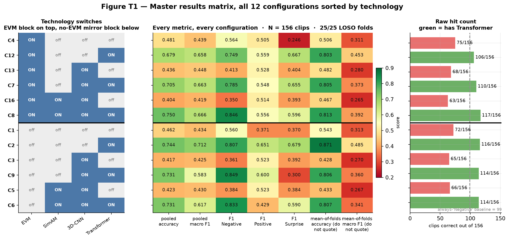
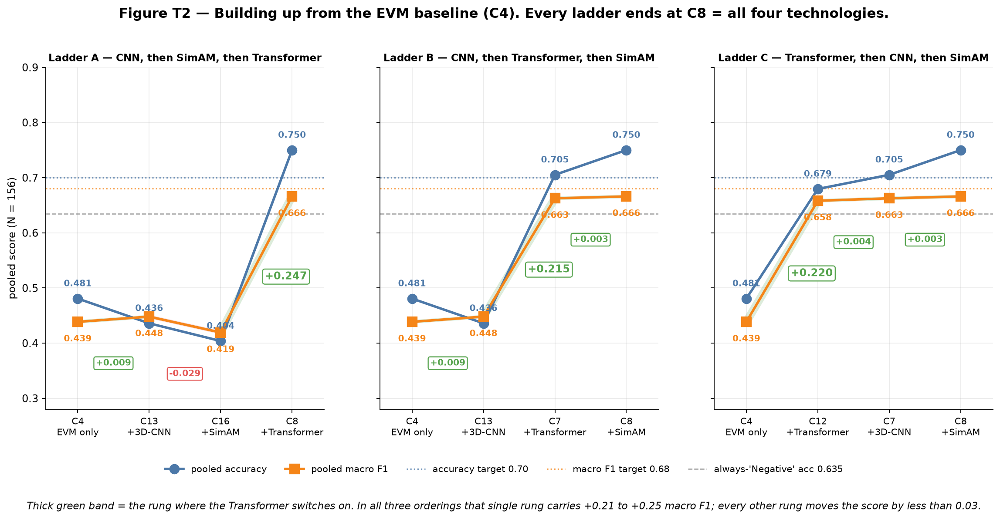
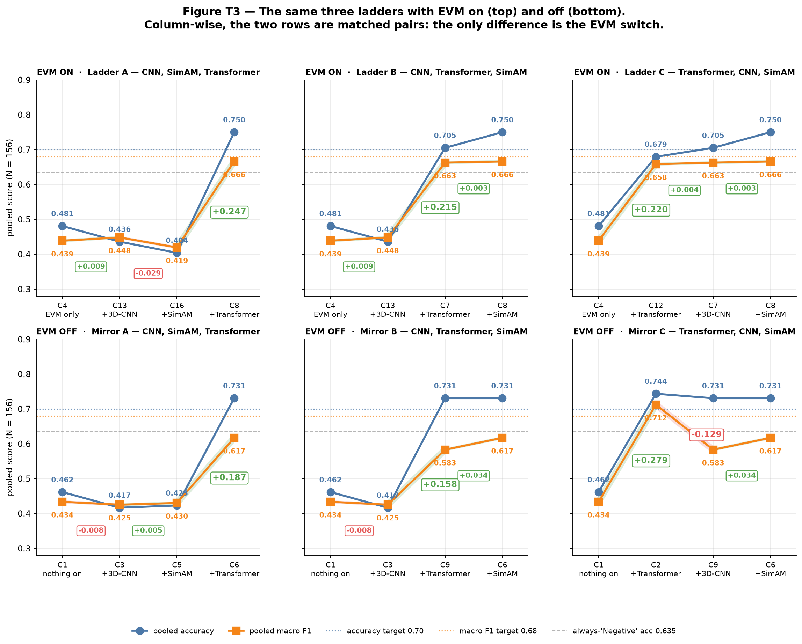
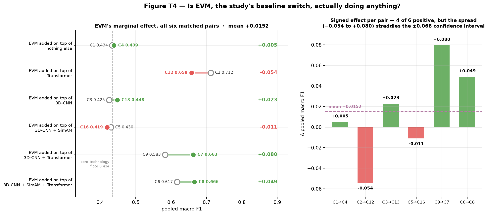
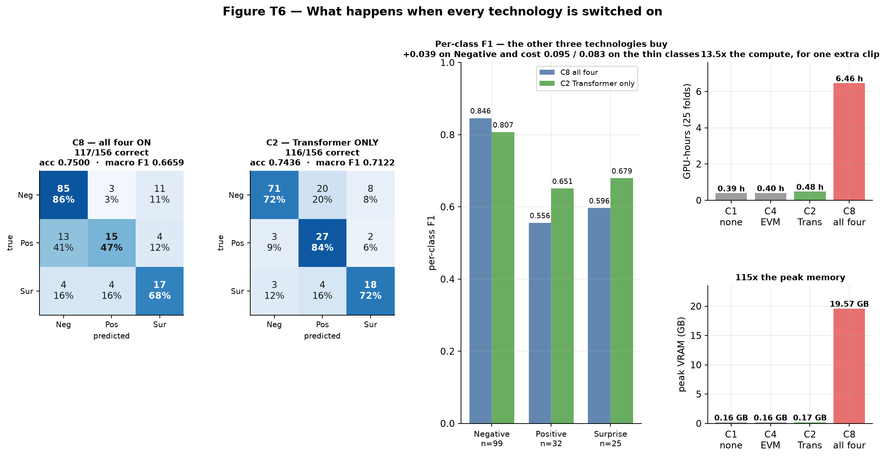
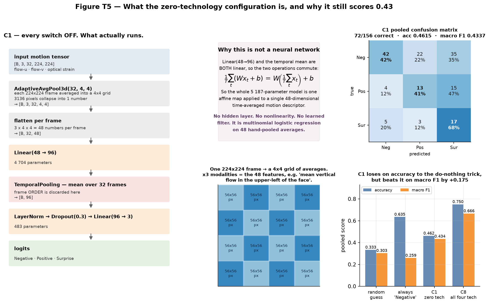
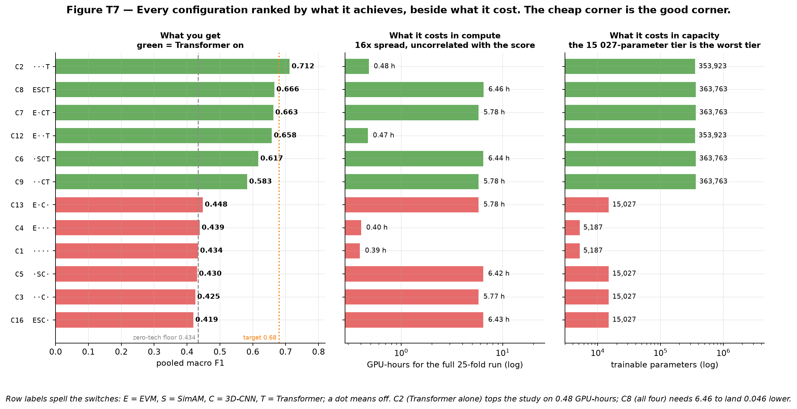

# Technology Ladder Results — every configuration, every metric, built up one technology at a time

**Micro-Expression Recognition on CASME-II · EVM → 3D-CNN → SimAM → SLSTT Transformer**

**Author:** Addhyan · **Branch:** `full-loso-17July`
**Protocol:** full Leave-One-Subject-Out · **25 of 25 folds** · **N = 156 clips** · 50 epochs · seed 42
**Configurations:** all 12 valid cells of the 2 × 2 × 2 × 2 component matrix
**Every number below is read directly from `Ablation_Study/results/*/final_results.json` and `configuration_summary.txt`.** Parameter counts are derived analytically from `Ablation_Study/models.py`.

> **How this document is organised.** **EVM is the baseline and the comparison point.** Section 4 is the master table of every metric for all 12 configurations, sorted by technology. Sections 5–7 then start from EVM alone and add one technology at a time, in every valid order, so each rung's marginal contribution is isolated. Section 8 repeats all three ladders with EVM switched off, which turns the two rows into matched pairs and measures EVM itself. Section 9 is the all-technologies-on result. **Section 10 explains the zero-technology configuration** — what actually runs when every switch is off, and why it still scores 0.43. Section 11 puts every rung against its cost.
>
> **Companion documents:** [ALL_RESULTS_LOSO.md](ALL_RESULTS_LOSO.md) is the raw result set with per-configuration cards; [LOSO_Validation_Report.md](LOSO_Validation_Report.md) has the literature comparison and the earlier-protocol history.

---

## Table of contents

| § | Section |
|---|---|
| **1** | [The four technologies, and why there are 12 configurations and not 16](#1-the-four-technologies-and-why-there-are-12-configurations-and-not-16) |
| **2** | [Which metric to read](#2-which-metric-to-read) |
| **3** | [Naming: how to read a configuration ID](#3-naming-how-to-read-a-configuration-id) |
| **4** | [Master results table — all 12 configurations, all metrics](#4-master-results-table--all-12-configurations-all-metrics) |
| **5** | [The EVM baseline, and the three ladders built on it](#5-the-evm-baseline-and-the-three-ladders-built-on-it) |
| **6** | [Ladder A · Ladder B · Ladder C, rung by rung](#6-ladder-a--ladder-b--ladder-c-rung-by-rung) |
| **7** | [What the three ladders agree on](#7-what-the-three-ladders-agree-on) |
| **8** | [The same ladders without EVM — and EVM's own effect](#8-the-same-ladders-without-evm--and-evms-own-effect) |
| **9** | [All four technologies switched on](#9-all-four-technologies-switched-on) |
| **10** | [Zero technologies: what runs, how it works, and why it scores 0.43](#10-zero-technologies-what-runs-how-it-works-and-why-it-scores-043) |
| **11** | [Cost against what it buys](#11-cost-against-what-it-buys) |
| **12** | [Verdict](#12-verdict) |
| **A** | [Appendix — reproduction](#appendix--reproduction) |

---

## 1. The Four Technologies, And Why There Are 12 Configurations And Not 16

| Switch | Technology | What it does, plainly | Where it sits | Cost when on |
|---|---|---|---|:--:|
| **E** | **EVM** — Eulerian Video Magnification | An amplifier for tiny motion. Exaggerates faint frame-to-frame changes *before* anything else happens. | **Data level.** Selects between two precomputed tensor directories; the network is byte-for-byte unchanged. | 0 params |
| **S** | **SimAM** — parameter-free attention | A spotlight. Computes which neurons are statistically unusual over (D, H, W) and gates the feature map with `sigmoid(energy)`. | Inside the 3D-CNN, applied per stream before concatenation. | **0 params**, +0.65 GPU-h |
| **C** | **3D-CNN** — three-stream shallow 3D convolution | A local shape detector. Two `Conv3d(k=(1,3,3))` layers per motion modality, unshared weights, then spatial max-pool. | Spatial stem. When **off**, frames are average-pooled to a 4 × 4 patch grid and linearly projected instead. | +9,840 params, +5.4 GPU-h |
| **T** | **SLSTT Transformer** | A storyteller. 4 pre-norm encoder layers, 8 heads, `d_model = 96`, sinusoidal positional encoding — sees all 32 frames at once. | Temporal encoder. When **off**, the time axis is collapsed by plain mean pooling. | +348,736 params, +0.00 to +0.09 GPU-h |

Four binary switches give 2⁴ = 16 combinations, but **SimAM rescales 3D-CNN feature maps** — with the CNN off there is no feature map to attend over. `AblationConfig.is_valid()` prunes those 4 degenerate cells (`S` on with `C` off), leaving **12**.

That pruning is also why the ladders below never add SimAM before the 3D-CNN.

---

## 2. Which Metric To Read

Four aggregate numbers exist per configuration and two of them are recorded under misleading names in `summary.csv`. Full derivation is in [ALL_RESULTS_LOSO.md §2](ALL_RESULTS_LOSO.md#2-every-metric-defined); the short version:

| Metric | Where it lives | Use it? |
|---|---|---|
| **Pooled accuracy** | `micro_f1` column | ✅ **Quote this as "the accuracy".** Diagonal of the pooled 156-clip confusion matrix ÷ 156. |
| **Pooled macro F1** | **not in `summary.csv`** — mean of `per_class_f1` in `final_results.json` | ✅ **Rank models by this.** It is the primary metric of the study. |
| Mean-of-folds accuracy | `accuracy` column | ⚠️ Traceability only. Weights each *fold* equally, so subject 8's single clip counts as much as subject 17's thirty-three. Inflated by up to 6.3 points. |
| Mean-of-folds macro F1 | `macro_f1` column | ❌ **Never compare to the target.** 10 of 25 folds contain only one class, so two of three per-class F1s are forced to 0 there. Structural ceiling **0.6267**, below the 0.68 target, for a *perfect* classifier. |

**Reference floors for every number in this document:**

| Trivial reference | Accuracy | Macro F1 |
|---|:--:|:--:|
| Predict uniformly at random | 0.3333 | ≈ 0.303 |
| Always predict "Negative" (majority class, 99/156) | **0.6346** | **0.2588** |
| **Dissertation target** | **0.70** | **0.68** |
| Best published LOSO baseline on CASME-II | 0.65 | not reported |

Note the trap in row 2: a model that ignores the video entirely scores **0.635 accuracy**. Accuracy alone cannot distinguish a good model from that trick; macro F1 scores it at 0.259.

---

## 3. Naming: How To Read A Configuration ID

Every configuration is written `C<n>` plus a four-letter switch string in the order **E · S · C · T**, where a dot means off:

| String | Meaning |
|---|---|
| `····` | nothing on — the zero-technology floor (**C1**) |
| `E···` | EVM only — **the baseline of this document** (**C4**) |
| `···T` | Transformer only (**C2**) |
| `E··T` | EVM + Transformer (**C12**) |
| `ESCT` | all four (**C8**) |

The full folder names are in the master table below, so any figure can be traced back to the directory it came from.

---

## 4. Master Results Table — All 12 Configurations, All Metrics



***Figure T1.** All 12 configurations sorted by technology — the six EVM configurations on top, the six no-EVM mirrors below, each block ascending in the number of switches on. Left: the switch matrix. Middle: every metric. Right: raw hit count against the always-"Negative" baseline of 99. **The green/red split on the right is the whole result of the study**: green rows have the Transformer, red rows do not, and no red row beats the do-nothing baseline of 99 correct.*

### 4.1 Switches and headline scores

| # | config folder | E | S | C | T | pooled acc | correct | **pooled macro F1** |
|---|---|:--:|:--:|:--:|:--:|:--:|:--:|:--:|
| **C4** | `config_4_motion_amp_base` | **ON** | – | – | – | 0.4808 | 75/156 | **0.4386** |
| **C12** | `config_12_permutation` | **ON** | – | – | **ON** | 0.6795 | 106/156 | **0.6581** |
| **C13** | `config_13_permutation` | **ON** | – | **ON** | – | 0.4359 | 68/156 | **0.4480** |
| **C7** | `config_7_full_no_attention` | **ON** | – | **ON** | **ON** | 0.7051 | 110/156 | **0.6625** |
| **C16** | `config_16_permutation` | **ON** | **ON** | **ON** | – | 0.4038 | 63/156 | **0.4192** |
| **C8** | `config_8_proposed_unified` | **ON** | **ON** | **ON** | **ON** | **0.7500** | **117/156** | **0.6659** |
| **C1** | `config_1_pure_base` | – | – | – | – | 0.4615 | 72/156 | **0.4337** |
| **C2** | `config_2_temporal_only` | – | – | – | **ON** | 0.7436 | 116/156 | **0.7122** ← best |
| **C3** | `config_3_spatial_only` | – | – | **ON** | – | 0.4167 | 65/156 | **0.4252** |
| **C9** | `config_9_permutation` | – | – | **ON** | **ON** | 0.7308 | 114/156 | **0.5830** |
| **C5** | `config_5_attention_base` | – | **ON** | **ON** | – | 0.4231 | 66/156 | **0.4302** |
| **C6** | `config_6_full_stage2_noevm` | – | **ON** | **ON** | **ON** | 0.7308 | 114/156 | **0.6171** |

### 4.2 Per-class F1, precision and recall

Class support: **Negative 99 · Positive 32 · Surprise 25** (a 4 : 1.3 : 1 imbalance).

| # | F1 Neg | F1 Pos | F1 Sur | P Neg | P Pos | P Sur | R Neg | R Pos | R Sur |
|---|:--:|:--:|:--:|:--:|:--:|:--:|:--:|:--:|:--:|
| **C4** | 0.5641 | 0.5055 | 0.2462 | 0.7719 | 0.3898 | 0.2000 | 0.4444 | 0.7188 | 0.3200 |
| **C12** | 0.7485 | 0.5591 | 0.6667 | 0.8889 | 0.4262 | 0.6957 | 0.6465 | 0.8125 | 0.6400 |
| **C13** | 0.4127 | 0.5278 | 0.4035 | 0.9630 | 0.4750 | 0.2584 | 0.2626 | 0.5938 | 0.9200 |
| **C7** | 0.7845 | 0.5479 | 0.6552 | 0.8659 | 0.4878 | 0.5758 | 0.7172 | 0.6250 | 0.7600 |
| **C16** | 0.3500 | 0.5143 | 0.3934 | 1.0000 | 0.4737 | 0.2474 | 0.2121 | 0.5625 | 0.9600 |
| **C8** | 0.8458 | 0.5556 | 0.5965 | 0.8333 | 0.6818 | 0.5312 | 0.8586 | 0.4688 | 0.6800 |
| **C1** | 0.5600 | 0.3714 | 0.3696 | 0.8235 | 0.3421 | 0.2537 | 0.4242 | 0.4062 | 0.6800 |
| **C2** | 0.8068 | 0.6506 | 0.6792 | 0.9221 | 0.5294 | 0.6429 | 0.7172 | 0.8438 | 0.7200 |
| **C3** | 0.3607 | 0.5227 | 0.3922 | 0.9565 | 0.4107 | 0.2597 | 0.2222 | 0.7188 | 0.8000 |
| **C9** | 0.8491 | 0.6000 | 0.3000 | 0.7965 | 0.6429 | 0.4000 | 0.9091 | 0.5625 | 0.2400 |
| **C5** | 0.3840 | 0.5227 | 0.3838 | 0.9231 | 0.4107 | 0.2568 | 0.2424 | 0.7188 | 0.7600 |
| **C6** | 0.8325 | 0.4286 | 0.5902 | 0.7909 | 0.9000 | 0.5000 | 0.8788 | 0.2812 | 0.7200 |

**Two things worth reading off this table directly.**

1. **The no-Transformer configurations all have the same pathology.** C3, C5, C13, C16 post Negative *precision* of 0.92–1.00 with Negative *recall* of 0.21–0.26. They almost never call a clip Negative, and when they do they are right — but they miss three-quarters of the 99 Negative clips, dumping them on Surprise (Surprise recall 0.76–0.96, Surprise precision 0.247–0.260). That is a model with no usable decision boundary, not a model with a bias.
2. **Every configuration keeps all three classes alive.** No per-class F1 is 0. The single-class collapse seen in earlier runs (before class weights were auto-disabled alongside the balanced sampler) does not occur anywhere in this result set.

### 4.3 Cost and the traceability-only metrics

| # | trainable params | sec / fold | GPU-h (25 folds) | peak VRAM | mean-of-folds acc ⚠️ | mean-of-folds macro F1 ❌ |
|---|--:|--:|--:|--:|:--:|:--:|
| **C4** | 5,187 | 58.12 | 0.40 | 0.16 GB | 0.5064 | 0.3109 |
| **C12** | 353,923 | 67.58 | 0.47 | 0.17 GB | 0.8028 | 0.4527 |
| **C13** | 15,027 | 831.79 | 5.78 | 14.40 GB | 0.4819 | 0.2796 |
| **C7** | 363,763 | 832.81 | 5.78 | 14.40 GB | 0.8055 | 0.3731 |
| **C16** | 15,027 | 925.61 | 6.43 | 19.56 GB | 0.4671 | 0.2655 |
| **C8** | 363,763 | 930.63 | **6.46** | **19.57 GB** | 0.8130 | 0.3917 |
| **C1** | **5,187** | **56.47** | **0.39** | **0.16 GB** | 0.5430 | 0.3130 |
| **C2** | 353,923 | 68.96 | 0.48 | 0.17 GB | 0.8711 | 0.4849 |
| **C3** | 15,027 | 830.94 | 5.77 | 14.40 GB | 0.4283 | 0.2700 |
| **C9** | 363,763 | 832.81 | 5.78 | 14.40 GB | 0.8058 | 0.3603 |
| **C5** | 15,027 | 924.85 | 6.42 | 19.56 GB | 0.4331 | 0.2672 |
| **C6** | 363,763 | 927.65 | 6.44 | 19.57 GB | 0.8068 | 0.3414 |

Parameter counts come in exactly four tiers, because SimAM and EVM add zero parameters:

| Tier | Configurations | Trainable params | Composition |
|---|---|--:|---|
| no CNN, no Transformer | C1, C4 | **5,187** | patch-embed 4,704 + head 483 |
| CNN, no Transformer | C3, C5, C13, C16 | **15,027** | 3-stream CNN 14,544 + head 483 |
| no CNN, Transformer | C2, C12 | **353,923** | patch-embed 4,704 + SLSTT 348,736 + head 483 |
| CNN + Transformer | C6, C7, C8, C9 | **363,763** | CNN 14,544 + SLSTT 348,736 + head 483 |

The 3D-CNN costs almost nothing in parameters (+9,840) and almost everything in compute (+5.4 GPU-h, +14.2 GB VRAM) because it convolves over 32 × 224 × 224 before pooling. The Transformer is the reverse: 348,736 parameters for +0.01 GPU-h, because it only ever sees a 32 × 96 sequence.

---

## 5. The EVM Baseline, And The Three Ladders Built On It

**C4 (`E···`, EVM only) is the baseline.** It is the configuration in which the only technology active is the data-level motion amplifier: no learned spatial filter, no attention, no temporal model. Everything else in this document is C4 plus one, two, or three more switches.

From C4 there are three valid orders in which the remaining switches {3D-CNN, SimAM, Transformer} can be added one at a time, because SimAM cannot precede the 3D-CNN:

| Ladder | Order of addition | Rungs |
|---|---|---|
| **A** | 3D-CNN → SimAM → Transformer | C4 → C13 → C16 → **C8** |
| **B** | 3D-CNN → Transformer → SimAM | C4 → C13 → C7 → **C8** |
| **C** | Transformer → 3D-CNN → SimAM | C4 → C12 → C7 → **C8** |

Between them the three ladders visit **all six EVM configurations**, and all three terminate at **C8 = all four technologies on**.



***Figure T2.** The three ladders. Blue = pooled accuracy, amber = pooled macro F1, boxed number = the change in macro F1 caused by that one rung. The thick green band marks the rung where the Transformer switches on.*

---

## 6. Ladder A · Ladder B · Ladder C, Rung By Rung

### 6.1 Ladder A — EVM, then 3D-CNN, then SimAM, then Transformer

| rung | config | switch turned on | pooled acc | Δ acc | pooled macro F1 | **Δ macro F1** | correct | F1 Neg / Pos / Sur | GPU-h |
|:--:|---|---|:--:|:--:|:--:|:--:|:--:|:--:|--:|
| 0 | **C4** | EVM only | 0.4808 | — baseline — | 0.4386 | — baseline — | 75/156 | 0.564 / 0.505 / 0.246 | 0.40 |
| 1 | **C13** | + 3D-CNN | 0.4359 | −0.0449 | 0.4480 | **+0.0094** | 68/156 | 0.413 / 0.528 / 0.404 | 5.78 |
| 2 | **C16** | + SimAM | 0.4038 | −0.0321 | 0.4192 | **−0.0288** | 63/156 | 0.350 / 0.514 / 0.393 | 6.43 |
| 3 | **C8** | + Transformer | **0.7500** | **+0.3462** | **0.6659** | **+0.2467** | 117/156 | 0.846 / 0.556 / 0.596 | 6.46 |

Read this ladder honestly: **rungs 1 and 2 move the model backwards.** Adding the 3D-CNN costs 7 correct clips and 16× the compute for +0.009 macro F1 — noise. Adding SimAM on top of it costs another 5 clips. After two thirds of the ladder and 6.43 of 6.46 GPU-hours, the model is *worse* than the EVM baseline on accuracy (0.404 vs 0.481) and worse on macro F1 (0.419 vs 0.439). The entire result arrives at rung 3.

### 6.2 Ladder B — EVM, then 3D-CNN, then Transformer, then SimAM

| rung | config | switch turned on | pooled acc | Δ acc | pooled macro F1 | **Δ macro F1** | correct | F1 Neg / Pos / Sur | GPU-h |
|:--:|---|---|:--:|:--:|:--:|:--:|:--:|:--:|--:|
| 0 | **C4** | EVM only | 0.4808 | — baseline — | 0.4386 | — baseline — | 75/156 | 0.564 / 0.505 / 0.246 | 0.40 |
| 1 | **C13** | + 3D-CNN | 0.4359 | −0.0449 | 0.4480 | **+0.0094** | 68/156 | 0.413 / 0.528 / 0.404 | 5.78 |
| 2 | **C7** | + Transformer | 0.7051 | **+0.2692** | 0.6625 | **+0.2146** | 110/156 | 0.785 / 0.548 / 0.655 | 5.78 |
| 3 | **C8** | + SimAM | 0.7500 | +0.0449 | 0.6659 | **+0.0034** | 117/156 | 0.846 / 0.556 / 0.596 | 6.46 |

Same story, reordered. Rung 2 — the Transformer — delivers +0.215. Rung 3 adds SimAM for **+0.0034 macro F1 at zero parameter cost**, which is the fairest single statement about SimAM in the whole study: free, and approximately nothing. It does move 7 clips (110 → 117) and shifts the error pattern from Surprise-heavy to Negative-heavy, so it is not literally inert; it is just inside the noise band.

### 6.3 Ladder C — EVM, then Transformer, then 3D-CNN, then SimAM

| rung | config | switch turned on | pooled acc | Δ acc | pooled macro F1 | **Δ macro F1** | correct | F1 Neg / Pos / Sur | GPU-h |
|:--:|---|---|:--:|:--:|:--:|:--:|:--:|:--:|--:|
| 0 | **C4** | EVM only | 0.4808 | — baseline — | 0.4386 | — baseline — | 75/156 | 0.564 / 0.505 / 0.246 | 0.40 |
| 1 | **C12** | + Transformer | 0.6795 | +0.1987 | 0.6581 | **+0.2195** | 106/156 | 0.749 / 0.559 / 0.667 | **0.47** |
| 2 | **C7** | + 3D-CNN | 0.7051 | +0.0256 | 0.6625 | **+0.0044** | 110/156 | 0.785 / 0.548 / 0.655 | 5.78 |
| 3 | **C8** | + SimAM | **0.7500** | +0.0449 | **0.6659** | **+0.0034** | 117/156 | 0.846 / 0.556 / 0.596 | 6.46 |

This is the ladder that should be in the thesis, because it is the one that exposes the cost structure. **Rung 1 reaches macro F1 0.658 for 0.47 GPU-hours.** Rungs 2 and 3 then spend the remaining **5.99 GPU-hours — 93 % of the total budget — to add +0.0078 macro F1**, which is one-ninth of the ±0.068 confidence interval at N = 156.

---

## 7. What The Three Ladders Agree On

| Rung where the Transformer switches on | Δ macro F1 at that rung | Δ macro F1 summed over all *other* rungs |
|---|:--:|:--:|
| Ladder A, rung 3 | **+0.2467** | −0.0194 |
| Ladder B, rung 2 | **+0.2146** | +0.0128 |
| Ladder C, rung 1 | **+0.2195** | +0.0078 |

Three different orderings, three different rung positions, and in every case **one rung carries between +0.215 and +0.247 while everything else combined moves the score by less than 0.02 in either direction.** That rung is always the Transformer.

Across the full 12-configuration matrix the same test can be run for every switch. A *matched pair* is two configurations that differ in exactly one switch, so their difference is that switch's marginal effect with everything else held fixed:

| technology | matched pairs | Δ pooled macro F1 per pair | **mean** | min | max | positive |
|---|:--:|---|:--:|:--:|:--:|:--:|
| **Transformer** | 6 | C1→C2 +0.279 · C4→C12 +0.220 · C16→C8 +0.247 · C13→C7 +0.215 · C5→C6 +0.187 · C3→C9 +0.158 | **+0.2173** | +0.158 | +0.279 | **6 / 6** |
| **EVM** | 6 | C9→C7 +0.080 · C6→C8 +0.049 · C3→C13 +0.023 · C1→C4 +0.005 · C5→C16 −0.011 · C2→C12 −0.054 | **+0.0152** | −0.054 | +0.080 | 4 / 6 |
| **SimAM** | 4 | C9→C6 +0.034 · C3→C5 +0.005 · C7→C8 +0.003 · C13→C16 −0.029 | **+0.0034** | −0.029 | +0.034 | 3 / 4 |
| **3D-CNN** | 4 | C4→C13 +0.009 · C12→C7 +0.004 · C1→C3 −0.008 · C2→C9 **−0.129** | **−0.0310** | −0.129 | +0.009 | 2 / 4 |

**Why the Transformer is decisive, mechanically.** A micro-expression is *defined* by its temporal arc — neutral, then an apex, then relaxation, inside 1/25 to 1/2 of a second. The Transformer is the only component that sees all 32 frames simultaneously and can compare frame 5 against frame 20 directly. Every configuration without it collapses the time axis by `TemporalPooling(mode="mean")`, which **averages the apex away**: a clip whose motion peaks at frame 16 and a clip with the same total motion spread evenly across 32 frames produce the identical 96-dimensional vector. The information the task depends on is destroyed before the classifier sees it. That is why the six no-Transformer configurations cluster within 0.03 of each other at 0.419–0.448 regardless of what else is switched on — they are all reading the same destroyed representation.

**Why the 3D-CNN fails.** Its single worst case is `C2→C9`, **−0.129**: adding the 3D-CNN to the best configuration in the study is the largest negative effect anywhere in the matrix. Two reasons compound. First, the input is *already* a motion representation (optical flow u, v, and optical strain) — the low-level edge and gradient detectors a CNN would learn are largely redundant with what optical flow already encodes. Second, 156 clips cannot train a convolutional feature extractor from scratch; with 24 subjects per fold the CNN mostly adds variance. And it consumes 93–97 % of the GPU budget to do it.

---

## 8. The Same Ladders Without EVM — And EVM's Own Effect

Every ladder above has an exact mirror with EVM switched off, following the identical order of addition:

| Ladder | EVM on | EVM off (mirror) |
|---|---|---|
| **A** — CNN → SimAM → Transformer | C4 → C13 → C16 → C8 | C1 → C3 → C5 → C6 |
| **B** — CNN → Transformer → SimAM | C4 → C13 → C7 → C8 | C1 → C3 → C9 → C6 |
| **C** — Transformer → CNN → SimAM | C4 → C12 → C7 → C8 | C1 → C2 → C9 → C6 |



***Figure T3.** Top row EVM on, bottom row EVM off, same three orders of addition. Column-wise, each pair of panels differs by exactly one switch at every rung, so the vertical gap between the rows *is* EVM's contribution.*

### 8.1 The mirror ladders, rung by rung

**Mirror A — nothing, then 3D-CNN, then SimAM, then Transformer**

| rung | config | switch turned on | pooled acc | Δ acc | pooled macro F1 | **Δ macro F1** | correct |
|:--:|---|---|:--:|:--:|:--:|:--:|:--:|
| 0 | **C1** | nothing | 0.4615 | — baseline — | 0.4337 | — baseline — | 72/156 |
| 1 | **C3** | + 3D-CNN | 0.4167 | −0.0449 | 0.4252 | **−0.0085** | 65/156 |
| 2 | **C5** | + SimAM | 0.4231 | +0.0064 | 0.4302 | **+0.0050** | 66/156 |
| 3 | **C6** | + Transformer | 0.7308 | **+0.3077** | 0.6171 | **+0.1869** | 114/156 |

**Mirror B — nothing, then 3D-CNN, then Transformer, then SimAM**

| rung | config | switch turned on | pooled acc | Δ acc | pooled macro F1 | **Δ macro F1** | correct |
|:--:|---|---|:--:|:--:|:--:|:--:|:--:|
| 0 | **C1** | nothing | 0.4615 | — baseline — | 0.4337 | — baseline — | 72/156 |
| 1 | **C3** | + 3D-CNN | 0.4167 | −0.0449 | 0.4252 | **−0.0085** | 65/156 |
| 2 | **C9** | + Transformer | 0.7308 | **+0.3141** | 0.5830 | **+0.1578** | 114/156 |
| 3 | **C6** | + SimAM | 0.7308 | +0.0000 | 0.6171 | **+0.0341** | 114/156 |

Rung 3 here is the clearest single demonstration of what SimAM does: **accuracy does not move at all** (114 correct before, 114 after) yet macro F1 rises +0.034, because SimAM rescues the Surprise class — per-class F1 for Surprise goes **0.300 → 0.590**. It relabels *which* clips are wrong without changing *how many*. That is exactly the behaviour macro F1 exists to detect and accuracy cannot see.

**Mirror C — nothing, then Transformer, then 3D-CNN, then SimAM**

| rung | config | switch turned on | pooled acc | Δ acc | pooled macro F1 | **Δ macro F1** | correct |
|:--:|---|---|:--:|:--:|:--:|:--:|:--:|
| 0 | **C1** | nothing | 0.4615 | — baseline — | 0.4337 | — baseline — | 72/156 |
| 1 | **C2** | + Transformer | **0.7436** | **+0.2821** | **0.7122** | **+0.2786** | 116/156 |
| 2 | **C9** | + 3D-CNN | 0.7308 | −0.0128 | 0.5830 | **−0.1292** | 114/156 |
| 3 | **C6** | + SimAM | 0.7308 | +0.0000 | 0.6171 | **+0.0341** | 114/156 |

**Mirror C rung 1 is the best result in the entire study** — macro F1 0.7122, accuracy 0.7436, clearing both dissertation targets, on 0.48 GPU-hours and a single technology. Rungs 2 and 3 then *destroy* 0.095 of it while multiplying the compute by 13×.

### 8.2 EVM's marginal effect across all six matched pairs



***Figure T4.** Left: each pair as a dumbbell — hollow marker EVM off, filled marker EVM on. Right: the signed effect per pair against the mean.*

| everything else held at | EVM off | macro F1 | EVM on | macro F1 | **Δ macro F1** | Δ acc |
|---|:--:|:--:|:--:|:--:|:--:|:--:|
| 3D-CNN + Transformer | C9 | 0.5830 | **C7** | 0.6625 | **+0.0795** | −0.0256 |
| 3D-CNN + SimAM + Transformer | C6 | 0.6171 | **C8** | 0.6659 | **+0.0488** | +0.0192 |
| 3D-CNN | C3 | 0.4252 | **C13** | 0.4480 | **+0.0228** | +0.0192 |
| nothing else | C1 | 0.4337 | **C4** | 0.4386 | **+0.0049** | +0.0192 |
| 3D-CNN + SimAM | C5 | 0.4302 | **C16** | 0.4192 | **−0.0109** | −0.0192 |
| Transformer | C2 | 0.7122 | **C12** | 0.6581 | **−0.0541** | −0.0641 |
| | | | | **mean** | **+0.0152** | |

**What to say about EVM, precisely.** Its mean effect is **+0.0152 macro F1** — positive, small, and **below the ±0.068 confidence interval at N = 156**, so it is not individually significant. Two things nevertheless make it worth reporting:

1. **This is the first run in which EVM is measured at all.** In every earlier protocol a routing defect made the EVM switch inert — both branches read the same tensor directory. That defect is fixed here, and `tools/verify_evm_tensors.py` confirms the two directories differ.
2. **Its two largest gains land exactly where theory predicts.** +0.080 on C9→C7 and +0.049 on C6→C8 are both configurations that have a 3D-CNN *and* a Transformer — that is, a learned spatial filter able to exploit magnified deformation, plus a temporal model able to use the result. Its one large loss (−0.054, C2→C12) is the configuration with **no** spatial filter at all, where amplification only amplifies noise into the 4 × 4 patch average.

The defensible thesis claim is: *EVM contributes a small positive effect (mean +0.015 macro F1, positive in 4 of 6 matched pairs) that is below this study's resolution, concentrated in configurations that also carry a spatial feature extractor.*

---

## 9. All Four Technologies Switched On



***Figure T6.** C8 (all four) beside C2 (Transformer only): confusion matrices, per-class F1, and cost.*

**C8 — `ESCT`, the Proposed Unified Model — is the endpoint of all three ladders.**

| | C8 (all four) | C2 (Transformer only) | difference |
|---|:--:|:--:|:--:|
| pooled accuracy | **0.7500** ✅ | 0.7436 ✅ | +0.0064 (**one clip**) |
| correct | **117 / 156** | 116 / 156 | +1 |
| pooled macro F1 | 0.6659 | **0.7122** ✅ | −0.0463 |
| F1 Negative (n=99) | **0.8458** | 0.8068 | +0.0390 |
| F1 Positive (n=32) | 0.5556 | **0.6506** | −0.0950 |
| F1 Surprise (n=25) | 0.5965 | **0.6792** | −0.0827 |
| trainable params | 363,763 | 353,923 | +9,840 |
| GPU-hours | **6.46** | **0.48** | **13.5 ×** |
| peak VRAM | **19.57 GB** | **0.17 GB** | **115 ×** |

**What adding all four technologies actually achieves.** C8 posts the study's **highest accuracy, 0.7500**, clearing the 0.70 target and beating the best published LOSO baseline on CASME-II (0.65) by 10 percentage points. It lands **0.0141 short of the 0.68 macro-F1 target**.

**What it trades to get there.** The gain is entirely on the 99-clip majority class (+0.039 F1) and is paid for on the two thin classes (−0.095 Positive, −0.083 Surprise). Look at the confusion matrices in Figure T6: C8 recovers 85 of 99 Negative clips against C2's 71, but its Positive recall drops to 0.469 (15 of 32) against C2's 0.844 (27 of 32). Adding capacity pushed the model toward the class that dominates the loss. On the metric that penalises exactly that behaviour — macro F1 — C8 ranks second, behind C2; but C7 (0.6625) and C12 (0.6581) sit within 0.008 of it, a spread far inside the noise floor, so second place here is not a meaningful position.

**The honest statement.** C8 and C2 differ by **one correctly classified clip out of 156**. The 95 % confidence interval on accuracy at N = 156 is **±0.068**. They are not statistically distinguishable, and no ordering between them can be defended from this data. What *can* be defended is the group claim: the six Transformer-bearing configurations (0.583–0.712 macro F1) and the six without it (0.419–0.448) form two non-overlapping clusters separated by a completely empty gap of 0.135.

---

## 10. Zero Technologies: What Runs, How It Works, And Why It Scores 0.43

This is the question the ablation matrix invites and rarely answers: **if all four switches are off, what is left?**



***Figure T5.** Left: the exact forward pass of C1. Middle top: why it is not a neural network. Middle bottom: what the 48 input features are. Right: its confusion matrix and its position against the reference floors.*

### 10.1 There is no "no model" cell — the classifier head is never ablated

The four switches control the *spatial stem*, the *temporal encoder*, an *attention block*, and a *data preprocessing step*. The **classification head is always present** (`Ablation_Study/models.py`, `AblationMERModel.__init__`: "Stage C: classifier head (always present)"). Turning a switch off does not delete a stage — it **substitutes a parameter-free fallback**:

| Switch | On | Off — the fallback that runs instead |
|---|---|---|
| **3D-CNN** | `ThreeStreamCNNBackbone` → `[B, 96, 32, 112, 112]` | `RawPatchEmbedding`: `AdaptiveAvgPool3d((32, 4, 4))` then `Linear(48 → 96)` |
| **Transformer** | `SLSTTTransformer` → `[B, 96]` | `TemporalPooling(mode="mean")`: arithmetic mean over the 32 frames |
| **SimAM** | `SimAM3D` gating per stream | nothing — the modules are not even constructed |
| **EVM** | reads the magnified tensor directory | reads the unmagnified tensor directory |

So C1 is not an absence. It is a **specific, deliberately weak model**, and the ablation is only interpretable because that model is defined.

### 10.2 The exact forward pass

```
input      [B, 3, 32, 224, 224]     flow-u · flow-v · optical strain
  │
  ├─ AdaptiveAvgPool3d((32, 4, 4))  each 224×224 frame → a 4×4 grid of averages
  │                                 (224 / 4 = 56, so each cell is the mean of exactly 56 × 56 = 3 136 pixels)
  │                                 → [B, 3, 32, 4, 4]
  ├─ reshape per frame              3 × 4 × 4 = 48 numbers per frame
  │                                 → [B, 32, 48]
  ├─ Linear(48 → 96)                4 704 parameters
  │                                 → [B, 32, 96]
  ├─ mean over the 32 frames        frame ORDER is discarded here
  │                                 → [B, 96]
  ├─ LayerNorm → Dropout(0.3)
  └─ Linear(96 → 3)                 483 parameters
                                    → [B, 3] logits
```

Total: **5,187 trainable parameters**, 56.47 seconds per fold, 0.16 GB peak VRAM.

### 10.3 Why it is not really a neural network

`Linear(48 → 96)` and the temporal mean are **both linear operations, so they commute**:

$$\frac{1}{T}\sum_{t=1}^{T}\left(W x_t + b\right) \;=\; W\left(\frac{1}{T}\sum_{t=1}^{T} x_t\right) + b$$

Averaging 32 projected frames is identical to projecting the average of 32 frames. There is no nonlinearity anywhere between the input and the classifier — no ReLU, no attention, no convolution, no hidden layer. Stripped of the redundant intermediate width, **C1 is multinomial logistic regression on a single 48-dimensional feature vector** (LayerNorm and Dropout modulate scale and add training noise; they add no representational capacity). The 96-dimensional intermediate exists only so that the downstream stages are shape-compatible with the CNN path — it buys no expressiveness.

### 10.4 What those 48 numbers actually are

**3 motion modalities × 16 spatial cells.** The face is divided into a 4 × 4 grid, and for each cell the model receives three whole-clip averages:

- mean **horizontal flow** in that cell over the clip,
- mean **vertical flow** in that cell over the clip,
- mean **optical strain** (how much the skin stretched) in that cell over the clip.

The layout is channel-major (`RawPatchEmbedding.forward` permutes to `[B, T, C, g, g]` before flattening), so 0-based indices 0–15 are the flow-u cells, 16–31 the flow-v cells, and 32–47 the strain cells. Feature 16 is therefore literally "average vertical motion in the top-left cell of the face grid, over the whole clip". That is the entire input. A 224 × 224 × 32 volume — 1.6 million values per channel — is compressed to 48 scalars before any decision is made.

### 10.5 Why it still reaches macro F1 0.4337, well above chance

Those 48 averages are not empty. Micro-expressions have coarse, region-specific motion signatures that survive heavy spatial averaging and even temporal averaging:

- **Surprise**: brow raise and jaw drop — strong *vertical* flow concentrated in the top row and bottom row of the grid.
- **Positive**: lip-corner pull — *horizontal* flow in the lower-middle cells.
- **Negative**: brow lowering and nose wrinkling — strain concentrated in the central cells.

A linear boundary over 48 such averages therefore separates the classes better than chance: **0.4615 accuracy** against 0.3333 for random guessing, and **0.4337 macro F1** against ≈ 0.303 for random and **0.2588** for the always-"Negative" trick. Two-thirds of what a linear probe can extract from motion averages is real signal.

### 10.6 Why it scores *below* the always-"Negative" baseline on accuracy — and why that is correct behaviour

C1's accuracy of **0.4615 is worse than 0.6346**, which is what you get by ignoring the video and answering "Negative" every time. That is not a bug; it is the training objective working as designed. The pipeline runs `use_balanced_sampler = true` plus Focal Loss (`focal_gamma = 2.0`) with `label_smoothing = 0.05`, which together **oversample the 32 Positive and 25 Surprise clips until all three classes are equally represented in each batch**. The model is therefore optimised to be right about all three classes equally, not to maximise raw hit count on a 4 : 1.3 : 1 distribution.

The consequence is visible in C1's confusion matrix (Figure T5, right): Surprise recall is **0.68** (17 of 25) with Surprise precision only **0.2537** — it over-predicts Surprise, dumping 35 of the 99 Negative clips there. Mechanically that is unsurprising given the feature set: Surprise is the highest-amplitude expression in the dataset, the 48 features encode little except regional motion amplitude, and the balanced sampler has removed any prior reason to prefer the majority class. **Any high-amplitude clip looks like Surprise to this model.**

So the correct reading is: C1 trades accuracy for class balance, and it wins on the metric that matters (macro F1 +0.175 over always-"Negative") while losing on the one that does not (accuracy −0.173). This is precisely why the study ranks configurations by macro F1.

### 10.7 What C1 is *for*

C1 exists to answer one question: **does a technology beat doing nothing?** It is the floor of the ablation, and it turns out to be a demanding floor:

| Configuration | Technologies on | Pooled macro F1 | vs C1 |
|---|:--:|:--:|:--:|
| **C1** | **0** | **0.4337** | — |
| C13 | EVM + 3D-CNN | 0.4480 | +0.0143 |
| C4 | EVM | 0.4386 | +0.0049 |
| C5 | SimAM + 3D-CNN | 0.4302 | −0.0035 |
| C3 | 3D-CNN | 0.4252 | −0.0085 |
| C16 | EVM + SimAM + 3D-CNN | 0.4192 | −0.0145 |

**Of the five non-Transformer configurations other than C1, three score *below* the 5,187-parameter linear probe (C5 −0.004, C3 −0.009, C16 −0.015) and two clear it by less than 0.015 (C4 +0.005, C13 +0.014) — every one of them inside the noise band.** No configuration lacking the Transformer beats doing almost nothing. C16 in particular burns **6.43 GPU-hours and 19.56 GB of VRAM to score 0.0145 *lower* than a model that trains in 56.5 seconds on 0.16 GB.**

That is the most economically useful sentence this ablation produces, and it is only available because the zero-technology cell was defined and run.

---

## 11. Cost Against What It Buys



***Figure T7.** Every configuration ranked by pooled macro F1, beside its compute cost and its parameter count. Green = Transformer on.*

| | cheapest configuration | best configuration | most expensive configuration |
|---|---|---|---|
| | **C1** `····` | **C2** `···T` | **C8** `ESCT` |
| pooled macro F1 | 0.4337 | **0.7122** | 0.6659 |
| pooled accuracy | 0.4615 | 0.7436 | **0.7500** |
| GPU-hours | 0.39 | **0.48** | 6.46 |
| peak VRAM | 0.16 GB | **0.17 GB** | 19.57 GB |
| trainable params | 5,187 | 353,923 | 363,763 |

**Three observations from Figure T7.**

1. **Cost and score are uncorrelated across the study.** The compute spread is 16.5× (0.39 → 6.46 GPU-hours) and it explains none of the score. The four most expensive configurations (C5, C16, C6, C8, all ≥ 6.42 h) span macro F1 0.419 to 0.666.
2. **The 15,027-parameter tier is the worst tier.** C3, C5, C13 and C16 all sit between the 5,187-parameter probe and the Transformer configurations in capacity, and all four score *at or below* the probe. Adding a convolutional stem without a temporal model is strictly worse than adding nothing.
3. **The good corner is the cheap corner.** C2 and C12 — the two Transformer-without-CNN configurations — cost 0.47–0.48 GPU-hours and 0.17 GB, and rank first and fourth on macro F1. The single decision that recovers 93 % of the compute budget is switching the 3D-CNN off.

---

## 12. Verdict

**Ordered as the ladders ask, the result is unambiguous.**

Starting from the EVM baseline (C4, macro F1 0.4386) and adding technologies one at a time in any of the three valid orders, the score is flat until the Transformer switches on, jumps +0.215 to +0.247 at that rung, and is flat again afterwards. Across all 12 configurations the Transformer's marginal effect is **+0.2173 macro F1 on average and positive in 6 of 6 matched pairs, minimum +0.158** — against EVM **+0.0152**, SimAM **+0.0034**, and the 3D-CNN **−0.0310**.

**When all four technologies are on**, C8 delivers the study's highest accuracy — **0.7500, 117 of 156 clips**, clearing the 0.70 target and beating the best published LOSO baseline by 10 points — and **falls 0.0141 short of the 0.68 macro-F1 target**, because the gain is concentrated on the 99-clip majority class and paid for on the two thin ones. It costs 13.5× the compute and 115× the memory of C2, which scores 0.0463 *higher* on macro F1, for a difference of one correctly classified clip.

**When zero technologies are on**, what runs is a 5,187-parameter affine classifier over 48 whole-clip motion averages on a 4 × 4 face grid — mathematically a multinomial logistic regression, not a network. It reaches **accuracy 0.4615 and macro F1 0.4337**, above random on both and far above the always-"Negative" trick on macro F1, because coarse regional motion averages genuinely separate the three expression classes. It scores *below* the majority-class baseline on accuracy because the balanced sampler and Focal Loss deliberately optimise for class balance rather than hit count. **Five of the eleven remaining configurations fail to beat this floor by more than noise.**

### 12.1 The statement for the thesis

> Under complete 25-fold Leave-One-Subject-Out cross-validation on CASME-II (3-class grouped, N = 156 clips, strictly subject-disjoint, 50 epochs, seed 42), the **Proposed Unified Model (C8: EVM + SimAM + 3D-CNN + SLSTT Transformer)** achieves **pooled accuracy 0.7500** (95 % CI [0.682, 0.818]) and **pooled macro F1 0.6659**, with per-class F1 of [Negative 0.846, Positive 0.556, Surprise 0.596] — exceeding the 0.70 accuracy target and the best comparable published LOSO baseline (0.65) by 10 percentage points, and falling 0.014 short of the 0.68 macro-F1 target.
>
> Built as an incremental ladder from the EVM baseline, the ablation localises the entire effect to a single component. In all three valid orders of addition, the rung at which the **SLSTT Transformer** enters carries **+0.215 to +0.247 pooled macro F1** while all remaining rungs combined move the score by less than 0.02. Across all matched pairs the Transformer contributes **+0.2173 on average, positive in 6 of 6 pairs**, against EVM **+0.0152**, SimAM **+0.0034** (at zero parameter cost), and the 3D-CNN **−0.0310**. Accordingly the reduced configuration **C2 (Transformer only)** attains the study's highest macro F1 at **0.7122** with accuracy **0.7436**, clearing **both** targets at **7 % of the proposed model's compute cost and 0.9 % of its peak memory**. At N = 156 the two configurations differ by one correctly classified clip and are not statistically distinguishable; the robust finding is that the temporal transformer is necessary and the 3D-CNN is not.

### 12.2 Caveats that apply to every number above

1. **Single seed.** Every configuration ran once at seed 42. The run is bit-exact reproducible (`results/` and `results_individual/` carry byte-identical metrics), which proves determinism but gives **no variance estimate**. Treat any difference below ~0.05 macro F1 as unresolved — which includes every EVM and SimAM effect in this document.
2. **The 95 % confidence interval at N = 156 is ±0.068.** Only the Transformer's effect clears it.
3. **The minority classes are thin.** 25 Surprise and 32 Positive clips carry two-thirds of the macro F1; a handful of predictions moves the headline materially.
4. **Paired significance testing is not possible from the committed artifacts.** Only aggregate confusion matrices are saved, not per-clip predictions. Persisting those would enable a McNemar test on C2 vs C8 at essentially zero cost, and would settle caveat 2.
5. **One subject dominates and one is missing.** Subject 17 supplies 33 of 156 clips (21 %); subject 18 contributes no qualifying clips, so LOSO runs 25 folds rather than 26.

---

## Appendix — Reproduction

**Source of every number.** Metrics: `Ablation_Study/results/<config>/final_results.json` (`metrics.micro_f1` = pooled accuracy; mean of `metrics.per_class_f1` = pooled macro F1; `metrics.confusion_matrix` = the pooled 156-clip matrix). Timing and memory: `Ablation_Study/results/<config>/configuration_summary.txt`. Parameter counts: derived analytically from `Ablation_Study/models.py` (trainable parameters only; BatchNorm running statistics and the positional-encoding buffer are excluded, which is why these figures are slightly below the checkpoint-size estimates quoted in `LOSO_Validation_Report.md`).

**Regenerating the figures:**

```bash
python tools/ladder_figures.py
```

Writes all seven figures to `report_figures_ladders/`. Requires `matplotlib` and `numpy`; reads nothing but the committed result artifacts.

**Re-running the experiments:**

```bash
python Ablation_Study/run_ablation_experiments.py --protocol loso --full_loso --label_mode grouped --epochs 50 --batch_size 8
```

**Figure index:**

| Figure | File | Shows |
|---|---|---|
| T1 | `figT1_master_matrix.png` | All 12 configurations × all metrics, sorted by technology |
| T2 | `figT2_evm_ladders.png` | The three EVM ladders with per-rung deltas |
| T3 | `figT3_ladders_evm_vs_noevm.png` | The same ladders with EVM off, as matched pairs |
| T4 | `figT4_evm_matched_pairs.png` | EVM's marginal effect across all six pairs |
| T5 | `figT5_zero_technology.png` | The zero-technology configuration: mechanism and result |
| T6 | `figT6_all_technologies.png` | All four on (C8) against Transformer-only (C2) |
| T7 | `figT7_cost_vs_gain.png` | Every configuration ranked by score beside its cost |
