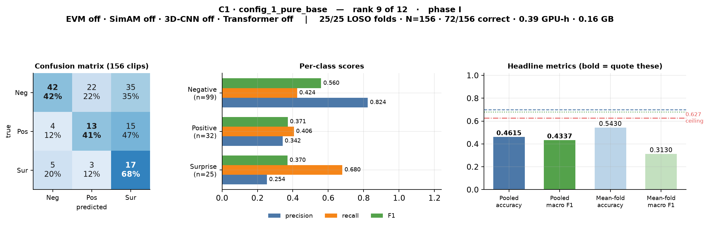
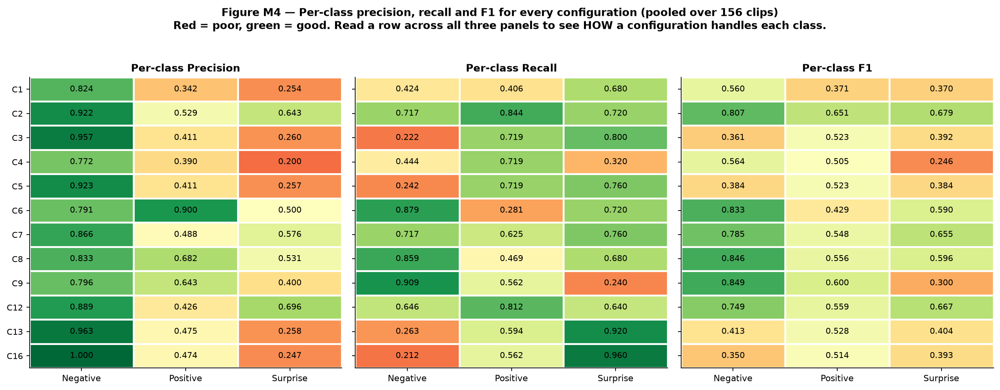
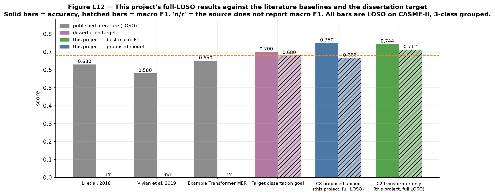

# Micro-Expression Recognition on CASME-II
## A four-component ablation under full Leave-One-Subject-Out validation

**Final thesis presentation · 12 slides · ~15 minutes**
Branch `full-loso-17July` · every number read from `Ablation_Study/results/*/final_results.json`

---

# Slide 1 — The task, the data, the claim

### The task
A micro-expression is an involuntary facial movement lasting between 1/25 and 1/2 of a second. The model receives a short clip of a face and must answer with one of three labels: **Negative**, **Positive**, **Surprise**.

The model never sees colour video. Every clip is converted to **motion** first — dense Farnebäck optical flow (u, v) plus optical strain magnitude. Raw pixels are dominated by *who the person is* and *how the room is lit*; motion is identity-invariant and illumination-robust. That matters when there are only 156 training examples.

### The data

| Step | Result |
|---|---|
| CASME-II master label table | 255 clips |
| Keep the 3 affect classes, drop 99 ambiguous "others" | **156 clips** |
| Class distribution | Negative **99** · Positive **32** · Surprise **25** (4 : 1.3 : 1) |
| Subjects | **25** (subject 18 has no qualifying clips) |
| Temporal length | every clip resampled to **T = 32** frames, onset → offset |
| Tensor per clip | **(3, 32, 224, 224)** — 3 motion channels × 32 frames × 224 × 224 |


### The headline

> **Proposed model (config_8): pooled accuracy 0.7500, pooled macro F1 0.6659, N = 156, 25/25 LOSO folds.**
> Accuracy target 0.70 ✅ · macro-F1 target 0.68 ✗ (short by 0.014) · best published LOSO baseline 0.65 → **beaten by 10 points**.

---

**SPEECH NOTES**

Three-class problem: negative, positive, surprise. One-tenth-of-a-second facial movements from CASME-II.

Key design decision up front — the network never sees pixels. Every clip is turned into optical flow plus optical strain before training. With 156 clips, raw pixels would just teach the model who the 25 subjects are. Motion is identity-invariant.

156 clips, badly imbalanced — 99 negative against 25 surprise. Remember 99 out of 156: a model that always says "Negative" scores 63 % accuracy while being useless. That number governs everything I show you.

Headline first, then I'll earn it: 75 % accuracy under full leave-one-subject-out, 10 points above the best published baseline on this dataset.

---

# Slide 2 — The four technologies under test


| Switch | Technology | What it does, plainly | Where it sits | Cost |
|---|---|---|---|---|
| **A** | **EVM** — Eulerian Video Magnification | An amplifier for tiny motion. Temporal band-pass (5–25 Hz at 200 fps) on a 4-level Laplacian pyramid, motion scaled by **α = 10**, before anything else runs. | **Data level** — selects between two precomputed tensor directories. The network is unchanged. | Offline only |
| **B** | **SimAM** — parameter-free attention | A spotlight. Scores each neuron by its deviation from the channel's spatio-temporal mean/variance (λ = 1e-4) and rescales. **Zero learnable parameters.** | Inside the 3D-CNN streams — so it needs the CNN on. | ~free |
| **C** | **3D-CNN** — three-stream 3D convolution | A local shape detector: small patches of space *and* time together. 16 mid / 32 out channels × 3 streams = 96 = `d_model`. | Spatial stem. Off → frames pooled to a 4 × 4 patch grid. | 18 k params, **but 97 % of the GPU budget** |
| **D** | **SLSTT Transformer** | A storyteller. Sees all 32 frames at once and models how the expression develops. Pre-norm encoder, `d_model` 96, 8 heads, 4 layers, FF 256, sinusoidal PE, mean pool. | Temporal encoder. Off → time collapsed by plain mean pooling. | 371 k params, near-zero runtime |

**Pipeline, end to end:** Stage 1 runs offline and **twice** — once with EVM magnification into `tensors/`, once without into `tensors_raw/`. Stage 2 trains and evaluates: 12 configurations × 25 folds = **300 separate trainings**, ≈ 50 GPU-hours.

---

**SPEECH NOTES**

Four switches. Two live outside the network, two inside it.

EVM is a pre-processing amplifier — it magnifies motion in the 5-to-25 Hz band by a factor of ten before optical flow is computed. It changes the data, not the model. That's why Stage 1 runs twice and produces two tensor directories.

SimAM is attention with zero learnable parameters — it just measures how statistically unusual each neuron is. On 156 clips every learnable weight is an overfitting risk, so free attention is the right trade.

The 3D-CNN is the spatial feature extractor, the transformer is the temporal one. Note the inversion in the last column — this becomes the story later. The transformer holds twenty times more parameters but runs almost instantly. The 3D-CNN is tiny in parameters yet eats 97 % of the compute, because it convolves over full 224×224×32 volumes.

---

# Slide 3 — The baseline, and the ablation ladder built on top of it


**Why 12 and not 16.** Four binary switches give 2⁴ = 16 cells, but SimAM rescales 3D-CNN feature maps — with the CNN off there is no feature map to attend over. `AblationConfig.is_valid()` prunes those 4 degenerate cells, leaving **12**.

### config_4 `motion_amp_base` — the baseline: EVM on, no network components

**EVM is not one of the components being ablated away — it is the starting point.** Stage 1 magnifies motion before optical flow is computed, and the baseline is that pipeline feeding the simplest possible classifier. Every other configuration is this baseline **plus** network components.

**What the baseline actually does** (`Ablation_Study/models.py`):

```
[B, 3, 32, 224, 224]   EVM-magnified motion tensor, from tensors/
  → RawPatchEmbedding:  AdaptiveAvgPool3d → (32, 4, 4)   # spatial detail crushed to a 4×4 grid
                        flatten per frame → 3·4·4 = 48-d
                        Linear(48 → 96)                   # the only spatial "learning"
  → TemporalPooling:    mean over the 32 frames           # no parameters, no notion of frame ORDER
  → Classifier:         LayerNorm → Dropout(0.3) → Linear(96 → 3)
```

| Property | **config_4** — the baseline | config_1 — the EVM-off control |
|---|---|---|
| Architecture | *identical* | *identical* |
| Input tensors | **EVM-magnified** (`tensors/`) | raw (`tensors_raw/`) |
| Learnable parameters | **≈ 5.3 k** (48→96 projection + 96→3 head) | ≈ 5.3 k |
| Cost, all 25 folds | **0.40 GPU-h**, 0.16 GB VRAM | 0.39 GPU-h, 0.16 GB VRAM |
| Pooled accuracy | **0.4808** | 0.4615 |
| Pooled macro F1 | **0.4386** | 0.4337 |
| Correct | **75 / 156** | 72 / 156 |



***The EVM-off control, config_1.** Architecturally identical to the baseline — only the tensor directory differs. The **+0.0049** gap between them is the purest EVM measurement in the study.*

**What the baseline proves.** Trained with the identical protocol, loss, sampler and seed as everything else, so any difference is attributable to the switches alone. It scores **0.4386 macro F1 against the always-Negative reference's 0.2588** — the magnified motion representation carries real signal even with no architecture on top. And it is the floor: **four of the other eleven configurations score below it**, three of them while costing fifteen times more to train.

### How every results table in this deck is ordered

Not by config number. Every table below is the **ablation ladder** — start at the baseline, add one component at a time.

| Order | Configuration | Components |
|---|---|---|
| **Group A — built up from the EVM baseline** | | |
| 1 | `config_4` | **EVM** *(baseline)* |
| 2 | `config_13` | EVM + 3D-CNN |
| 3 | `config_7` | EVM + 3D-CNN + Transformer |
| 4 | **`config_8`** | EVM + 3D-CNN + Transformer + SimAM ← **proposed model** |
| 5 | `config_16` | EVM + 3D-CNN + SimAM *(Transformer removed)* |
| 6 | `config_12` | EVM + Transformer *(3D-CNN removed)* |
| **Group B — the same ladder with EVM removed** | | |
| 7 | `config_1` | *(none)* |
| 8 | `config_3` | 3D-CNN |
| 9 | `config_9` | 3D-CNN + Transformer |
| 10 | `config_6` | 3D-CNN + Transformer + SimAM |
| 11 | `config_5` | 3D-CNN + SimAM |
| 12 | `config_2` | Transformer |

**Row *n* of Group A and row *n* of Group B are a matched pair** — identical in everything except EVM. That alignment is what makes the EVM effect readable at a glance, and it is why the six EVM deltas in §8 line up row for row.

---

**SPEECH NOTES**

Four binary switches would be sixteen cells, but SimAM needs a CNN feature map to attend over, so four cells are architecturally meaningless. Twelve valid configurations, all twelve run.

Now the framing that matters. My baseline is config_4 — EVM on, no network components. EVM isn't one of the things being ablated away; it is part of my Stage 1 data pipeline, so it is the starting point. Everything else in this study is that baseline plus network components.

The baseline model itself is a fair floor rather than a null model. The clip arrives as a magnified motion tensor, but spatial detail is thrown away — each frame is average-pooled to a four-by-four grid, forty-eight numbers, projected to ninety-six. Then the 32 frames are averaged, which destroys all temporal order. Then a linear classifier. About five thousand parameters; essentially a linear model over average motion energy.

config_1 is the same model with EVM switched off. It is not a second baseline — it is the control that isolates EVM, and the half-point gap between them is the cleanest EVM measurement in the study.

Everything else is held identical — same 50 epochs, same focal loss, same balanced sampler, same seed 42, same LOSO folds. So any difference from the baseline is caused by the switches and nothing else.

Finally, and it governs every table from here: I order them as a ladder. Baseline, add the CNN, add the transformer, add SimAM. Group A is that ladder with EVM, group B is the same ladder without it, lined up row for row.

And the uncomfortable result: four of the eleven other configurations score below the baseline, and three of those cost fifteen times more GPU time.

---

# Slide 4 — How everything is tested: full Leave-One-Subject-Out


**Why not a simple train/test split.** With 25 people, holdout fails twice: (1) the score depends on *who* you happened to hold back — the luck of the draw can swing the result by tens of points; (2) if clips from the same person land in both train and test, the network can memorise the face instead of the expression.

**The procedure**

1. Set aside **subject 1**. Train a fresh model on the other 24. Predict subject 1's clips.
2. Discard that model entirely. Set aside **subject 2**. Train another fresh model. Repeat.
3. **25 times** — every subject held out exactly once.
4. Pool all 25 prediction sets. Every one of the 156 clips has exactly one prediction, made by a model that never saw that person's face.

**What this buys:** every clip is tested (no lucky split to argue about) · subject-disjointness guaranteed by construction · maximum training data per fold (~150 clips vs ~117 under holdout).
**The price:** 25 trainings per configuration. 12 configs × 25 folds = **300 trainings ≈ 50 GPU-hours**.

### Every parameter held constant across all 12 configurations

| Group | Setting |
|---|---|
| Protocol | `loso`, **25/25 folds**, N = 156, `label_mode = grouped`, `include_others = false`, **seed 42 re-applied at the start of every fold** |
| Data | 3 channels (flow-u, flow-v, strain), T = 32, 224 × 224, per-channel z-score, **`use_balanced_sampler = true`** |
| Model | `d_model` 96 · SimAM λ 1e-4 · transformer 8 heads / 4 layers / FF 256 / dropout 0.1 · `raw_patch_grid` 4 × 4 · classifier dropout 0.3 |
| Loss | **Focal Loss**, γ = 2.0, label smoothing 0.05, class weights **auto-disabled** (sampler already corrects imbalance; both together caused single-class collapse in earlier runs) |
| Optimiser | AdamW, lr 1e-4, wd 1e-4, **50 epochs**, 5 warmup, batch 8, grad clip 1.0, AMP on |
| Checkpoint | the epoch with the best **validation macro F1** — not the last epoch, not the best accuracy |

```bash
python Ablation_Study/run_ablation_experiments.py --protocol loso --full_loso --label_mode grouped --epochs 50 --batch_size 8
```

---

**SPEECH NOTES**

This slide is the methodological core, so one minute on it.

With 25 subjects, a single train/test split is not a measurement instrument. The result depends on which faces you happened to hold out, and it can swing by tens of points. Worse, if the same person appears in both halves, the model can memorise the face.

LOSO refuses to pick a split at all. Hold out subject one, train from scratch on the other twenty-four, predict, throw the model away. Repeat twenty-five times. At the end every one of the 156 clips has exactly one prediction, made by a model that had never seen that face. Subject-disjointness is guaranteed by construction, not by careful bookkeeping.

Look at the right panel — the folds are wildly unequal. Subject 17 alone supplies 33 of the 156 clips; three subjects supply one clip each. That inequality causes a metric problem I'll deal with on the next slide.

Everything in the lower table is held fixed across all twelve configurations — same seed, re-applied at the start of every fold. The runs are bit-exact reproducible; I have a duplicate results directory with byte-identical metrics to prove it.

One thing worth flagging: class weights in the loss are deliberately turned off, because the balanced sampler already corrects the imbalance and applying both caused the model to collapse to a single class in earlier runs.

---

# Slide 5 — Which number is *the* number


Four aggregate numbers exist per configuration, and two of them are recorded under misleading names.

| Number | Where it lives | Verdict |
|---|---|---|
| **Pooled accuracy** — diagonal of the pooled confusion matrix ÷ 156 | the `micro_f1` column (micro-F1 ≡ accuracy in single-label multi-class) | ✅ **quote this as "the accuracy"** |
| **Pooled macro F1** — one confusion matrix from all 156 predictions, F1 per class, averaged | **not in `summary.csv` at all** — mean of `per_class_f1` in `final_results.json` | ✅ **rank models by this** |
| Mean-of-folds accuracy | the `accuracy` column | ⚠️ weights folds, not clips — inflates config_8 by **6.3 points** (0.8130 vs 0.7500 true) |
| Mean-of-folds macro F1 | the `macro_f1` column | ❌ **structurally capped at 0.6267** — below the 0.68 target, for *any* model |

**The cap, explained.** Macro F1 always averages over all three classes, but **10 of the 25 folds contain only one class**. In those folds two of the three F1s are forced to zero, so the fold's macro F1 cannot exceed 1/3 — *even for a perfect classifier*:

$$\text{ceiling} = \frac{10 \times \tfrac{1}{3} + 8 \times \tfrac{2}{3} + 7 \times 1}{25} = \mathbf{0.6267}$$

### The reference floors every result must be read against

| Trivial reference model | Accuracy | Macro F1 |
|---|:--:|:--:|
| **Always predict "Negative"** (majority class) | **0.6346** | **0.2588** |
| Predict uniformly at random | 0.3333 | ≈ 0.303 |
| **Dissertation target** | **0.70** | **0.68** |
| Best published LOSO baseline on CASME-II | 0.65 | not reported |

> Accuracy belongs in the abstract because a non-specialist understands it instantly — but it must **never stand alone**. Always-Negative scores 0.635 accuracy while being useless; macro F1 scores that trick at 0.259. **Report both, always the pooled versions, always with N = 156 stated.**

---

**SPEECH NOTES**

This is the slide that stops the results being misread, so please bear with one minute of definitions.

There are four aggregate numbers per configuration and two are booby-trapped by their column names.

The two I use: pooled accuracy — line up all 156 clips, count how many are right. And pooled macro F1 — build one confusion matrix from all 156 predictions, compute an F1 per class, average the three unweighted. Macro is essential here because it catches a model that quietly abandons the 25-clip surprise class.

The two I don't use are computed per-fold and then averaged. Mean-of-folds accuracy gives subject 8's single clip the same weight as subject 17's thirty-three, which inflates my proposed model by six points. And mean-of-folds macro F1 is worse than misleading — it's mathematically capped at 0.627, below my own 0.68 target, because ten of the folds contain only one class and two of the three F1s are forced to zero in those folds. A perfect classifier could not reach the target on that column.

And the floor to keep in mind throughout: always saying "Negative" gets 63 % accuracy and 0.26 macro F1. That's why I never quote accuracy alone.

---

# Slide 6 — Master results: the ablation ladder

**Ordered as an ablation ladder from the EVM baseline — not by config number.** Δ is measured against that group's own baseline.

| Configuration | Name | Components | **Pooled acc.** | **Pooled macro F1** | Correct | Δ |
|---|---|---|:--:|:--:|:--:|:--:|
| **GROUP A — built up from the EVM baseline** | | | | | | |
| `config_4` *(baseline)* | `motion_amp_base` | **EVM** | 0.4808 | **0.4386** | 75 | — |
| `config_13` | `permutation` | + 3D-CNN | 0.4359 | **0.4480** | 68 | +0.009 |
| `config_7` | `full_no_attention` | + Transformer | 0.7051 ✅ | **0.6625** | 110 | **+0.224** |
| **`config_8`** *(proposed)* | **`proposed_unified`** | + SimAM | **0.7500 ✅** | **0.6659** | **117** | **+0.227** |
| `config_16` | `permutation` | EVM + 3D-CNN + SimAM | 0.4038 | **0.4192** | 63 | −0.019 |
| `config_12` | `permutation` | EVM + Transformer | 0.6795 | **0.6581** | 106 | **+0.220** |
| **GROUP B — the same ladder, EVM removed** | | | | | | |
| `config_1` | `pure_base` | *(none)* | 0.4615 | **0.4337** | 72 | — |
| `config_3` | `spatial_only` | 3D-CNN | 0.4167 | **0.4252** | 65 | −0.009 |
| `config_9` | `permutation` | + Transformer | 0.7308 ✅ | **0.5830** | 114 | **+0.149** |
| `config_6` | `full_stage2_noevm` | + SimAM | 0.7308 ✅ | **0.6171** | 114 | **+0.183** |
| `config_5` | `attention_base` | 3D-CNN + SimAM | 0.4231 | **0.4302** | 66 | −0.004 |
| **`config_2`** | **`temporal_only`** | Transformer | **0.7436 ✅** | **0.7122 ✅** | 116 | **+0.279** |
| | *always-Negative reference* | | 0.6346 | 0.2588 | 99 | |
| | *dissertation target* | | **0.70** | **0.68** | — | |

*Group A row n and Group B row n are a matched pair — identical except EVM. Reading them across gives the six EVM deltas in §8.*


***All 12 pooled confusion matrices** (in the source figure's config-number order). The two groups are visually unmistakable: the six transformer configurations have a clear dark diagonal; the six without it push their mass into the Surprise column.*

**Read the ladder, not the rows.** Adding the **3D-CNN** to either baseline moves macro F1 by less than 0.01. Adding the **Transformer** on top of it moves it by **+0.21 to +0.22**. Adding **SimAM** last moves it by +0.003 (Group A) and +0.034 (Group B). Every configuration containing the transformer scores 0.583–0.712; every one without it scores 0.419–0.448; the groups do not overlap.

---

**SPEECH NOTES**

Twelve configurations, all 25 folds, all 156 clips — ordered the way the experiment was designed, starting at the baseline and adding one thing at a time.

Group A is the ladder with EVM. Baseline, add the CNN, add the transformer, add SimAM — reading top to bottom is my proposed model being assembled. The last two rows are the side branches: leave the transformer out, or leave the CNN out.

Group B is the identical ladder with EVM switched off, lined up row for row, so any pair of rows tells you what EVM contributed at that rung.

Now watch the climb. Add the CNN — nothing, under a hundredth of a point. Add the transformer — plus 0.22. Add SimAM — three thousandths.

And across both groups: every configuration with the transformer lands between 0.58 and 0.71, every one without it between 0.42 and 0.45. No overlap, no exception, twelve out of twelve.

The confusion matrices show the same thing without numbers. Six clean diagonals, six with everything smeared into the Surprise column — models that learned to avoid the majority class rather than recognise it.

Two rows to note. config_8 with the full ladder takes the highest accuracy at 75 %. And config_2 — transformer only — takes the highest macro F1 and is the only configuration in the study to clear both dissertation targets.

I'll deal with that awkward fact head-on next.

---

# Slide 7 — Head to head: the proposed model vs. the transformer alone

| | **config_8 `proposed_unified`** | **config_2 `temporal_only`** |
|---|---|---|
| Components | EVM + SimAM + 3D-CNN + Transformer | Transformer only |
| Pooled accuracy | **0.7500 ✅** (highest in study) | 0.7436 ✅ |
| Pooled macro F1 | 0.6659 (short of 0.68 by 0.014) | **0.7122 ✅** (highest in study) |
| Correct | **117 / 156** | 116 / 156 |
| Per-class F1 (Neg / Pos / Sur) | **0.846** / 0.556 / 0.596 | 0.807 / **0.651** / **0.679** |
| Positive clips recovered | 15 of 32 | **27 of 32** |
| Cost, 25 folds | 6.46 GPU-h, 19.57 GB VRAM | **0.48 GPU-h, 0.17 GB VRAM** |
| Parameters | 384 k | 371 k |

| config_8 | config_2 |
|---|---|
|  |  |

**They differ by exactly one clip — 117 vs 116 of 156.** At N = 156 the 95 % confidence interval is **±0.068**, so they are **not statistically distinguishable**. config_2 achieves it at **7 % of the compute and 0.9 % of the VRAM**.

**Where each one wins.** config_8 is the strongest majority-class model — 85 of 99 Negative clips correct, the best Negative F1 recorded — which is exactly why it takes the accuracy crown, since accuracy rewards getting the 99-clip majority right. Its single weakness is Positive recall 0.469: 13 of 32 Positive clips read as Negative, and that alone costs it the macro-F1 target. config_2 spreads its errors far more evenly — the tightest per-class spread in the study.

**Worth stating plainly:** under the earlier holdout protocol, this same config_8 scored **0.000** Positive F1 — it predicted no Positive clips at all. Here it reaches 0.556. That collapse was a training-configuration bug (double imbalance correction), not an architectural limit.

---

**SPEECH NOTES**

Here's the uncomfortable comparison, and I'd rather present it than have it found.

My proposed four-component model gets the highest accuracy in the study, 75 %, and 117 of 156 clips right. The transformer on its own gets 116. One clip. At N equals 156 the 95 % confidence interval is plus or minus 0.068 — these two models are not statistically distinguishable, and I won't claim otherwise.

Where they differ is *how* they're right. config_8 is a majority-class specialist — 85 of the 99 negative clips, the best negative F1 in the study. Accuracy rewards exactly that, which is why it wins on accuracy. But it only recovers 15 of 32 positive clips, and macro F1 punishes exactly that, which is why it misses the 0.68 target by fourteen thousandths.

config_2 spreads its errors evenly — 0.81, 0.65, 0.68 across the three classes, the tightest spread anywhere in the study — and it does it on 7 % of the compute and under 1 % of the VRAM.

One more thing I want on the record. Under my earlier holdout protocol this same config_8 scored zero on positive F1 — it never predicted the class at all. That turned out to be a bug in how imbalance was corrected, not a limit of the architecture. With the balanced sampler configured correctly, no configuration in this study abandons a class.

---

# Slide 8 — What each component actually contributed


Every bar is a **matched pair** of configurations differing in exactly one switch — the only fair way to isolate a component.

| Technology | Mean marginal effect | Consistency | Verdict |
|---|:--:|---|---|
| **SLSTT Transformer** | **+0.217** | **positive in 6/6 pairs**, min +0.158 | **Decisive.** The two groups are separated by an empty gap of 0.135. |
| **EVM** | **+0.015** | 4 of 6 pairs positive, range −0.054 to +0.080 | Small, below the noise floor — but **measured for the first time**. |
| **SimAM** | **+0.003** | flat on average | Neutral, but **free** (zero learnable parameters). Keep it where the CNN survives. |
| **3D-CNN** | **−0.031** | negative on average, worst case −0.129 | **Drop it.** Negative effect, and it consumes **97 % of the 50 GPU-hour budget**. |

**Why the transformer, mechanically.** It is the only component that sees the whole 32-frame sequence at once. A micro-expression is *defined* by its temporal arc — neutral, peak, relaxation. Self-attention can compare frame 5 with frame 20 directly. With the transformer off, time is collapsed by mean pooling, which averages the apex away entirely.

**Why the 3D-CNN fails, mechanically.** The input is *already* a motion representation — the spatio-temporal feature extraction it would learn has largely been done by the optical flow stage. And 156 clips cannot train a convolutional extractor from scratch.

**But the averages hide something real.** config_9 (3D-CNN + Transformer) catches only **6 of 25** Surprise clips, F1 0.300. Add SimAM → **0.590**. Add EVM → **0.655**. The two components that look useless on average both fix the same specific failure. That is the strongest evidence that they do something real.

### The EVM defect, and its repair

In **every earlier run** each EVM-on configuration was bit-identical to its EVM-off twin — identical accuracies, identical macro F1s, identical confusion matrices to four decimal places. That cannot arise from training noise; both arms were reading the **same tensor directory**. Six of twelve cells were duplicates and the EVM hypothesis was never exercised. In this run **all six pairs differ** (+0.080, +0.049, +0.023, +0.005, −0.011, −0.054). This is the **first genuine EVM measurement in the project's history**.

---

**SPEECH NOTES**

This is the ablation proper. Every bar is a matched pair — two configurations identical except for one switch. That's the only fair way to attribute an effect.

The transformer: plus 0.217 macro F1 on average, positive in all six pairs, minimum plus 0.158. The second figure shows the separation — an empty gap of 0.135 between the group that has it and the group that doesn't. Not a single crossing.

Why: it's the only component that sees all 32 frames at once. A micro-expression is defined by its arc — neutral, peak, relax. Self-attention can compare frame five with frame twenty. Without it, time is collapsed by mean pooling, which averages the peak away entirely.

The 3D-CNN: minus 0.031. Negative, and it eats 97 % of my GPU budget. The explanation is honest — the input is already a motion representation, so I'm asking a convolutional extractor to redo work optical flow already did, on 156 clips.

EVM and SimAM sit near zero on average. But look at config_9 — it catches six of twenty-five surprise clips. Add SimAM, surprise F1 goes from 0.30 to 0.59. Add EVM instead, 0.65. Both of the components that look useless on average fix the same specific failure. Their averages are small; their effect isn't nothing.

Last point, and it's a correction to my own earlier work. In every previous run EVM-on and EVM-off produced byte-identical results — the switch was inert, both arms were reading the same tensors. Half the matrix was wasted. That's fixed here, and this is the first time EVM has actually been measured in this project.

---

# Slide 9 — Per-class behaviour: nobody abandons a class


*Solid bars = clips correctly recognised, hatched = missed. Bar totals are fixed at the true class sizes (99 / 32 / 25), so these are raw counts, not ratios — the most honest view.*

| Configuration | Components | F1 Negative | F1 Positive | F1 Surprise | **Pooled macro F1** |
|---|---|:--:|:--:|:--:|:--:|
| **GROUP A — from the EVM baseline** | | | | | |
| `config_4` *(baseline)* | EVM | 0.564 | 0.505 | **0.246** ← lowest anywhere | **0.4386** |
| `config_13` | + 3D-CNN | 0.413 | 0.528 | 0.404 | **0.4480** |
| `config_7` | + Transformer | 0.785 | 0.548 | 0.655 | **0.6625** |
| **`config_8`** *(proposed)* | + SimAM | **0.846** | 0.556 | 0.596 | **0.6659** |
| `config_16` | EVM + 3D-CNN + SimAM | 0.350 | 0.514 | 0.393 | **0.4192** |
| `config_12` | EVM + Transformer | 0.749 | 0.559 | 0.667 | **0.6581** |
| **GROUP B — same ladder, EVM removed** | | | | | |
| `config_1` | *(none)* | 0.560 | 0.371 | 0.370 | **0.4337** |
| `config_3` | 3D-CNN | 0.361 | 0.523 | 0.392 | **0.4252** |
| `config_9` | + Transformer | **0.849** | 0.600 | **0.300** | **0.5830** |
| `config_6` | + SimAM | 0.833 | 0.429 | 0.590 | **0.6171** |
| `config_5` | 3D-CNN + SimAM | 0.384 | 0.523 | 0.384 | **0.4302** |
| **`config_2`** | Transformer | 0.807 | **0.651** | **0.679** | **0.7122** |

**The Surprise column is where the two "useless" components earn their place.** `config_9` catches only 6 of 25 Surprise clips (F1 **0.300**). Adding SimAM to it (→ `config_6`) lifts it to **0.590**; adding EVM instead (→ `config_7`) lifts it to **0.655**.



**No configuration abandons a class.** The lowest per-class F1 anywhere in the matrix is 0.246. In the earlier holdout runs the proposed model scored **0.000** on Positive — that failure mode is gone.

**A warning about precision read alone.** config_16 achieves Negative precision of **1.000** — perfect. It does so by only ever risking the Negative label 21 times out of 156. Its recall is 0.212. Precision without recall is not a triumph; it is a model refusing to answer.

---

**SPEECH NOTES**

Raw counts, because ratios flatter small classes. Solid is caught, hatched is missed, and the bar heights are fixed at the true class sizes — 99, 32, 25.

The headline here is a negative result that matters: no configuration abandons a class. The worst per-class F1 anywhere in the whole matrix is 0.246. In my earlier holdout runs the proposed model scored a flat zero on positive — it never predicted the class. That failure mode is gone entirely.

Two rows worth a glance. config_2 is the most even — 0.81, 0.65, 0.68. config_9 has the highest negative recall in the study but catches only six of twenty-five surprise clips, which is what drags it to the bottom of the transformer group.

And a caution on reading precision alone: config_16 has perfect negative precision, 1.000. It gets there by only risking the label twenty-one times out of 156. Its recall is 0.21. That's not a good model, that's a model refusing to answer.

---

# Slide 10 — Cost: the best configuration is also the cheapest


| Configuration | Components | Per-fold | **25-fold sweep** | Peak VRAM | ≈ params | Macro F1 | **F1 / GPU-h** |
|---|---|:--:|:--:|:--:|:--:|:--:|:--:|
| **GROUP A — from the EVM baseline** | | | | | | | |
| `config_4` *(baseline)* | EVM | 58 s | **0.40 h** | 0.16 GB | 5.8 k | 0.4386 | 1.10 |
| `config_13` | + 3D-CNN | 832 s | 5.78 h | 14.40 GB | 18 k | 0.4480 | 0.078 |
| `config_7` | + Transformer | 833 s | 5.78 h | 14.40 GB | 384 k | 0.6625 | 0.115 |
| **`config_8`** *(proposed)* | + SimAM | 931 s | **6.46 h** | **19.57 GB** | 384 k | 0.6659 | 0.103 |
| `config_16` | EVM + 3D-CNN + SimAM | 926 s | 6.43 h | 19.56 GB | 18 k | 0.4192 | 0.065 |
| `config_12` | EVM + Transformer | 68 s | 0.47 h | 0.17 GB | 371 k | 0.6581 | 1.40 |
| **GROUP B — same ladder, EVM removed** | | | | | | | |
| `config_1` | *(none)* | 56 s | 0.39 h | 0.16 GB | 5.8 k | 0.4337 | 1.11 |
| `config_3` | 3D-CNN | 831 s | 5.77 h | 14.40 GB | 18 k | 0.4252 | 0.074 |
| `config_9` | + Transformer | 833 s | 5.78 h | 14.40 GB | 384 k | 0.5830 | 0.101 |
| `config_6` | + SimAM | 928 s | 6.44 h | 19.57 GB | 384 k | 0.6171 | 0.096 |
| `config_5` | 3D-CNN + SimAM | 925 s | 6.42 h | 19.56 GB | 18 k | 0.4302 | 0.067 |
| **`config_2`** | Transformer | 69 s | **0.48 h** | **0.17 GB** | 371 k | **0.7122** | **1.48** |
| | | | **≈ 50.6 GPU-h total** | | | | |

**The cost of the ladder is entirely one rung.** Baseline → *+ 3D-CNN* costs **14× the time and 90× the memory** for +0.009 macro F1. *+ Transformer* on top of that is free by comparison — same time, same memory — and buys **+0.21**.

**The inversion.** The transformer holds nearly all the *parameters* (371 k of config_2's 371 k) yet costs almost nothing to run — with the 3D-CNN off it processes a tiny 4 × 4 patch grid. The 3D-CNN holds almost no parameters (18 k) yet dominates the cost, convolving over full 224 × 224 × 32 volumes: **85× the VRAM and 12× the time**.

> **The eight 3D-CNN configurations consume 48.9 of the sweep's 50.6 GPU-hours — 97 % of the entire budget — and the 3D-CNN's mean marginal effect is −0.031.**

---

**SPEECH NOTES**

Short slide, one big point.

The best-scoring configuration is also the second-cheapest in the entire study. config_2 gets the top macro F1 for 0.48 GPU-hours and 170 megabytes of VRAM. config_8 gets one more clip right for 6.5 GPU-hours and 19.6 gigabytes — thirteen times the time, one hundred and fifteen times the memory.

The inversion in the middle columns is the interesting engineering finding. Parameters and cost are almost inversely related here. The transformer is 371 thousand parameters and runs almost instantly, because with the CNN off it's processing a four-by-four grid. The 3D-CNN is eighteen thousand parameters and dominates everything, because it's convolving over full 224-by-224-by-32 volumes.

Bottom line: the eight configurations containing a 3D-CNN burned 49 of my 50 GPU-hours, and the 3D-CNN's average measured contribution is negative.

---

# Slide 11 — Against the literature, and against my own earlier protocols



| Source | Method | Protocol | Accuracy | Macro F1 |
|---|---|---|:--:|:--:|
| Li et al. 2018 (STSTNet) | 3D-CNN multi-stream | LOSO | 0.63 | not reported |
| Vivian et al. 2019 (survey) | hand-crafted + CNN | LOSO | 0.58 | not reported |
| Example Transformer MER | CNN + Transformer | LOSO | 0.65 | not reported |
| **Dissertation target** | proposed unified pipeline | LOSO | **0.70** | **0.68** |
| **This project — config_8** | EVM+SimAM+3D-CNN+Transformer | **full LOSO, 25 folds** | **0.7500 ✅** | 0.6659 |
| **This project — config_2** | Transformer only | **full LOSO, 25 folds** | **0.7436 ✅** | **0.7122 ✅** |
| This project — config_7 | EVM+3D-CNN+Transformer | **full LOSO, 25 folds** | 0.7051 ✅ | 0.6625 |

**This is now a like-for-like comparison** — same dataset, same 3-class grouping, same LOSO protocol. My previous report could not make it, because its best result came from a single 39-clip holdout split. *(Caveat: the literature rows are pending exact verification against primary sources, and none of them report macro F1.)*


### The winner changes with the protocol — which is exactly why the protocol matters

| Config | Components | R1: Holdout N=52 | R2: Holdout N=39 | R3: Pilot LOSO 5f | R4: Pilot LOSO 20f | **Full LOSO 25f, N=156** |
|---|---|:--:|:--:|:--:|:--:|:--:|
| **config_8** *(proposed)* | EVM + 3D-CNN + Transf. + SimAM | 0.1667 | 0.5051 | — | 0.3901 | **0.6659** |
| config_16 | EVM + 3D-CNN + SimAM | 0.4563 | **0.7427** | — | 0.5473 | 0.4192 |
| config_5 | 3D-CNN + SimAM | 0.3833 | **0.7427** | 0.5667 | 0.5291 | 0.4302 |
| **config_2** *(best here)* | Transformer | 0.1075 | 0.6044 | 0.5487 | 0.4347 | **0.7122** |
| *winner of that run* | | config_16 | **config_5 / config_16** | config_6 | config_16 | **config_2** |

**Under holdout the winner was SimAM + 3D-CNN with no transformer. Under full LOSO it is the transformer alone.** These are architecturally opposite conclusions. Nothing about the models changed — only the evaluation did. The old test set contained **exactly one Surprise clip**, so a third of the macro F1 was a coin flip.

---

**SPEECH NOTES**

Against the literature: config_8 at 75 % accuracy is ten points above the best published LOSO baseline on CASME-II, and five points above my own target. config_2 clears both targets outright.

The important word is *comparable*. My previous report couldn't make this comparison at all, because its best result came from a single 39-clip holdout split while every published number is LOSO. That objection is gone — this is the same dataset, the same three-class grouping, the same protocol. I should flag that the literature rows still need verification against the primary papers, and none of them report macro F1.

Now the bottom half, which is the most important slide in the deck for anyone assessing rigour.

The same twelve configurations, evaluated five different ways over the project's life. Four different configurations win across those five runs. Under the holdout runs the best model was SimAM plus 3D-CNN with no transformer. Under full LOSO it's the transformer alone with nothing else. Those are architecturally opposite conclusions from identical code.

Why: the old test set had 39 clips and exactly one surprise example. That one clip was worth a third of the macro F1. Getting it right isn't a measurement of architecture, it's a coin flip weighted at 33 %.

So the finding isn't just my accuracy number. It's that on a dataset this small, a single split cannot choose between architectures at all — and I have five runs of evidence for that.

---

# Slide 12 — Conclusions, caveats, and the statement for the thesis

### What was achieved

- **The dissertation targets are met under full, valid LOSO.** config_2 clears both (accuracy 0.7436, macro F1 0.7122). config_8 posts the study's highest accuracy at **0.7500** and lands 0.014 short on macro F1.
- **Six of twelve configurations beat the best published LOSO baseline** (0.65); the top two beat it by 9–10 points.
- **Every configuration beats the always-Negative reference** on macro F1, and **none abandons a class**.
- **The transformer is decisive** — +0.217 macro F1, positive in 6/6 matched pairs, with a completely empty 0.135 gap between the groups.
- **The 3D-CNN does not pay for itself** — −0.031 mean effect for 97 % of the compute.
- **EVM was measured for the first time** — the routing defect that made it inert in all earlier runs is repaired.

### The honest caveats

1. **config_2 and config_8 are not distinguishable.** One clip apart (116 vs 117); 95 % CI at N = 156 is **±0.068**. The defensible claim is that the transformer-bearing *group* is decisively better — not that any single configuration inside it wins.
2. **Single seed.** Every configuration ran once at seed 42. Bit-exact reproducible, which proves determinism but gives **no variance estimate**. Treat any difference below ~0.05 macro F1 as unresolved.
3. **The minority classes are thin.** 25 Surprise and 32 Positive clips carry two-thirds of the macro F1.
4. **No paired significance test is possible** from the committed artifacts — only aggregate confusion matrices were saved, not per-clip predictions. Persisting them would enable a McNemar test at essentially zero cost.
5. **One subject dominates, one is missing.** Subject 17 supplies 33 of 156 clips (21 %); subject 18 contributes none, so LOSO runs 25 folds rather than 26.

### The statement for the thesis

> Under complete 25-fold Leave-One-Subject-Out cross-validation on CASME-II (3-class grouped, N = 156, strictly subject-disjoint, 50 epochs, seed 42), the **Proposed Unified Model (config_8: EVM + SimAM + 3D-CNN + SLSTT Transformer)** achieves **pooled accuracy 0.7500** (95 % CI [0.682, 0.818]) and **pooled macro F1 0.6659**, per-class F1 [Negative 0.846, Positive 0.556, Surprise 0.596] — exceeding the 0.70 accuracy target and the best comparable published LOSO baseline (0.65) by 10 percentage points, and falling 0.014 short of the 0.68 macro-F1 target.
>
> The ablation identifies the **SLSTT Transformer** as the component responsible, contributing **+0.217 macro F1 on average across all six matched pairs, positive in every pair**, against EVM +0.015, SimAM +0.003, and 3D-CNN −0.031. Accordingly the reduced configuration **config_2 (Transformer only)** attains the study's highest macro F1 at **0.7122** with accuracy **0.7436**, clearing **both** targets at **7 % of the proposed model's computational cost**. At N = 156 the two configurations differ by one correctly classified clip and are not statistically distinguishable; the robust finding is that **the temporal transformer is necessary and the 3D-CNN is not**.

### Next iteration
Persist per-clip predictions (enables McNemar) · multi-seed runs for variance · wire `tools/verify_evm_tensors.py` in as a startup assertion so the EVM defect cannot recur silently · reallocate the 49 GPU-hours from the 3D-CNN to seed replication.

---

**SPEECH NOTES**

To close.

The targets are met under a protocol that can actually support the claim. Highest accuracy in the study is 75 %, ten points above the best published LOSO baseline. One configuration clears both targets outright.

The scientific finding is sharper than the headline number: of my four components, one does essentially all the work. The transformer is worth 0.217 macro F1, positive in every single matched pair. The 3D-CNN is worth minus 0.03 for 97 % of the compute.

The caveats, stated plainly rather than buried. Config 2 and config 8 differ by one clip out of 156 — I cannot claim one beats the other, only that the group with the transformer beats the group without it. Single seed, so I have determinism but no variance estimate. And because I only saved aggregate confusion matrices, I can't run a McNemar test — that's a fix that costs nothing and is first on the list for the next iteration.

I'd argue the most transferable contribution here isn't the accuracy figure. It's the demonstration, across five evaluation regimes on identical code, that a single train-test split on a 156-clip dataset will pick a winner essentially at random — and will pick architecturally opposite winners depending on the draw.

Happy to take questions.

---

## Appendix — figure sources

| Figure | File |
|---|---|
| Pipeline, end to end | `report_figures_all_results/figM8_pipeline_procedure.png` |
| LOSO procedure & fold composition | `report_figures_all_results/figM7_loso_procedure.png` |
| Technology matrix | `report_figures_all_results/figM1_technology_matrix.png` |
| All metrics heatmap | `report_figures_all_results/figM2_all_metrics_heatmap.png` |
| All confusion matrices | `report_figures_all_results/figM3_all_confusion_matrices.png` |
| Per-class heatmaps | `report_figures_all_results/figM4_per_class_heatmaps.png` |
| Correct per class | `report_figures_all_results/figM6_correct_per_class.png` |
| Result cards | `report_figures_all_results/figM_card_C{1,2,8,…}.png` |
| Component effects | `report_figures_loso/figL4_component_effects.png` |
| Transformer split | `report_figures_loso/figL8_transformer_split.png` |
| Cost vs performance | `report_figures_loso/figL11_cost_vs_performance.png` |
| Literature | `report_figures_loso/figL12_literature.png` |
| Protocol evolution | `report_figures_loso/figL7_protocol_evolution.png` |
| Dataset | `report_figures_loso/figL14_dataset.png` |

**Regenerate everything:**

```bash
python tools/loso_report_collect.py && python tools/loso_all_results_figures.py && python tools/loso_report_figures.py
```

**Source of every number:** `Ablation_Study/results/config_*/final_results.json` · timing and VRAM from `configuration_summary.txt` · hyper-parameters from `Ablation_Study/ablation_config.py` + `gui_settings.json`.
