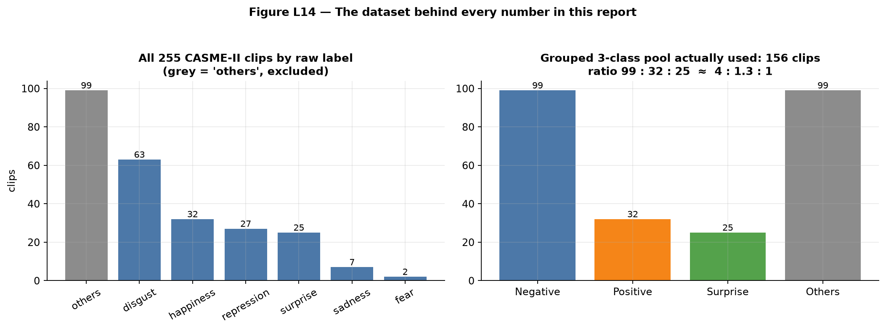
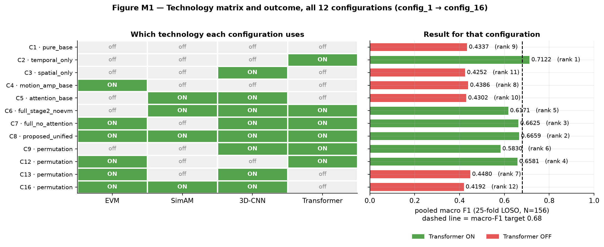
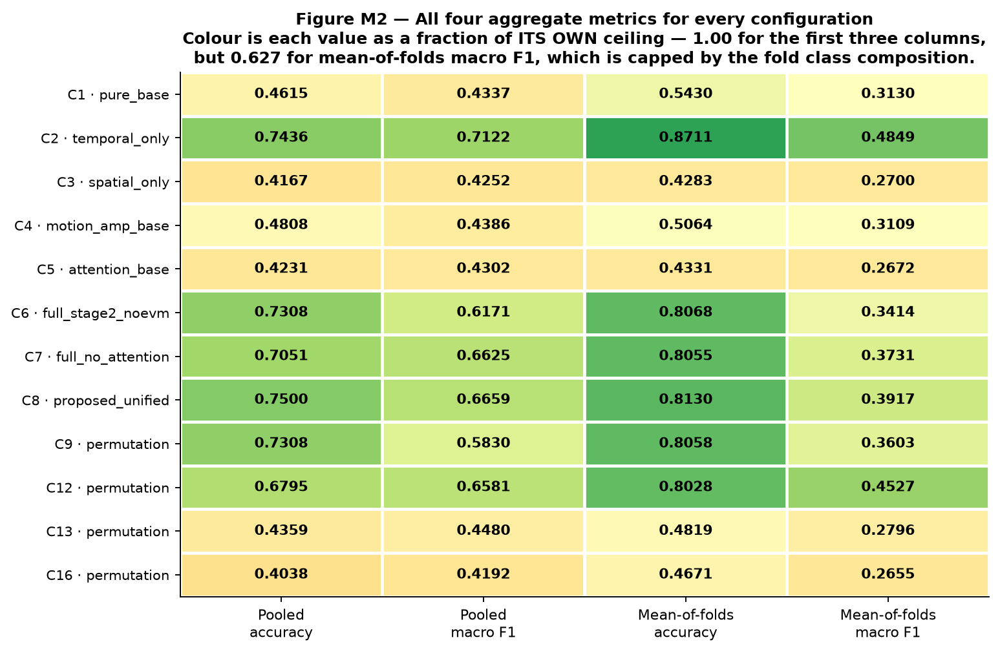
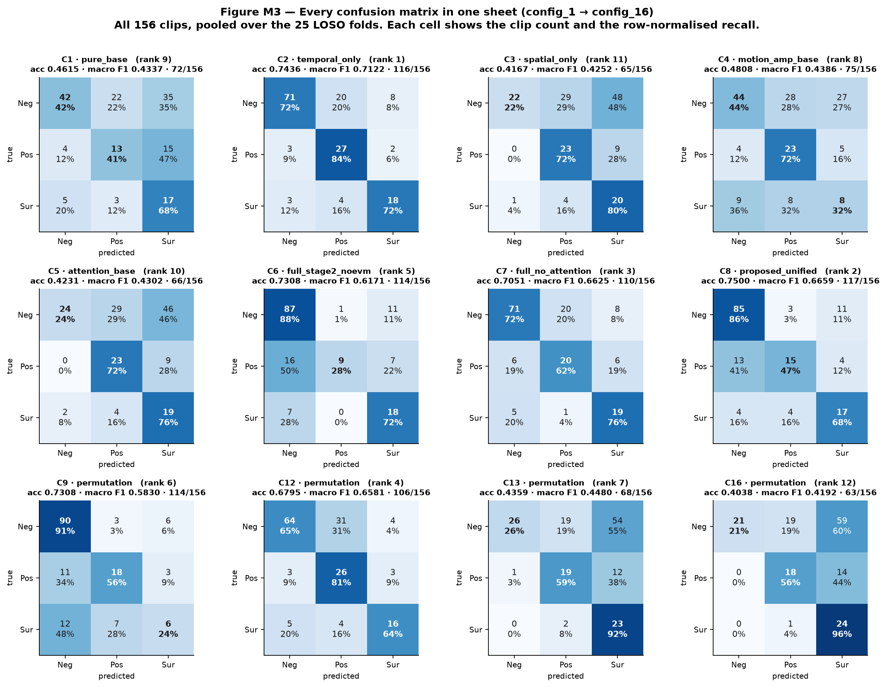
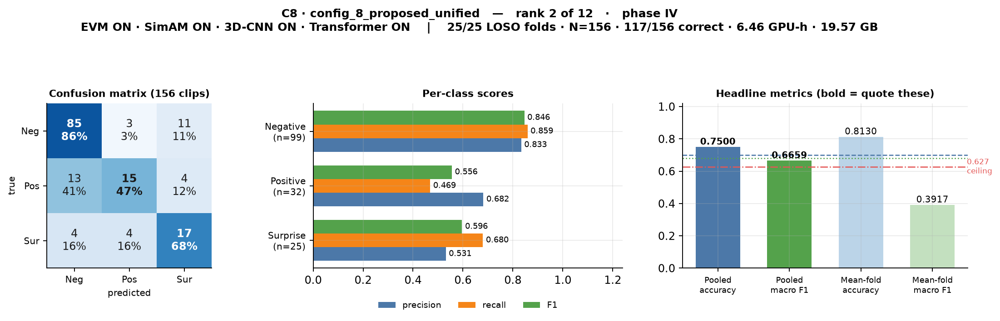
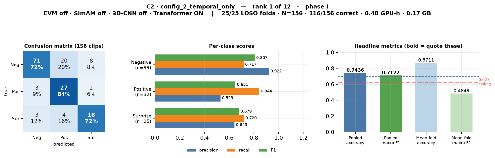
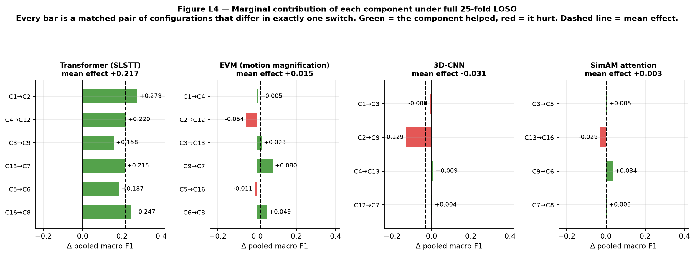
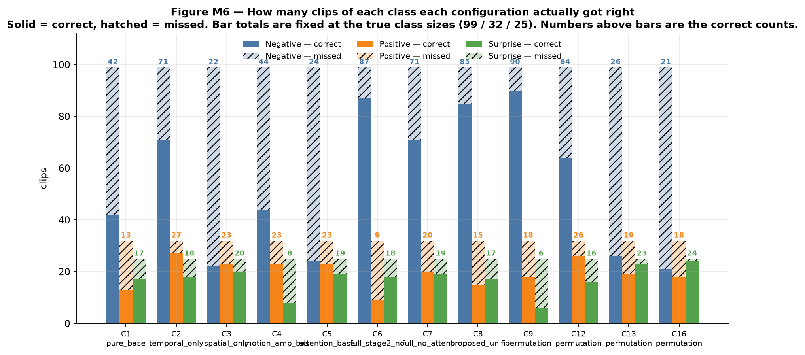
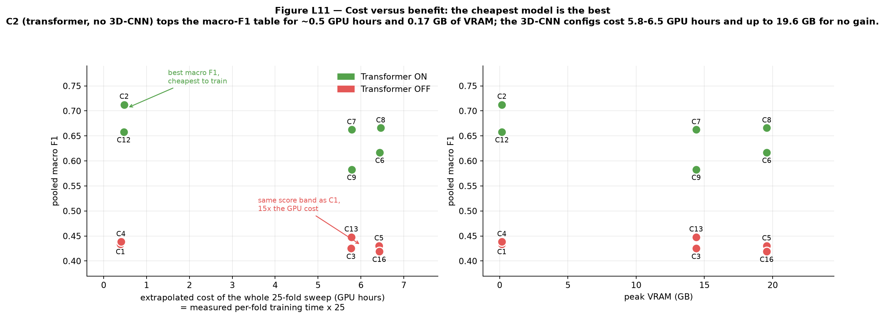
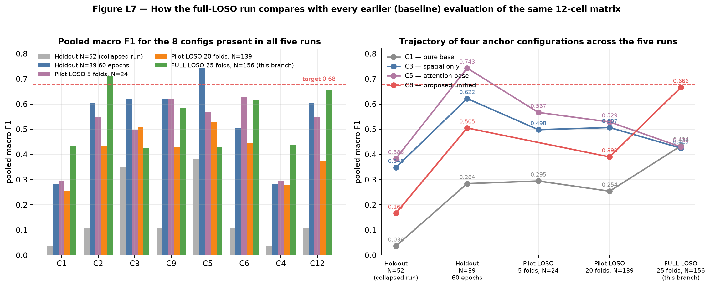

# Micro-Expression Recognition on CASME-II
## A four-component ablation under full Leave-One-Subject-Out validation

**Final thesis presentation · 12 slides · ~15 minutes**
Branch `full-loso-17July` · every number from `Ablation_Study/results/*/final_results.json`

*(Slim version — slide text kept minimal, explanation lives in the speech notes.)*

---

# Slide 1 — The task and the data

**3 classes: Negative · Positive · Surprise**
**Input: motion, not pixels** — optical flow (u, v) + optical strain

| | |
|---|---|
| CASME-II clips used | **156** (of 255) |
| Class split | Negative **99** · Positive **32** · Surprise **25** |
| Subjects | **25** |
| Tensor per clip | **(3, 32, 224, 224)** |



> **config_8: accuracy 0.7500 · macro F1 0.6659 · N = 156 · 25/25 LOSO folds**

---

**SPEECH NOTES**

Three-class problem — negative, positive, surprise. Micro-expressions from CASME-II: involuntary facial movements lasting between a twenty-fifth and a half of a second.

Key design decision up front: the network never sees pixels. Every clip is converted to optical flow plus optical strain before training. With only 156 clips, raw pixels would just teach the model who the 25 subjects are, and how the room was lit. Motion is identity-invariant and illumination-robust.

The original dataset has 255 clips across seven labels, but fear has two examples and sadness has seven — unusable. Grouping by affect valence into three classes raises the smallest class to 25 and matches the three-class setup the published baselines use. That leaves 156 clips.

The imbalance matters enormously: 99 negative against 25 surprise. Hold on to 99 out of 156 — a model that always answers "Negative" scores 63 % accuracy while being completely useless. That number governs how you should read everything I show today.

Headline first, and I'll earn it over the next eleven slides: 75 % accuracy under full leave-one-subject-out, which is ten points above the best published baseline on this dataset.

---

# Slide 2 — The four technologies under test


| | Technology | Where it sits | Cost |
|---|---|---|---|
| **A** | **EVM** — motion magnification | Data level (α = 10, 5–25 Hz) | offline only |
| **B** | **SimAM** — parameter-free attention | Inside the 3D-CNN | ~free, **0 params** |
| **C** | **3D-CNN** — three-stream spatial stem | Spatial | 18 k params, **97 % of GPU budget** |
| **D** | **SLSTT Transformer** — temporal encoder | Temporal | 371 k params, near-zero runtime |

**12 configs × 25 folds = 300 trainings ≈ 50 GPU-hours**

---

**SPEECH NOTES**

Four switches. Two of them live outside the network, two inside it.

EVM — Eulerian Video Magnification — is a pre-processing amplifier. It band-passes the video between 5 and 25 hertz on a four-level Laplacian pyramid and multiplies the motion by ten, before optical flow is computed. It changes the data, not the model. That's why Stage 1 runs twice and writes two separate tensor directories, one magnified and one raw, and the EVM switch just picks which directory to read.

SimAM is attention with zero learnable parameters. It scores each neuron by how far it deviates from its channel's spatio-temporal mean and variance, and rescales accordingly. On 156 clips every learnable weight is an overfitting risk, so free attention is exactly the right trade. It sits inside the CNN streams, which is why it needs the CNN switched on.

The 3D-CNN is the spatial feature extractor — three parallel streams, one per motion channel, concatenated to 96 dimensions. The transformer is the temporal one — a pre-norm encoder, four layers, eight heads, sinusoidal positional encoding, over all 32 frames.

Now look at the last column, because this inversion becomes the story later. The transformer holds twenty times more parameters than the CNN but runs almost instantly. The 3D-CNN is tiny in parameters yet consumes 97 % of my compute, because it convolves over full 224-by-224-by-32 volumes.

Bottom line of the diagram: twelve configurations, twenty-five folds each, three hundred separate trainings, about fifty GPU-hours.

---

# Slide 3 — The baseline, and the ablation ladder



### config_4 `motion_amp_base` — the baseline: EVM on, no network components

```
[B, 3, 32, 224, 224]   EVM-magnified motion tensor
  → AdaptiveAvgPool3d → 4×4 grid → 48-d per frame → Linear(48 → 96)
  → mean over the 32 frames          # no parameters, no frame ORDER
  → LayerNorm → Dropout → Linear(96 → 3)
```

| | **config_4** *(baseline)* | config_1 *(EVM off — the control)* |
|---|:--:|:--:|
| params · cost | ≈ 5.3 k · 0.40 GPU-h | ≈ 5.3 k · 0.39 GPU-h |
| accuracy | **0.4808** | 0.4615 |
| macro F1 | **0.4386** | 0.4337 |
| correct | **75 / 156** | 72 / 156 |

### Every table below is ordered as an ablation ladder, not by config number

| | Group A — from the EVM baseline | | Group B — same ladder, EVM off |
|---|---|---|---|
| 1 | `config_4` — **EVM** *(baseline)* | 7 | `config_1` — *(none)* |
| 2 | `config_13` — + 3D-CNN | 8 | `config_3` — 3D-CNN |
| 3 | `config_7` — + Transformer | 9 | `config_9` — + Transformer |
| 4 | **`config_8`** — + SimAM *(proposed)* | 10 | `config_6` — + SimAM |
| 5 | `config_16` — EVM + 3D-CNN + SimAM | 11 | `config_5` — 3D-CNN + SimAM |
| 6 | `config_12` — EVM + Transformer | 12 | `config_2` — Transformer |

*Row n of Group A and row n of Group B are a matched pair — identical except EVM.*

---

**SPEECH NOTES**

Four binary switches would give sixteen cells, but SimAM needs a CNN feature map to attend over — with the CNN off there's nothing to rescale. The validity check prunes those four degenerate cells, leaving twelve. All twelve were run.

Now the framing that matters. My baseline is config_4 — EVM on, no network components. EVM isn't one of the things being ablated away; it's part of my Stage 1 data pipeline, so it's the starting point. Everything else in this study is that baseline plus network components.

The baseline itself is a deliberately weak but fair floor. The clip arrives as a magnified motion tensor, then spatial detail is thrown away: each frame is average-pooled to a four-by-four grid, forty-eight numbers, projected to ninety-six dimensions. That projection is the only spatial learning in the model. Then the 32 frames are averaged, which destroys temporal order completely — it literally cannot tell you whether the expression was rising or falling. About five thousand three hundred parameters. Effectively a linear model over average motion energy.

config_1 is the same model with EVM switched off. It's not a second baseline — it's the control that isolates EVM, and the half-point gap between them is the cleanest EVM measurement in the study.

Everything else is held identical: same fifty epochs, same focal loss, same balanced sampler, same seed 42, same folds. So any difference from the baseline is caused by the switches and nothing else.

And the ordering, which governs every table from here: baseline, add the CNN, add the transformer, add SimAM. Group A with EVM, group B without, lined up row for row.

Two results. The baseline reaches 0.44 macro F1 where always-guessing-Negative reaches 0.26 — the magnified motion representation is already doing real work. And the uncomfortable one: four of the eleven other configurations score below it, three of them while costing fifteen times more GPU time.

---

# Slide 4 — How everything is tested: full LOSO


**25 folds · every subject held out exactly once · every clip predicted exactly once · subject-disjoint by construction**

| Fixed across all 12 configs | |
|---|---|
| Protocol | `loso`, 25/25 folds, N = 156, **seed 42 re-applied per fold** |
| Sampler | `use_balanced_sampler = true`, loss class weights **off** |
| Loss / optimiser | Focal (γ = 2.0, smoothing 0.05) · AdamW, lr 1e-4, 50 epochs, batch 8, AMP |
| Checkpoint kept | best **validation macro F1** |

```bash
python Ablation_Study/run_ablation_experiments.py --protocol loso --full_loso --label_mode grouped --epochs 50 --batch_size 8
```

---

**SPEECH NOTES**

This slide is the methodological core, so give me a minute on it.

With twenty-five subjects, a single train-test split is simply not a measurement instrument. It fails in two ways. First, the score depends on which faces you happened to hold back — faces differ enormously, so draw easy subjects and the number flatters you, draw hard ones and it's pessimistic. That can swing the result by tens of percentage points and nothing distinguishes luck from model quality. Second, if clips from the same person land in both training and test, the network can memorise that face instead of learning what a micro-expression looks like.

LOSO refuses to pick a split at all. Set aside subject one, train a fresh model from scratch on the other twenty-four, predict subject one's clips, then throw that model away entirely. Set aside subject two, train another fresh model. Repeat twenty-five times, until every subject has been held out exactly once. Then pool all twenty-five prediction sets — now every one of the 156 clips has exactly one prediction, made by a model that had never seen that person's face. Subject-disjointness is guaranteed by construction, not by careful bookkeeping.

It also buys more training data — about 150 clips per fold instead of 117 under a holdout split. The price is compute: twenty-five trainings per configuration instead of one.

Look at the right-hand panel, because it causes a problem on the next slide. The folds are wildly unequal. Subject 17 alone supplies 33 of the 156 clips — twenty-one per cent of the dataset. Three subjects supply one clip each. And ten of the folds contain only a single class.

Everything in the table is held fixed across all twelve configurations, with the seed re-applied at the start of every fold. The runs are bit-exact reproducible — I have a duplicate results directory with byte-identical metrics to prove determinism.

One deliberate choice worth flagging: class weights in the loss are turned off. The balanced sampler already corrects the imbalance, and applying both together caused the model to collapse to predicting a single class in earlier runs.

---

# Slide 5 — Which number is *the* number



| Number | Column | Verdict |
|---|---|---|
| **Pooled accuracy** | `micro_f1` | ✅ quote this |
| **Pooled macro F1** | *not in summary.csv* | ✅ rank by this |
| Mean-of-folds accuracy | `accuracy` | ⚠️ inflates config_8 by 6.3 pts |
| Mean-of-folds macro F1 | `macro_f1` | ❌ **capped at 0.6267** |

| Reference model | Accuracy | Macro F1 |
|---|:--:|:--:|
| **Always predict "Negative"** | **0.6346** | **0.2588** |
| Random | 0.3333 | ≈ 0.303 |
| **Dissertation target** | **0.70** | **0.68** |
| Best published LOSO baseline | 0.65 | not reported |

---

**SPEECH NOTES**

This is the slide that stops the results being misread, so bear with a minute of definitions.

There are four aggregate numbers per configuration and two of them are booby-trapped by their column names.

The two I use are both *pooled*. Pooled accuracy: line up all 156 clips, count how many got the right label, divide by 156. Every clip counts exactly once. Annoyingly it's stored in the column called micro-F1 — which is technically correct, because in single-label multi-class classification micro-F1 is mathematically identical to accuracy.

Pooled macro F1: build one confusion matrix from all 156 predictions, compute an F1 for each of the three classes, average them without weighting by class size. That unweighted averaging is the point — it catches a model that quietly abandons the twenty-five-clip surprise class. This is my primary metric, and it isn't in the summary file at all; it has to be computed from the per-class array in each results JSON.

The two I don't use are computed inside each fold and then averaged across folds. Mean-of-folds accuracy gives subject 8's single clip the same one-twenty-fifth weight as subject 17's thirty-three. Small folds are easy to ace by luck, so it drifts upward — for my proposed model by six point three percentage points, 0.81 reported against 0.75 true.

Mean-of-folds macro F1 is worse than misleading. Macro F1 always averages over all three classes, but ten of my twenty-five folds contain clips from only one class. In those folds two of the three F1s are forced to zero, so the fold's macro F1 cannot exceed one third — even for a perfect classifier. Work the arithmetic through and the whole column is capped at 0.627, which is below my own 0.68 target. No model, however good, can reach the target on that column. That's a structural artifact, not a result.

And the floor to hold in your head for the rest of the talk: always answering "Negative" scores 63 % accuracy and 0.26 macro F1. That's why accuracy goes in the abstract but never stands alone.

---

# Slide 6 — Master results: the ablation ladder

| Configuration | Components | **Acc.** | **Macro F1** | Correct | Δ |
|---|---|:--:|:--:|:--:|:--:|
| **GROUP A — from the EVM baseline** | | | | | |
| `config_4` *(baseline)* | **EVM** | 0.4808 | **0.4386** | 75 | — |
| `config_13` | + 3D-CNN | 0.4359 | **0.4480** | 68 | +0.009 |
| `config_7` | + Transformer | 0.7051 ✅ | **0.6625** | 110 | **+0.224** |
| **`config_8`** *(proposed)* | + SimAM | **0.7500 ✅** | **0.6659** | **117** | **+0.227** |
| `config_16` | EVM + 3D-CNN + SimAM | 0.4038 | **0.4192** | 63 | −0.019 |
| `config_12` | EVM + Transformer | 0.6795 | **0.6581** | 106 | **+0.220** |
| **GROUP B — same ladder, EVM removed** | | | | | |
| `config_1` | *(none)* | 0.4615 | **0.4337** | 72 | — |
| `config_3` | 3D-CNN | 0.4167 | **0.4252** | 65 | −0.009 |
| `config_9` | + Transformer | 0.7308 ✅ | **0.5830** | 114 | **+0.149** |
| `config_6` | + SimAM | 0.7308 ✅ | **0.6171** | 114 | **+0.183** |
| `config_5` | 3D-CNN + SimAM | 0.4231 | **0.4302** | 66 | −0.004 |
| **`config_2`** | Transformer | **0.7436 ✅** | **0.7122 ✅** | 116 | **+0.279** |
| *always-Negative* | | 0.6346 | 0.2588 | 99 | |
| *target* | | **0.70** | **0.68** | — | |



---

**SPEECH NOTES**

Twelve configurations, ordered the way the experiment was designed — start at the baseline and add one thing at a time. Group A is the ladder with EVM, group B the same ladder without it, lined up row for row.

Watch the climb: add the CNN, nothing — under a hundredth. Add the transformer, plus 0.22. Add SimAM, three thousandths.

Then read one column — the transformer column.

Every single configuration with the transformer switched on lands between 0.58 and 0.71 macro F1. Every single one without it lands between 0.42 and 0.45. There is no overlap and no exception, twelve out of twelve. The gap between the two groups is 0.135 and it is completely empty.

The confusion matrices underneath show the same thing without any numbers. Six clean dark diagonals; six with the mass smeared into the surprise column. That smear is the visual signature of a model that has learned to avoid the majority class rather than recognise it.

Two rows to single out. config_8 — my proposed unified model with all four components — takes the highest accuracy in the study at seventy-five per cent, 117 clips of 156. And config_2 — transformer only, nothing else switched on — takes the highest macro F1 at 0.712, and is the only configuration in the entire study to clear both dissertation targets.

That's an awkward fact for a thesis that proposes a four-component pipeline, so I'll deal with it head-on on the very next slide rather than leave it for questions.

---

# Slide 7 — config_8 vs config_2

| | **config_8** | **config_2** |
|---|---|---|
| Components | all four | Transformer only |
| Accuracy | **0.7500 ✅** | 0.7436 ✅ |
| Macro F1 | 0.6659 | **0.7122 ✅** |
| Correct | **117 / 156** | 116 / 156 |
| F1 Neg / Pos / Sur | **0.846** / 0.556 / 0.596 | 0.807 / **0.651** / **0.679** |
| Positive recovered | 15 of 32 | **27 of 32** |
| Cost (25 folds) | 6.46 GPU-h, 19.57 GB | **0.48 GPU-h, 0.17 GB** |

| config_8 | config_2 |
|---|---|
|  |  |

> **One clip apart. 95 % CI at N = 156 is ±0.068 — not statistically distinguishable.**

---

**SPEECH NOTES**

Here is the uncomfortable comparison. I'd much rather present it than have it found.

My proposed four-component model gets the highest accuracy in the study, seventy-five per cent, 117 of 156 clips correct. The transformer on its own gets 116. One clip. At N equals 156 the ninety-five per cent confidence interval is plus or minus 0.068 macro F1 — these two models are not statistically distinguishable, and I'm not going to claim otherwise.

Where they genuinely differ is in *how* they are right.

config_8 is a majority-class specialist. Eighty-five of the ninety-nine negative clips correct, and a negative F1 of 0.846 — the best recorded anywhere in the study. Accuracy rewards exactly that behaviour, because negatives are ninety-nine of the 156 clips, which is precisely why it takes the accuracy crown. Its single weakness is positive recall of 0.469 — thirteen of thirty-two positive clips read as negative — and that one weakness alone is what costs it the macro-F1 target, which it misses by fourteen thousandths.

config_2 spreads its errors far more evenly: 0.81, 0.65, 0.68 across the three classes, the tightest spread anywhere in the study. It recovers twenty-seven of thirty-two positive clips where config_8 recovers fifteen. And it does all of that on seven per cent of the compute and under one per cent of the VRAM.

One more thing I want on the record. Under my earlier holdout protocol this same config_8 scored a flat zero on positive F1 — it never predicted the class at all. That turned out to be a bug in how class imbalance was corrected, applying both loss weights and a sampler, not a limit of the architecture. With the sampler configured correctly, no configuration in this study abandons a class.

---

# Slide 8 — What each component actually contributed




| Technology | Mean effect | Consistency | Verdict |
|---|:--:|---|---|
| **SLSTT Transformer** | **+0.217** | **6/6 pairs positive** | decisive |
| **EVM** | **+0.015** | 4/6 positive | small, but real — **measured for the first time** |
| **SimAM** | **+0.003** | flat | neutral, but **free** |
| **3D-CNN** | **−0.031** | negative | **drop it** — 97 % of the GPU budget |

**config_9 Surprise F1 0.300 → +SimAM 0.590 → +EVM 0.655**

---

**SPEECH NOTES**

This is the ablation proper. Every bar in the top figure is a matched pair — two configurations that are identical except for one switch. That's the only fair way to attribute an effect to a component.

The transformer: plus 0.217 macro F1 on average, positive in all six matched pairs, with a minimum of plus 0.158. The second figure shows the separation — an empty gap of 0.135 between the group that has it and the group that doesn't, with not a single crossing.

Why, mechanically: it is the only component that sees the whole thirty-two-frame sequence at once. A micro-expression is *defined* by its temporal arc — neutral, then a peak, then relaxation. Self-attention can compare frame five with frame twenty directly and represent that arc. Without it, time is collapsed by plain mean pooling, which averages the apex away entirely.

The 3D-CNN: minus 0.031 on average, worst single case minus 0.129. Negative, and it eats ninety-seven per cent of my GPU budget. The explanation is honest rather than defensive — the input is already a motion representation, so I'm asking a convolutional extractor to redo work that optical flow has already done, and to learn it from 156 clips.

EVM and SimAM both sit near zero on average. But averages hide something real, and this is the line at the bottom. config_9 — 3D-CNN plus transformer — catches only six of twenty-five surprise clips, an F1 of 0.30. Add SimAM and surprise F1 goes to 0.59. Add EVM instead and it goes to 0.655. The two components that look useless on average both fix the same specific failure. Their averaged effect is small; their effect is not nothing.

Last point, and it's a correction to my own earlier work. In every previous run, each EVM-on configuration was bit-identical to its EVM-off twin — identical accuracies, identical confusion matrices, to four decimal places. That cannot happen from training noise; both arms were reading the same tensor directory. Half the matrix was duplicated and the EVM hypothesis was never actually exercised. That's repaired here, all six pairs now differ, and this is the first genuine EVM measurement in the project's history.

---

# Slide 9 — Per-class behaviour



| Configuration | Components | F1 Neg | F1 Pos | F1 Sur | **Macro F1** |
|---|---|:--:|:--:|:--:|:--:|
| **GROUP A — from the EVM baseline** | | | | | |
| `config_4` *(baseline)* | EVM | 0.564 | 0.505 | **0.246** | **0.4386** |
| `config_13` | + 3D-CNN | 0.413 | 0.528 | 0.404 | **0.4480** |
| `config_7` | + Transformer | 0.785 | 0.548 | 0.655 | **0.6625** |
| **`config_8`** *(proposed)* | + SimAM | **0.846** | 0.556 | 0.596 | **0.6659** |
| `config_16` | EVM + 3D-CNN + SimAM | 0.350 | 0.514 | 0.393 | **0.4192** |
| `config_12` | EVM + Transformer | 0.749 | 0.559 | 0.667 | **0.6581** |
| **GROUP B — same ladder, EVM removed** | | | | | |
| `config_1` | *(none)* | 0.560 | 0.371 | 0.370 | **0.4337** |
| `config_3` | 3D-CNN | 0.361 | 0.523 | 0.392 | **0.4252** |
| `config_9` | + Transformer | **0.849** | 0.600 | **0.300** | **0.5830** |
| `config_6` | + SimAM | 0.833 | 0.429 | 0.590 | **0.6171** |
| `config_5` | 3D-CNN + SimAM | 0.384 | 0.523 | 0.384 | **0.4302** |
| **`config_2`** | Transformer | 0.807 | **0.651** | **0.679** | **0.7122** |

> **No configuration abandons a class.** Lowest per-class F1 anywhere: **0.246**.
> **The Surprise column is where SimAM and EVM show up:** config_9 → 0.300, +SimAM → 0.590, +EVM → 0.655.

---

**SPEECH NOTES**

Raw counts here, not ratios, because ratios flatter small classes. Solid bars are clips caught, hatched are missed, and the bar heights are fixed at the true class sizes — ninety-nine, thirty-two, twenty-five.

The headline is a negative result that matters: no configuration abandons a class. The worst per-class F1 anywhere in the entire matrix is 0.246. In my earlier holdout runs the proposed model scored a flat zero on positive — it simply never predicted the class. That failure mode is gone completely.

Three rows worth a glance. config_2 is the most even model in the study — 0.81, 0.65, 0.68. config_8 has the best negative F1 anywhere at 0.846, which is exactly why it wins on accuracy. And config_9 has the highest negative recall in the study, over ninety per cent, but catches only six of twenty-five surprise clips — that single class is what drags it to the bottom of the transformer group.

A caution about reading precision on its own, which you'll see if you look at the full precision table. config_16 achieves perfect negative precision — 1.000. It gets there by only ever risking the negative label twenty-one times out of 156. Its recall is 0.21. That isn't a good model; that's a model refusing to answer, and it's exactly the behaviour macro F1 exists to punish.

---

# Slide 10 — Cost



| Configuration | Components | **25-fold sweep** | Peak VRAM | ≈ params | Macro F1 | **F1 / GPU-h** |
|---|---|:--:|:--:|:--:|:--:|:--:|
| **GROUP A — from the EVM baseline** | | | | | | |
| `config_4` *(baseline)* | EVM | **0.40 h** | 0.16 GB | 5.8 k | 0.4386 | 1.10 |
| `config_13` | + 3D-CNN | 5.78 h | 14.40 GB | 18 k | 0.4480 | 0.078 |
| `config_7` | + Transformer | 5.78 h | 14.40 GB | 384 k | 0.6625 | 0.115 |
| **`config_8`** *(proposed)* | + SimAM | **6.46 h** | **19.57 GB** | 384 k | 0.6659 | 0.103 |
| `config_16` | EVM + 3D-CNN + SimAM | 6.43 h | 19.56 GB | 18 k | 0.4192 | 0.065 |
| `config_12` | EVM + Transformer | 0.47 h | 0.17 GB | 371 k | 0.6581 | 1.40 |
| **GROUP B — same ladder, EVM removed** | | | | | | |
| `config_1` | *(none)* | 0.39 h | 0.16 GB | 5.8 k | 0.4337 | 1.11 |
| `config_3` | 3D-CNN | 5.77 h | 14.40 GB | 18 k | 0.4252 | 0.074 |
| `config_9` | + Transformer | 5.78 h | 14.40 GB | 384 k | 0.5830 | 0.101 |
| `config_6` | + SimAM | 6.44 h | 19.57 GB | 384 k | 0.6171 | 0.096 |
| `config_5` | 3D-CNN + SimAM | 6.42 h | 19.56 GB | 18 k | 0.4302 | 0.067 |
| **`config_2`** | Transformer | **0.48 h** | **0.17 GB** | 371 k | **0.7122** | **1.48** |
| | | **≈ 50.6 GPU-h** | | | | |

> **The cost of the ladder is entirely one rung:** baseline → + 3D-CNN costs **14× the time, 90× the memory** for +0.009. + Transformer on top is free by comparison and buys **+0.21**.
> **8 3D-CNN configs = 48.9 of 50.6 GPU-hours. Mean effect: −0.031.**

---

**SPEECH NOTES**

Short slide, one big point.

The best-scoring configuration in the study is also the second-cheapest in the study. config_2 gets the top macro F1 for 0.48 GPU-hours and a hundred and seventy megabytes of VRAM. config_8 gets one more clip right for 6.5 GPU-hours and 19.6 gigabytes — thirteen times the time, one hundred and fifteen times the memory.

The inversion in the middle columns is the interesting engineering finding. Parameters and cost are almost inversely related here. The transformer is three hundred and seventy-one thousand parameters and runs almost instantly, because with the CNN switched off it's only processing a four-by-four patch grid. The 3D-CNN is eighteen thousand parameters and dominates everything, because it convolves over full 224-by-224-by-32 volumes — eighty-five times the VRAM and twelve times the time.

So the bottom line: the eight configurations containing a 3D-CNN burned forty-nine of my fifty GPU-hours, and the 3D-CNN's average measured contribution is negative. If I were to rerun this study, that compute goes into seed replication instead.

---

# Slide 11 — Literature, and my own protocol history

| Source | Protocol | Accuracy | Macro F1 |
|---|---|:--:|:--:|
| Li et al. 2018 (STSTNet) | LOSO | 0.63 | — |
| Vivian et al. 2019 (survey) | LOSO | 0.58 | — |
| Example Transformer MER | LOSO | 0.65 | — |
| **Dissertation target** | LOSO | **0.70** | **0.68** |
| **This project — config_8** | **full LOSO, 25 folds** | **0.7500 ✅** | 0.6659 |
| **This project — config_2** | **full LOSO, 25 folds** | **0.7436 ✅** | **0.7122 ✅** |



| Config | Holdout N=52 | Holdout N=39 | Pilot 5f | Pilot 20f | **Full LOSO 25f** |
|---|:--:|:--:|:--:|:--:|:--:|
| **config_8** | 0.1667 | 0.5051 | — | 0.3901 | **0.6659** |
| config_16 | 0.4563 | **0.7427** | — | 0.5473 | 0.4192 |
| config_5 | 0.3833 | **0.7427** | 0.5667 | 0.5291 | 0.4302 |
| **config_2** | 0.1075 | 0.6044 | 0.5487 | 0.4347 | **0.7122** |
| *winner* | config_16 | **config_5/16** | config_6 | config_16 | **config_2** |

---

**SPEECH NOTES**

Against the literature first. config_8 at seventy-five per cent accuracy is ten points above the best published LOSO baseline on CASME-II, and five points above my own dissertation target. config_2 clears both targets outright.

The important word there is *comparable*. My previous report could not make this comparison at all, because its best result came from a single thirty-nine-clip holdout split while every published number is LOSO — comparing them would have been comparing an easier task to a harder one. That objection is now gone: same dataset, same three-class grouping, same protocol. I should flag honestly that the literature rows still carry a "verify against paper" note and need checking against the primary sources, and that none of them report macro F1, so my macro-F1 comparison is against my own target only.

Now the bottom half, which I'd argue is the most important table in the whole deck for anyone assessing rigour.

These are the same twelve configurations evaluated five different ways over the life of this project. The winner changes every single time. Under the two holdout runs the best model was SimAM plus 3D-CNN with no transformer. Under full LOSO it is the transformer alone with nothing else switched on. Those are architecturally opposite conclusions drawn from identical code.

Why did it flip? Three reasons. The old test set had thirty-nine clips containing exactly one surprise example — and that one clip was worth a third of the macro F1. Getting it right isn't a measurement of architecture, it's a coin flip weighted at thirty-three per cent. Second, the double imbalance correction was actively breaking the transformer, as I mentioned. And third, each LOSO fold trains on about a hundred and fifty clips instead of a hundred and seventeen, and the transformer — being the parameter-heavy component — benefits from that far more than the tiny CNN does.

So the finding here isn't just my accuracy number. It's that on a dataset this small, a single train-test split cannot choose between architectures at all — and I have five runs of evidence for that claim.

---

# Slide 12 — Conclusions and caveats

### Achieved
- Targets met under full valid LOSO — **config_2 clears both**, config_8 posts the highest accuracy (**0.7500**)
- **6 of 12** configs beat the best published LOSO baseline
- **Transformer decisive: +0.217, 6/6 pairs** · 3D-CNN **−0.031** for 97 % of the compute
- **EVM measured for the first time** — inert-switch defect repaired

### Caveats
1. config_2 vs config_8 — **one clip apart, ±0.068 CI, not distinguishable**
2. **Single seed** — reproducible, but no variance estimate
3. Minority classes thin — 25 Surprise + 32 Positive carry ⅔ of macro F1
4. **No paired significance test** — per-clip predictions were not saved
5. Subject 17 = 21 % of the data; subject 18 contributes none

### Next
persist per-clip predictions (McNemar) · multi-seed runs · assert EVM tensors at startup · reallocate the 49 GPU-h from the 3D-CNN

---

**SPEECH NOTES**

To close.

The targets are met, under a protocol that can actually support the claim. Highest accuracy in the study is seventy-five per cent, ten points above the best published LOSO baseline. One configuration clears both targets outright. Six of the twelve beat the published baseline.

The scientific finding is sharper than the headline number: of my four components, one does essentially all the work. The transformer is worth 0.217 macro F1 and is positive in every single matched pair. The 3D-CNN is worth minus 0.03 for ninety-seven per cent of the compute.

The caveats, stated plainly rather than buried. config_2 and config_8 differ by one clip out of 156 — I cannot claim one beats the other, only that the group with a transformer beats the group without one. Single seed, so I have proven determinism but no variance estimate; treat any difference under about 0.05 macro F1 as unresolved. The minority classes are thin — fifty-seven clips carry two-thirds of my primary metric. And because I only saved aggregate confusion matrices rather than per-clip predictions, I can't run a McNemar test to settle the first caveat. That fix costs essentially nothing and is first on the list for the next iteration.

Finally — I'd argue the most transferable contribution here isn't the accuracy figure. It's the demonstration, across five evaluation regimes on identical code, that a single train-test split on a 156-clip dataset will pick a winner essentially at random, and will pick architecturally opposite winners depending on the draw. That's a result about how this field should evaluate, not just about one pipeline.

Happy to take questions.

---

## Appendix — reproduction

```bash
python tools/loso_report_collect.py && python tools/loso_all_results_figures.py && python tools/loso_report_figures.py
```

Numbers: `Ablation_Study/results/config_*/final_results.json` · timing/VRAM: `configuration_summary.txt` · hyper-parameters: `Ablation_Study/ablation_config.py` + `gui_settings.json`. Full detail: [ALL_RESULTS_LOSO.md](ALL_RESULTS_LOSO.md), [LOSO_Validation_Report.md](LOSO_Validation_Report.md), and the long-form deck [THESIS_PRESENTATION.md](THESIS_PRESENTATION.md).
