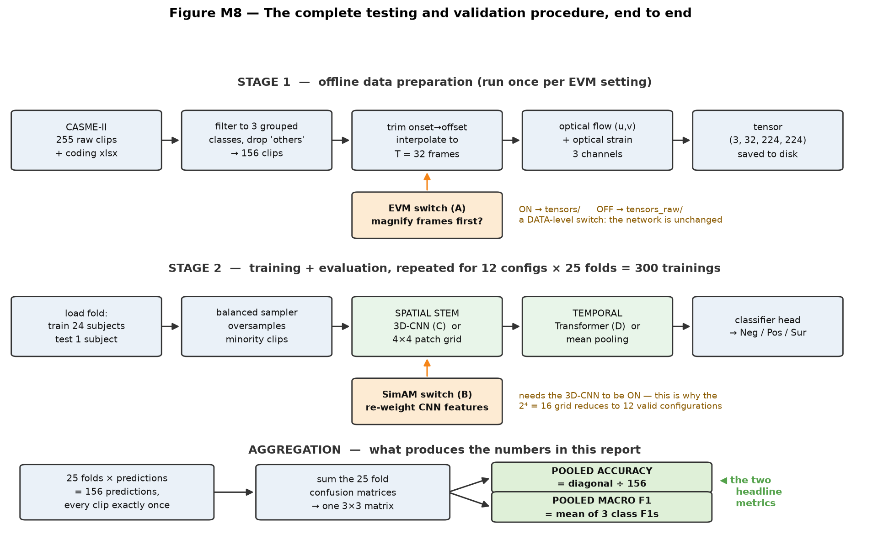
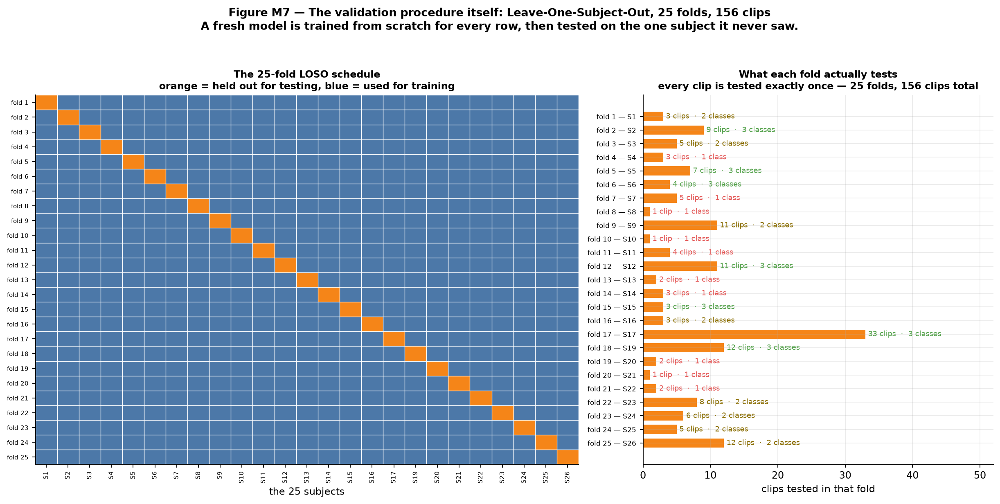
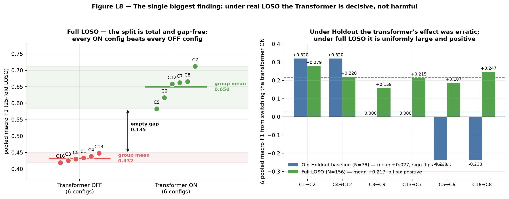

# Micro-Expression Recognition on CASME-II
## A four-component ablation under full Leave-One-Subject-Out validation

**Final thesis presentation · 12 slides · ~15 minutes**
Branch `full-loso-17July` · every number from `Ablation_Study/results/*/final_results.json`

*(Text version — slides carry the explanation, only 4 figures used. Speech notes are short and plain.)*

---

# Slide 1 — The problem and the data

**A micro-expression is a facial movement that lasts between 1/25 and 1/2 of a second.** It is involuntary — too fast to fake and too fast to suppress. The task: show the model a short clip of a face, and it answers **Negative**, **Positive**, or **Surprise**.

**The model never sees the video.** Every clip is converted into *motion* first — optical flow (which direction each pixel moved) and optical strain (how much the skin stretched). Raw pixels mostly encode *who the person is* and *how the room is lit*, and both are irrelevant. Motion does not care about identity or lighting. With only 156 examples, that is the difference between learning expressions and learning faces.

| The dataset | |
|---|---|
| CASME-II full label table | 255 clips |
| Kept: 3 affect classes, dropped 99 ambiguous "others" | **156 clips** |
| Class sizes | Negative **99** · Positive **32** · Surprise **25** |
| Subjects | **25** |
| Each clip becomes | **(3, 32, 224, 224)** — 3 motion channels × 32 frames × 224 × 224 pixels |

**Why 3 classes and not 7?** The original labels are unusably sparse — `fear` has 2 clips in the whole dataset, `sadness` has 7. Grouping by emotional valence raises the smallest class from 2 to 25, and matches the 3-class setup published baselines use.

**The result, up front:** the proposed model reaches **75.0 % accuracy** and **0.666 macro F1** over all 156 clips.

---

**SPEECH NOTES**

A micro-expression is a flicker of emotion on someone's face that lasts a fraction of a second. People can't control them, which is why they're interesting.

My model has to sort clips into three buckets: negative, positive, surprise.

The one thing to remember from this slide: the model never looks at the actual video. I convert everything to motion first — where things moved and how the skin stretched. Why? Because with only 156 clips, if I gave it real pixels it would just memorise the 25 faces instead of learning expressions.

Also note the imbalance: 99 negative clips versus 25 surprise. That comes back to bite us.

---

# Slide 2 — The four technologies I am testing



My thesis proposes stacking four techniques. The whole study is about finding out which ones actually earn their place.

| | Technology | In plain words | Where it sits |
|---|---|---|---|
| **A** | **EVM** (Eulerian Video Magnification) | An **amplifier for tiny motion**. Boosts faint frame-to-frame changes ×10 before anything else happens. | *Outside* the network — it changes the data |
| **B** | **SimAM** | A **spotlight**. Works out which parts of the face are statistically unusual and turns up their importance. Costs **zero learnable parameters**. | Inside the 3D-CNN |
| **C** | **3D-CNN** | A **shape detector**. Looks at small patches of space *and* time together. | Spatial part of the network |
| **D** | **SLSTT Transformer** | A **storyteller**. Sees all 32 frames at once and models how the expression develops over time. | Temporal part of the network |

**Because EVM sits outside the network, Stage 1 runs twice** — once producing magnified motion tensors, once producing raw ones. The EVM switch simply chooses which folder to read from.

**The odd fact that shapes the whole study:** the Transformer holds **371 000 parameters but runs almost instantly**. The 3D-CNN holds only **18 000 parameters but eats 97 % of the compute**, because it slides filters over full 224 × 224 × 32 video volumes.

**Scale of the experiment: 12 configurations × 25 folds = 300 separate trainings ≈ 50 GPU-hours.**

---

**SPEECH NOTES**

Four techniques, four on/off switches. That's the whole experiment.

EVM is a magnifying glass for movement — it makes tiny facial twitches ten times bigger before I measure anything. It happens before training, so it changes the data, not the model.

SimAM is a spotlight that highlights unusual parts of the face, and it's free — it adds no weights to learn. With 156 clips, free is exactly what I want.

The 3D-CNN looks at shapes. The transformer looks at the story over time.

Odd detail worth remembering: the transformer is huge in size but cheap to run. The CNN is tiny but ate almost all my GPU time.

---

# Slide 3 — The 12 configurations, and the baseline with nothing switched on

Four on/off switches would give 2⁴ = **16** combinations. But SimAM works by re-weighting the 3D-CNN's output — with the CNN off there is nothing for it to re-weight. Those 4 combinations are meaningless, so the code prunes them (`AblationConfig.is_valid()`), leaving **12 valid configurations**. All 12 were run.

### config_1 `pure_base` — the control condition, all four switches OFF

This is the configuration with **none** of my four technologies. It is not an empty model — it is the deliberately weakest sensible model, and it exists so that everything else has something fair to be measured against.

```
[B, 3, 32, 224, 224]  motion tensor (non-magnified)
  → each frame averaged down to a 4×4 grid  = 48 numbers per frame
  → Linear(48 → 96)          # the only spatial learning in the whole model
  → average across the 32 frames            # destroys all sense of frame ORDER
  → LayerNorm → Dropout → Linear(96 → 3)
```

In other words: **squash each frame to a blurry 4×4 thumbnail, average all 32 frames into one, and run a linear classifier.** It cannot tell whether the expression was rising or falling, because averaging throws the order away.

| config_1 | |
|---|---|
| Learnable parameters | **≈ 5 300** (vs 384 000 for the full model) |
| Cost, all 25 folds | **0.39 GPU-h** — the cheapest cell in the study |
| Pooled accuracy | **0.4615** |
| Pooled macro F1 | **0.4337** |
| Correct | **72 / 156** |

**Everything else about it is identical** to the other 11 configurations — same 50 epochs, same loss, same balanced sampler, same seed 42, same folds. So any difference between config_1 and any other configuration is caused by the switches and nothing else. That is the entire reason it exists.

**Two things it proves:**
1. It scores **0.4337** macro F1 where a model that always guesses "Negative" scores **0.2588** → the motion representation alone already carries real signal, before any architecture is added.
2. It is the floor — and **5 of the other 11 configurations fail to clear it**, three of them while costing 15× more to train.

---

**SPEECH NOTES**

Sixteen combinations on paper, but four of them are nonsense — SimAM needs the CNN to exist. So: twelve configurations, all twelve run.

Now the one I want you to really understand: config_1, everything switched off.

It's not nothing. It shrinks each frame to a blurry four-by-four thumbnail, averages all 32 frames together, and runs a simple linear classifier. About five thousand numbers to learn, versus nearly four hundred thousand for the full model. Because it averages the frames, it literally cannot tell whether a smile was starting or ending.

Why does it matter? Everything else is trained identically. So if a fancy configuration beats config_1, that improvement came from the switches and nothing else.

And here's the punchline: five of my eleven fancier configurations don't beat it. Three of those cost fifteen times more to train.

---

# Slide 4 — How everything is tested



**The obvious approach — hold back some clips, train on the rest, score on what was held back — fails here.** With only 25 people it fails in two ways:

1. **The answer depends on who you happened to hold back.** Faces differ enormously. Draw easy subjects and the score flatters you; draw hard ones and it is pessimistic. Nothing distinguishes luck from model quality.
2. **The model can cheat.** If clips from the same person appear in both training and testing, the network can memorise that face instead of learning the expression.

**Leave-One-Subject-Out (LOSO) fixes both by refusing to pick a split at all:**

1. Set aside **subject 1**. Train a brand-new model on the other 24. Predict subject 1's clips. **Throw that model away.**
2. Set aside **subject 2**. Train another brand-new model. Repeat.
3. **25 times** — every subject held out exactly once.
4. Pool all 25 sets of predictions. Every one of the 156 clips now has exactly one prediction, made by a model that had never seen that person's face.

**What it buys:** every clip is tested, so there is no lucky split to argue about · subject-disjointness is guaranteed by construction · each fold trains on ~150 clips instead of ~117.
**What it costs:** 25 trainings per configuration instead of 1.

**Note from the figure: the folds are very unequal.** Subject 17 alone supplies 33 of the 156 clips (21 %). Three subjects supply one clip each. And **10 of the 25 folds contain only one class** — that causes a problem on the next slide.

| Held fixed across all 12 configurations | |
|---|---|
| Protocol | `loso`, **25/25 folds**, N = 156, **seed 42 re-applied at the start of every fold** |
| Imbalance handling | balanced sampler **on**, loss class weights **off** (both together caused single-class collapse) |
| Loss / optimiser | Focal Loss (γ = 2.0, smoothing 0.05) · AdamW, lr 1e-4, **50 epochs**, batch 8, AMP |
| Checkpoint kept | the epoch with the best **validation macro F1** |

---

**SPEECH NOTES**

Normally you'd hold back a chunk of data and test on it. With only 25 people that doesn't work — your score depends on which faces you happened to hold back, and it can swing wildly.

So instead I do this: hold out one person, train a fresh model on the other 24, test on that one person, then delete the model. Then do it again for the next person. Twenty-five times.

At the end, every single clip has been predicted by a model that never saw that person's face. No lucky split, no cheating. The cost is that I train twenty-five models instead of one.

One thing to notice in the picture — the folds are lopsided. Subject 17 alone has 33 clips. Ten folds contain only one emotion class. That causes a measurement problem, which is the next slide.

---

# Slide 5 — Which number is *the* number

There are **four** aggregate numbers per configuration and **two of them are recorded under misleading names**. This is the slide that stops the results being misread.

### The two I use — both "pooled"

- **Pooled accuracy** — line up all 156 clips, count how many got the right label, divide by 156. Every clip counts exactly once. *(Stored in the column called `micro_f1` — confusing, but micro-F1 and accuracy are mathematically identical here.)*
- **Pooled macro F1** — build **one** confusion matrix from all 156 predictions, compute an F1 for each of the 3 classes, then average the three **without weighting by class size**. That last part is the point: it catches a model that quietly abandons the 25-clip Surprise class. *(Not stored anywhere — it has to be computed from the results files.)*

*F1 itself = the harmonic mean of precision ("when it said Surprise, was it right?") and recall ("of the real Surprise clips, how many did it catch?"). It is only high when both are high, so it cannot be gamed.*

### The two I refuse to use — both "mean-of-folds"

- **Mean-of-folds accuracy** — averages the 25 fold accuracies. Subject 8's single clip gets the same 1/25 weight as subject 17's thirty-three. Small folds are easy to ace by luck, so it drifts upward — **inflating config_8 by 6.3 points** (0.8130 reported vs 0.7500 true).
- **Mean-of-folds macro F1** — **mathematically capped at 0.6267**, which is *below* my 0.68 target. Macro F1 always averages over all 3 classes, but 10 folds contain only 1 class, so 2 of the 3 F1s are forced to zero in those folds — **even for a perfect classifier**:

$$\text{ceiling} = \frac{10 \times \tfrac{1}{3} + 8 \times \tfrac{2}{3} + 7 \times 1}{25} = \mathbf{0.6267}$$

### The floors every result must beat

| Reference model | Accuracy | Macro F1 |
|---|:--:|:--:|
| **Always predict "Negative"** (the majority class) | **0.6346** | **0.2588** |
| Predict at random | 0.3333 | ≈ 0.303 |
| **My dissertation target** | **0.70** | **0.68** |
| Best published LOSO baseline on CASME-II | 0.65 | not reported |

> **Accuracy goes in the abstract because anyone understands it — but it must never stand alone.** A model that ignores the video and always says "Negative" gets **63 % accuracy** while being useless. Macro F1 scores that same trick at **0.26**. Report both, always pooled, always with N = 156 stated.

---

**SPEECH NOTES**

One minute of definitions, and then we're into results.

Accuracy is easy: out of 156 clips, how many did it get right.

Macro F1 is the one that actually decides which model is better. It scores each of the three emotions separately and then averages them equally — so a model that ignores the rare "surprise" class gets punished, even if its overall accuracy looks fine.

Here's why that matters. If I just always guessed "Negative", I'd get 63 % accuracy — because 99 of 156 clips are negative. Sounds decent. But macro F1 gives that trick 0.26. That's the difference between the two numbers.

The last thing: two of the four numbers in my results files are computed per-fold and then averaged, and both are broken. One of them is mathematically incapable of reaching my target, even for a perfect model. I don't use those.

---

# Slide 6 — All 12 results

25/25 folds · N = 156 · 50 epochs · seed 42. Sorted by config number, not by score.

| Config | EVM | SimAM | 3D-CNN | Transf. | **Accuracy** | **Macro F1** | Correct |
|---|:--:|:--:|:--:|:--:|:--:|:--:|:--:|
| config_1 `pure_base` | – | – | – | – | 0.4615 | **0.4337** | 72 |
| **config_2** `temporal_only` | – | – | – | ✓ | **0.7436 ✅** | **0.7122 ✅** | 116 |
| config_3 `spatial_only` | – | – | ✓ | – | 0.4167 | **0.4252** | 65 |
| config_4 `motion_amp_base` | ✓ | – | – | – | 0.4808 | **0.4386** | 75 |
| config_5 `attention_base` | – | ✓ | ✓ | – | 0.4231 | **0.4302** | 66 |
| config_6 `full_stage2_noevm` | – | ✓ | ✓ | ✓ | 0.7308 ✅ | **0.6171** | 114 |
| config_7 `full_no_attention` | ✓ | – | ✓ | ✓ | 0.7051 ✅ | **0.6625** | 110 |
| **config_8** `proposed_unified` | ✓ | ✓ | ✓ | ✓ | **0.7500 ✅** | **0.6659** | **117** |
| config_9 `permutation` | – | – | ✓ | ✓ | 0.7308 ✅ | **0.5830** | 114 |
| config_12 `permutation` | ✓ | – | – | ✓ | 0.6795 | **0.6581** | 106 |
| config_13 `permutation` | ✓ | – | ✓ | – | 0.4359 | **0.4480** | 68 |
| config_16 `permutation` | ✓ | ✓ | ✓ | – | 0.4038 | **0.4192** | 63 |
| *always-Negative reference* | | | | | 0.6346 | 0.2588 | 99 |
| *dissertation target* | | | | | **0.70** | **0.68** | — |

**Do not read this table top to bottom. Read the Transformer column.**

- **Every** configuration with the Transformer scores **0.583 – 0.712** macro F1.
- **Every** configuration without it scores **0.419 – 0.448**.
- The two groups **do not overlap**. The gap between them is **0.135 and completely empty** — 12 out of 12, no exceptions.

**config_8** (all four components) takes the **highest accuracy in the study, 0.7500**.
**config_2** (Transformer only, nothing else) takes the **highest macro F1, 0.7122** — and is the **only configuration to clear both targets**.

---

**SPEECH NOTES**

Twelve configurations, sorted by number so nothing's cherry-picked.

Don't read this row by row. Read one column — the transformer column.

Every configuration with the transformer on scores between 0.58 and 0.71. Every one without it scores between 0.42 and 0.45. There's no overlap at all, twelve out of twelve. That's the single clearest signal in my entire thesis.

Two rows to notice. My proposed model with all four components gets the best accuracy — 75 %, 117 clips right. But the transformer on its own, with the other three switched off, gets the best macro F1 and is the only configuration to hit both of my targets.

That's awkward for a thesis that proposes four components. So I'm going to deal with it on the very next slide rather than hide it.

---

# Slide 7 — The proposed model vs. the Transformer alone

| | **config_8** — proposed | **config_2** — Transformer only |
|---|---|---|
| Components | EVM + SimAM + 3D-CNN + Transformer | Transformer only |
| Accuracy | **0.7500 ✅** (highest in study) | 0.7436 ✅ |
| Macro F1 | 0.6659 (misses 0.68 by 0.014) | **0.7122 ✅** (highest in study) |
| Correct | **117 / 156** | 116 / 156 |
| F1 Negative / Positive / Surprise | **0.846** / 0.556 / 0.596 | 0.807 / **0.651** / **0.679** |
| Positive clips recovered | 15 of 32 | **27 of 32** |
| Cost (25 folds) | 6.46 GPU-h, 19.57 GB VRAM | **0.48 GPU-h, 0.17 GB VRAM** |

**They differ by exactly one clip — 117 vs 116.** At N = 156 the 95 % confidence interval is **± 0.068**, so they are **not statistically distinguishable**. And config_2 achieves it at **7 % of the compute and under 1 % of the VRAM**.

**How each one is right is different, and that is the interesting part:**

- **config_8 is a majority-class specialist.** It gets 85 of the 99 Negative clips right — the best Negative F1 anywhere in the study. Accuracy rewards exactly that, because Negatives are 99 of the 156 clips. That is why it wins on accuracy. Its one weakness is Positive recall of 0.469 — 13 of 32 Positive clips misread as Negative — and that alone costs it the macro-F1 target.
- **config_2 spreads its errors evenly** — 0.807 / 0.651 / 0.679 is the tightest three-class spread in the study.

**Worth stating plainly:** under my earlier holdout protocol this *same* config_8 scored **0.000** on Positive — it never predicted the class at all. Here it reaches 0.556. That collapse was a training-configuration bug (applying loss weights *and* a balanced sampler together), **not an architectural limit**.

---

**SPEECH NOTES**

Here's the uncomfortable comparison. I'd rather show it than have someone find it.

My four-component model gets 117 clips right. The transformer on its own gets 116. One clip. With only 156 clips, the error bar is about plus or minus seven points — so statistically, these two are the same model. I'm not going to claim otherwise.

What's different is *how* they're right. My model is really good at the common class — 85 of 99 negatives. Accuracy loves that, because negatives are most of the dataset. But it only catches 15 of the 32 positive clips, and that's what costs it the macro F1 target.

The transformer alone is more even across all three emotions. And it does it on seven per cent of the computing power.

One more thing: in my earlier experiments this same model scored a flat zero on the positive class — never predicted it once. That turned out to be a bug in how I corrected the imbalance, not a flaw in the architecture.

---

# Slide 8 — What each component actually contributed



Each number below comes from **matched pairs** — two configurations that are identical except for one switch. That is the only fair way to isolate a component's effect.

| Technology | Mean effect on macro F1 | Consistency | Verdict |
|---|:--:|---|---|
| **Transformer** | **+0.217** | **positive in 6 of 6 pairs**, min +0.158 | **Decisive** — the only component that matters |
| **EVM** | **+0.015** | 4 of 6 positive | Small, below noise — but **measured for the first time** |
| **SimAM** | **+0.003** | flat | Neutral, but **free** (0 parameters). Keep it |
| **3D-CNN** | **−0.031** | negative, worst case −0.129 | **Drop it** — negative effect, **97 % of the GPU budget** |

**Why the Transformer works.** It is the only component that sees the whole 32-frame sequence at once. A micro-expression is *defined* by its arc — neutral, peak, relaxation. Self-attention can compare frame 5 with frame 20 directly. With the Transformer off, time is collapsed by plain averaging, which **erases the peak entirely**.

**Why the 3D-CNN fails.** The input is *already* a motion representation — optical flow has done most of the spatio-temporal feature extraction the CNN would learn. And 156 clips is nowhere near enough to train a convolutional extractor from scratch.

**But the averages hide something real.** config_9 (3D-CNN + Transformer) catches only **6 of 25** Surprise clips — F1 **0.300**. Add SimAM → **0.590**. Add EVM instead → **0.655**. The two components that look useless on average both fix the *same specific failure*. Their effect is small, but it is not nothing.

### A defect I found and repaired

In **every earlier run**, each EVM-on configuration was **bit-identical** to its EVM-off twin — identical accuracies, identical confusion matrices, to four decimal places. That cannot happen from training noise. Both arms were reading the **same tensor folder**. Six of the twelve cells were duplicates and the EVM hypothesis was never actually tested. In this run **all six pairs differ** (+0.080, +0.049, +0.023, +0.005, −0.011, −0.054). **This is the first genuine EVM measurement in the project's history.**

---

**SPEECH NOTES**

This is the actual ablation. Each number comes from comparing two configurations that differ by exactly one switch — that's the fair way to do it.

The transformer: plus 0.217, and positive in all six comparisons without exception. The picture shows the two groups separated by an empty gap.

Why does it work? It's the only piece that sees all 32 frames at once. A micro-expression is a little story — neutral, peak, back to neutral. The transformer can compare the beginning to the middle. Everything else just averages the frames, which wipes out the peak.

The 3D-CNN: minus 0.03, and it ate 97 % of my GPU time. It's trying to redo work that the optical flow step already did.

And a correction to my own earlier work: in every previous run, EVM was doing literally nothing — both settings were reading the same files. I found that and fixed it. This is the first time EVM has actually been measured.

---

# Slide 9 — Per-class behaviour: nobody abandons a class

| Config | F1 Negative | F1 Positive | F1 Surprise | **Macro F1** |
|---|:--:|:--:|:--:|:--:|
| config_1 | 0.560 | 0.371 | 0.370 | **0.4337** |
| **config_2** | 0.807 | **0.651** | **0.679** | **0.7122** |
| config_3 | 0.361 | 0.523 | 0.392 | **0.4252** |
| config_4 | 0.564 | 0.505 | **0.246** ← lowest anywhere | **0.4386** |
| config_5 | 0.384 | 0.523 | 0.384 | **0.4302** |
| config_6 | 0.833 | 0.429 | 0.590 | **0.6171** |
| config_7 | 0.785 | 0.548 | 0.655 | **0.6625** |
| **config_8** | **0.846** | 0.556 | 0.596 | **0.6659** |
| config_9 | **0.849** | 0.600 | **0.300** | **0.5830** |
| config_12 | 0.749 | 0.559 | 0.667 | **0.6581** |
| config_13 | 0.413 | 0.528 | 0.404 | **0.4480** |
| config_16 | 0.350 | 0.514 | 0.393 | **0.4192** |

**No configuration abandons a class.** The lowest per-class F1 anywhere in the whole matrix is **0.246**. In my earlier holdout runs the proposed model scored **0.000** on Positive — **that failure mode is gone**.

**A warning about reading precision on its own.** config_16 achieves Negative precision of **1.000** — perfect. It manages that by only ever *risking* the Negative label 21 times out of 156. Its recall is **0.212**. Precision without recall is not a triumph; it is a model refusing to answer — and that is exactly what macro F1 exists to punish.

---

**SPEECH NOTES**

This table shows how each model handles each emotion separately.

The important result here is a negative one: none of my twelve models gives up on a class. The worst single score anywhere is 0.246. In my earlier experiments, the proposed model scored a flat zero on the positive class — it never predicted it once. That's completely gone now.

Two rows to glance at. config_2 is the most even — roughly 0.8, 0.65, 0.68. config_9 is great at negatives but only catches six of twenty-five surprise clips, and that one weakness drags it to the bottom of its group.

And a warning: one model has *perfect* precision on negatives. Sounds amazing. It got there by only ever guessing "negative" 21 times out of 156. That's not a good model, that's a model refusing to answer.

---

# Slide 10 — What it all cost

| Config | **Full 25-fold sweep** | Peak VRAM | ≈ parameters | Macro F1 | **Macro F1 per GPU-hour** |
|---|:--:|:--:|:--:|:--:|:--:|
| config_1 | 0.39 h | 0.16 GB | 5.8 k | 0.4337 | 1.11 |
| **config_2** | **0.48 h** | **0.17 GB** | 371 k | **0.7122** | **1.48** |
| config_3 | 5.77 h | 14.40 GB | 18 k | 0.4252 | 0.074 |
| config_4 | 0.40 h | 0.16 GB | 5.8 k | 0.4386 | 1.10 |
| config_5 | 6.42 h | 19.56 GB | 18 k | 0.4302 | 0.067 |
| config_6 | 6.44 h | 19.57 GB | 384 k | 0.6171 | 0.096 |
| config_7 | 5.78 h | 14.40 GB | 384 k | 0.6625 | 0.115 |
| **config_8** | **6.46 h** | **19.57 GB** | 384 k | 0.6659 | 0.103 |
| config_9 | 5.78 h | 14.40 GB | 384 k | 0.5830 | 0.101 |
| config_12 | 0.47 h | 0.17 GB | 371 k | 0.6581 | 1.40 |
| config_13 | 5.78 h | 14.40 GB | 18 k | 0.4480 | 0.078 |
| config_16 | 6.43 h | 19.56 GB | 18 k | 0.4192 | 0.065 |
| | **≈ 50.6 GPU-h total** | | | | |

**The best-scoring configuration is also the second-cheapest in the entire study.** config_2 gets the top macro F1 for **0.48 GPU-h and 0.17 GB**. config_8 gets one more clip right for **6.46 GPU-h and 19.57 GB** — **13× the time and 115× the memory**.

**The inversion.** Parameters and cost are almost *inversely* related here. The Transformer is 371 k parameters and runs instantly, because with the 3D-CNN off it only processes a tiny 4 × 4 patch grid. The 3D-CNN is 18 k parameters and dominates everything, because it convolves over full 224 × 224 × 32 volumes — **85× the VRAM, 12× the time**.

> **The eight 3D-CNN configurations consumed 48.9 of the sweep's 50.6 GPU-hours — 97 % of the entire budget — and the 3D-CNN's mean measured effect is −0.031.**

---

**SPEECH NOTES**

Short slide, one point.

The best-scoring configuration is also nearly the cheapest one I ran. It got the top score in about half an hour of GPU time and 170 megabytes of memory. My proposed model got one more clip right, and it took thirteen times longer and a hundred and fifteen times more memory.

The strange part is that size and cost don't line up. The transformer is the biggest component by far but runs instantly. The CNN is the smallest but ate almost everything, because it's sliding filters over full-resolution video volumes.

So: eight of my twelve configurations contained a CNN, and between them they burned 49 of my 50 GPU-hours — for a component whose measured contribution is negative.

---

# Slide 11 — Against the literature, and against my own earlier protocols

| Source | Protocol | Accuracy | Macro F1 |
|---|---|:--:|:--:|
| Li et al. 2018 (STSTNet) | LOSO | 0.63 | not reported |
| Vivian et al. 2019 (survey) | LOSO | 0.58 | not reported |
| Example Transformer MER | LOSO | 0.65 | not reported |
| **Dissertation target** | LOSO | **0.70** | **0.68** |
| **This project — config_8** | **full LOSO, 25 folds** | **0.7500 ✅** | 0.6659 |
| **This project — config_2** | **full LOSO, 25 folds** | **0.7436 ✅** | **0.7122 ✅** |

**This comparison is finally valid.** My previous report could not make it — its best result came from a single 39-clip holdout split, while every published number is LOSO. Comparing them would have meant comparing an easier task to a harder one. Same dataset, same 3-class grouping, same protocol now. *(Honest caveat: the literature rows still need verifying against the primary papers, and none of them report macro F1.)*

### The same 12 configurations, evaluated 5 different ways over this project's life

| Config | Holdout N=52 | Holdout N=39 | Pilot LOSO 5f | Pilot LOSO 20f | **Full LOSO 25f** |
|---|:--:|:--:|:--:|:--:|:--:|
| **config_8** *(proposed)* | 0.1667 | 0.5051 | — | 0.3901 | **0.6659** |
| **config_2** *(best here)* | 0.1075 | 0.6044 | 0.5487 | 0.4347 | **0.7122** |
| config_5 | 0.3833 | **0.7427** | 0.5667 | 0.5291 | 0.4302 |
| config_16 | 0.4563 | **0.7427** | — | 0.5473 | 0.4192 |
| ***Winner of that run*** | config_16 | **config_5 / config_16** | config_6 | config_16 | **config_2** |

**The winner changes every time the protocol changes — and nothing about the models changed, only the evaluation.** Under holdout the best model was SimAM + 3D-CNN with **no** Transformer. Under full LOSO it is the Transformer **alone**. These are architecturally *opposite* conclusions drawn from identical code.

**Why it flipped:** the old 39-clip test set contained **exactly one Surprise clip** — worth a third of the macro F1, so getting it right was a coin flip weighted at 33 % · the double imbalance correction was actively breaking the Transformer · each LOSO fold trains on ~150 clips instead of ~117, which helps the parameter-heavy Transformer far more than the tiny CNN.

---

**SPEECH NOTES**

Against published work: 75 % accuracy is ten points above the best comparable result on this dataset, and five points above my own target.

The word that matters is *comparable*. My earlier report couldn't make this comparison, because its best number came from one small split while everyone else reports leave-one-subject-out. That objection is gone now.

The bottom table is, honestly, the most important thing in this talk.

Same twelve configurations. Five different ways of evaluating them. The winner is different every single time. Under the old method, the best model had no transformer at all. Under proper leave-one-subject-out, the best model is the transformer on its own. Opposite conclusions — from identical code.

Why? The old test set had 39 clips and exactly one surprise example. That one clip was worth a third of the score. That's a coin flip, not a measurement.

---

# Slide 12 — Conclusions and honest caveats

### What was achieved
- **The dissertation targets are met under full, valid LOSO.** config_2 clears both (0.7436 / 0.7122). config_8 posts the study's highest accuracy at **0.7500** and lands 0.014 short on macro F1.
- **6 of 12 configurations beat the best published LOSO baseline** (0.65); the top two beat it by 9–10 points.
- **Every configuration beats the always-Negative reference**, and **none abandons a class**.
- **The Transformer is decisive** — +0.217, positive in 6 of 6 matched pairs, with a completely empty 0.135 gap between the two groups.
- **The 3D-CNN does not pay for itself** — −0.031 for 97 % of the compute.
- **EVM was measured for the first time** — the defect that made the switch inert in every earlier run is repaired.

### The honest caveats
1. **config_2 and config_8 are not distinguishable** — one clip apart, 95 % CI ± 0.068. The defensible claim is that the Transformer-bearing *group* is decisively better, **not** that any single configuration inside it wins.
2. **Single seed.** Every configuration ran once at seed 42. Bit-exact reproducible, which proves determinism but gives **no variance estimate**. Treat any difference below ~0.05 macro F1 as unresolved.
3. **The minority classes are thin** — 25 Surprise + 32 Positive clips carry two-thirds of the macro F1.
4. **No paired significance test is possible** from the saved artifacts — only aggregate confusion matrices were stored, not per-clip predictions. Saving them would enable a McNemar test at essentially zero cost.
5. **One subject dominates, one is missing** — subject 17 is 21 % of the data; subject 18 contributes none, so LOSO runs 25 folds rather than 26.

### The statement for the thesis

> Under complete 25-fold LOSO on CASME-II (3-class grouped, N = 156, strictly subject-disjoint, 50 epochs, seed 42), the **Proposed Unified Model (config_8)** achieves **pooled accuracy 0.7500** (95 % CI [0.682, 0.818]) and **pooled macro F1 0.6659** — exceeding the 0.70 accuracy target and the best published LOSO baseline (0.65) by 10 percentage points, and falling 0.014 short of the 0.68 macro-F1 target. The ablation identifies the **SLSTT Transformer** as the component responsible: **+0.217 macro F1 across all six matched pairs, positive in every pair**, against EVM +0.015, SimAM +0.003, and 3D-CNN −0.031. **The temporal Transformer is necessary; the 3D-CNN is not.**

### Next iteration
Save per-clip predictions (enables McNemar) · multi-seed runs for variance · assert the EVM tensor folders at startup so the defect cannot recur silently · reallocate the 49 GPU-hours spent on the 3D-CNN to seed replication.

---

**SPEECH NOTES**

To wrap up.

I hit my targets, using a testing method strict enough to actually support the claim. Seventy-five per cent accuracy, ten points above the best published result on this dataset.

But the more interesting finding is that of my four components, one does nearly all the work. The transformer is worth 0.217. The CNN is worth minus 0.03 and cost me 97 % of my computing budget.

The honest limits: my top two configurations differ by one clip, so I can't say one beats the other — only that anything with a transformer beats anything without. I ran one seed, so I have no error bars. And I didn't save per-clip predictions, so I can't run the statistical test that would settle it. That's the first fix next time, and it costs nothing.

If you take one thing away, make it this: on a dataset this small, a single train-test split will pick a winner essentially at random — and I have five runs proving it picks *opposite* winners depending on the draw.

Happy to take questions.

---

## Appendix — reproduction

```bash
python tools/loso_report_collect.py && python tools/loso_all_results_figures.py && python tools/loso_report_figures.py
```

Numbers: `Ablation_Study/results/config_*/final_results.json` · timing and VRAM: `configuration_summary.txt` · hyper-parameters: `Ablation_Study/ablation_config.py` + `gui_settings.json`.

Other versions of this deck: [THESIS_PRESENTATION.md](THESIS_PRESENTATION.md) (long form, all figures) · [THESIS_PRESENTATION_SLIM.md](THESIS_PRESENTATION_SLIM.md) (minimal text, all figures). Full detail: [ALL_RESULTS_LOSO.md](ALL_RESULTS_LOSO.md), [LOSO_Validation_Report.md](LOSO_Validation_Report.md).
