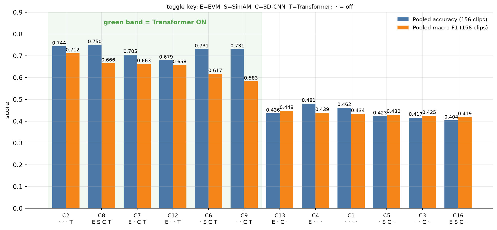
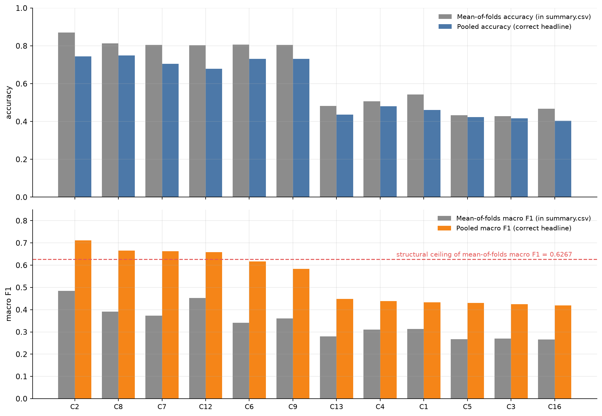
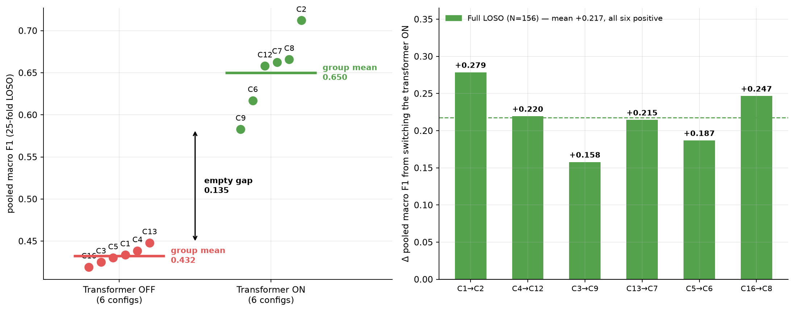
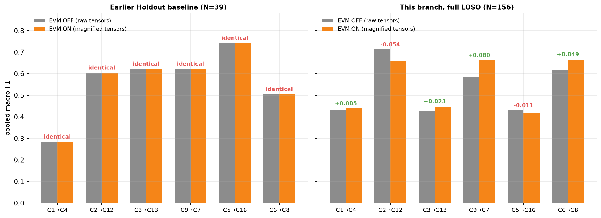
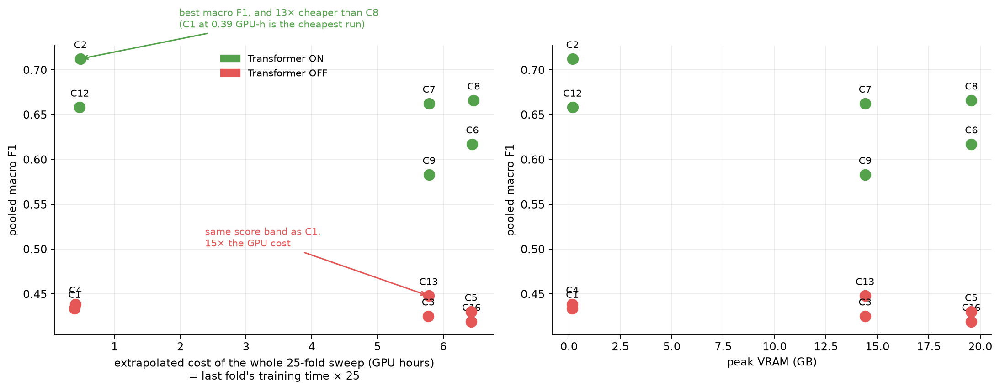
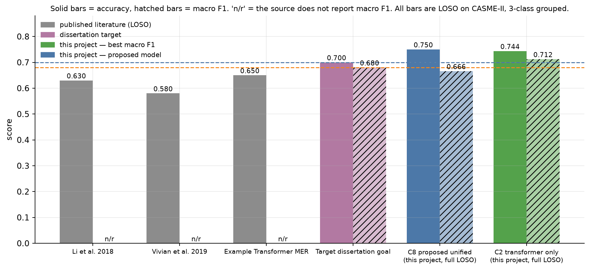
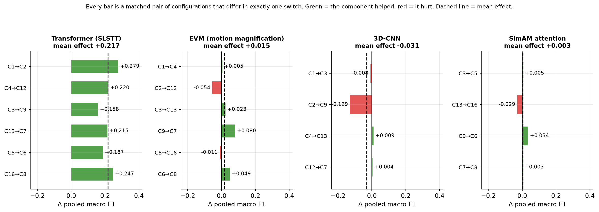

# Chapter 5 — Results

This chapter reports what the ablation found. Chapter 4 specified the design, the twelve configurations, the architecture and the evaluation protocol; this chapter presents the scores those choices produced and reads them within the bounds Chapter 4 established.

Every figure reported here is computed from the stored per-configuration results under `Ablation_Study/results/`. The primary metric throughout is pooled macro F1 — the mean of the per-class F1 scores taken over a confusion matrix summed across all twenty-five folds — for the reasons given in §4.6.4 and §4.6.5. Where accuracy is reported it is pooled accuracy, not the mean of per-fold accuracies. The distinction is not cosmetic: the two orderings disagree, and §5.1 shows where.

The chapter takes each ablated component in turn, reports its effect over the matched pairs that isolate it, and then draws the four findings together against per-class behaviour, computational cost, and the published literature.
## 5.1 Overview of Results

This section reports the outcome of the twelve-configuration factorial sweep specified in §4.1 and §4.3, scored under the leave-one-subject-out protocol of §4.6. It establishes the reference points against which every subsequent section reads its numbers; §5.2 through §5.5 return to the same twelve rows to isolate each component's marginal effect.

### 5.1.1 The twelve configurations, ranked

Table 5.1 reports pooled macro F1 (§4.6.4), pooled accuracy (§4.6.3's `micro_f1` field), and the raw count of correctly classified clips out of 156, for all twelve valid configurations, sorted by pooled macro F1 descending.

**Table 5.1 — All twelve configurations, ranked by pooled macro F1.**

| Rank | Configuration | EVM | SimAM | CNN | Transf. | Pooled macro F1 | Pooled accuracy | Correct / 156 |
|---|---|:-:|:-:|:-:|:-:|--:|--:|--:|
| 1 | `config_2_temporal_only` | – | – | – | ✓ | 0.7122 | 0.7436 | 116 |
| 2 | `config_8_proposed_unified` | ✓ | ✓ | ✓ | ✓ | 0.6659 | 0.7500 | 117 |
| 3 | `config_7_full_no_attention` | ✓ | – | ✓ | ✓ | 0.6625 | 0.7051 | 110 |
| 4 | `config_12_permutation` | ✓ | – | – | ✓ | 0.6581 | 0.6795 | 106 |
| 5 | `config_6_full_stage2_noevm` | – | ✓ | ✓ | ✓ | 0.6171 | 0.7308 | 114 |
| 6 | `config_9_permutation` | – | – | ✓ | ✓ | 0.5830 | 0.7308 | 114 |
| 7 | `config_13_permutation` | ✓ | – | ✓ | – | 0.4480 | 0.4359 | 68 |
| 8 | `config_4_motion_amp_base` | ✓ | – | – | – | 0.4386 | 0.4808 | 75 |
| 9 | `config_1_pure_base` | – | – | – | – | 0.4337 | 0.4615 | 72 |
| 10 | `config_5_attention_base` | – | ✓ | ✓ | – | 0.4302 | 0.4231 | 66 |
| 11 | `config_3_spatial_only` | – | – | ✓ | – | 0.4252 | 0.4167 | 65 |
| 12 | `config_16_permutation` | ✓ | ✓ | ✓ | – | 0.4192 | 0.4038 | 63 |

Figure 5.1 shows the same ranking graphically, with pooled accuracy alongside.

*Figure 5.1 — The twelve configurations ranked by pooled macro F1, with pooled accuracy shown alongside. The six carrying a transformer occupy the upper band and the six without the lower, with no overlap between them.*

### 5.1.2 The headline result

The best-performing configuration on this thesis's primary metric is **`config_2_temporal_only`**, at a pooled macro F1 of **0.7122**. Its architecture is a transformer applied directly to the raw motion tensor: no convolutional stem, no SimAM attention, and no motion magnification. The proposed full system, `config_8_proposed_unified`, which activates all four components, reaches **0.6659** — lower by **0.0463**. Under the metric this thesis committed to in §4.6.4, `config_2` outperforms `config_8`, and the ranking in Table 5.1 places it first.

This is not reversed by looking at accuracy instead. `config_8` does lead on pooled accuracy, at **0.7500** against `config_2`'s **0.7436**, but the margin is **one clip** out of 156 — 117 correct against 116. The two configurations are therefore two different winners under two different metrics: `config_2` wins decisively on pooled macro F1, and `config_8` wins by a single classification on pooled accuracy. §4.6.5 already established why this thesis treats pooled macro F1 as primary. Given that commitment, the ranking in Table 5.1 stands: `config_2_temporal_only`, not the proposed unified system, is the best-performing configuration in this study. Why this occurs, and what it implies for the four components under test, is taken up in §5.5 and §5.8.

### 5.1.3 A reference point: the all-Negative classifier

Reading any of the scores in Table 5.1 requires a sense of what a classifier achieves by doing nothing. Of the 156 clips in the working corpus, 99 belong to the Negative class (§4.2). A classifier that predicts Negative for every clip, irrespective of input, therefore reaches a pooled accuracy of **0.6346** ($99/156$). Its pooled macro F1, by contrast, is only **0.2588**: the Negative class alone yields a per-class F1 of $2 \times 0.6346 / (0.6346 + 1) \approx 0.7765$, while Positive and Surprise, never predicted, each contribute a per-class F1 of zero, and the mean of the three is 0.2588.

The consequence is that pooled accuracy near 0.63 on this corpus is not, by itself, evidence that a model has learned anything about the discrimination task; a rule with no discriminative capacity whatsoever already reaches most of the way there. Pooled macro F1 above 0.2588, on the other hand, is evidence of learning, because the all-Negative rule cannot produce it. Every configuration in Table 5.1 clears this floor, but by very different margins — from `config_16`'s 0.4192, comfortably above the floor, to `config_2`'s 0.7122, more than double it. This is the practical reason §4.6 fixes pooled macro F1 as the metric that governs conclusions in this thesis rather than merely relabelling the same numbers: on this corpus, the choice of metric changes which configuration is judged to have succeeded, not just the scale on which success is reported.

Figure 5.2 shows both aggregations side by side for every configuration.

*Figure 5.2 — Mean-of-folds against pooled aggregation, for accuracy and for macro F1. The dashed line marks the 0.6267 ceiling that fold composition imposes on any mean-of-folds macro F1, irrespective of model quality.*

### 5.1.4 The transformer/no-transformer split

A second pattern is visible in Table 5.1 without any further computation. The six configurations that include a transformer — `config_2`, `config_8`, `config_7`, `config_12`, `config_6`, `config_9` — occupy pooled macro F1 scores between 0.5830 and 0.7122. The six that do not — `config_13`, `config_4`, `config_1`, `config_5`, `config_3`, `config_16` — occupy scores between 0.4192 and 0.4480. These two ranges do not overlap: the worst transformer-equipped configuration (`config_9`, 0.5830) still scores 0.1350 above the best transformer-free configuration (`config_13`, 0.4480). No other single flag in the design produces a clean separation of this kind in the ranked table. §5.2 examines this split directly, computing it as a matched-pair marginal effect rather than reading it off the ranking.

### 5.1.5 The baseline, and how many configurations fall below it

§4.3.4 designates `config_4_motion_amp_base` (0.4386) as this study's baseline: motion magnification applied with no learned spatial or temporal component. Measured against it, **four** of the remaining eleven configurations score lower — `config_1_pure_base` (0.4337), `config_3_spatial_only` (0.4252), `config_5_attention_base` (0.4302), and `config_16_permutation` (0.4192).

This count requires care. `config_13_permutation` scores **0.4480**, which is above the baseline despite being, by every other measure in Table 5.1, a weak configuration — it ranks seventh of twelve and sits close to the cluster of transformer-free scores. It is tempting to group `config_13` with the four configurations named above and report five below the baseline; the correct figure, against `config_4`, is four. This thesis measures against `config_4`, as §4.3.4 specifies, and the count of four is reported on that basis throughout.

---

## 5.2 The Temporal Transformer

§4.3.5 fixes the transformer's marginal effect as the mean of six matched-pair differences in pooled macro F1. The same construction is applied to the three components treated in §5.3 to §5.5, over six matched pairs or four as the ablation matrix allows.

### 5.2.1 The effect

The transformer's mean marginal contribution across its six matched pairs is **+0.2173** pooled macro F1. Every one of the six pairs moves in the same direction — positive in all six — with individual differences ranging from **+0.1578** to **+0.2786**. This is, by a wide margin, the largest effect measured for any of the four components in this study.

### 5.2.2 The six pairs

Table 5.2 lists all six matched pairs identified in Table 4.2, each pair holding EVM, SimAM, and the CNN stem fixed and toggling only the transformer, `off → on`.

**Table 5.2 — Transformer matched pairs.**

| Pair (off → on) | Δ pooled macro F1 |
|---|--:|
| `config_1` → `config_2` | +0.2786 |
| `config_16` → `config_8` | +0.2467 |
| `config_4` → `config_12` | +0.2195 |
| `config_13` → `config_7` | +0.2146 |
| `config_5` → `config_6` | +0.1869 |
| `config_3` → `config_9` | +0.1578 |

Figure 5.3 plots the six pairs and the group separation they produce.

*Figure 5.3 — The six transformer matched pairs, and the resulting separation between transformer-bearing and transformer-free configurations.*

### 5.2.3 What consistency across six of six means, and does not

Every one of the six pairs improves when the transformer is added, and the smallest of these six improvements, +0.1578, is larger than the entire mean effect reported in this thesis for any other component.

§4.1.5 records that every configuration in this study was trained exactly once, on a single fixed seed, with no variance estimate across seeds and no significance test available (§4.6.6 confirms that per-clip predictions are not retained, so no paired test could be constructed even after the fact). Six matched pairs all moving in the same direction under these conditions is strong evidence about the *sign* of the effect — it is difficult to attribute six independent same-direction outcomes to seed noise alone — but it gives no confidence interval on the *magnitude* of +0.2173, and no basis for saying whether a repeat run under a different seed would reproduce a mean nearer +0.16 or nearer +0.28. Consistency of sign across six independently constructed configurations is the strongest claim this experimental design supports; a precise magnitude is not.

### 5.2.4 The group separation

§5.1.4 gives the two group ranges and the **0.135** gap between them.

This separation is specific to the transformer. Of the four components in the design, it is the only one whose on/off groups do not overlap in pooled macro F1; the EVM, SimAM, and CNN-stem comparisons each produce overlapping distributions, in which some off-configurations outscore some on-configurations. The transformer is therefore the one flag whose setting, by itself, predicts which half of the ranked table a configuration falls into.

### 5.2.5 Interpretation

The transformer is the component in this architecture that models relationships across the temporal axis of the 32-frame sequence. §4.4.3 establishes that the convolutional stem performs no temporal mixing at all, so in any configuration without a transformer the only operation applied to the temporal axis is the order-blind pooling of the `TemporalPooling` fallback (§4.4.7). The comparison this section reports is therefore not, strictly, "transformer versus some other way of handling time"; every transformer-off configuration in this study collapses the temporal axis by an order-blind pooling operation before classification. The +0.2173 effect is the difference between modelling the temporal axis and discarding its order entirely.

It would overreach to claim that the transformer is "the most important component" of this pipeline in any general sense — the design in §4.1.4 does not measure importance in the abstract, only marginal effects local to the twelve trained configurations and the seed used to train them. What can be claimed is narrower and better supported: on this corpus, under this leave-one-subject-out protocol, adding a temporal transformer in place of order-blind pooling moves pooled macro F1 by approximately 0.22, consistently, across every one of the six matched comparisons this design provides.

That effect is also cheap to obtain: among the four stem-free configurations, which are the least expensive in the sweep (§4.7.2), the two carrying a transformer cost around a fifth more in training time, and one of them is the best-scoring configuration in the study. §5.5 develops the cost comparison.

---

## 5.3 Motion Magnification

§4.3.5 fixes magnification's marginal effect as the mean of six matched-pair differences in pooled macro F1. The near-zero mean that results is the least informative number this section can offer.

### 5.3.1 The effect

Motion magnification's mean marginal contribution across its six matched pairs is **+0.0152** pooled macro F1 — positive in **four** of the six pairs, negative in two. Individual differences range from **−0.0541** to **+0.0795**. Unlike the transformer's six-of-six result in §5.2.1, magnification does not move consistently in one direction, and its mean sits closer to zero than any comparison this study reports except the one taken up in §5.4.

### 5.3.2 The six pairs

Table 5.3 lists all six matched pairs identified in §4.3.5, each pair holding the other three flags fixed and toggling only `use_evm`, off → on. The second column records which of the two learned components — the convolutional stem and the transformer — each pair carries, because §5.3.4 shows this to bear on the direction of the effect.

**Table 5.3 — Motion-magnification matched pairs.**

| Pair (off → on) | Components present | Δ pooled macro F1 |
|---|---|--:|
| `config_9` → `config_7` | CNN + transformer | +0.0795 |
| `config_6` → `config_8` | CNN + SimAM + transformer | +0.0488 |
| `config_3` → `config_13` | CNN only | +0.0228 |
| `config_1` → `config_4` | none | +0.0049 |
| `config_5` → `config_16` | CNN + SimAM | −0.0109 |
| `config_2` → `config_12` | transformer only | −0.0541 |

Figure 5.4 plots the six pairs, with the two regressions visible against the four gains.

*Figure 5.4 — The six magnification matched pairs under the full leave-one-subject-out protocol. Four improve, two regress.*

### 5.3.3 The most consequential observation

The largest single movement in this table is not a gain. `config_2 → config_12` loses **−0.0541** pooled macro F1 when magnification is switched on, and `config_2` is not an arbitrary configuration: §5.1.2 establishes it as the best-performing configuration in the entire study, at a pooled macro F1 of 0.7122. Adding motion magnification to the best configuration found in this thesis makes it worse — by more than three and a half times the magnitude of magnification's own mean effect, and in the direction opposite to what that mean would suggest.

The largest gain sits at the opposite end of the same table. `config_9 → config_7` improves by **+0.0795**, the single biggest movement magnification produces in either direction, and this pair carries both a convolutional stem and a transformer — the two learned components this thesis ablates. The best and worst outcomes for magnification therefore occur in architecturally distinct settings: its worst result is a transformer with no spatial stem, its best is a transformer with one.

### 5.3.4 A pattern, not a conclusion

Four of the six pairs in Table 5.3 carry a convolutional stem (`config_9→7`, `config_6→8`, `config_3→13`, `config_5→16`), and three of those four improve with magnification; only `config_5→config_16` is negative, and only slightly so, at −0.0109. The two pairs without a stem (`config_1→4` and `config_2→12`) split one positive, one negative, with the stem-free negative case being magnification's single largest loss.

Three of four is not a large sample, and one of two is smaller still; with a single fixed seed and no variance estimate across seeds (§4.1.5), neither split carries a confidence interval, and a repeat run could shift either count. The pattern is worth naming because it is the only structure visible in an otherwise near-zero mean.

### 5.3.5 Interpretation

Two facts recorded in Chapters 2 and 3 bear directly on why magnification's mean effect sits so close to zero in this pipeline, and both are offered here as explanations consistent with the measurement, not as claims this study's design can test.

The first is a matter of pipeline ordering. §2.3.5 records that each clip is resampled to a fixed frame count before the magnifier is invoked, while the magnifier still receives the corpus's nominal 200 fps; §3.5.7 works through what that does to the intended 5–25 Hz band. The realised pass-band is clip-dependent, and a filter whose frequency axis does not match the signal it filters will not amplify the right motion consistently across clips of different lengths.

The second is a matter of what magnification is being placed in front of. §3.2.5 establishes that every reviewed application of Eulerian magnification evaluates it in front of an *appearance-based* representation; this thesis's pipeline instead feeds magnified frames into a dense optical-flow and optical-strain stage, and §3.2.6 sets out why a representation that already recovers motion may not respond to amplification the way an appearance descriptor does. No experiment in this study isolates whether that mismatch or the ordering effect of §2.3.5 is the larger contributor to the near-zero mean — both are plausible, and neither is tested here.

Nor can cost settle whether magnification is worth retaining. It is a preprocessing step (§3.2.7) that adds no learnable parameters, and the training-time and peak-VRAM figures of §4.7.2 exclude it entirely, so no cost figure for the component exists to weigh its effect against.

---

## 5.4 Parameter-Free Attention

§4.3.5 fixes SimAM's marginal effect as the mean of its matched-pair differences in pooled macro F1. SimAM's aggregate is the smallest of the four components measured in this study, and this section's purpose is to show why that aggregate is the wrong number to read as the finding.

### 5.4.1 The effect

SimAM's mean marginal contribution is **+0.0034** pooled macro F1, computed across **four** matched pairs — positive in **three**, negative in one. Individual differences range from **−0.0288** to **+0.0341**. This is the smallest mean effect of the four components ablated in this thesis, and at this sample size it cannot be separated from zero: with no variance estimate across seeds (§4.1.5), a mean of +0.0034 over four pairs gives no basis for distinguishing a real small effect from noise. No significance test is performed, and the persisted results would not support one.

### 5.4.2 The four pairs

Table 5.4 lists all four matched pairs identified in §4.3.5. SimAM is measured over four pairs rather than the eight a complete matrix would give because §4.1.3 rejects, as architecturally undefined, any configuration combining SimAM with no convolutional stem. The four configurations in which SimAM would pair with a stem-free model were accordingly never run.

**Table 5.4 — SimAM matched pairs.**

| Pair (off → on) | Δ pooled macro F1 |
|---|--:|
| `config_9` → `config_6` | +0.0341 |
| `config_3` → `config_5` | +0.0050 |
| `config_7` → `config_8` | +0.0034 |
| `config_13` → `config_16` | −0.0288 |

### 5.4.3 Why the mean is not the finding

The aggregate in §5.4.1 hides a substantial redistribution of errors across classes, and this redistribution, not the mean, is this section's real finding. Table 5.5 gives per-class F1 for the two pairs that move most: the largest gain, `config_9 → config_6`, and the largest loss, `config_13 → config_16`.

**Table 5.5 — Per-class F1 for the two most-affected SimAM pairs.**

| Configuration | Negative | Positive | Surprise |
|---|--:|--:|--:|
| `config_9` (SimAM off) | 0.8491 | 0.6000 | **0.3000** |
| `config_6` (SimAM on) | 0.8325 | 0.4286 | **0.5902** |
| `config_13` (SimAM off) | 0.4127 | 0.5278 | 0.4035 |
| `config_16` (SimAM on) | 0.3500 | 0.5143 | 0.3934 |

In `config_9 → config_6`, Surprise-class F1 very nearly doubles, from **0.3000** to **0.5902** — and `config_9`'s 0.3000 is the second-lowest Surprise score of the twelve configurations in this study, behind `config_4`'s 0.2462. Read in isolation, that looks like SimAM meaningfully improving the model's weakest class. But in the same pair, Positive-class F1 falls substantially, from **0.6000** to **0.4286**, and Negative-class F1 also drops slightly, from 0.8491 to 0.8325. The +0.0341 pooled macro F1 gain for this pair is the net of a large improvement on the rarest class and a substantial loss on the second-rarest one, not a uniform improvement across the board.

Both directions have to be reported together: told only that SimAM nearly doubles Surprise-class F1 here, a reader takes away a materially more favourable picture than the data support; told only the +0.0034 mean, they miss that anything is happening in the per-class scores at all.

### 5.4.4 What this supports, and what it does not

§4.2 records 25 Surprise clips and 32 Positive clips in the 156-clip corpus. A change in F1 of the size seen in `config_9 → config_6` corresponds to a handful of clips moving from one predicted class to another on either side of this ledger — this is not a large-sample result on either class, and it should be read as such. The honest description of `config_9 → config_6` is that attention redistributed errors between the two minority classes in the one configuration that had handled Surprise worst of all twelve; it is not evidence that SimAM rescues the Surprise class in any general sense, since the same component's effect on `config_13 → config_16` moves Surprise-class F1 only slightly (0.4035 to 0.3934, a small decline) while the pooled macro F1 for that pair falls by the largest margin in Table 5.4, −0.0288. The two most-affected pairs in this study's SimAM comparison do not even agree on which class benefits.

### 5.4.5 Cost

SimAM adds zero learnable parameters to any configuration it appears in, confirmed in the parameter totals of §4.4.9. Its compute cost is not zero, however. In each of the four matched pairs of Table 5.4, enabling SimAM adds roughly 11% to last-fold training time and 5,292 MB to peak VRAM, a 35.9% increase; extrapolated across the sweep on §4.7.4's convention, that is roughly 2.64 of the 50.61 GPU-hours, or 5.2% of the total. The convolutional stem, treated fully in §5.5, is a different order of expense again — §4.7.3 records it at roughly a thirteenfold increase in training time and over a hundredfold in peak VRAM — but SimAM is not free, and the parameter count alone does not show this. A near-zero mean effect is still not, by itself, a reason to discard the component; whether it is worth retaining turns on whether a twentieth of the compute budget is worth an effect that cannot be separated from noise at this sample size.

---

## 5.5 The Convolutional Stem

Of the four components ablated in this thesis, the convolutional stem is the only one whose mean effect is negative — and it is by far the most expensive to include.

### 5.5.1 The effect

The convolutional stem's mean marginal contribution is **−0.0310** pooled macro F1, computed across **four** matched pairs, positive in only **two** of the four. Individual differences range from **−0.1292** to **+0.0094**. No other component in this study has a negative mean effect: the transformer's is +0.2173 (§5.2.1), motion magnification's is +0.0152 (§5.3.1), and SimAM's is +0.0034 (§5.4.1).

### 5.5.2 The four pairs

Table 5.6 lists all four matched pairs in which the stem is toggled with every other factor held fixed. The comparison is measured over four pairs rather than eight for the same architectural reason noted for SimAM in §5.4.2: the four cells §4.1.3 excludes as undefined were never run, and each of them would have completed one further stem-toggled pair.

**Table 5.6 — Convolutional stem matched pairs.**

| Pair (off → on) | Components also present | Δ pooled macro F1 |
|---|---|--:|
| `config_4` → `config_13` | EVM | +0.0094 |
| `config_12` → `config_7` | EVM + transformer | +0.0044 |
| `config_1` → `config_3` | none | −0.0085 |
| `config_2` → `config_9` | transformer | **−0.1292** |

### 5.5.3 The worst pair is the most important one

An aggregate of four small-magnitude numbers, three of them within 0.01 of zero, would ordinarily read as a component with no clear effect either way. That reading is not available here, because the fourth pair is not small. `config_2 → config_9` takes `config_2`, the best-performing configuration in the entire study at a pooled macro F1 of 0.7122 (§5.1.2), and adds nothing but the convolutional stem. The result is `config_9` at 0.5830 — a loss of **0.1292**, four times the component's own mean effect and larger in magnitude than the entire mean effect this study measures for either motion magnification or SimAM attention. This is also the second time `config_2` has been damaged by the addition of a single component: §5.3.3 records that adding motion magnification to the same configuration costs it 0.0541 pooled macro F1. The two configurations built from `config_2` by adding one further component each are both worse than `config_2` itself, and the stem is the larger of the two losses. The two pairs in which the stem helps are both modest — +0.0094 and +0.0044 — nowhere near large enough to offset what happens to `config_2`.

### 5.5.4 The cost

The size of the negative effect would be a curiosity if the component were cheap. It is not. §4.7.2 and §4.7.4 record, from single-fold training times scaled by the study's 25-fold LOSO protocol, that the eight stem-bearing configurations require an extrapolated **5.77–6.46 GPU-hours** each and peak at **14,742–20,039 MB** of VRAM, against **0.39–0.48 GPU-hours** and **165–174 MB** for the four stem-free configurations. Restated at the level of the whole sweep:

| | CNN-bearing (8 configs) | Stem-free (4 configs) |
|---|--:|--:|
| Extrapolated GPU-hours each | 5.77 – 6.46 | 0.39 – 0.48 |
| Peak VRAM | 14,742 – 20,039 MB | 165 – 174 MB |

The eight configurations carrying the stem account for **48.87 of the sweep's 50.61 extrapolated GPU-hours — 96.6%**. As §4.7.2 and §4.7.4 note, these figures are extrapolations from a single stored fold per configuration, multiplied by 25, not a sum of 300 measured fold durations — the sweep never recorded a fold-by-fold total to check that assumption against.

The conclusion follows directly: **the component consuming 96.6% of this study's compute has a mean effect of −0.0310 pooled macro F1.** That is a finding about the specific pipeline built and measured in this thesis — a particular stem, at a particular resolution, feeding a particular downstream encoder — and not a general claim that convolutional stems are unhelpful for micro-expression recognition as such.

Figure 5.5 places every configuration's score against what it cost to obtain.

*Figure 5.5 — Pooled macro F1 against extrapolated GPU-hours and against peak VRAM. The configurations carrying a convolutional stem occupy the high-cost region without a corresponding gain in score.*

### 5.5.5 Interpretation

Three facts already established elsewhere in this thesis bear on why the stem might behave this way. Each is a candidate explanation, not a conclusion the current design can confirm.

**The stem is spatial, not spatio-temporal.** §4.4.3 records that no kernel in `SingleStream3DCNN` spans the temporal axis, so the sequence length of 32 passes through unchanged. Despite being built from `Conv3d` operations, the component is a learned spatial feature extractor applied independently to each frame, not a mechanism that mixes information across time. Whatever the stem contributes, it cannot be a temporal contribution.

**The input to the stem is already a motion representation.** §3.3 and §3.4 establish that optical flow and optical strain are themselves analytically computed descriptions of motion and deformation, not raw pixel intensities. A learned spatial stem sitting on top of channels that already encode where and how the face moved is not extracting motion from scratch; it may, in some part, be re-deriving structure the input has already made explicit.

**The stem's input resolution is far above the range the literature uses.** §3.6 records that this pipeline feeds the stem 224×224 frames — more than twice the 100×100 threshold above which the reviewed literature reports degradation for deeper backbones, and eight times STSTNet's 28×28 — and concludes there that the measured −0.0310 may be a resolution result as much as an architectural one. That reading is not clean: the same source reports shallow models to be largely robust to input resolution, and this stem is shallow.

These three explanations are not mutually exclusive, and this study cannot adjudicate between them, or rule out some other cause entirely. The ablation varies only the stem's presence — on or off — with its kernel shape, its input resolution, and its position relative to the flow and strain computation all held fixed at the single configuration described in Chapter 4. Distinguishing a temporal-mixing effect from a resolution effect from a redundant-computation effect would require varying each of those factors independently, which this design does not do. Chapter 6 sets out the experiments — principally, re-running the stem at lower input resolutions closer to the literature's converged range — that this result motivates but does not itself provide.

---

## 5.6 Per-Class Performance

§5.1 through §5.5 report each component's marginal effect on pooled macro F1 as a single number. That number is itself an average of three per-class scores, and averaging across Negative, Positive and Surprise can conceal as much as it reveals — §5.4.3 already made this point for the two SimAM pairs that move most. This section returns to the full twelve-configuration table and reads the three class scores separately, for every configuration at once.

### 5.6.1 Per-class F1 for all twelve configurations

Table 5.7 reproduces the per-class F1 recorded in each configuration's `final_results.json`, ordered by pooled macro F1 descending, alongside the class support fixed in §4.2: 99 Negative clips, 32 Positive, 25 Surprise, out of 156 in total.

**Table 5.7 — Per-class F1 for all twelve configurations.**

| Configuration | Negative | Positive | Surprise | Pooled macro F1 |
|---|--:|--:|--:|--:|
| `config_2_temporal_only` | 0.8068 | 0.6506 | 0.6792 | 0.7122 |
| `config_8_proposed_unified` | 0.8458 | 0.5556 | 0.5965 | 0.6659 |
| `config_7_full_no_attention` | 0.7845 | 0.5479 | 0.6552 | 0.6625 |
| `config_12_permutation` | 0.7485 | 0.5591 | 0.6667 | 0.6581 |
| `config_6_full_stage2_noevm` | 0.8325 | 0.4286 | 0.5902 | 0.6171 |
| `config_9_permutation` | 0.8491 | 0.6000 | 0.3000 | 0.5830 |
| `config_13_permutation` | 0.4127 | 0.5278 | 0.4035 | 0.4480 |
| `config_4_motion_amp_base` | 0.5641 | 0.5055 | 0.2462 | 0.4386 |
| `config_1_pure_base` | 0.5600 | 0.3714 | 0.3696 | 0.4337 |
| `config_5_attention_base` | 0.3840 | 0.5227 | 0.3838 | 0.4302 |
| `config_3_spatial_only` | 0.3607 | 0.5227 | 0.3922 | 0.4252 |
| `config_16_permutation` | 0.3500 | 0.5143 | 0.3934 | 0.4192 |

Four patterns follow from this table that are not visible in the pooled macro F1 column alone.

Figure 5.6 gives the pooled confusion matrices for three configurations, and Figure 5.7 the per-class scores for all twelve.

*Figure 5.6 — Pooled confusion matrices, summed across all twenty-five folds, for the baseline-level `config_1`, the proposed `config_8`, and the best-scoring `config_2`.*

*Figure 5.7 — Per-class F1 for all twelve configurations, ordered as in Figure 5.1. Negative, Positive and Surprise are supported by 99, 32 and 25 clips respectively.*

### 5.6.2 No configuration abandons a class

The lowest per-class F1 anywhere in Table 5.7 is 0.2462, `config_4` on Surprise — low, but not zero. Every one of the twelve configurations predicts all three classes to some extent. This did not happen automatically: §3.9.7 records earlier configurations that abandoned a class entirely — the minority class under loss weighting alone, the majority class once a balanced sampler was added on top of it — and §4.5.2 fixes the run-time rule that stops the two corrections from acting at once. Table 5.7 is the evidence that the rule works across the full twelve-configuration sweep, not only in the cases that exposed the failures: whatever else varies between the strongest and weakest configurations here, none of them collapses onto one or two classes.

### 5.6.3 `config_9` is the most imbalanced configuration in the study

`config_9` holds the **highest** Negative-class F1 of any configuration, 0.8491, alongside a Surprise-class F1 of 0.3000 — the second-lowest in the study, behind `config_4`'s 0.2462. The distance between its best and worst class, 0.5491, is the widest spread any configuration in Table 5.7 records. Yet `config_9`'s accuracy — the pooled, confusion-matrix-based figure recorded as `micro_f1` in §4.6.3, 0.7308 — places it respectably in the ranking Table 5.1 orders by pooled macro F1: sixth of twelve on that ordering, ahead of six other configurations, with an accuracy figure that would not, read alone, suggest anything unusual. A reader who looked only at that accuracy number would have no way to see that `config_9` is, class by class, the single most lopsided model this study produced. This is the clearest individual illustration in the dataset of the argument §4.6 makes in the abstract for preferring macro F1 to accuracy as the governing metric: accuracy can be respectable while the classifier has, in effect, given up on the rarest class in exchange for near-total command of the largest one.

### 5.6.4 `config_2` has the most balanced profile

`config_2`, the study's best configuration overall, is also its most even one. Its three class scores — 0.8068, 0.6506, 0.6792 — span 0.1562, the narrowest range of any transformer-equipped configuration in Table 5.7, and it holds both the highest Positive-class F1 and the highest Surprise-class F1 in the study. Two configurations span a narrower range overall, `config_13` at 0.1243 and `config_5` at 0.1389, but each is even only in the sense that it scores poorly on all three classes. `config_2`'s advantage over `config_8`, the second-ranked configuration, is concentrated almost entirely in the two minority classes: Positive 0.6506 against `config_8`'s 0.5556, Surprise 0.6792 against 0.5965. On Negative, the ordering reverses — `config_8` scores 0.8458 against `config_2`'s 0.8068, so `config_8` is in fact the better of the two on the majority class. This has to be stated explicitly, because it is the precise mechanism behind the divergence §5.1.2 already reports: `config_8` leads `config_2` on pooled accuracy (0.7500 against 0.7436) while trailing it substantially on pooled macro F1 (0.6659 against 0.7122). Accuracy is dominated by the 99 Negative clips, where `config_8` has the edge; macro F1 weights Positive and Surprise equally with Negative, and on both of those `config_2` is ahead by a wide margin. The two metrics disagree because they are, in effect, asking about different classes.

### 5.6.5 Negative-class F1 tracks the transformer split

§5.1.4 and §5.2.4 already establish that the six transformer-equipped configurations occupy a non-overlapping, higher band of pooled macro F1 than the six without one. The same separation appears, more sharply, in the Negative-class column alone. The six transformer configurations score between 0.7485 and 0.8491 on Negative; the six without one score between 0.3500 and 0.5641. These ranges do not overlap, and the gap between them is 0.1844 at the nearest edges. Neither minority class separates this way: on Positive the two groups overlap by 0.0992, and on Surprise by 0.1035. Negative is the only class in which the transformer split is clean. Whatever the transformer contributes overall, its clearest single-class signature is on the class with the most training examples.

### 5.6.6 A caution about minority-class numbers

With 32 Positive clips and 25 Surprise clips in the pooled evaluation, one clip moving from a correct to an incorrect prediction changes F1 on that class by roughly 0.03 on Positive and roughly 0.04 on Surprise, depending on where in the precision/recall balance it falls. Differences of a few hundredths between two configurations on either minority class — several of the comparisons in Table 5.7, and several of the matched pairs examined in §5.2 through §5.5 — are consequently differences of a single clip's classification, not a stable estimate of a general tendency. No significance test can settle whether such a difference is more than noise: §4.6.6 records that per-clip predictions were not retained, so no paired test can be reconstructed after the fact. Every per-class comparison in this chapter should be read with that ceiling on precision in mind.

---

## 5.7 Comparison with Published Results

### 5.7.1 What is being compared

§3.1.6 establishes that this thesis's primary metric, pooled macro F1, is identical in construction to the Unweighted F1 (UF1) of the MEGC 2019 benchmark [11], and that argument is not repeated here. The two quantities are directly comparable *in construction*. This study's best configuration, `config_2_temporal_only`, scores **0.7122** pooled macro F1 (§5.1.2). Whether that figure can be read against MEGC's published CASME II-subset UF1 scores as if the two experiments occupied the same evidentiary footing is a separate question, and it is the substance of this section.

### 5.7.2 The published results

Table 3.6, reproduced from See et al. [11], reports UF1 on the CASME II subset of the MEGC 2019 Composite Database Evaluation for seven methods. The relevant column is reproduced here.

**Table 5.8 — Published CASME II-subset UF1, MEGC 2019 [11].**

| Method | CASME II subset UF1 |
|---|--:|
| OFF-ApexNet [5] | 0.8764 |
| Zhou et al.† | 0.8621 |
| Liong et al., STSTNet [17] | 0.8382 |
| Liu et al., EMR [18] | 0.8293 |
| Bi-WOOF [16] | 0.7805 |
| Quang et al.† | 0.7068 |
| LBP-TOP [13] | 0.7026 |

† outside the review corpus; reported as it appears in that table.

### 5.7.3 Where this study lands

At 0.7122, `config_2` sits above LBP-TOP (0.7026) and Quang et al. (0.7068), and below every other entry in Table 5.8 — well below the 0.78–0.88 cluster, which is deep-learned throughout except for Bi-WOOF's hand-crafted optical-flow histogram. This should be stated plainly rather than qualified away: `config_2` does not compete with OFF-ApexNet, EMR, or STSTNet, which lead it by margins of 0.117 to 0.164. It occupies the bottom of the published table, ahead of only the two weakest entries and by a narrow margin in both cases. This is not a competitive result against the state of the art, and it is not presented as one.

Figure 5.8 places this study's configurations against those published figures.

*Figure 5.8 — This study's configurations set against the MEGC 2019 CASME II subset results. The published entries are produced by models trained on the composite database, not on CASME II alone.*

### 5.7.4 Three reasons the comparison is not like-for-like

The gap just described cannot be read at face value, because the two experiments differ in three respects that bear directly on the numbers being compared. Each is stated in full, including the one that argues the true gap is larger than the table shows.

**1. Training data.** Every row in Table 5.8 is produced by a model trained on the MEGC composite database — SMIC, CASME II and SAMM pooled together, 442 samples across three corpora and 68 subjects — and then scored on the pooled predictions restricted to the CASME II portion. §3.1.6 makes this point directly. This study trains each fold on CASME II alone: 156 clips, one corpus, 25 subjects. The published models therefore train on roughly 2.8 times the sample count of this study's single-corpus folds, drawn from three capture conditions rather than one. A cross-corpus model that has seen SAMM's participants (28 of its 32 enter MEGC's composite) and 13 ethnicities (§3.1.5, Table 3.5), and SMIC's independent recording apparatus, carries a regularising effect that a single-corpus model trained on 156 clips cannot have. This difference favours the published figures.

**2. Sample count.** MEGC reports its CASME II subset as **145** samples; this study's working set is **156**. §3.1.3 traces the difference to the label taxonomy — this thesis assigns sadness and fear to Negative, following MEGC's **SAMM** mapping rather than its CASME II one, a declared divergence — and leaves a residual two clips unresolved rather than forcing a reconciliation. The evaluation sets underlying the two sets of figures are consequently not identical populations, independent of the training-data difference above.

**3. The protocol limitation.** §4.6.2 records that this study's evaluation has no inner validation split. This is an optimistic bias of unknown magnitude in every fold, and therefore in the aggregate pooled macro F1 reported for every configuration, including `config_2`'s 0.7122. This point must be read in the opposite direction from the first two: it does not excuse the gap to the published figures, it widens it. If this study's own reported score is inflated by an unknown amount relative to what a genuine held-out evaluation would produce, then the true distance between `config_2` and the published methods in Table 5.8 is, if anything, larger than 0.7122 versus 0.7026–0.8764 suggests. It would be dishonest to cite only the two reasons that make this study's task harder than MEGC's without also stating the one that makes this study's own reported number more favourable than its protocol supports.

### 5.7.5 What the comparison does support

§4.1 frames this study's purpose from the outset: it is a factorial ablation designed to measure which components of a standard micro-expression pipeline are responsible for its performance, not an attempt to advance the state of the art on CASME II. Read in that light, the comparison in this section supports a modest but specific claim. A transformer applied to motion tensors, trained on one corpus of 156 clips, with no composite-database augmentation, no inner validation split working in its favour, and no hyperparameter search, reaches a pooled macro F1 in the range occupied by the classical hand-crafted baselines in Table 5.8 — ahead of LBP-TOP and Quang et al., behind everything built on deep features and cross-corpus training. That is not evidence that this pipeline is competitive with OFF-ApexNet, EMR, or STSTNet. It is evidence that the architectural idea explored in this thesis — modelling the temporal axis of a motion representation with a transformer, deliberately without the additional machinery the pipeline also tests — is not far off the floor set by pre-deep-learning methods on this benchmark, despite training on a fraction of the data those methods were given. Nothing beyond that claim is supported by Table 5.8, and nothing beyond it is asserted here.

---

## 5.8 Summary and Limitations

### 5.8.1 The four component findings, recapitulated

§5.2 through §5.5 each measure one component's marginal effect over its matched pairs. Table 5.9 collects the four mean effects together with the pair counts each rests on — the count is part of the evidence, since a mean over four pairs and a mean over six do not carry the same weight.

**Table 5.9 — Mean marginal effect of each component on pooled macro F1.**

| Component | Mean effect (pooled macro F1) | Pairs | Positive |
|---|--:|:-:|:-:|
| Temporal transformer | **+0.2173** | 6 | 6 / 6 |
| Motion magnification | +0.0152 | 6 | 4 / 6 |
| Parameter-free attention | +0.0034 | 4 | 3 / 4 |
| Convolutional stem | **−0.0310** | 4 | 2 / 4 |

Four findings follow.

**The temporal transformer is the only component with a large, consistent effect.** Its mean, +0.2173, is seven times the magnitude of the next largest effect and more than an order of magnitude larger than the two smallest, and it is the only one to move in the same direction in every matched pair — six out of six positive. It is also the only component whose presence or absence partitions the full ranking into non-overlapping groups: transformer-equipped configurations span 0.5830 to 0.7122 pooled macro F1, transformer-free ones span 0.4192 to 0.4480, a gap of 0.1350 between the closest members of each (§5.1.4, §5.2.4).

**Magnification's mean is small and its sign is not stable across pairs.** At +0.0152 over four positive and two negative pairs, it has no settled direction. Its worst case is not merely small: applied to `config_2`, this study's best configuration, magnification costs 0.0541 pooled macro F1 (§5.3.3) — over three times its own mean, and opposite in sign to it.

**Attention's mean is indistinguishable from zero, but it is not inert.** SimAM's +0.0034 mean, over three positive and one negative pair, is the smallest effect measured here, and at this sample size cannot be distinguished from noise. It is nonetheless not doing nothing: §5.4 shows it redistributing error between the two minority classes within at least one pair, and it does so at zero parameter cost, though not at zero compute cost: §5.4.5 records a 35.9% increase in peak VRAM and about a twentieth of the sweep's GPU-hours.

**The convolutional stem has a negative mean effect while consuming almost all of the sweep's compute.** At −0.0310 over four pairs, positive in only two, it is the only component with a negative mean effect at all. The eight stem-equipped configurations account for 48.87 of the sweep's 50.61 extrapolated GPU-hours — **96.6%** of the total (§5.5.4). The component consuming almost the entire computational budget is, on average, the one that makes the pipeline worse.

Figure 5.9 shows all twenty matched pairs at once, grouped by component.

*Figure 5.9 — All twenty matched pairs, grouped by component. Each bar is one pair differing in exactly one switch; the dashed line marks that component's mean effect.*

### 5.8.2 The headline tension, and what it means for this thesis

The proposed full system, `config_8_proposed_unified`, is not this study's best configuration: `config_2_temporal_only`, a transformer applied to the motion tensor alone, leads it by **0.0463** pooled macro F1, while trailing it on pooled accuracy by one clip out of 156 (§5.1.2, §5.6.4).

§4.6.4 and §4.6.5 already commit this thesis to pooled macro F1 as the governing metric, so the tension is not resolved by choosing a metric after the fact: under that commitment `config_2` wins decisively. What it shows instead is the value of the ablation design itself. An end-to-end evaluation that trained and reported `config_8` alone — the norm §4.1.1 identifies in the reviewed literature — would have produced a single number and no way to know that three of its four components were not earning their place. Only because every component was toggled independently against a shared protocol can this thesis show the proposed unified system outperformed by a subset of itself. That is the finding the factorial design exists to produce: not how well the proposed pipeline performs, but which of its stages are responsible for that performance (§4.1.1).

### 5.8.3 Limitations

Each limitation below was established where it first bore on a specific result. They are gathered because their combined effect bears on every number in this chapter at once.

- **Single seed, one run per configuration.** All twelve configurations were trained exactly once, on a single fixed seed, with no variance estimate and no confidence interval on any reported difference (§4.5.7). Six same-direction pairs are strong evidence of the transformer's sign; no effect here carries a magnitude a different seed is guaranteed to reproduce.
- **No inner validation split.** Checkpoint selection and final scoring use the same held-out fold in every one of the 25 folds, for every configuration (§4.6.2). Every pooled macro F1 in this chapter is optimistically biased by an amount this design cannot quantify.
- **No paired significance test is possible.** Per-clip predictions were not retained (§4.6.6), so differences between configurations, including the 0.0463 gap between `config_2` and `config_8`, can only be reported as point estimates, not tested.
- **156 clips, 25 subjects, one corpus, one demographic.** §3.1.7 catalogues what this bounds: a single ethnicity and age band, laboratory recording conditions, fold sizes varying by a factor of 33, and no basis for a claim extending beyond CASME II.
- **No hyperparameter search was run.** Every configuration trains under one fixed setting of learning rate, schedule, loss and regularisation, chosen once and never tuned per configuration (§4.5.8). A component that would repay a different setting is therefore measured at a setting chosen without it in mind, which bounds the ranking in Table 5.9 as much as any other limitation here.
- **Each component is varied only as present or absent.** No configuration varies kernel shape, input resolution, magnification parameters, or magnification's position in the pipeline. This design identifies *which* components matter, not *why*.

Taken together, every quantity in this chapter — the component effects in Table 5.9, the 0.0463 gap between `config_2` and `config_8`, the comparison with published figures in §5.7 — is a single, potentially biased point estimate rather than a confidence-bounded measurement, and the conclusions drawn from them are scoped accordingly.

What these limitations permit this study to claim, and what a stronger design would still need to establish, is taken up in Chapter 6.

---

