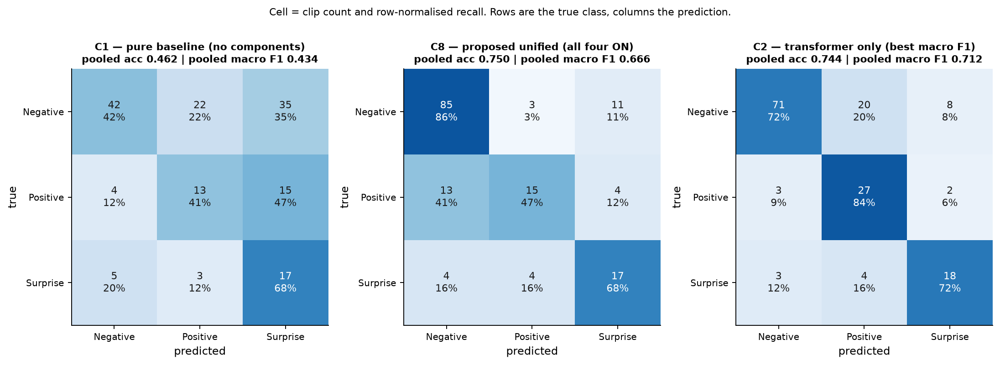
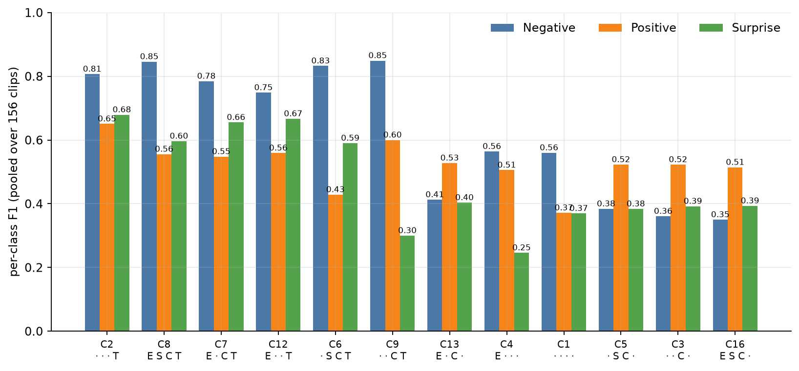

## 5.6 Per-Class Performance

§5.1 through §5.5 report each component's marginal effect on pooled macro F1 as a single number. That number is itself an average of three per-class scores, and averaging across Negative, Positive and Surprise can conceal as much as it reveals — §5.4.3 already made this point for the two SimAM pairs that move most. This section returns to the full twelve-configuration table and reads the three class scores separately, for every configuration at once.

### 5.6.1 Per-class F1 for all twelve configurations

Table 5.7 reproduces the per-class F1 recorded in each configuration's `final_results.json`, ordered by pooled macro F1 descending, alongside the class support fixed in §4.2: 99 Negative clips, 32 Positive, 25 Surprise, out of 156 in total.

**Table 5.7 — Per-class F1 for all twelve configurations.**

| Configuration | Negative | Positive | Surprise | Pooled macro F1 |
|---|--:|--:|--:|--:|
| `config_2_temporal_only` | 0.8068 | 0.6506 | 0.6792 | 0.7122 |
| `config_8_proposed_unified` | 0.8458 | 0.5556 | 0.5965 | 0.6659 |
| `config_7_full_no_attention` | 0.7845 | 0.5479 | 0.6552 | 0.6625 |
| `config_12_permutation` | 0.7485 | 0.5591 | 0.6667 | 0.6581 |
| `config_6_full_stage2_noevm` | 0.8325 | 0.4286 | 0.5902 | 0.6171 |
| `config_9_permutation` | 0.8491 | 0.6000 | 0.3000 | 0.5830 |
| `config_13_permutation` | 0.4127 | 0.5278 | 0.4035 | 0.4480 |
| `config_4_motion_amp_base` | 0.5641 | 0.5055 | 0.2462 | 0.4386 |
| `config_1_pure_base` | 0.5600 | 0.3714 | 0.3696 | 0.4337 |
| `config_5_attention_base` | 0.3840 | 0.5227 | 0.3838 | 0.4302 |
| `config_3_spatial_only` | 0.3607 | 0.5227 | 0.3922 | 0.4252 |
| `config_16_permutation` | 0.3500 | 0.5143 | 0.3934 | 0.4192 |

Four patterns follow from this table that are not visible in the pooled macro F1 column alone.

Figure 5.6 gives the pooled confusion matrices for three configurations, and Figure 5.7 the per-class scores for all twelve.

*Figure 5.6 — Pooled confusion matrices, summed across all twenty-five folds, for the baseline-level `config_1`, the proposed `config_8`, and the best-scoring `config_2`.*

*Figure 5.7 — Per-class F1 for all twelve configurations, ordered as in Figure 5.1. Negative, Positive and Surprise are supported by 99, 32 and 25 clips respectively.*

### 5.6.2 No configuration abandons a class

The lowest per-class F1 anywhere in Table 5.7 is 0.2462, `config_4` on Surprise — low, but not zero. Every one of the twelve configurations predicts all three classes to some extent. This did not happen automatically: §3.9 records an earlier configuration that abandoned the Positive class entirely, at 0.000 F1, and §4.5.2 fixes the run-time rule that stops inverse-frequency loss weighting and a balanced sampler from correcting for the same imbalance twice. Table 5.7 is the evidence that the rule works across the full twelve-configuration sweep, not only in the single case that exposed the failure: whatever else varies between the strongest and weakest configurations here, none of them collapses onto one or two classes.

### 5.6.3 `config_9` is the most imbalanced configuration in the study

`config_9` holds the **highest** Negative-class F1 of any configuration, 0.8491, alongside a Surprise-class F1 of 0.3000 — the second-lowest in the study, behind `config_4`'s 0.2462. The distance between its best and worst class, 0.5491, is the widest spread any configuration in Table 5.7 records. Yet `config_9`'s accuracy — the pooled, confusion-matrix-based figure recorded as `micro_f1` in §4.6.3, 0.7308 — places it respectably in the ranking Table 5.1 orders by pooled macro F1: sixth of twelve on that ordering, ahead of six other configurations, with an accuracy figure that would not, read alone, suggest anything unusual. A reader who looked only at that accuracy number would have no way to see that `config_9` is, class by class, the single most lopsided model this study produced. This is the clearest individual illustration in the dataset of the argument §4.6 makes in the abstract for preferring macro F1 to accuracy as the governing metric: accuracy can be respectable while the classifier has, in effect, given up on the rarest class in exchange for near-total command of the largest one.

### 5.6.4 `config_2` has the most balanced profile

`config_2`, the study's best configuration overall, is also its most even one. Its three class scores — 0.8068, 0.6506, 0.6792 — span 0.1562, the narrowest range of any transformer-equipped configuration in Table 5.7, and it holds both the highest Positive-class F1 and the highest Surprise-class F1 in the study. Two configurations span a narrower range overall, `config_13` at 0.1243 and `config_5` at 0.1389, but each is even only in the sense that it scores poorly on all three classes. `config_2`'s advantage over `config_8`, the second-ranked configuration, is concentrated almost entirely in the two minority classes: Positive 0.6506 against `config_8`'s 0.5556, Surprise 0.6792 against 0.5965. On Negative, the ordering reverses — `config_8` scores 0.8458 against `config_2`'s 0.8068, so `config_8` is in fact the better of the two on the majority class. This has to be stated explicitly, because it is the precise mechanism behind the divergence §5.1.2 already reports: `config_8` leads `config_2` on pooled accuracy (0.7500 against 0.7436) while trailing it substantially on pooled macro F1 (0.6659 against 0.7122). Accuracy is dominated by the 99 Negative clips, where `config_8` has the edge; macro F1 weights Positive and Surprise equally with Negative, and on both of those `config_2` is ahead by a wide margin. The two metrics disagree because they are, in effect, asking about different classes.

### 5.6.5 Negative-class F1 tracks the transformer split

§5.1.4 and §5.2.4 already establish that the six transformer-equipped configurations occupy a non-overlapping, higher band of pooled macro F1 than the six without one. The same separation appears, more sharply, in the Negative-class column alone. The six transformer configurations score between 0.7485 and 0.8491 on Negative; the six without one score between 0.3500 and 0.5641. These ranges do not overlap, and the gap between them is 0.1844 at the nearest edges. Neither minority class separates this way: on Positive the two groups overlap by 0.0992, and on Surprise by 0.1035. Negative is the only class in which the transformer split is clean. Whatever the transformer contributes overall, its clearest single-class signature is on the class with the most training examples.

### 5.6.6 A caution about minority-class numbers

With 32 Positive clips and 25 Surprise clips in the pooled evaluation, one clip moving from a correct to an incorrect prediction changes F1 on that class by roughly 0.03 on Positive and roughly 0.04 on Surprise, depending on where in the precision/recall balance it falls. Differences of a few hundredths between two configurations on either minority class — several of the comparisons in Table 5.7, and several of the matched pairs examined in §5.2 through §5.5 — are consequently differences of a single clip's classification, not a stable estimate of a general tendency. No significance test can settle whether such a difference is more than noise: §4.6.6 records that per-clip predictions were not retained, so no paired test can be reconstructed after the fact. Every per-class comparison in this chapter should be read with that ceiling on precision in mind.
